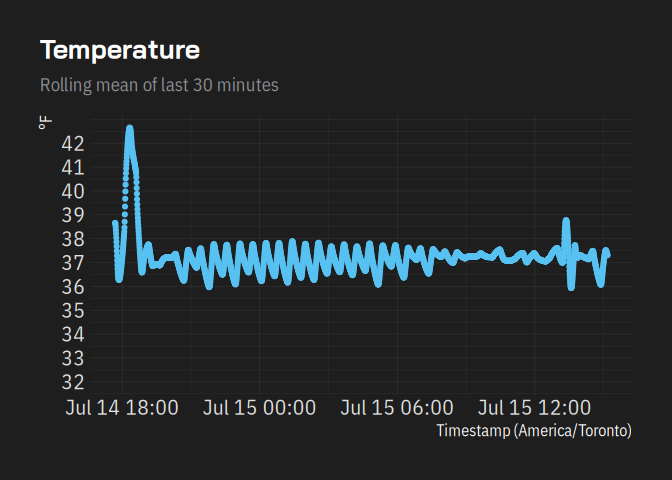
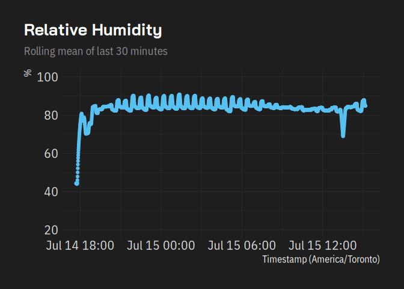
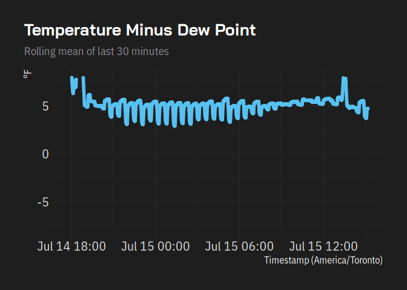
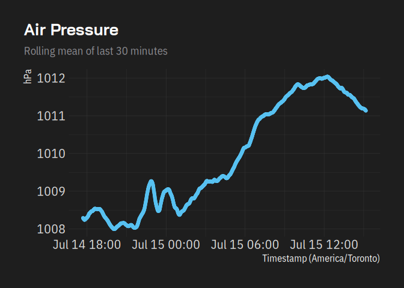
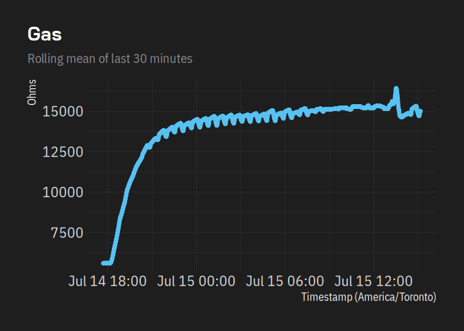

Dry Age Log Analysis
================
Tan Ho
2026-07-15

Parameters

``` r
roll_minutes <- 30
```

Utils

``` r
.dew_point <- function(temp_c, rh_pct) {
  stopifnot(length(temp_c) == length(rh_pct))
  a <- 17.625
  b <- 243.04

  x <- ((a * temp_c) / (b + temp_c)) + log(rh_pct / 100)

  return((b * x) / (a - x))
}
c_to_f <- function(temp_c) (temp_c * 9/5) + 32
f_to_c <- function(temp_f) (temp_f - 32) * 5/9
```

Data Pull

``` r
system("scp tan@relicanth:/home/tan/dry_age_monitor/logs/* logs")
```

``` r
readings <- list.files(path = "logs",full.names = TRUE) |>
  purrr::map(readLines) |>
  unlist() |>
  purrr::map(jsonlite::parse_json) |>
  tibble::tibble() |>
  tidyr::unnest_wider(1) |>
  dplyr::mutate(
    timestamp = lubridate::as_datetime(timestamp),
    temperature_f = c_to_f(temperature_c),
    dew_point = .dew_point(temperature_c, humidity_pct) |> c_to_f(),
    tempf_rolling = slider::slide_dbl(temperature_f, mean, .before = 2 * roll_minutes),
    tempc_rolling = slider::slide_dbl(temperature_c, mean, .before = 2 * roll_minutes),
    humidity_rolling = slider::slide_dbl(humidity_pct, mean, .before = 2 * roll_minutes),
    dew_point_rolling = slider::slide_dbl(dew_point, mean, .before = 2 * roll_minutes),
    pressure_rolling = slider::slide_dbl(pressure_hpa, mean, .before = 2 * roll_minutes),
    gas_rolling = slider::slide_dbl(gas_ohms, mean, .before = 2 * roll_minutes)
  )

readings |>
  ggplot2::ggplot(ggplot2::aes(x = timestamp)) +
  ggplot2::geom_point(ggplot2::aes(y = tempf_rolling)) +
  tantastic::theme_tantastic(base_size = 16, plot_title_size = 20) +
  ggplot2::scale_y_continuous(
    limits = c(32, NA),
    breaks = seq.int(32, max(readings$tempf_rolling))
  ) +
  ggplot2::scale_x_datetime(timezone = "America/Toronto") +
  ggplot2::labs(
    title = "Temperature",
    subtitle = glue::glue("Rolling mean of last {roll_minutes} minutes"),
    x = "Timestamp (America/Toronto)",
    y = "°F"
  )
```

<!-- -->

``` r
readings |>
  ggplot2::ggplot(ggplot2::aes(x = timestamp)) +
  ggplot2::geom_point(ggplot2::aes(y = humidity_rolling)) +
  tantastic::theme_tantastic(base_size = 16, plot_title_size = 20) +
  ggplot2::scale_y_continuous(limits = c(20, 100)) +
  ggplot2::scale_x_datetime(timezone = "America/Toronto") +
  ggplot2::labs(
    title = "Relative Humidity",
    subtitle = glue::glue("Rolling mean of last {roll_minutes} minutes"),
    x = "Timestamp (America/Toronto)",
    y = "%"
  )
```

<!-- -->

``` r
readings |>
  ggplot2::ggplot(ggplot2::aes(x = timestamp)) +
  ggplot2::geom_point(ggplot2::aes(y = tempf_rolling - dew_point_rolling)) +
  tantastic::theme_tantastic(base_size = 16, plot_title_size = 20) +
  ggplot2::scale_y_continuous(limits = c(-8, 8)) +
  ggplot2::scale_x_datetime(timezone = "America/Toronto") +
  ggplot2::labs(
    title = "Temperature Minus Dew Point",
    subtitle = glue::glue("Rolling mean of last {roll_minutes} minutes"),
    x = "Timestamp (America/Toronto)",
    y = "°F"
  )
```

    ## Warning: Removed 116 rows containing missing values or values outside the scale range
    ## (`geom_point()`).

<!-- -->

``` r
readings |>
  ggplot2::ggplot(ggplot2::aes(x = timestamp)) +
  ggplot2::geom_point(ggplot2::aes(y = pressure_rolling)) +
  tantastic::theme_tantastic(base_size = 16, plot_title_size = 20) +
  # ggplot2::scale_y_continuous(limits = c(-8, 8)) +
  ggplot2::scale_x_datetime(timezone = "America/Toronto") +
  ggplot2::labs(
    title = "Air Pressure",
    subtitle = glue::glue("Rolling mean of last {roll_minutes} minutes"),
    x = "Timestamp (America/Toronto)",
    y = "hPa"
  )
```

<!-- -->

``` r
readings |>
  ggplot2::ggplot(ggplot2::aes(x = timestamp)) +
  ggplot2::geom_point(ggplot2::aes(y = gas_rolling)) +
  tantastic::theme_tantastic(base_size = 16, plot_title_size = 20) +
  # ggplot2::scale_y_continuous(limits = c(-8, 8)) +
  ggplot2::scale_x_datetime(timezone = "America/Toronto") +
  ggplot2::labs(
    title = "Gas",
    subtitle = glue::glue("Rolling mean of last {roll_minutes} minutes"),
    x = "Timestamp (America/Toronto)",
    y = "Ohms"
  )
```

<!-- -->
