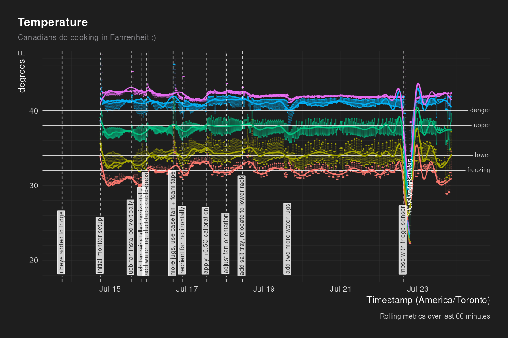
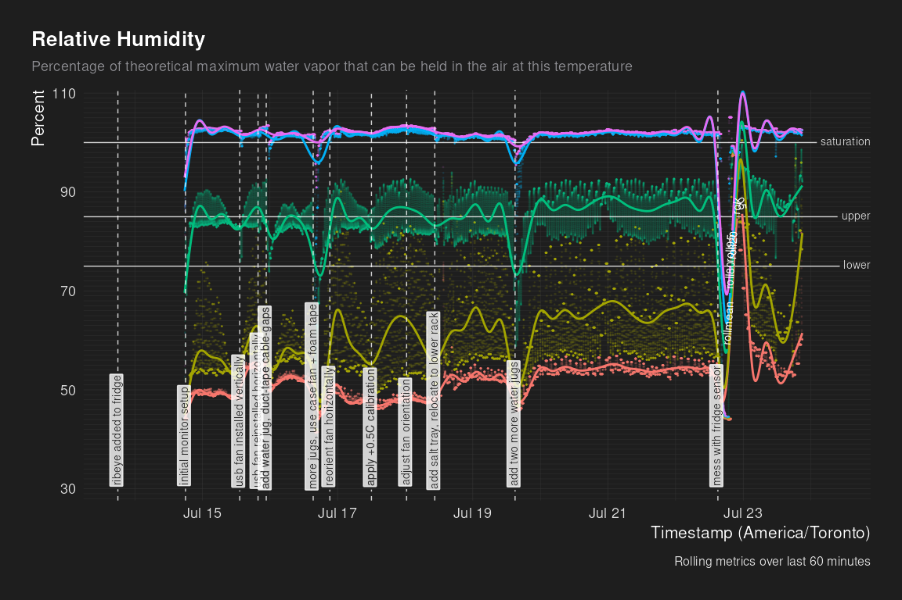
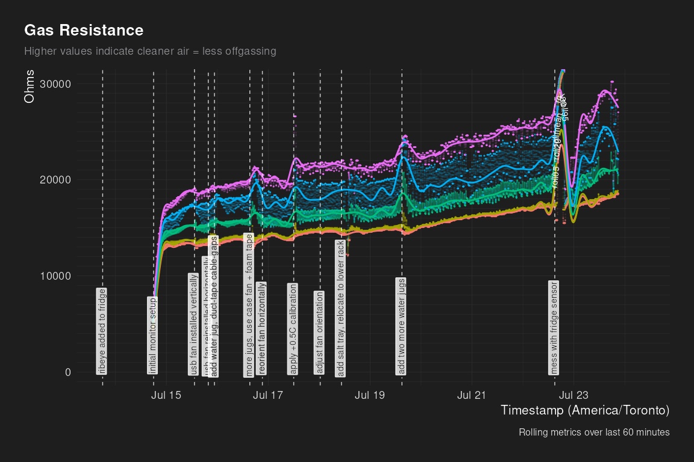
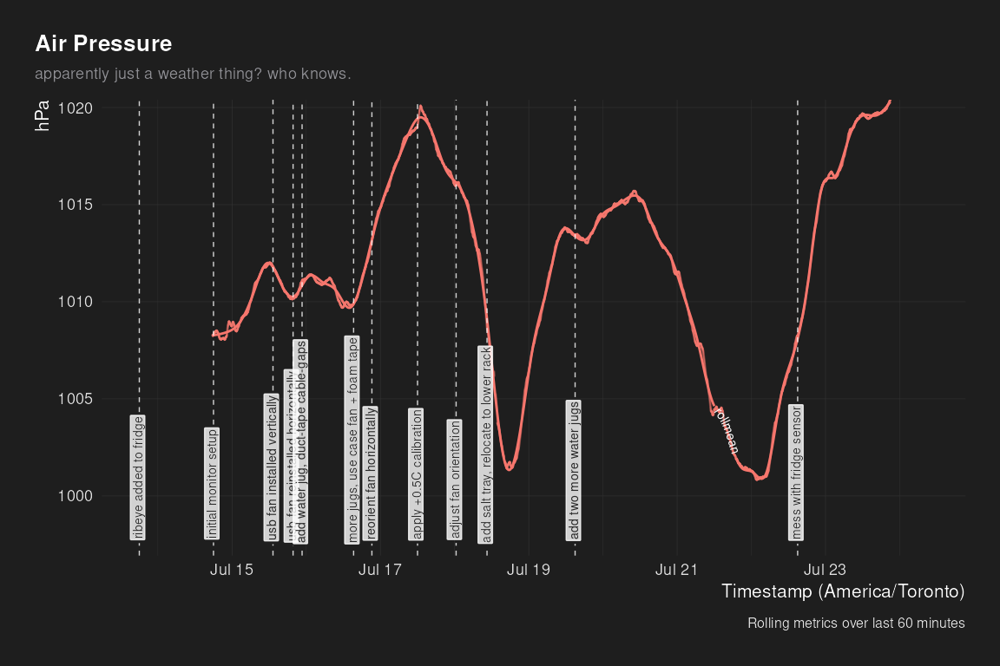

Dry Age Monitor - Log Analysis
================
2026-07-24 01:00:03.074279

``` r
knitr::opts_chunk$set(echo = FALSE, dev = "ragg_png")
suppressPackageStartupMessages({
  library(jsonlite)
  library(dplyr)
  library(tidyr)
  library(purrr)
  library(slider)
  library(lubridate)
  library(glue)
  library(ggplot2)
  library(geomtextpath)
  library(scales)
  library(ragg)
  library(marquee)
  library(tantastic)
  library(here)
})
here::i_am("reports/log_analysis.Rmd")
```

    ## here() starts at /dry-age-monitor

## dry age status

Current dry-age duration: 10.5 days

Starting weight: 14.2 lbs

Start date: 2026-07-13

Target date: 2026-08-27 (45 days)

## event timeline

| local_time          | event                                 |
|:--------------------|:--------------------------------------|
| 2026-07-13 18:00:00 | ribeye added to fridge                |
| 2026-07-14 18:00:00 | initial monitor setup                 |
| 2026-07-15 13:15:00 | usb fan installed vertically          |
| 2026-07-15 19:45:00 | usb fan reinstalled horizontally      |
| 2026-07-15 22:40:00 | add water jug, duct-tape cable-gaps   |
| 2026-07-16 15:20:00 | more jugs, use case fan + foam tape   |
| 2026-07-16 21:15:00 | reorient fan horizontally             |
| 2026-07-17 12:01:00 | apply +0.5C calibration               |
| 2026-07-18 00:30:00 | adjust fan orientation                |
| 2026-07-18 10:30:00 | add salt tray, relocate to lower rack |
| 2026-07-19 15:00:00 | add two more water jugs               |
| 2026-07-22 15:00:00 | mess with fridge sensor               |

## Rolling Average Plots

    ## Warning: Removed 373 rows containing non-finite outside the scale range
    ## (`stat_smooth()`).

    ## Warning: Removed 373 rows containing missing values or values outside the scale range
    ## (`geom_point()`).

    ## Warning: The text offset exceeds the curvature in one or more paths. This will result in
    ## displaced letters. Consider reducing the vjust or text size, or use the hjust
    ## parameter to move the string to a different point on the path.

<!-- --><!-- --><!-- --><!-- -->

## Summary Tables

| timestamp           | metric        | roll05 | roll20 | rollmean | roll80 | roll95 |
|:--------------------|:--------------|-------:|-------:|---------:|-------:|-------:|
| 2026-07-14 21:00:00 | temperature_f |  35.49 |  35.88 |    37.05 |  38.22 |  38.74 |
| 2026-07-14 22:00:00 | temperature_f |  32.96 |  35.42 |    39.92 |  43.17 |  52.87 |
| 2026-07-14 23:00:00 | temperature_f |  31.18 |  33.38 |    37.50 |  41.29 |  44.11 |
| 2026-07-15 00:00:00 | temperature_f |  30.75 |  33.01 |    37.06 |  41.08 |  42.46 |
| 2026-07-15 01:00:00 | temperature_f |  30.48 |  32.89 |    36.93 |  40.98 |  42.43 |
| 2026-07-15 02:00:00 | temperature_f |  30.22 |  32.66 |    36.86 |  40.96 |  42.40 |
| 2026-07-15 03:00:00 | temperature_f |  30.41 |  32.98 |    37.05 |  41.06 |  42.45 |
| 2026-07-15 04:00:00 | temperature_f |  30.41 |  32.99 |    37.06 |  41.04 |  42.42 |
| 2026-07-15 05:00:00 | temperature_f |  30.30 |  32.89 |    36.94 |  40.96 |  42.41 |
| 2026-07-15 06:00:00 | temperature_f |  30.28 |  32.84 |    36.92 |  41.00 |  42.42 |
| 2026-07-15 07:00:00 | temperature_f |  30.50 |  33.05 |    37.12 |  41.12 |  42.46 |
| 2026-07-15 08:00:00 | temperature_f |  30.55 |  33.02 |    37.12 |  41.19 |  42.48 |
| 2026-07-15 09:00:00 | temperature_f |  30.49 |  32.95 |    37.02 |  41.07 |  42.48 |
| 2026-07-15 10:00:00 | temperature_f |  30.62 |  32.89 |    37.07 |  41.14 |  42.51 |
| 2026-07-15 11:00:00 | temperature_f |  30.69 |  33.07 |    37.15 |  41.24 |  42.56 |
| 2026-07-15 12:00:00 | temperature_f |  30.89 |  33.21 |    37.26 |  41.25 |  42.58 |
| 2026-07-15 13:00:00 | temperature_f |  30.94 |  33.22 |    37.27 |  41.27 |  42.59 |
| 2026-07-15 14:00:00 | temperature_f |  31.14 |  33.31 |    37.27 |  41.31 |  42.56 |
| 2026-07-15 15:00:00 | temperature_f |  31.05 |  33.22 |    37.22 |  41.18 |  42.55 |
| 2026-07-15 16:00:00 | temperature_f |  31.00 |  33.27 |    37.22 |  41.20 |  42.55 |
| 2026-07-15 17:00:00 | temperature_f |  31.00 |  32.99 |    37.41 |  41.48 |  44.40 |
| 2026-07-15 18:00:00 | temperature_f |  30.85 |  32.89 |    37.02 |  41.17 |  43.35 |
| 2026-07-15 19:00:00 | temperature_f |  30.49 |  32.78 |    36.91 |  41.04 |  42.57 |
| 2026-07-15 20:00:00 | temperature_f |  30.36 |  32.82 |    36.97 |  41.18 |  42.62 |
| 2026-07-15 21:00:00 | temperature_f |  30.26 |  32.72 |    36.84 |  40.95 |  42.56 |
| 2026-07-15 22:00:00 | temperature_f |  29.94 |  32.43 |    36.70 |  40.93 |  42.54 |
| 2026-07-15 23:00:00 | temperature_f |  30.25 |  33.14 |    37.16 |  41.23 |  42.61 |
| 2026-07-16 00:00:00 | temperature_f |  30.75 |  33.21 |    36.93 |  40.66 |  42.36 |
| 2026-07-16 01:00:00 | temperature_f |  30.48 |  32.83 |    36.87 |  40.91 |  42.37 |
| 2026-07-16 02:00:00 | temperature_f |  30.42 |  33.18 |    37.03 |  40.94 |  42.50 |
| 2026-07-16 03:00:00 | temperature_f |  31.95 |  33.73 |    37.55 |  41.37 |  43.26 |
| 2026-07-16 04:00:00 | temperature_f |  32.41 |  34.09 |    37.81 |  41.55 |  42.93 |
| 2026-07-16 05:00:00 | temperature_f |  32.28 |  34.05 |    37.70 |  41.29 |  42.58 |
| 2026-07-16 06:00:00 | temperature_f |  32.14 |  34.02 |    37.60 |  41.10 |  42.35 |
| 2026-07-16 07:00:00 | temperature_f |  32.02 |  33.96 |    37.52 |  41.06 |  42.27 |
| 2026-07-16 08:00:00 | temperature_f |  31.82 |  33.84 |    37.44 |  41.01 |  42.20 |
| 2026-07-16 09:00:00 | temperature_f |  31.79 |  33.84 |    37.38 |  40.97 |  42.14 |
| 2026-07-16 10:00:00 | temperature_f |  31.91 |  33.85 |    37.40 |  40.94 |  42.15 |
| 2026-07-16 11:00:00 | temperature_f |  31.84 |  33.79 |    37.33 |  40.85 |  42.08 |
| 2026-07-16 12:00:00 | temperature_f |  31.94 |  33.98 |    37.45 |  40.88 |  42.15 |
| 2026-07-16 13:00:00 | temperature_f |  32.01 |  33.91 |    37.45 |  40.87 |  42.08 |
| 2026-07-16 14:00:00 | temperature_f |  32.05 |  33.96 |    37.45 |  40.91 |  42.08 |
| 2026-07-16 15:00:00 | temperature_f |  31.76 |  33.69 |    37.29 |  40.86 |  42.06 |
| 2026-07-16 16:00:00 | temperature_f |  31.81 |  33.75 |    37.35 |  40.87 |  42.07 |
| 2026-07-16 17:00:00 | temperature_f |  31.91 |  33.78 |    37.34 |  40.91 |  42.14 |
| 2026-07-16 18:00:00 | temperature_f |  31.72 |  33.70 |    37.34 |  40.88 |  42.14 |
| 2026-07-16 19:00:00 | temperature_f |  32.64 |  35.42 |    39.59 |  43.90 |  47.07 |
| 2026-07-16 20:00:00 | temperature_f |  34.38 |  35.35 |    39.04 |  42.97 |  46.04 |
| 2026-07-16 21:00:00 | temperature_f |  33.15 |  34.50 |    37.83 |  41.25 |  42.69 |
| 2026-07-16 22:00:00 | temperature_f |  32.06 |  33.84 |    37.42 |  40.96 |  42.16 |
| 2026-07-16 23:00:00 | temperature_f |  31.51 |  33.43 |    37.10 |  40.72 |  41.83 |
| 2026-07-17 00:00:00 | temperature_f |  31.27 |  33.64 |    37.26 |  40.79 |  41.68 |
| 2026-07-17 01:00:00 | temperature_f |  30.99 |  33.28 |    37.03 |  40.35 |  43.67 |
| 2026-07-17 02:00:00 | temperature_f |  31.78 |  33.82 |    37.37 |  40.90 |  42.34 |
| 2026-07-17 03:00:00 | temperature_f |  31.92 |  34.35 |    37.64 |  40.91 |  41.75 |
| 2026-07-17 04:00:00 | temperature_f |  31.64 |  33.93 |    37.42 |  40.81 |  41.74 |
| 2026-07-17 05:00:00 | temperature_f |  32.48 |  34.70 |    37.73 |  40.67 |  41.57 |
| 2026-07-17 06:00:00 | temperature_f |  32.73 |  34.47 |    37.55 |  40.58 |  41.43 |
| 2026-07-17 07:00:00 | temperature_f |  32.74 |  34.68 |    37.71 |  40.62 |  41.46 |
| 2026-07-17 08:00:00 | temperature_f |  32.98 |  34.68 |    37.68 |  40.62 |  41.46 |
| 2026-07-17 09:00:00 | temperature_f |  33.03 |  34.77 |    37.72 |  40.66 |  41.52 |
| 2026-07-17 10:00:00 | temperature_f |  33.09 |  34.89 |    37.79 |  40.66 |  41.55 |
| 2026-07-17 11:00:00 | temperature_f |  33.11 |  34.80 |    37.79 |  40.71 |  41.57 |
| 2026-07-17 12:00:00 | temperature_f |  33.04 |  34.68 |    37.69 |  40.59 |  41.47 |
| 2026-07-17 13:00:00 | temperature_f |  33.20 |  34.70 |    37.69 |  40.58 |  41.47 |
| 2026-07-17 14:00:00 | temperature_f |  33.13 |  34.74 |    37.71 |  40.61 |  41.48 |
| 2026-07-17 15:00:00 | temperature_f |  33.12 |  34.79 |    37.69 |  40.56 |  41.49 |
| 2026-07-17 16:00:00 | temperature_f |  33.16 |  35.11 |    38.15 |  41.10 |  42.03 |
| 2026-07-17 17:00:00 | temperature_f |  33.18 |  35.19 |    38.44 |  41.55 |  42.42 |
| 2026-07-17 18:00:00 | temperature_f |  32.63 |  34.61 |    38.02 |  41.36 |  42.48 |
| 2026-07-17 19:00:00 | temperature_f |  32.03 |  34.68 |    38.18 |  41.57 |  42.51 |
| 2026-07-17 20:00:00 | temperature_f |  31.93 |  34.16 |    37.76 |  41.30 |  42.41 |
| 2026-07-17 21:00:00 | temperature_f |  31.93 |  34.27 |    37.88 |  41.19 |  42.61 |
| 2026-07-17 22:00:00 | temperature_f |  31.70 |  34.10 |    37.73 |  41.31 |  42.40 |
| 2026-07-17 23:00:00 | temperature_f |  32.03 |  34.76 |    38.21 |  41.55 |  42.42 |
| 2026-07-18 00:00:00 | temperature_f |  31.77 |  33.92 |    37.67 |  41.31 |  42.38 |
| 2026-07-18 01:00:00 | temperature_f |  31.70 |  34.47 |    38.01 |  41.46 |  42.39 |
| 2026-07-18 02:00:00 | temperature_f |  31.62 |  34.25 |    37.87 |  41.46 |  42.39 |
| 2026-07-18 03:00:00 | temperature_f |  31.86 |  34.40 |    37.92 |  41.34 |  42.37 |
| 2026-07-18 04:00:00 | temperature_f |  31.80 |  34.07 |    37.87 |  41.64 |  43.01 |
| 2026-07-18 05:00:00 | temperature_f |  31.84 |  34.31 |    37.89 |  41.34 |  43.01 |
| 2026-07-18 06:00:00 | temperature_f |  31.61 |  34.20 |    37.92 |  41.55 |  42.51 |
| 2026-07-18 07:00:00 | temperature_f |  31.97 |  34.52 |    38.02 |  41.42 |  42.45 |
| 2026-07-18 08:00:00 | temperature_f |  32.06 |  34.33 |    37.96 |  41.45 |  42.44 |
| 2026-07-18 09:00:00 | temperature_f |  32.31 |  34.60 |    38.12 |  41.51 |  42.45 |
| 2026-07-18 10:00:00 | temperature_f |  32.31 |  34.31 |    37.92 |  41.41 |  42.43 |
| 2026-07-18 11:00:00 | temperature_f |  32.40 |  34.50 |    38.02 |  41.49 |  42.44 |
| 2026-07-18 12:00:00 | temperature_f |  32.43 |  34.54 |    38.07 |  41.45 |  42.45 |
| 2026-07-18 13:00:00 | temperature_f |  32.43 |  34.49 |    37.93 |  41.34 |  42.42 |
| 2026-07-18 14:00:00 | temperature_f |  32.58 |  34.38 |    38.05 |  41.70 |  42.91 |
| 2026-07-18 15:00:00 | temperature_f |  32.89 |  34.75 |    38.12 |  41.39 |  42.54 |
| 2026-07-18 16:00:00 | temperature_f |  33.33 |  35.48 |    38.54 |  41.50 |  42.33 |
| 2026-07-18 17:00:00 | temperature_f |  34.51 |  36.12 |    38.65 |  41.55 |  42.16 |
| 2026-07-18 18:00:00 | temperature_f |  33.23 |  35.07 |    38.25 |  41.38 |  42.15 |
| 2026-07-18 19:00:00 | temperature_f |  32.54 |  34.29 |    37.64 |  40.92 |  41.94 |
| 2026-07-18 20:00:00 | temperature_f |  33.80 |  36.06 |    38.76 |  41.28 |  42.00 |
| 2026-07-18 21:00:00 | temperature_f |  32.32 |  34.56 |    37.89 |  41.05 |  41.99 |
| 2026-07-18 22:00:00 | temperature_f |  32.18 |  34.08 |    37.47 |  40.80 |  41.91 |
| 2026-07-18 23:00:00 | temperature_f |  32.15 |  34.49 |    37.78 |  40.97 |  41.92 |
| 2026-07-19 00:00:00 | temperature_f |  31.61 |  33.71 |    37.24 |  40.72 |  41.88 |
| 2026-07-19 01:00:00 | temperature_f |  31.85 |  34.30 |    37.67 |  40.92 |  41.87 |
| 2026-07-19 02:00:00 | temperature_f |  31.46 |  33.80 |    37.38 |  40.90 |  41.89 |
| 2026-07-19 03:00:00 | temperature_f |  31.76 |  34.23 |    37.63 |  40.92 |  41.89 |
| 2026-07-19 04:00:00 | temperature_f |  31.75 |  34.39 |    37.83 |  41.14 |  41.98 |
| 2026-07-19 05:00:00 | temperature_f |  31.54 |  33.72 |    37.32 |  40.88 |  41.97 |
| 2026-07-19 06:00:00 | temperature_f |  32.13 |  34.68 |    37.94 |  41.13 |  41.98 |
| 2026-07-19 07:00:00 | temperature_f |  32.05 |  34.06 |    37.53 |  40.94 |  41.97 |
| 2026-07-19 08:00:00 | temperature_f |  32.27 |  34.56 |    37.91 |  41.16 |  42.01 |
| 2026-07-19 09:00:00 | temperature_f |  32.35 |  34.29 |    37.66 |  40.96 |  42.00 |
| 2026-07-19 10:00:00 | temperature_f |  32.41 |  34.50 |    37.89 |  41.21 |  42.05 |
| 2026-07-19 11:00:00 | temperature_f |  32.32 |  34.45 |    37.80 |  41.04 |  42.01 |
| 2026-07-19 12:00:00 | temperature_f |  32.29 |  34.20 |    37.69 |  41.06 |  42.02 |
| 2026-07-19 13:00:00 | temperature_f |  32.38 |  34.59 |    37.94 |  41.21 |  42.11 |
| 2026-07-19 14:00:00 | temperature_f |  32.42 |  34.32 |    37.69 |  40.98 |  42.02 |
| 2026-07-19 15:00:00 | temperature_f |  32.40 |  34.50 |    37.87 |  41.13 |  42.05 |
| 2026-07-19 16:00:00 | temperature_f |  32.01 |  34.15 |    37.60 |  40.95 |  42.01 |
| 2026-07-19 17:00:00 | temperature_f |  31.43 |  33.51 |    37.23 |  40.87 |  41.96 |
| 2026-07-19 18:00:00 | temperature_f |  31.76 |  34.01 |    37.25 |  40.53 |  42.07 |
| 2026-07-19 19:00:00 | temperature_f |  33.13 |  33.97 |    36.73 |  39.64 |  41.51 |
| 2026-07-19 20:00:00 | temperature_f |  32.48 |  33.42 |    36.59 |  39.88 |  41.39 |
| 2026-07-19 21:00:00 | temperature_f |  32.07 |  33.31 |    36.66 |  40.01 |  41.39 |
| 2026-07-19 22:00:00 | temperature_f |  31.98 |  33.89 |    37.32 |  40.62 |  41.58 |
| 2026-07-19 23:00:00 | temperature_f |  31.32 |  33.09 |    36.86 |  40.48 |  41.60 |
| 2026-07-20 00:00:00 | temperature_f |  31.63 |  33.93 |    37.47 |  40.84 |  41.72 |
| 2026-07-20 01:00:00 | temperature_f |  31.57 |  33.97 |    37.58 |  40.99 |  41.75 |
| 2026-07-20 02:00:00 | temperature_f |  31.18 |  33.49 |    37.41 |  41.04 |  41.89 |
| 2026-07-20 03:00:00 | temperature_f |  31.61 |  34.06 |    37.71 |  41.09 |  41.84 |
| 2026-07-20 04:00:00 | temperature_f |  31.26 |  33.56 |    37.45 |  41.10 |  41.87 |
| 2026-07-20 05:00:00 | temperature_f |  31.50 |  33.94 |    37.63 |  41.06 |  41.83 |
| 2026-07-20 06:00:00 | temperature_f |  31.73 |  34.14 |    37.78 |  41.10 |  41.85 |
| 2026-07-20 07:00:00 | temperature_f |  32.03 |  34.45 |    37.88 |  41.09 |  41.89 |
| 2026-07-20 08:00:00 | temperature_f |  31.34 |  33.48 |    37.28 |  40.97 |  41.89 |
| 2026-07-20 09:00:00 | temperature_f |  32.23 |  34.48 |    37.79 |  41.00 |  41.86 |
| 2026-07-20 10:00:00 | temperature_f |  31.90 |  34.25 |    37.79 |  41.07 |  41.86 |
| 2026-07-20 11:00:00 | temperature_f |  32.38 |  34.55 |    37.83 |  41.07 |  41.88 |
| 2026-07-20 12:00:00 | temperature_f |  31.97 |  34.27 |    37.70 |  41.00 |  41.92 |
| 2026-07-20 13:00:00 | temperature_f |  32.11 |  34.53 |    37.95 |  41.17 |  41.90 |
| 2026-07-20 14:00:00 | temperature_f |  32.29 |  34.43 |    37.76 |  41.05 |  41.89 |
| 2026-07-20 15:00:00 | temperature_f |  32.15 |  34.26 |    37.65 |  40.93 |  41.88 |
| 2026-07-20 16:00:00 | temperature_f |  32.51 |  34.80 |    38.05 |  41.14 |  41.91 |
| 2026-07-20 17:00:00 | temperature_f |  31.91 |  33.89 |    37.45 |  40.90 |  41.86 |
| 2026-07-20 18:00:00 | temperature_f |  32.25 |  34.62 |    37.92 |  41.07 |  41.91 |
| 2026-07-20 19:00:00 | temperature_f |  32.09 |  34.53 |    37.94 |  41.15 |  41.94 |
| 2026-07-20 20:00:00 | temperature_f |  31.30 |  33.53 |    37.44 |  41.06 |  41.92 |
| 2026-07-20 21:00:00 | temperature_f |  31.68 |  34.03 |    37.67 |  41.09 |  41.92 |
| 2026-07-20 22:00:00 | temperature_f |  31.89 |  34.44 |    37.89 |  41.18 |  41.93 |
| 2026-07-20 23:00:00 | temperature_f |  31.34 |  33.77 |    37.64 |  41.20 |  41.91 |
| 2026-07-21 00:00:00 | temperature_f |  32.11 |  34.67 |    38.10 |  41.32 |  41.95 |
| 2026-07-21 01:00:00 | temperature_f |  31.07 |  33.36 |    37.40 |  41.11 |  41.93 |
| 2026-07-21 02:00:00 | temperature_f |  31.13 |  33.83 |    37.85 |  41.33 |  42.00 |
| 2026-07-21 03:00:00 | temperature_f |  31.76 |  34.49 |    38.05 |  41.30 |  42.01 |
| 2026-07-21 04:00:00 | temperature_f |  31.76 |  34.30 |    37.94 |  41.31 |  42.02 |
| 2026-07-21 05:00:00 | temperature_f |  31.15 |  33.48 |    37.47 |  41.18 |  41.96 |
| 2026-07-21 06:00:00 | temperature_f |  31.90 |  34.52 |    37.95 |  41.15 |  41.92 |
| 2026-07-21 07:00:00 | temperature_f |  31.87 |  34.29 |    37.90 |  41.19 |  41.93 |
| 2026-07-21 08:00:00 | temperature_f |  32.08 |  34.58 |    37.94 |  41.19 |  41.89 |
| 2026-07-21 09:00:00 | temperature_f |  32.26 |  34.35 |    37.74 |  41.03 |  41.93 |
| 2026-07-21 10:00:00 | temperature_f |  32.36 |  34.75 |    38.02 |  41.07 |  41.89 |
| 2026-07-21 11:00:00 | temperature_f |  32.06 |  34.23 |    37.74 |  41.08 |  41.93 |
| 2026-07-21 12:00:00 | temperature_f |  32.40 |  34.54 |    37.76 |  40.95 |  41.84 |
| 2026-07-21 13:00:00 | temperature_f |  32.38 |  34.70 |    37.98 |  41.05 |  41.81 |
| 2026-07-21 14:00:00 | temperature_f |  31.76 |  33.81 |    37.39 |  40.84 |  41.81 |
| 2026-07-21 15:00:00 | temperature_f |  32.27 |  34.50 |    37.79 |  40.93 |  41.78 |
| 2026-07-21 16:00:00 | temperature_f |  32.18 |  34.30 |    37.69 |  40.95 |  41.81 |
| 2026-07-21 17:00:00 | temperature_f |  31.80 |  33.83 |    37.38 |  40.81 |  41.79 |
| 2026-07-21 18:00:00 | temperature_f |  31.71 |  34.03 |    37.61 |  40.95 |  41.82 |
| 2026-07-21 19:00:00 | temperature_f |  31.99 |  34.21 |    37.65 |  40.95 |  41.79 |
| 2026-07-21 20:00:00 | temperature_f |  31.71 |  33.66 |    37.29 |  40.80 |  41.79 |
| 2026-07-21 21:00:00 | temperature_f |  32.11 |  34.45 |    37.76 |  40.89 |  41.76 |
| 2026-07-21 22:00:00 | temperature_f |  31.87 |  34.25 |    37.71 |  41.01 |  41.77 |
| 2026-07-21 23:00:00 | temperature_f |  32.19 |  34.18 |    37.59 |  40.92 |  41.78 |
| 2026-07-22 00:00:00 | temperature_f |  32.15 |  34.55 |    37.83 |  40.97 |  41.79 |
| 2026-07-22 01:00:00 | temperature_f |  31.69 |  34.05 |    37.66 |  41.02 |  41.84 |
| 2026-07-22 02:00:00 | temperature_f |  31.42 |  33.89 |    37.63 |  41.12 |  41.83 |
| 2026-07-22 03:00:00 | temperature_f |  32.17 |  34.57 |    37.95 |  41.17 |  41.87 |
| 2026-07-22 04:00:00 | temperature_f |  31.22 |  33.63 |    37.46 |  41.05 |  41.86 |
| 2026-07-22 05:00:00 | temperature_f |  31.75 |  34.29 |    37.84 |  41.07 |  41.82 |
| 2026-07-22 06:00:00 | temperature_f |  31.88 |  34.38 |    37.93 |  41.20 |  41.87 |
| 2026-07-22 07:00:00 | temperature_f |  31.67 |  34.03 |    37.70 |  41.11 |  41.86 |
| 2026-07-22 08:00:00 | temperature_f |  32.20 |  34.44 |    37.83 |  41.12 |  41.90 |
| 2026-07-22 09:00:00 | temperature_f |  31.61 |  33.88 |    37.56 |  41.00 |  41.84 |
| 2026-07-22 10:00:00 | temperature_f |  32.37 |  34.85 |    38.08 |  41.14 |  41.86 |
| 2026-07-22 11:00:00 | temperature_f |  31.88 |  34.02 |    37.57 |  40.97 |  41.87 |
| 2026-07-22 12:00:00 | temperature_f |  32.30 |  34.61 |    37.84 |  40.96 |  41.86 |
| 2026-07-22 13:00:00 | temperature_f |  32.12 |  34.48 |    37.87 |  41.06 |  41.85 |
| 2026-07-22 14:00:00 | temperature_f |  32.41 |  34.29 |    37.67 |  40.95 |  41.84 |
| 2026-07-22 15:00:00 | temperature_f |  32.48 |  34.74 |    37.97 |  41.02 |  41.84 |
| 2026-07-22 16:00:00 | temperature_f |  32.12 |  34.18 |    37.64 |  40.94 |  41.84 |
| 2026-07-22 17:00:00 | temperature_f |  32.35 |  34.52 |    37.78 |  40.91 |  41.84 |
| 2026-07-22 18:00:00 | temperature_f |  32.37 |  34.63 |    37.94 |  41.11 |  41.91 |
| 2026-07-22 19:00:00 | temperature_f |  31.46 |  33.48 |    37.52 |  40.74 |  46.30 |
| 2026-07-22 20:00:00 | temperature_f |  26.81 |  27.49 |    30.68 |  33.41 |  38.14 |
| 2026-07-22 21:00:00 | temperature_f |  24.29 |  24.55 |    25.25 |  25.96 |  26.44 |
| 2026-07-22 22:00:00 | temperature_f |  22.73 |  22.97 |    23.77 |  24.29 |  26.23 |
| 2026-07-22 23:00:00 | temperature_f |  24.77 |  26.87 |    31.07 |  34.97 |  38.47 |
| 2026-07-23 00:00:00 | temperature_f |  34.54 |  35.65 |    36.63 |  37.70 |  38.06 |
| 2026-07-23 01:00:00 | temperature_f |  38.29 |  38.61 |    39.21 |  39.82 |  40.11 |
| 2026-07-23 02:00:00 | temperature_f |  34.74 |  36.88 |    39.20 |  41.24 |  41.54 |
| 2026-07-23 03:00:00 | temperature_f |  31.71 |  34.46 |    37.98 |  40.98 |  41.59 |
| 2026-07-23 04:00:00 | temperature_f |  31.80 |  34.22 |    37.89 |  41.10 |  41.71 |
| 2026-07-23 05:00:00 | temperature_f |  32.23 |  34.79 |    38.11 |  41.15 |  41.80 |
| 2026-07-23 06:00:00 | temperature_f |  32.19 |  34.66 |    38.04 |  41.20 |  41.84 |
| 2026-07-23 07:00:00 | temperature_f |  32.36 |  34.55 |    37.86 |  41.04 |  41.85 |
| 2026-07-23 08:00:00 | temperature_f |  32.56 |  34.75 |    37.95 |  41.00 |  41.85 |
| 2026-07-23 09:00:00 | temperature_f |  32.53 |  34.97 |    38.16 |  41.15 |  41.89 |
| 2026-07-23 10:00:00 | temperature_f |  32.39 |  34.40 |    37.80 |  41.09 |  41.92 |
| 2026-07-23 11:00:00 | temperature_f |  32.58 |  34.86 |    38.02 |  41.08 |  41.90 |
| 2026-07-23 12:00:00 | temperature_f |  32.23 |  34.58 |    37.98 |  41.17 |  41.94 |
| 2026-07-23 13:00:00 | temperature_f |  32.08 |  34.36 |    37.82 |  41.14 |  41.93 |
| 2026-07-23 14:00:00 | temperature_f |  32.01 |  34.03 |    37.64 |  41.08 |  41.92 |
| 2026-07-23 15:00:00 | temperature_f |  31.14 |  33.17 |    37.03 |  40.81 |  42.09 |
| 2026-07-23 16:00:00 | temperature_f |  30.59 |  33.06 |    37.54 |  41.46 |  42.19 |
| 2026-07-23 17:00:00 | temperature_f |  30.54 |  32.90 |    37.46 |  41.46 |  42.19 |
| 2026-07-23 18:00:00 | temperature_f |  30.47 |  32.84 |    37.42 |  41.43 |  42.27 |
| 2026-07-23 19:00:00 | temperature_f |  30.50 |  32.89 |    37.46 |  41.48 |  42.22 |
| 2026-07-23 20:00:00 | temperature_f |  30.57 |  33.21 |    37.65 |  41.55 |  42.26 |
| 2026-07-23 21:00:00 | temperature_f |  29.78 |  31.90 |    36.43 |  40.58 |  42.33 |
| 2026-07-23 22:00:00 | temperature_f |  30.44 |  33.82 |    37.79 |  41.23 |  42.02 |
| 2026-07-23 23:00:00 | temperature_f |  29.26 |  31.46 |    36.02 |  40.18 |  41.57 |
| 2026-07-24 00:00:00 | temperature_f |  32.04 |  35.41 |    38.48 |  41.26 |  41.85 |

| timestamp           | metric       | roll05 | roll20 | rollmean | roll80 | roll95 |
|:--------------------|:-------------|-------:|-------:|---------:|-------:|-------:|
| 2026-07-14 21:00:00 | humidity_pct |  43.97 |  44.12 |    57.64 |  70.14 |  74.33 |
| 2026-07-14 22:00:00 | humidity_pct |  44.52 |  47.60 |    75.49 |  98.40 | 100.31 |
| 2026-07-14 23:00:00 | humidity_pct |  47.95 |  51.88 |    81.60 | 101.20 | 102.12 |
| 2026-07-15 00:00:00 | humidity_pct |  49.31 |  54.34 |    84.31 | 102.24 | 102.51 |
| 2026-07-15 01:00:00 | humidity_pct |  49.54 |  56.41 |    84.98 | 102.41 | 102.62 |
| 2026-07-15 02:00:00 | humidity_pct |  49.26 |  56.23 |    84.87 | 102.56 | 102.77 |
| 2026-07-15 03:00:00 | humidity_pct |  49.21 |  57.62 |    85.39 | 102.56 | 102.79 |
| 2026-07-15 04:00:00 | humidity_pct |  49.25 |  57.86 |    85.77 | 102.61 | 102.78 |
| 2026-07-15 05:00:00 | humidity_pct |  49.37 |  58.13 |    85.96 | 102.75 | 102.92 |
| 2026-07-15 06:00:00 | humidity_pct |  49.53 |  56.66 |    85.36 | 102.76 | 102.97 |
| 2026-07-15 07:00:00 | humidity_pct |  49.12 |  56.37 |    85.20 | 102.72 | 102.88 |
| 2026-07-15 08:00:00 | humidity_pct |  49.01 |  56.34 |    85.32 | 102.61 | 102.79 |
| 2026-07-15 09:00:00 | humidity_pct |  49.27 |  56.92 |    85.38 | 102.44 | 102.75 |
| 2026-07-15 10:00:00 | humidity_pct |  49.38 |  55.91 |    85.21 | 102.39 | 102.88 |
| 2026-07-15 11:00:00 | humidity_pct |  49.13 |  54.71 |    84.79 | 102.52 | 102.87 |
| 2026-07-15 12:00:00 | humidity_pct |  49.06 |  54.74 |    84.52 | 102.56 | 102.77 |
| 2026-07-15 13:00:00 | humidity_pct |  48.73 |  54.22 |    83.99 | 102.36 | 102.60 |
| 2026-07-15 14:00:00 | humidity_pct |  48.72 |  53.71 |    83.45 | 102.20 | 102.48 |
| 2026-07-15 15:00:00 | humidity_pct |  48.60 |  52.86 |    83.05 | 102.20 | 102.40 |
| 2026-07-15 16:00:00 | humidity_pct |  48.30 |  52.89 |    82.94 | 102.15 | 102.34 |
| 2026-07-15 17:00:00 | humidity_pct |  48.41 |  54.20 |    81.12 | 101.09 | 102.27 |
| 2026-07-15 18:00:00 | humidity_pct |  54.06 |  58.28 |    83.58 | 100.70 | 101.50 |
| 2026-07-15 19:00:00 | humidity_pct |  54.55 |  58.85 |    84.60 | 101.55 | 101.70 |
| 2026-07-15 20:00:00 | humidity_pct |  54.49 |  60.23 |    85.64 | 101.65 | 101.75 |
| 2026-07-15 21:00:00 | humidity_pct |  54.72 |  62.09 |    86.30 | 101.61 | 101.80 |
| 2026-07-15 22:00:00 | humidity_pct |  54.49 |  60.22 |    85.41 | 101.62 | 101.85 |
| 2026-07-15 23:00:00 | humidity_pct |  54.35 |  63.20 |    86.60 | 101.61 | 101.89 |
| 2026-07-16 00:00:00 | humidity_pct |  55.07 |  61.56 |    85.87 | 101.82 | 102.66 |
| 2026-07-16 01:00:00 | humidity_pct |  55.03 |  60.28 |    86.16 | 102.89 | 103.12 |
| 2026-07-16 02:00:00 | humidity_pct |  55.07 |  63.33 |    87.61 | 102.87 | 103.20 |
| 2026-07-16 03:00:00 | humidity_pct |  50.47 |  53.21 |    78.23 | 100.14 | 102.23 |
| 2026-07-16 04:00:00 | humidity_pct |  49.90 |  52.12 |    78.15 |  99.45 | 100.50 |
| 2026-07-16 05:00:00 | humidity_pct |  50.74 |  54.34 |    81.00 | 100.56 | 101.24 |
| 2026-07-16 06:00:00 | humidity_pct |  51.44 |  55.68 |    82.72 | 101.32 | 101.79 |
| 2026-07-16 07:00:00 | humidity_pct |  52.08 |  56.73 |    83.45 | 101.61 | 101.95 |
| 2026-07-16 08:00:00 | humidity_pct |  52.17 |  57.76 |    84.13 | 101.54 | 101.89 |
| 2026-07-16 09:00:00 | humidity_pct |  52.58 |  57.96 |    84.37 | 101.40 | 101.70 |
| 2026-07-16 10:00:00 | humidity_pct |  52.45 |  57.81 |    84.34 | 101.36 | 101.70 |
| 2026-07-16 11:00:00 | humidity_pct |  52.56 |  57.89 |    84.29 | 101.41 | 101.70 |
| 2026-07-16 12:00:00 | humidity_pct |  52.78 |  58.19 |    84.44 | 101.42 | 101.76 |
| 2026-07-16 13:00:00 | humidity_pct |  52.25 |  57.56 |    84.05 | 101.20 | 101.61 |
| 2026-07-16 14:00:00 | humidity_pct |  51.89 |  56.92 |    83.60 | 101.17 | 101.44 |
| 2026-07-16 15:00:00 | humidity_pct |  51.89 |  56.79 |    83.49 | 101.04 | 101.34 |
| 2026-07-16 16:00:00 | humidity_pct |  51.78 |  57.19 |    83.98 | 101.14 | 101.43 |
| 2026-07-16 17:00:00 | humidity_pct |  51.95 |  57.91 |    84.05 | 101.19 | 101.55 |
| 2026-07-16 18:00:00 | humidity_pct |  51.71 |  57.69 |    83.82 | 101.18 | 101.57 |
| 2026-07-16 19:00:00 | humidity_pct |  47.82 |  53.76 |    78.58 | 100.58 | 101.61 |
| 2026-07-16 20:00:00 | humidity_pct |  41.50 |  42.32 |    58.00 |  79.00 |  95.27 |
| 2026-07-16 21:00:00 | humidity_pct |  44.43 |  46.32 |    70.46 |  96.22 |  99.46 |
| 2026-07-16 22:00:00 | humidity_pct |  45.98 |  49.22 |    77.37 | 100.31 | 101.22 |
| 2026-07-16 23:00:00 | humidity_pct |  47.76 |  53.16 |    81.30 | 101.55 | 102.01 |
| 2026-07-17 00:00:00 | humidity_pct |  49.18 |  59.19 |    84.44 | 102.06 | 102.30 |
| 2026-07-17 01:00:00 | humidity_pct |  49.43 |  58.00 |    83.44 | 101.87 | 102.35 |
| 2026-07-17 02:00:00 | humidity_pct |  50.04 |  58.62 |    84.18 | 101.80 | 102.34 |
| 2026-07-17 03:00:00 | humidity_pct |  50.25 |  69.31 |    87.71 | 101.52 | 102.02 |
| 2026-07-17 04:00:00 | humidity_pct |  49.71 |  61.31 |    85.12 | 101.28 | 101.70 |
| 2026-07-17 05:00:00 | humidity_pct |  49.34 |  69.76 |    88.18 | 102.23 | 102.87 |
| 2026-07-17 06:00:00 | humidity_pct |  48.56 |  60.59 |    85.56 | 102.24 | 102.69 |
| 2026-07-17 07:00:00 | humidity_pct |  48.02 |  61.80 |    86.02 | 102.19 | 102.54 |
| 2026-07-17 08:00:00 | humidity_pct |  47.88 |  60.05 |    85.44 | 102.04 | 102.35 |
| 2026-07-17 09:00:00 | humidity_pct |  47.43 |  57.89 |    84.49 | 101.83 | 102.25 |
| 2026-07-17 10:00:00 | humidity_pct |  47.63 |  57.12 |    84.33 | 101.78 | 102.17 |
| 2026-07-17 11:00:00 | humidity_pct |  47.55 |  57.22 |    84.30 | 101.74 | 102.10 |
| 2026-07-17 12:00:00 | humidity_pct |  47.63 |  56.69 |    84.04 | 101.61 | 102.02 |
| 2026-07-17 13:00:00 | humidity_pct |  47.75 |  57.09 |    84.08 | 101.65 | 101.99 |
| 2026-07-17 14:00:00 | humidity_pct |  47.59 |  55.84 |    83.74 | 101.62 | 101.96 |
| 2026-07-17 15:00:00 | humidity_pct |  47.43 |  55.31 |    82.75 | 101.50 | 101.82 |
| 2026-07-17 16:00:00 | humidity_pct |  47.07 |  55.36 |    82.51 | 101.39 | 101.80 |
| 2026-07-17 17:00:00 | humidity_pct |  46.65 |  56.06 |    83.21 | 101.65 | 102.09 |
| 2026-07-17 18:00:00 | humidity_pct |  46.47 |  56.33 |    83.21 | 101.66 | 102.19 |
| 2026-07-17 19:00:00 | humidity_pct |  46.88 |  59.12 |    84.52 | 101.88 | 102.40 |
| 2026-07-17 20:00:00 | humidity_pct |  46.98 |  61.53 |    85.32 | 102.04 | 102.67 |
| 2026-07-17 21:00:00 | humidity_pct |  47.24 |  59.90 |    84.94 | 102.33 | 102.88 |
| 2026-07-17 22:00:00 | humidity_pct |  47.51 |  63.79 |    86.40 | 102.43 | 103.00 |
| 2026-07-17 23:00:00 | humidity_pct |  48.17 |  67.25 |    87.65 | 102.48 | 103.06 |
| 2026-07-18 00:00:00 | humidity_pct |  47.79 |  60.35 |    85.43 | 102.39 | 103.04 |
| 2026-07-18 01:00:00 | humidity_pct |  48.08 |  66.23 |    87.41 | 102.57 | 103.09 |
| 2026-07-18 02:00:00 | humidity_pct |  48.24 |  64.52 |    86.74 | 102.57 | 103.28 |
| 2026-07-18 03:00:00 | humidity_pct |  48.49 |  67.58 |    88.15 | 102.87 | 103.42 |
| 2026-07-18 04:00:00 | humidity_pct |  48.12 |  59.87 |    85.33 | 102.53 | 103.33 |
| 2026-07-18 05:00:00 | humidity_pct |  48.35 |  65.61 |    87.23 | 102.55 | 103.25 |
| 2026-07-18 06:00:00 | humidity_pct |  48.44 |  61.52 |    85.88 | 102.49 | 103.30 |
| 2026-07-18 07:00:00 | humidity_pct |  48.59 |  65.81 |    87.55 | 102.66 | 103.29 |
| 2026-07-18 08:00:00 | humidity_pct |  48.01 |  58.87 |    84.86 | 102.39 | 103.06 |
| 2026-07-18 09:00:00 | humidity_pct |  48.02 |  60.84 |    85.89 | 102.49 | 102.98 |
| 2026-07-18 10:00:00 | humidity_pct |  47.69 |  58.23 |    84.66 | 102.25 | 102.84 |
| 2026-07-18 11:00:00 | humidity_pct |  47.54 |  55.96 |    83.92 | 102.17 | 102.76 |
| 2026-07-18 12:00:00 | humidity_pct |  47.74 |  57.91 |    84.82 | 102.29 | 102.74 |
| 2026-07-18 13:00:00 | humidity_pct |  47.70 |  57.68 |    84.75 | 102.35 | 102.88 |
| 2026-07-18 14:00:00 | humidity_pct |  47.25 |  52.72 |    81.97 | 101.63 | 102.64 |
| 2026-07-18 15:00:00 | humidity_pct |  47.56 |  54.34 |    82.11 | 100.62 | 101.29 |
| 2026-07-18 16:00:00 | humidity_pct |  48.83 |  59.90 |    85.17 | 101.10 | 101.33 |
| 2026-07-18 17:00:00 | humidity_pct |  59.60 |  67.88 |    84.56 | 100.85 | 101.68 |
| 2026-07-18 18:00:00 | humidity_pct |  52.35 |  58.94 |    84.15 | 101.74 | 101.86 |
| 2026-07-18 19:00:00 | humidity_pct |  51.85 |  59.04 |    83.90 | 101.51 | 101.79 |
| 2026-07-18 20:00:00 | humidity_pct |  53.96 |  66.07 |    86.43 | 101.55 | 101.74 |
| 2026-07-18 21:00:00 | humidity_pct |  50.91 |  59.57 |    84.19 | 100.91 | 101.33 |
| 2026-07-18 22:00:00 | humidity_pct |  51.47 |  59.97 |    83.50 | 100.67 | 101.03 |
| 2026-07-18 23:00:00 | humidity_pct |  52.01 |  64.29 |    85.64 | 100.89 | 101.11 |
| 2026-07-19 00:00:00 | humidity_pct |  52.06 |  59.85 |    83.93 | 100.84 | 101.14 |
| 2026-07-19 01:00:00 | humidity_pct |  52.38 |  64.67 |    86.28 | 100.98 | 101.27 |
| 2026-07-19 02:00:00 | humidity_pct |  52.87 |  63.85 |    85.69 | 101.07 | 101.46 |
| 2026-07-19 03:00:00 | humidity_pct |  53.39 |  67.79 |    87.45 | 101.24 | 101.59 |
| 2026-07-19 04:00:00 | humidity_pct |  53.65 |  67.76 |    87.41 | 101.20 | 101.61 |
| 2026-07-19 05:00:00 | humidity_pct |  52.61 |  62.20 |    85.44 | 101.27 | 101.66 |
| 2026-07-19 06:00:00 | humidity_pct |  53.27 |  67.54 |    87.28 | 101.19 | 101.50 |
| 2026-07-19 07:00:00 | humidity_pct |  52.33 |  61.81 |    84.96 | 101.02 | 101.37 |
| 2026-07-19 08:00:00 | humidity_pct |  52.67 |  64.58 |    85.94 | 101.07 | 101.32 |
| 2026-07-19 09:00:00 | humidity_pct |  52.67 |  63.23 |    85.42 | 100.94 | 101.26 |
| 2026-07-19 10:00:00 | humidity_pct |  52.65 |  62.57 |    85.24 | 101.01 | 101.36 |
| 2026-07-19 11:00:00 | humidity_pct |  52.46 |  63.86 |    85.94 | 100.99 | 101.32 |
| 2026-07-19 12:00:00 | humidity_pct |  52.26 |  60.16 |    84.39 | 100.94 | 101.28 |
| 2026-07-19 13:00:00 | humidity_pct |  52.25 |  63.40 |    85.60 | 101.01 | 101.30 |
| 2026-07-19 14:00:00 | humidity_pct |  52.21 |  62.23 |    84.84 | 100.84 | 101.18 |
| 2026-07-19 15:00:00 | humidity_pct |  52.16 |  61.21 |    84.52 | 100.85 | 101.19 |
| 2026-07-19 16:00:00 | humidity_pct |  51.50 |  60.94 |    84.50 | 100.82 | 101.20 |
| 2026-07-19 17:00:00 | humidity_pct |  50.86 |  57.44 |    81.88 | 100.39 | 100.75 |
| 2026-07-19 18:00:00 | humidity_pct |  49.20 |  54.17 |    78.56 |  99.47 | 100.59 |
| 2026-07-19 19:00:00 | humidity_pct |  46.05 |  47.31 |    64.37 |  88.85 |  97.77 |
| 2026-07-19 20:00:00 | humidity_pct |  46.00 |  47.74 |    70.24 |  95.06 |  98.41 |
| 2026-07-19 21:00:00 | humidity_pct |  46.89 |  50.42 |    74.98 |  97.35 |  99.28 |
| 2026-07-19 22:00:00 | humidity_pct |  49.44 |  55.53 |    80.49 |  99.54 | 100.09 |
| 2026-07-19 23:00:00 | humidity_pct |  49.84 |  56.05 |    81.85 | 100.24 | 100.49 |
| 2026-07-20 00:00:00 | humidity_pct |  51.71 |  62.46 |    85.12 | 100.79 | 101.20 |
| 2026-07-20 01:00:00 | humidity_pct |  52.68 |  65.17 |    86.53 | 100.90 | 101.25 |
| 2026-07-20 02:00:00 | humidity_pct |  52.73 |  60.53 |    85.90 | 101.36 | 101.66 |
| 2026-07-20 03:00:00 | humidity_pct |  54.25 |  67.06 |    87.96 | 101.51 | 101.81 |
| 2026-07-20 04:00:00 | humidity_pct |  53.80 |  62.55 |    87.17 | 101.60 | 101.87 |
| 2026-07-20 05:00:00 | humidity_pct |  54.50 |  66.45 |    88.20 | 101.62 | 101.90 |
| 2026-07-20 06:00:00 | humidity_pct |  54.28 |  65.47 |    87.41 | 101.62 | 101.98 |
| 2026-07-20 07:00:00 | humidity_pct |  54.71 |  67.75 |    87.56 | 101.32 | 101.70 |
| 2026-07-20 08:00:00 | humidity_pct |  53.10 |  59.58 |    84.94 | 101.35 | 101.72 |
| 2026-07-20 09:00:00 | humidity_pct |  54.30 |  67.21 |    87.64 | 101.42 | 101.86 |
| 2026-07-20 10:00:00 | humidity_pct |  53.72 |  65.28 |    87.07 | 101.29 | 101.63 |
| 2026-07-20 11:00:00 | humidity_pct |  54.93 |  66.33 |    86.66 | 101.39 | 101.79 |
| 2026-07-20 12:00:00 | humidity_pct |  54.52 |  66.10 |    87.61 | 101.46 | 101.80 |
| 2026-07-20 13:00:00 | humidity_pct |  54.51 |  64.81 |    87.24 | 101.58 | 101.88 |
| 2026-07-20 14:00:00 | humidity_pct |  54.71 |  65.91 |    86.47 | 101.52 | 101.89 |
| 2026-07-20 15:00:00 | humidity_pct |  53.88 |  64.75 |    86.83 | 101.46 | 101.79 |
| 2026-07-20 16:00:00 | humidity_pct |  54.46 |  66.24 |    87.01 | 101.43 | 101.77 |
| 2026-07-20 17:00:00 | humidity_pct |  53.37 |  60.91 |    85.17 | 101.36 | 101.67 |
| 2026-07-20 18:00:00 | humidity_pct |  54.40 |  66.84 |    87.54 | 101.57 | 101.90 |
| 2026-07-20 19:00:00 | humidity_pct |  54.19 |  67.05 |    87.64 | 101.53 | 101.89 |
| 2026-07-20 20:00:00 | humidity_pct |  53.42 |  60.69 |    85.80 | 101.60 | 101.91 |
| 2026-07-20 21:00:00 | humidity_pct |  54.24 |  66.60 |    88.08 | 101.67 | 101.95 |
| 2026-07-20 22:00:00 | humidity_pct |  54.49 |  67.55 |    88.13 | 101.86 | 102.20 |
| 2026-07-20 23:00:00 | humidity_pct |  53.67 |  64.33 |    87.76 | 101.65 | 101.98 |
| 2026-07-21 00:00:00 | humidity_pct |  55.43 |  71.79 |    89.67 | 101.99 | 102.28 |
| 2026-07-21 01:00:00 | humidity_pct |  53.55 |  60.63 |    86.64 | 101.94 | 102.28 |
| 2026-07-21 02:00:00 | humidity_pct |  54.46 |  67.33 |    89.48 | 101.95 | 102.20 |
| 2026-07-21 03:00:00 | humidity_pct |  55.72 |  71.34 |    90.22 | 102.23 | 102.54 |
| 2026-07-21 04:00:00 | humidity_pct |  55.94 |  68.93 |    89.36 | 102.29 | 102.64 |
| 2026-07-21 05:00:00 | humidity_pct |  54.04 |  63.43 |    87.75 | 101.90 | 102.22 |
| 2026-07-21 06:00:00 | humidity_pct |  55.34 |  70.17 |    89.71 | 102.10 | 102.38 |
| 2026-07-21 07:00:00 | humidity_pct |  55.00 |  66.39 |    88.22 | 102.05 | 102.37 |
| 2026-07-21 08:00:00 | humidity_pct |  55.12 |  68.93 |    88.17 | 101.87 | 102.20 |
| 2026-07-21 09:00:00 | humidity_pct |  54.69 |  66.11 |    87.34 | 101.88 | 102.20 |
| 2026-07-21 10:00:00 | humidity_pct |  54.56 |  68.70 |    88.45 | 101.80 | 102.08 |
| 2026-07-21 11:00:00 | humidity_pct |  54.01 |  61.86 |    85.74 | 101.74 | 102.14 |
| 2026-07-21 12:00:00 | humidity_pct |  54.26 |  66.37 |    87.30 | 101.76 | 102.08 |
| 2026-07-21 13:00:00 | humidity_pct |  54.59 |  67.34 |    87.70 | 101.66 | 102.02 |
| 2026-07-21 14:00:00 | humidity_pct |  53.79 |  60.27 |    84.90 | 101.55 | 101.98 |
| 2026-07-21 15:00:00 | humidity_pct |  54.27 |  66.31 |    87.22 | 101.64 | 102.00 |
| 2026-07-21 16:00:00 | humidity_pct |  54.05 |  64.65 |    85.89 | 101.51 | 101.88 |
| 2026-07-21 17:00:00 | humidity_pct |  53.40 |  62.05 |    85.84 | 101.50 | 101.84 |
| 2026-07-21 18:00:00 | humidity_pct |  53.47 |  63.29 |    86.60 | 101.48 | 101.80 |
| 2026-07-21 19:00:00 | humidity_pct |  53.87 |  64.80 |    86.28 | 101.50 | 101.91 |
| 2026-07-21 20:00:00 | humidity_pct |  53.49 |  61.65 |    85.71 | 101.59 | 101.90 |
| 2026-07-21 21:00:00 | humidity_pct |  53.95 |  67.38 |    87.72 | 101.63 | 102.00 |
| 2026-07-21 22:00:00 | humidity_pct |  53.75 |  64.56 |    86.78 | 101.51 | 101.89 |
| 2026-07-21 23:00:00 | humidity_pct |  54.31 |  65.44 |    86.82 | 101.72 | 102.07 |
| 2026-07-22 00:00:00 | humidity_pct |  54.48 |  68.95 |    88.40 | 101.74 | 102.03 |
| 2026-07-22 01:00:00 | humidity_pct |  53.31 |  62.03 |    86.40 | 101.79 | 102.14 |
| 2026-07-22 02:00:00 | humidity_pct |  53.82 |  64.90 |    87.86 | 101.82 | 102.13 |
| 2026-07-22 03:00:00 | humidity_pct |  55.65 |  70.82 |    89.29 | 102.15 | 102.45 |
| 2026-07-22 04:00:00 | humidity_pct |  53.45 |  63.04 |    87.69 | 101.89 | 102.17 |
| 2026-07-22 05:00:00 | humidity_pct |  55.00 |  69.65 |    89.33 | 101.99 | 102.33 |
| 2026-07-22 06:00:00 | humidity_pct |  54.73 |  67.62 |    88.62 | 102.12 | 102.45 |
| 2026-07-22 07:00:00 | humidity_pct |  54.06 |  65.43 |    87.60 | 101.93 | 102.20 |
| 2026-07-22 08:00:00 | humidity_pct |  55.18 |  68.99 |    88.38 | 102.06 | 102.42 |
| 2026-07-22 09:00:00 | humidity_pct |  53.66 |  65.01 |    87.72 | 101.97 | 102.24 |
| 2026-07-22 10:00:00 | humidity_pct |  55.02 |  69.98 |    88.87 | 101.96 | 102.24 |
| 2026-07-22 11:00:00 | humidity_pct |  54.15 |  61.88 |    85.90 | 101.83 | 102.19 |
| 2026-07-22 12:00:00 | humidity_pct |  54.40 |  67.99 |    87.77 | 101.81 | 102.18 |
| 2026-07-22 13:00:00 | humidity_pct |  53.94 |  65.95 |    87.15 | 101.60 | 101.97 |
| 2026-07-22 14:00:00 | humidity_pct |  54.06 |  64.02 |    86.08 | 101.69 | 102.06 |
| 2026-07-22 15:00:00 | humidity_pct |  54.37 |  68.10 |    88.05 | 101.76 | 102.03 |
| 2026-07-22 16:00:00 | humidity_pct |  53.39 |  61.11 |    85.11 | 101.63 | 102.02 |
| 2026-07-22 17:00:00 | humidity_pct |  54.01 |  65.93 |    87.07 | 101.69 | 102.08 |
| 2026-07-22 18:00:00 | humidity_pct |  53.80 |  65.84 |    86.68 | 101.62 | 101.93 |
| 2026-07-22 19:00:00 | humidity_pct |  51.66 |  57.66 |    80.42 |  99.93 | 101.90 |
| 2026-07-22 20:00:00 | humidity_pct |  45.54 |  46.12 |    53.35 |  61.09 |  70.50 |
| 2026-07-22 21:00:00 | humidity_pct |  44.36 |  44.42 |    44.71 |  44.98 |  45.30 |
| 2026-07-22 22:00:00 | humidity_pct |  44.11 |  44.20 |    46.21 |  47.40 |  56.02 |
| 2026-07-22 23:00:00 | humidity_pct |  55.36 |  64.38 |    80.69 |  96.84 | 104.58 |
| 2026-07-23 00:00:00 | humidity_pct |  95.24 |  97.67 |    97.91 |  98.74 |  99.12 |
| 2026-07-23 01:00:00 | humidity_pct |  97.45 |  97.54 |    97.64 |  97.76 |  97.86 |
| 2026-07-23 02:00:00 | humidity_pct |  85.06 |  90.02 |    95.14 |  98.81 |  99.68 |
| 2026-07-23 03:00:00 | humidity_pct |  76.15 |  88.35 |    96.47 | 102.92 | 103.34 |
| 2026-07-23 04:00:00 | humidity_pct |  68.34 |  81.72 |    94.24 | 102.98 | 103.30 |
| 2026-07-23 05:00:00 | humidity_pct |  63.67 |  79.79 |    93.02 | 102.94 | 103.19 |
| 2026-07-23 06:00:00 | humidity_pct |  60.38 |  74.64 |    90.73 | 102.75 | 102.94 |
| 2026-07-23 07:00:00 | humidity_pct |  58.76 |  71.48 |    89.28 | 102.53 | 102.73 |
| 2026-07-23 08:00:00 | humidity_pct |  57.93 |  72.64 |    89.66 | 102.45 | 102.63 |
| 2026-07-23 09:00:00 | humidity_pct |  57.75 |  72.35 |    89.54 | 102.33 | 102.46 |
| 2026-07-23 10:00:00 | humidity_pct |  56.18 |  66.21 |    87.22 | 102.24 | 102.44 |
| 2026-07-23 11:00:00 | humidity_pct |  56.90 |  71.76 |    89.20 | 102.26 | 102.47 |
| 2026-07-23 12:00:00 | humidity_pct |  55.80 |  67.74 |    87.87 | 102.17 | 102.34 |
| 2026-07-23 13:00:00 | humidity_pct |  55.67 |  67.66 |    87.46 | 102.10 | 102.30 |
| 2026-07-23 14:00:00 | humidity_pct |  55.07 |  64.77 |    87.02 | 102.13 | 102.31 |
| 2026-07-23 15:00:00 | humidity_pct |  53.75 |  61.52 |    84.29 | 101.05 | 102.78 |
| 2026-07-23 16:00:00 | humidity_pct |  53.04 |  62.38 |    87.42 | 101.91 | 102.12 |
| 2026-07-23 17:00:00 | humidity_pct |  53.10 |  61.93 |    87.08 | 101.90 | 102.09 |
| 2026-07-23 18:00:00 | humidity_pct |  53.28 |  61.85 |    87.07 | 101.89 | 102.00 |
| 2026-07-23 19:00:00 | humidity_pct |  53.56 |  62.13 |    87.28 | 101.98 | 102.11 |
| 2026-07-23 20:00:00 | humidity_pct |  53.63 |  64.06 |    88.27 | 102.26 | 102.40 |
| 2026-07-23 21:00:00 | humidity_pct |  53.26 |  59.57 |    84.06 | 102.18 | 102.50 |
| 2026-07-23 22:00:00 | humidity_pct |  61.18 |  75.87 |    91.23 | 101.98 | 102.05 |
| 2026-07-23 23:00:00 | humidity_pct |  55.64 |  64.11 |    85.82 | 101.92 | 102.40 |
| 2026-07-24 00:00:00 | humidity_pct |  62.30 |  85.32 |    94.19 | 102.49 | 102.64 |

| timestamp           | metric   |   roll05 |   roll20 | rollmean |   roll80 |   roll95 |
|:--------------------|:---------|---------:|---------:|---------:|---------:|---------:|
| 2026-07-14 21:00:00 | gas_ohms |  5600.00 |  5600.00 |  5600.00 |  5600.00 |  5600.00 |
| 2026-07-14 22:00:00 | gas_ohms |  5600.00 |  5620.00 |  6391.78 |  7162.17 |  7803.17 |
| 2026-07-14 23:00:00 | gas_ohms |  7939.17 |  8593.33 |  9667.17 | 10615.83 | 11795.83 |
| 2026-07-15 00:00:00 | gas_ohms | 10711.67 | 11052.50 | 12048.27 | 13055.00 | 14161.67 |
| 2026-07-15 01:00:00 | gas_ohms | 12040.83 | 12395.83 | 13260.57 | 14302.50 | 15420.83 |
| 2026-07-15 02:00:00 | gas_ohms | 12658.33 | 12900.83 | 13876.68 | 15122.50 | 16269.17 |
| 2026-07-15 03:00:00 | gas_ohms | 12866.67 | 13104.17 | 14138.02 | 15363.33 | 16730.83 |
| 2026-07-15 04:00:00 | gas_ohms | 13055.83 | 13245.83 | 14334.30 | 15640.00 | 17076.67 |
| 2026-07-15 05:00:00 | gas_ohms | 13112.50 | 13385.00 | 14479.35 | 15799.17 | 17268.33 |
| 2026-07-15 06:00:00 | gas_ohms | 13130.83 | 13448.33 | 14608.26 | 16155.00 | 17543.33 |
| 2026-07-15 07:00:00 | gas_ohms | 13205.00 | 13441.67 | 14644.71 | 16128.33 | 17691.67 |
| 2026-07-15 08:00:00 | gas_ohms | 13157.50 | 13470.83 | 14686.41 | 16210.83 | 17845.83 |
| 2026-07-15 09:00:00 | gas_ohms | 13207.50 | 13496.67 | 14778.25 | 16312.50 | 18070.00 |
| 2026-07-15 10:00:00 | gas_ohms | 13237.50 | 13543.33 | 14877.03 | 16564.17 | 18200.00 |
| 2026-07-15 11:00:00 | gas_ohms | 13310.00 | 13600.00 | 14994.88 | 16770.00 | 18382.50 |
| 2026-07-15 12:00:00 | gas_ohms | 13315.83 | 13669.17 | 15065.78 | 16910.83 | 18512.50 |
| 2026-07-15 13:00:00 | gas_ohms | 13400.00 | 13700.00 | 15137.71 | 17035.00 | 18711.67 |
| 2026-07-15 14:00:00 | gas_ohms | 13400.00 | 13700.00 | 15197.92 | 17135.00 | 18835.83 |
| 2026-07-15 15:00:00 | gas_ohms | 13400.00 | 13700.00 | 15243.26 | 17320.00 | 18864.17 |
| 2026-07-15 16:00:00 | gas_ohms | 13400.00 | 13700.00 | 15259.87 | 17355.00 | 18929.17 |
| 2026-07-15 17:00:00 | gas_ohms | 13261.68 | 13648.91 | 15368.09 | 17509.58 | 19021.64 |
| 2026-07-15 18:00:00 | gas_ohms | 12959.17 | 13386.67 | 14983.09 | 16984.83 | 18284.00 |
| 2026-07-15 19:00:00 | gas_ohms | 13208.33 | 13530.83 | 15074.23 | 17111.67 | 18486.67 |
| 2026-07-15 20:00:00 | gas_ohms | 13218.33 | 13541.67 | 15034.32 | 16997.50 | 18616.67 |
| 2026-07-15 21:00:00 | gas_ohms | 13246.67 | 13591.67 | 14990.48 | 16801.67 | 18680.00 |
| 2026-07-15 22:00:00 | gas_ohms | 13200.00 | 13597.50 | 15098.94 | 17138.33 | 18863.33 |
| 2026-07-15 23:00:00 | gas_ohms | 13220.83 | 13562.50 | 14992.64 | 16690.00 | 18780.83 |
| 2026-07-16 00:00:00 | gas_ohms | 13453.33 | 13915.83 | 15364.79 | 17089.17 | 18880.00 |
| 2026-07-16 01:00:00 | gas_ohms | 13779.17 | 14142.50 | 15602.74 | 17542.50 | 19234.17 |
| 2026-07-16 02:00:00 | gas_ohms | 13722.50 | 14076.67 | 15401.27 | 16997.50 | 19098.33 |
| 2026-07-16 03:00:00 | gas_ohms | 13323.33 | 13875.83 | 15760.07 | 18258.33 | 19182.50 |
| 2026-07-16 04:00:00 | gas_ohms | 13173.33 | 13579.17 | 15623.80 | 18338.33 | 19297.50 |
| 2026-07-16 05:00:00 | gas_ohms | 13334.17 | 13641.67 | 15499.29 | 17884.17 | 19245.00 |
| 2026-07-16 06:00:00 | gas_ohms | 13480.83 | 13792.50 | 15455.97 | 17770.00 | 19182.50 |
| 2026-07-16 07:00:00 | gas_ohms | 13610.00 | 13882.50 | 15475.87 | 17735.83 | 19303.33 |
| 2026-07-16 08:00:00 | gas_ohms | 13618.33 | 13915.83 | 15460.85 | 17649.17 | 19369.17 |
| 2026-07-16 09:00:00 | gas_ohms | 13624.17 | 13935.83 | 15485.98 | 17697.50 | 19345.83 |
| 2026-07-16 10:00:00 | gas_ohms | 13693.33 | 13973.33 | 15546.58 | 17800.00 | 19434.17 |
| 2026-07-16 11:00:00 | gas_ohms | 13783.33 | 14040.83 | 15614.24 | 17835.83 | 19464.17 |
| 2026-07-16 12:00:00 | gas_ohms | 13813.33 | 14085.83 | 15613.58 | 17736.67 | 19423.33 |
| 2026-07-16 13:00:00 | gas_ohms | 13800.00 | 14068.33 | 15640.90 | 17875.00 | 19590.00 |
| 2026-07-16 14:00:00 | gas_ohms | 13800.00 | 14022.50 | 15672.84 | 17925.83 | 19676.67 |
| 2026-07-16 15:00:00 | gas_ohms | 13773.33 | 14035.83 | 15691.32 | 17981.67 | 19735.83 |
| 2026-07-16 16:00:00 | gas_ohms | 13793.33 | 14050.00 | 15665.01 | 17905.83 | 19739.17 |
| 2026-07-16 17:00:00 | gas_ohms | 13813.33 | 14059.17 | 15693.75 | 17956.67 | 19748.33 |
| 2026-07-16 18:00:00 | gas_ohms | 13808.33 | 14063.33 | 15717.74 | 17964.17 | 19825.00 |
| 2026-07-16 19:00:00 | gas_ohms | 13280.83 | 13969.17 | 15590.16 | 17767.50 | 19517.50 |
| 2026-07-16 20:00:00 | gas_ohms | 12899.17 | 14256.67 | 16988.21 | 19004.17 | 20057.50 |
| 2026-07-16 21:00:00 | gas_ohms | 13110.83 | 13734.17 | 16873.66 | 20413.33 | 21257.50 |
| 2026-07-16 22:00:00 | gas_ohms | 13579.17 | 13841.67 | 16443.29 | 19799.17 | 21200.00 |
| 2026-07-16 23:00:00 | gas_ohms | 13801.67 | 14052.50 | 16163.26 | 19096.67 | 20870.83 |
| 2026-07-17 00:00:00 | gas_ohms | 13900.00 | 14097.50 | 15847.42 | 18012.50 | 20479.17 |
| 2026-07-17 01:00:00 | gas_ohms | 13853.33 | 14165.00 | 15828.24 | 18109.17 | 20362.50 |
| 2026-07-17 02:00:00 | gas_ohms | 13800.00 | 13965.83 | 15655.78 | 17846.67 | 19910.83 |
| 2026-07-17 03:00:00 | gas_ohms | 13950.00 | 14207.50 | 15527.86 | 16821.67 | 19819.17 |
| 2026-07-17 04:00:00 | gas_ohms | 14151.67 | 14340.00 | 15874.72 | 17781.67 | 20285.83 |
| 2026-07-17 05:00:00 | gas_ohms | 14221.67 | 14371.67 | 15606.76 | 16735.83 | 19912.50 |
| 2026-07-17 06:00:00 | gas_ohms | 14200.00 | 14344.17 | 15772.52 | 17631.67 | 20010.00 |
| 2026-07-17 07:00:00 | gas_ohms | 14162.50 | 14275.00 | 15665.92 | 17376.67 | 20015.00 |
| 2026-07-17 08:00:00 | gas_ohms | 14090.00 | 14240.00 | 15647.27 | 17440.83 | 19985.00 |
| 2026-07-17 09:00:00 | gas_ohms | 14001.67 | 14186.67 | 15622.33 | 17539.17 | 19857.50 |
| 2026-07-17 10:00:00 | gas_ohms | 13915.00 | 14064.17 | 15525.64 | 17557.50 | 19781.67 |
| 2026-07-17 11:00:00 | gas_ohms | 13900.00 | 14015.83 | 15477.08 | 17517.50 | 19723.33 |
| 2026-07-17 12:00:00 | gas_ohms | 13773.33 | 13924.17 | 15425.54 | 17535.83 | 19645.83 |
| 2026-07-17 13:00:00 | gas_ohms | 13710.00 | 13909.17 | 15368.58 | 17428.33 | 19537.50 |
| 2026-07-17 14:00:00 | gas_ohms | 13700.00 | 13900.00 | 15359.51 | 17435.83 | 19515.00 |
| 2026-07-17 15:00:00 | gas_ohms | 13739.17 | 13949.17 | 15592.89 | 17765.17 | 19837.21 |
| 2026-07-17 16:00:00 | gas_ohms | 14193.39 | 14842.15 | 18152.98 | 21086.28 | 26040.08 |
| 2026-07-17 17:00:00 | gas_ohms | 14375.79 | 14652.50 | 16764.43 | 19459.50 | 21922.54 |
| 2026-07-17 18:00:00 | gas_ohms | 14300.00 | 14515.83 | 16344.69 | 18854.17 | 21342.50 |
| 2026-07-17 19:00:00 | gas_ohms | 14326.67 | 14508.33 | 16192.25 | 18288.33 | 21187.50 |
| 2026-07-17 20:00:00 | gas_ohms | 14396.67 | 14590.83 | 16216.08 | 18218.33 | 21237.50 |
| 2026-07-17 21:00:00 | gas_ohms | 14425.00 | 14638.33 | 16271.74 | 18381.67 | 21333.33 |
| 2026-07-17 22:00:00 | gas_ohms | 14433.33 | 14688.33 | 16219.48 | 18018.33 | 21387.50 |
| 2026-07-17 23:00:00 | gas_ohms | 14500.00 | 14671.67 | 16073.49 | 17437.50 | 21052.50 |
| 2026-07-18 00:00:00 | gas_ohms | 14561.67 | 14779.17 | 16394.28 | 18452.50 | 21544.17 |
| 2026-07-18 01:00:00 | gas_ohms | 14569.32 | 14764.41 | 16190.65 | 17707.46 | 21301.61 |
| 2026-07-18 02:00:00 | gas_ohms | 14607.50 | 14772.17 | 16287.25 | 17942.17 | 21310.67 |
| 2026-07-18 03:00:00 | gas_ohms | 14700.00 | 14898.33 | 16250.66 | 17590.83 | 21292.50 |
| 2026-07-18 04:00:00 | gas_ohms | 14600.00 | 14840.00 | 16447.95 | 18481.67 | 21501.67 |
| 2026-07-18 05:00:00 | gas_ohms | 14472.50 | 14784.17 | 16297.12 | 17928.33 | 21399.17 |
| 2026-07-18 06:00:00 | gas_ohms | 14581.67 | 14818.33 | 16413.83 | 18311.67 | 21468.33 |
| 2026-07-18 07:00:00 | gas_ohms | 14625.00 | 14887.50 | 16300.03 | 17821.67 | 21359.17 |
| 2026-07-18 08:00:00 | gas_ohms | 14608.33 | 14870.83 | 16508.16 | 18641.67 | 21505.83 |
| 2026-07-18 09:00:00 | gas_ohms | 14628.33 | 14842.50 | 16410.24 | 18366.67 | 21445.83 |
| 2026-07-18 10:00:00 | gas_ohms | 14620.83 | 14855.83 | 16541.88 | 18815.00 | 21602.50 |
| 2026-07-18 11:00:00 | gas_ohms | 14623.33 | 14859.17 | 16579.68 | 18945.83 | 21582.50 |
| 2026-07-18 12:00:00 | gas_ohms | 14616.67 | 14843.33 | 16507.64 | 18704.17 | 21671.67 |
| 2026-07-18 13:00:00 | gas_ohms | 14612.50 | 14862.50 | 16528.22 | 18725.00 | 21636.67 |
| 2026-07-18 14:00:00 | gas_ohms | 14514.17 | 14801.67 | 16761.03 | 19557.50 | 21868.33 |
| 2026-07-18 15:00:00 | gas_ohms | 14410.00 | 14664.17 | 16653.93 | 19350.00 | 21745.83 |
| 2026-07-18 16:00:00 | gas_ohms | 13833.47 | 14571.02 | 16105.14 | 18252.65 | 21306.43 |
| 2026-07-18 17:00:00 | gas_ohms | 12871.55 | 13435.86 | 15078.10 | 16835.86 | 18342.93 |
| 2026-07-18 18:00:00 | gas_ohms | 14212.71 | 14831.17 | 16685.45 | 19122.17 | 21274.08 |
| 2026-07-18 19:00:00 | gas_ohms | 14826.61 | 15053.04 | 17029.06 | 19620.17 | 21801.74 |
| 2026-07-18 20:00:00 | gas_ohms | 14822.62 | 14926.43 | 16409.60 | 18168.81 | 20576.79 |
| 2026-07-18 21:00:00 | gas_ohms | 14775.83 | 14906.83 | 16754.15 | 19126.17 | 21708.29 |
| 2026-07-18 22:00:00 | gas_ohms | 14710.00 | 14875.83 | 16767.58 | 19251.67 | 21484.17 |
| 2026-07-18 23:00:00 | gas_ohms | 14572.50 | 14672.50 | 16306.90 | 18309.17 | 21130.00 |
| 2026-07-19 00:00:00 | gas_ohms | 14469.17 | 14641.67 | 16437.04 | 18859.17 | 21117.50 |
| 2026-07-19 01:00:00 | gas_ohms | 14460.00 | 14607.50 | 16138.06 | 17918.33 | 20948.33 |
| 2026-07-19 02:00:00 | gas_ohms | 14516.67 | 14650.83 | 16275.79 | 18366.67 | 21018.33 |
| 2026-07-19 03:00:00 | gas_ohms | 14600.00 | 14725.00 | 16160.23 | 17691.67 | 20901.67 |
| 2026-07-19 04:00:00 | gas_ohms | 14600.00 | 14775.00 | 16204.84 | 17788.33 | 20908.33 |
| 2026-07-19 05:00:00 | gas_ohms | 14728.33 | 14861.67 | 16547.19 | 18800.00 | 21391.67 |
| 2026-07-19 06:00:00 | gas_ohms | 14700.00 | 14833.33 | 16295.53 | 17858.33 | 21179.17 |
| 2026-07-19 07:00:00 | gas_ohms | 14725.00 | 14894.17 | 16644.17 | 18954.17 | 21514.17 |
| 2026-07-19 08:00:00 | gas_ohms | 14724.08 | 14851.00 | 16500.18 | 18429.83 | 21373.25 |
| 2026-07-19 09:00:00 | gas_ohms | 14729.17 | 14899.17 | 16642.68 | 18831.50 | 21483.33 |
| 2026-07-19 10:00:00 | gas_ohms | 14804.17 | 15005.83 | 16743.88 | 18891.67 | 21617.50 |
| 2026-07-19 11:00:00 | gas_ohms | 14900.00 | 15070.00 | 16747.42 | 18770.00 | 21695.00 |
| 2026-07-19 12:00:00 | gas_ohms | 14865.00 | 15049.17 | 16886.29 | 19359.17 | 21812.50 |
| 2026-07-19 13:00:00 | gas_ohms | 14824.17 | 14957.50 | 16694.92 | 18795.83 | 21740.00 |
| 2026-07-19 14:00:00 | gas_ohms | 14819.17 | 15006.67 | 16829.30 | 19151.67 | 21747.50 |
| 2026-07-19 15:00:00 | gas_ohms | 14866.67 | 15047.50 | 16869.73 | 19180.00 | 21905.00 |
| 2026-07-19 16:00:00 | gas_ohms | 14910.00 | 15085.83 | 17004.12 | 19449.17 | 22260.00 |
| 2026-07-19 17:00:00 | gas_ohms | 14800.00 | 15006.67 | 17322.15 | 20312.50 | 22905.00 |
| 2026-07-19 18:00:00 | gas_ohms | 14805.83 | 15117.50 | 17804.11 | 21128.33 | 23205.00 |
| 2026-07-19 19:00:00 | gas_ohms | 14565.83 | 15809.17 | 19896.70 | 23570.00 | 24217.50 |
| 2026-07-19 20:00:00 | gas_ohms | 14394.17 | 15174.17 | 19128.61 | 23575.83 | 24541.67 |
| 2026-07-19 21:00:00 | gas_ohms | 14400.00 | 14892.50 | 18286.59 | 22441.67 | 24207.50 |
| 2026-07-19 22:00:00 | gas_ohms | 14497.50 | 14711.67 | 17284.82 | 20535.00 | 23174.17 |
| 2026-07-19 23:00:00 | gas_ohms | 14630.00 | 14766.67 | 17320.27 | 20756.67 | 23140.83 |
| 2026-07-20 00:00:00 | gas_ohms | 14755.00 | 14906.67 | 16885.88 | 19262.50 | 22677.50 |
| 2026-07-20 01:00:00 | gas_ohms | 14800.00 | 14918.33 | 16801.72 | 18919.17 | 22636.67 |
| 2026-07-20 02:00:00 | gas_ohms | 14995.83 | 15141.67 | 17010.61 | 19705.83 | 22597.50 |
| 2026-07-20 03:00:00 | gas_ohms | 15025.00 | 15127.50 | 16813.41 | 18802.50 | 22120.00 |
| 2026-07-20 04:00:00 | gas_ohms | 15100.00 | 15236.67 | 16986.88 | 19428.33 | 22456.67 |
| 2026-07-20 05:00:00 | gas_ohms | 15155.83 | 15285.00 | 16882.78 | 18873.33 | 22273.33 |
| 2026-07-20 06:00:00 | gas_ohms | 15252.50 | 15341.67 | 17006.91 | 19097.50 | 22308.33 |
| 2026-07-20 07:00:00 | gas_ohms | 15105.83 | 15308.33 | 16925.80 | 18760.83 | 22167.50 |
| 2026-07-20 08:00:00 | gas_ohms | 15258.33 | 15387.50 | 17444.15 | 20319.17 | 22983.33 |
| 2026-07-20 09:00:00 | gas_ohms | 15295.83 | 15433.33 | 17090.70 | 18862.50 | 22369.17 |
| 2026-07-20 10:00:00 | gas_ohms | 15303.33 | 15400.00 | 17181.96 | 19258.33 | 22689.17 |
| 2026-07-20 11:00:00 | gas_ohms | 15400.83 | 15506.67 | 17244.51 | 19190.00 | 22336.67 |
| 2026-07-20 12:00:00 | gas_ohms | 15483.33 | 15569.17 | 17314.94 | 19255.83 | 22665.83 |
| 2026-07-20 13:00:00 | gas_ohms | 15548.33 | 15660.00 | 17412.18 | 19500.83 | 23000.83 |
| 2026-07-20 14:00:00 | gas_ohms | 15606.67 | 15722.50 | 17574.58 | 19668.33 | 22937.50 |
| 2026-07-20 15:00:00 | gas_ohms | 15630.83 | 15783.33 | 17635.72 | 19830.00 | 23462.50 |
| 2026-07-20 16:00:00 | gas_ohms | 15600.00 | 15738.33 | 17516.02 | 19402.50 | 23090.83 |
| 2026-07-20 17:00:00 | gas_ohms | 15626.67 | 15833.33 | 17968.29 | 20710.83 | 23892.50 |
| 2026-07-20 18:00:00 | gas_ohms | 15749.17 | 15910.83 | 17673.37 | 19552.50 | 23299.17 |
| 2026-07-20 19:00:00 | gas_ohms | 15800.00 | 15890.00 | 17686.93 | 19506.67 | 23452.50 |
| 2026-07-20 20:00:00 | gas_ohms | 15900.00 | 16022.50 | 18086.22 | 20952.50 | 24175.83 |
| 2026-07-20 21:00:00 | gas_ohms | 15900.00 | 15982.50 | 17788.54 | 19905.83 | 23910.83 |
| 2026-07-20 22:00:00 | gas_ohms | 15900.00 | 16033.33 | 17763.18 | 19675.00 | 23542.50 |
| 2026-07-20 23:00:00 | gas_ohms | 15969.17 | 16003.33 | 17942.03 | 20379.17 | 24351.67 |
| 2026-07-21 00:00:00 | gas_ohms | 16080.83 | 16164.17 | 17665.20 | 18953.33 | 23340.00 |
| 2026-07-21 01:00:00 | gas_ohms | 16088.15 | 16210.25 | 18168.66 | 21098.82 | 24395.63 |
| 2026-07-21 02:00:00 | gas_ohms | 16018.33 | 16129.17 | 17750.97 | 19496.17 | 24176.04 |
| 2026-07-21 03:00:00 | gas_ohms | 16117.50 | 16218.33 | 17687.14 | 18990.83 | 23548.33 |
| 2026-07-21 04:00:00 | gas_ohms | 16200.00 | 16279.17 | 17850.32 | 19505.00 | 23706.67 |
| 2026-07-21 05:00:00 | gas_ohms | 16138.33 | 16233.33 | 18123.82 | 20624.17 | 24510.00 |
| 2026-07-21 06:00:00 | gas_ohms | 16152.50 | 16310.00 | 17905.48 | 19300.00 | 23889.17 |
| 2026-07-21 07:00:00 | gas_ohms | 16257.50 | 16394.17 | 18135.17 | 20153.33 | 24005.00 |
| 2026-07-21 08:00:00 | gas_ohms | 16287.50 | 16375.83 | 18115.43 | 19870.83 | 23995.00 |
| 2026-07-21 09:00:00 | gas_ohms | 16300.00 | 16443.33 | 18275.85 | 20342.50 | 24125.83 |
| 2026-07-21 10:00:00 | gas_ohms | 16274.17 | 16423.33 | 18136.07 | 19750.00 | 24167.50 |
| 2026-07-21 11:00:00 | gas_ohms | 16300.00 | 16450.00 | 18516.37 | 21085.83 | 24484.17 |
| 2026-07-21 12:00:00 | gas_ohms | 16300.00 | 16485.83 | 18338.17 | 20439.17 | 24234.17 |
| 2026-07-21 13:00:00 | gas_ohms | 16209.17 | 16415.83 | 18213.31 | 20118.33 | 24118.33 |
| 2026-07-21 14:00:00 | gas_ohms | 16248.33 | 16475.00 | 18706.78 | 21683.33 | 24775.83 |
| 2026-07-21 15:00:00 | gas_ohms | 16298.33 | 16522.50 | 18437.12 | 20614.17 | 24487.50 |
| 2026-07-21 16:00:00 | gas_ohms | 16404.17 | 16559.17 | 18661.65 | 21119.17 | 24737.50 |
| 2026-07-21 17:00:00 | gas_ohms | 16434.17 | 16611.67 | 18824.57 | 21562.50 | 25190.83 |
| 2026-07-21 18:00:00 | gas_ohms | 16455.00 | 16609.17 | 18758.73 | 21407.33 | 25290.17 |
| 2026-07-21 19:00:00 | gas_ohms | 16490.71 | 16652.17 | 18779.69 | 21230.67 | 25116.21 |
| 2026-07-21 20:00:00 | gas_ohms | 16600.00 | 16769.17 | 19055.11 | 22029.17 | 25451.67 |
| 2026-07-21 21:00:00 | gas_ohms | 16650.83 | 16802.50 | 18701.11 | 20720.00 | 25100.83 |
| 2026-07-21 22:00:00 | gas_ohms | 16602.50 | 16765.00 | 18838.11 | 21291.67 | 25331.67 |
| 2026-07-21 23:00:00 | gas_ohms | 16700.00 | 16892.50 | 18941.84 | 21370.00 | 25109.17 |
| 2026-07-22 00:00:00 | gas_ohms | 16700.00 | 16871.67 | 18744.58 | 20585.83 | 25072.50 |
| 2026-07-22 01:00:00 | gas_ohms | 16776.27 | 16946.95 | 19079.14 | 21911.36 | 25708.14 |
| 2026-07-22 02:00:00 | gas_ohms | 16814.17 | 16919.17 | 18956.63 | 21322.83 | 25605.88 |
| 2026-07-22 03:00:00 | gas_ohms | 16925.83 | 17031.67 | 18757.15 | 20387.50 | 24775.83 |
| 2026-07-22 04:00:00 | gas_ohms | 16873.33 | 17021.67 | 19053.91 | 21706.67 | 25863.33 |
| 2026-07-22 05:00:00 | gas_ohms | 16855.83 | 16985.83 | 18806.64 | 20568.33 | 25220.00 |
| 2026-07-22 06:00:00 | gas_ohms | 16957.50 | 17065.00 | 18938.24 | 21006.67 | 25251.67 |
| 2026-07-22 07:00:00 | gas_ohms | 16975.83 | 17092.50 | 19134.74 | 21452.50 | 25585.83 |
| 2026-07-22 08:00:00 | gas_ohms | 17025.00 | 17193.33 | 19086.22 | 21075.83 | 25202.50 |
| 2026-07-22 09:00:00 | gas_ohms | 17030.83 | 17200.00 | 19272.66 | 21832.50 | 25999.17 |
| 2026-07-22 10:00:00 | gas_ohms | 17068.33 | 17230.83 | 19018.08 | 20734.17 | 25221.67 |
| 2026-07-22 11:00:00 | gas_ohms | 17142.50 | 17305.83 | 19578.07 | 22488.33 | 25942.50 |
| 2026-07-22 12:00:00 | gas_ohms | 17137.50 | 17334.17 | 19293.63 | 21440.00 | 25628.33 |
| 2026-07-22 13:00:00 | gas_ohms | 17100.00 | 17245.83 | 19360.37 | 21740.83 | 26027.50 |
| 2026-07-22 14:00:00 | gas_ohms | 17163.33 | 17378.33 | 19634.92 | 22484.17 | 25951.67 |
| 2026-07-22 15:00:00 | gas_ohms | 17233.33 | 17380.83 | 19392.16 | 21357.50 | 26010.00 |
| 2026-07-22 16:00:00 | gas_ohms | 17192.50 | 17395.00 | 19813.03 | 22929.17 | 26346.67 |
| 2026-07-22 17:00:00 | gas_ohms | 17143.33 | 17391.67 | 19561.68 | 22089.17 | 26054.17 |
| 2026-07-22 18:00:00 | gas_ohms | 17200.00 | 17358.33 | 19571.35 | 22087.50 | 26081.67 |
| 2026-07-22 19:00:00 | gas_ohms | 16241.67 | 17450.00 | 20457.60 | 24307.50 | 27124.17 |
| 2026-07-22 20:00:00 | gas_ohms | 21988.33 | 24495.83 | 26943.68 | 29258.33 | 29535.83 |
| 2026-07-22 21:00:00 | gas_ohms | 29666.67 | 29910.83 | 30271.83 | 30635.83 | 30773.33 |
| 2026-07-22 22:00:00 | gas_ohms | 27739.17 | 30122.50 | 30618.04 | 31290.83 | 31415.83 |
| 2026-07-22 23:00:00 | gas_ohms | 15529.17 | 16966.67 | 21084.33 | 25178.33 | 27590.83 |
| 2026-07-23 00:00:00 | gas_ohms | 17287.50 | 17431.67 | 17612.07 | 17759.17 | 18052.50 |
| 2026-07-23 01:00:00 | gas_ohms | 17845.04 | 17920.67 | 17994.01 | 18078.15 | 18100.00 |
| 2026-07-23 02:00:00 | gas_ohms | 17794.08 | 17884.67 | 18556.36 | 19467.50 | 20663.21 |
| 2026-07-23 03:00:00 | gas_ohms | 17425.83 | 17472.50 | 18535.08 | 19743.33 | 21967.50 |
| 2026-07-23 04:00:00 | gas_ohms | 17235.83 | 17326.67 | 18466.88 | 19752.50 | 22726.67 |
| 2026-07-23 05:00:00 | gas_ohms | 17262.50 | 17300.00 | 18654.83 | 19765.00 | 23705.83 |
| 2026-07-23 06:00:00 | gas_ohms | 17300.00 | 17447.50 | 19098.10 | 20705.00 | 24860.00 |
| 2026-07-23 07:00:00 | gas_ohms | 17416.67 | 17522.50 | 19428.64 | 21455.00 | 25265.00 |
| 2026-07-23 08:00:00 | gas_ohms | 17474.17 | 17622.50 | 19496.06 | 21349.17 | 25549.17 |
| 2026-07-23 09:00:00 | gas_ohms | 17500.00 | 17651.67 | 19557.04 | 21381.67 | 25775.83 |
| 2026-07-23 10:00:00 | gas_ohms | 17544.17 | 17733.33 | 19987.32 | 22725.83 | 26400.00 |
| 2026-07-23 11:00:00 | gas_ohms | 17585.00 | 17820.00 | 19782.00 | 21803.33 | 26257.50 |
| 2026-07-23 12:00:00 | gas_ohms | 17660.00 | 17838.33 | 20061.51 | 22451.67 | 26806.67 |
| 2026-07-23 13:00:00 | gas_ohms | 17621.67 | 17878.33 | 20241.83 | 22870.83 | 27015.00 |
| 2026-07-23 14:00:00 | gas_ohms | 17800.00 | 17969.17 | 20457.68 | 23498.33 | 27449.17 |
| 2026-07-23 15:00:00 | gas_ohms | 17512.50 | 18008.33 | 20987.41 | 24793.33 | 28254.17 |
| 2026-07-23 16:00:00 | gas_ohms | 17773.33 | 17902.50 | 20582.03 | 24364.17 | 28681.67 |
| 2026-07-23 17:00:00 | gas_ohms | 17887.50 | 18026.67 | 20774.53 | 24953.33 | 28756.67 |
| 2026-07-23 18:00:00 | gas_ohms | 17985.00 | 18100.00 | 20869.28 | 25120.00 | 28966.67 |
| 2026-07-23 19:00:00 | gas_ohms | 18079.17 | 18193.33 | 20939.81 | 24970.00 | 29100.00 |
| 2026-07-23 20:00:00 | gas_ohms | 18176.67 | 18312.50 | 20869.31 | 24445.00 | 29017.50 |
| 2026-07-23 21:00:00 | gas_ohms | 18336.67 | 18525.83 | 21820.23 | 26598.33 | 29599.17 |
| 2026-07-23 22:00:00 | gas_ohms | 18250.83 | 18356.67 | 20510.79 | 23359.17 | 27454.17 |
| 2026-07-23 23:00:00 | gas_ohms | 18387.50 | 18606.67 | 21734.28 | 26005.00 | 29065.83 |
| 2026-07-24 00:00:00 | gas_ohms | 18520.51 | 18664.10 | 20600.51 | 21794.36 | 27290.00 |

| timestamp           | metric       |  roll05 |  roll20 | rollmean |  roll80 |  roll95 |
|:--------------------|:-------------|--------:|--------:|---------:|--------:|--------:|
| 2026-07-14 21:00:00 | pressure_hpa | 1008.00 | 1008.00 |  1008.00 | 1008.00 | 1008.00 |
| 2026-07-14 22:00:00 | pressure_hpa | 1008.00 | 1008.00 |  1008.13 | 1008.87 | 1008.94 |
| 2026-07-14 23:00:00 | pressure_hpa | 1008.00 | 1008.00 |  1008.12 | 1008.52 | 1008.67 |
| 2026-07-15 00:00:00 | pressure_hpa | 1008.00 | 1008.00 |  1008.00 | 1008.00 | 1008.00 |
| 2026-07-15 01:00:00 | pressure_hpa | 1008.00 | 1008.00 |  1008.00 | 1008.00 | 1008.00 |
| 2026-07-15 02:00:00 | pressure_hpa | 1008.00 | 1008.08 |  1008.53 | 1008.68 | 1008.83 |
| 2026-07-15 03:00:00 | pressure_hpa | 1008.00 | 1008.21 |  1009.00 | 1009.00 | 1009.00 |
| 2026-07-15 04:00:00 | pressure_hpa | 1008.34 | 1008.72 |  1009.00 | 1009.00 | 1009.00 |
| 2026-07-15 05:00:00 | pressure_hpa | 1008.00 | 1008.02 |  1008.80 | 1009.00 | 1009.00 |
| 2026-07-15 06:00:00 | pressure_hpa | 1008.61 | 1009.00 |  1009.00 | 1009.00 | 1009.00 |
| 2026-07-15 07:00:00 | pressure_hpa | 1009.00 | 1009.00 |  1009.00 | 1009.00 | 1009.01 |
| 2026-07-15 08:00:00 | pressure_hpa | 1009.00 | 1009.00 |  1009.00 | 1009.38 | 1010.00 |
| 2026-07-15 09:00:00 | pressure_hpa | 1009.18 | 1009.48 |  1009.84 | 1010.00 | 1010.00 |
| 2026-07-15 10:00:00 | pressure_hpa | 1010.00 | 1010.00 |  1010.18 | 1010.52 | 1010.68 |
| 2026-07-15 11:00:00 | pressure_hpa | 1010.78 | 1010.92 |  1011.00 | 1011.00 | 1011.00 |
| 2026-07-15 12:00:00 | pressure_hpa | 1011.00 | 1011.00 |  1011.00 | 1011.02 | 1011.17 |
| 2026-07-15 13:00:00 | pressure_hpa | 1011.00 | 1011.29 |  1011.60 | 1012.00 | 1012.00 |
| 2026-07-15 14:00:00 | pressure_hpa | 1011.90 | 1012.00 |  1012.00 | 1012.00 | 1012.00 |
| 2026-07-15 15:00:00 | pressure_hpa | 1012.00 | 1012.00 |  1012.00 | 1012.00 | 1012.00 |
| 2026-07-15 16:00:00 | pressure_hpa | 1012.00 | 1012.00 |  1012.00 | 1012.00 | 1012.00 |
| 2026-07-15 17:00:00 | pressure_hpa | 1011.46 | 1012.00 |  1012.00 | 1012.00 | 1012.00 |
| 2026-07-15 18:00:00 | pressure_hpa | 1011.00 | 1011.01 |  1011.31 | 1011.71 | 1011.86 |
| 2026-07-15 19:00:00 | pressure_hpa | 1011.00 | 1011.00 |  1011.00 | 1011.00 | 1011.00 |
| 2026-07-15 20:00:00 | pressure_hpa | 1010.23 | 1010.71 |  1011.00 | 1011.00 | 1011.00 |
| 2026-07-15 21:00:00 | pressure_hpa | 1010.00 | 1010.00 |  1010.43 | 1011.00 | 1011.00 |
| 2026-07-15 22:00:00 | pressure_hpa | 1010.00 | 1010.00 |  1010.00 | 1010.08 | 1010.23 |
| 2026-07-15 23:00:00 | pressure_hpa | 1010.00 | 1010.00 |  1010.00 | 1010.00 | 1010.00 |
| 2026-07-16 00:00:00 | pressure_hpa | 1010.00 | 1010.00 |  1010.00 | 1010.00 | 1010.13 |
| 2026-07-16 01:00:00 | pressure_hpa | 1010.00 | 1010.18 |  1010.55 | 1010.78 | 1011.00 |
| 2026-07-16 02:00:00 | pressure_hpa | 1010.91 | 1011.00 |  1011.00 | 1011.00 | 1011.00 |
| 2026-07-16 03:00:00 | pressure_hpa | 1011.00 | 1011.00 |  1011.00 | 1011.00 | 1011.00 |
| 2026-07-16 04:00:00 | pressure_hpa | 1011.00 | 1011.00 |  1011.00 | 1011.00 | 1011.22 |
| 2026-07-16 05:00:00 | pressure_hpa | 1011.00 | 1011.00 |  1011.00 | 1011.00 | 1011.86 |
| 2026-07-16 06:00:00 | pressure_hpa | 1011.00 | 1011.00 |  1011.00 | 1011.00 | 1011.00 |
| 2026-07-16 07:00:00 | pressure_hpa | 1011.00 | 1011.00 |  1011.00 | 1011.00 | 1011.00 |
| 2026-07-16 08:00:00 | pressure_hpa | 1011.00 | 1011.00 |  1011.00 | 1011.00 | 1011.00 |
| 2026-07-16 09:00:00 | pressure_hpa | 1011.00 | 1011.00 |  1011.00 | 1011.00 | 1011.00 |
| 2026-07-16 10:00:00 | pressure_hpa | 1011.00 | 1011.00 |  1011.00 | 1011.00 | 1011.00 |
| 2026-07-16 11:00:00 | pressure_hpa | 1011.00 | 1011.00 |  1011.00 | 1011.00 | 1011.00 |
| 2026-07-16 12:00:00 | pressure_hpa | 1011.00 | 1011.00 |  1011.00 | 1011.00 | 1011.00 |
| 2026-07-16 13:00:00 | pressure_hpa | 1010.22 | 1010.37 |  1010.67 | 1010.97 | 1011.00 |
| 2026-07-16 14:00:00 | pressure_hpa | 1010.00 | 1010.00 |  1010.00 | 1010.00 | 1010.12 |
| 2026-07-16 15:00:00 | pressure_hpa | 1009.34 | 1010.00 |  1010.00 | 1010.00 | 1010.00 |
| 2026-07-16 16:00:00 | pressure_hpa | 1009.65 | 1010.00 |  1010.00 | 1010.00 | 1010.00 |
| 2026-07-16 17:00:00 | pressure_hpa | 1010.00 | 1010.00 |  1010.00 | 1010.00 | 1010.00 |
| 2026-07-16 18:00:00 | pressure_hpa | 1010.00 | 1010.00 |  1010.00 | 1010.00 | 1010.00 |
| 2026-07-16 19:00:00 | pressure_hpa | 1010.00 | 1010.00 |  1010.00 | 1010.00 | 1010.00 |
| 2026-07-16 20:00:00 | pressure_hpa | 1010.00 | 1010.00 |  1010.05 | 1010.41 | 1010.77 |
| 2026-07-16 21:00:00 | pressure_hpa | 1010.52 | 1010.67 |  1011.00 | 1011.00 | 1011.00 |
| 2026-07-16 22:00:00 | pressure_hpa | 1011.00 | 1011.05 |  1011.39 | 1011.84 | 1011.99 |
| 2026-07-16 23:00:00 | pressure_hpa | 1011.58 | 1012.00 |  1012.00 | 1012.00 | 1012.02 |
| 2026-07-17 00:00:00 | pressure_hpa | 1012.12 | 1012.27 |  1012.52 | 1012.87 | 1013.00 |
| 2026-07-17 01:00:00 | pressure_hpa | 1013.00 | 1013.02 |  1013.29 | 1013.62 | 1013.77 |
| 2026-07-17 02:00:00 | pressure_hpa | 1013.87 | 1014.00 |  1014.00 | 1014.38 | 1014.53 |
| 2026-07-17 03:00:00 | pressure_hpa | 1014.32 | 1014.70 |  1014.93 | 1015.00 | 1015.00 |
| 2026-07-17 04:00:00 | pressure_hpa | 1015.00 | 1015.00 |  1015.00 | 1015.00 | 1015.08 |
| 2026-07-17 05:00:00 | pressure_hpa | 1015.00 | 1015.18 |  1015.48 | 1015.92 | 1016.00 |
| 2026-07-17 06:00:00 | pressure_hpa | 1015.58 | 1016.00 |  1016.00 | 1016.00 | 1016.00 |
| 2026-07-17 07:00:00 | pressure_hpa | 1016.00 | 1016.00 |  1016.37 | 1016.60 | 1016.92 |
| 2026-07-17 08:00:00 | pressure_hpa | 1016.76 | 1017.00 |  1017.00 | 1017.00 | 1017.00 |
| 2026-07-17 09:00:00 | pressure_hpa | 1017.00 | 1017.00 |  1017.00 | 1017.08 | 1017.22 |
| 2026-07-17 10:00:00 | pressure_hpa | 1017.32 | 1017.48 |  1017.85 | 1018.00 | 1018.00 |
| 2026-07-17 11:00:00 | pressure_hpa | 1018.00 | 1018.00 |  1018.00 | 1018.49 | 1018.97 |
| 2026-07-17 12:00:00 | pressure_hpa | 1018.00 | 1018.24 |  1018.80 | 1019.00 | 1019.00 |
| 2026-07-17 13:00:00 | pressure_hpa | 1018.00 | 1019.00 |  1019.00 | 1019.00 | 1019.00 |
| 2026-07-17 14:00:00 | pressure_hpa | 1018.63 | 1019.00 |  1019.00 | 1019.00 | 1019.00 |
| 2026-07-17 15:00:00 | pressure_hpa | 1019.00 | 1019.00 |  1019.00 | 1019.00 | 1019.00 |
| 2026-07-17 16:00:00 | pressure_hpa | 1019.07 | 1019.22 |  1019.58 | 1019.82 | 1020.64 |
| 2026-07-17 17:00:00 | pressure_hpa | 1019.91 | 1020.00 |  1020.00 | 1020.00 | 1020.00 |
| 2026-07-17 18:00:00 | pressure_hpa | 1019.00 | 1019.35 |  1019.64 | 1020.00 | 1020.00 |
| 2026-07-17 19:00:00 | pressure_hpa | 1019.00 | 1019.00 |  1019.00 | 1019.08 | 1019.23 |
| 2026-07-17 20:00:00 | pressure_hpa | 1018.50 | 1018.65 |  1019.00 | 1019.00 | 1019.00 |
| 2026-07-17 21:00:00 | pressure_hpa | 1017.88 | 1018.00 |  1018.13 | 1018.29 | 1018.44 |
| 2026-07-17 22:00:00 | pressure_hpa | 1017.00 | 1017.52 |  1018.00 | 1018.00 | 1018.00 |
| 2026-07-17 23:00:00 | pressure_hpa | 1017.00 | 1017.00 |  1017.04 | 1017.74 | 1017.89 |
| 2026-07-18 00:00:00 | pressure_hpa | 1017.00 | 1017.00 |  1017.00 | 1017.00 | 1017.00 |
| 2026-07-18 01:00:00 | pressure_hpa | 1017.00 | 1017.00 |  1017.00 | 1017.00 | 1017.00 |
| 2026-07-18 02:00:00 | pressure_hpa | 1016.70 | 1016.85 |  1017.00 | 1017.00 | 1017.00 |
| 2026-07-18 03:00:00 | pressure_hpa | 1016.00 | 1016.00 |  1016.02 | 1016.45 | 1016.60 |
| 2026-07-18 04:00:00 | pressure_hpa | 1016.00 | 1016.00 |  1016.00 | 1016.00 | 1016.00 |
| 2026-07-18 05:00:00 | pressure_hpa | 1016.00 | 1016.00 |  1016.00 | 1016.00 | 1016.00 |
| 2026-07-18 06:00:00 | pressure_hpa | 1015.09 | 1015.24 |  1015.80 | 1016.00 | 1016.00 |
| 2026-07-18 07:00:00 | pressure_hpa | 1015.00 | 1015.00 |  1015.00 | 1015.45 | 1015.60 |
| 2026-07-18 08:00:00 | pressure_hpa | 1014.58 | 1014.72 |  1014.87 | 1015.00 | 1015.00 |
| 2026-07-18 09:00:00 | pressure_hpa | 1013.26 | 1013.62 |  1013.84 | 1014.32 | 1014.48 |
| 2026-07-18 10:00:00 | pressure_hpa | 1012.72 | 1013.00 |  1013.00 | 1013.40 | 1013.55 |
| 2026-07-18 11:00:00 | pressure_hpa | 1012.00 | 1012.92 |  1013.00 | 1013.00 | 1013.00 |
| 2026-07-18 12:00:00 | pressure_hpa | 1011.62 | 1011.78 |  1012.05 | 1012.52 | 1012.67 |
| 2026-07-18 13:00:00 | pressure_hpa | 1009.77 | 1010.07 |  1010.58 | 1011.38 | 1011.52 |
| 2026-07-18 14:00:00 | pressure_hpa | 1008.07 | 1008.23 |  1008.78 | 1009.10 | 1009.55 |
| 2026-07-18 15:00:00 | pressure_hpa | 1006.54 | 1006.82 |  1007.44 | 1007.73 | 1007.88 |
| 2026-07-18 16:00:00 | pressure_hpa | 1005.73 | 1005.92 |  1006.57 | 1007.00 | 1007.00 |
| 2026-07-18 17:00:00 | pressure_hpa | 1003.79 | 1004.07 |  1004.41 | 1004.59 | 1004.69 |
| 2026-07-18 18:00:00 | pressure_hpa | 1002.78 | 1002.96 |  1003.29 | 1003.69 | 1003.89 |
| 2026-07-18 19:00:00 | pressure_hpa | 1002.00 | 1002.00 |  1002.38 | 1002.55 | 1002.70 |
| 2026-07-18 20:00:00 | pressure_hpa | 1001.05 | 1001.19 |  1001.64 | 1001.76 | 1002.00 |
| 2026-07-18 21:00:00 | pressure_hpa | 1001.00 | 1001.23 |  1001.94 | 1001.97 | 1002.00 |
| 2026-07-18 22:00:00 | pressure_hpa | 1001.00 | 1001.00 |  1001.63 | 1002.00 | 1002.00 |
| 2026-07-18 23:00:00 | pressure_hpa | 1001.66 | 1001.91 |  1002.00 | 1002.00 | 1002.00 |
| 2026-07-19 00:00:00 | pressure_hpa | 1002.00 | 1002.04 |  1002.22 | 1002.64 | 1002.79 |
| 2026-07-19 01:00:00 | pressure_hpa | 1002.93 | 1003.19 |  1003.48 | 1004.02 | 1004.32 |
| 2026-07-19 02:00:00 | pressure_hpa | 1004.48 | 1004.63 |  1005.05 | 1005.58 | 1005.72 |
| 2026-07-19 03:00:00 | pressure_hpa | 1005.82 | 1005.98 |  1006.00 | 1006.17 | 1006.32 |
| 2026-07-19 04:00:00 | pressure_hpa | 1006.42 | 1006.57 |  1006.92 | 1007.28 | 1007.43 |
| 2026-07-19 05:00:00 | pressure_hpa | 1007.53 | 1007.68 |  1007.85 | 1008.00 | 1008.00 |
| 2026-07-19 06:00:00 | pressure_hpa | 1008.00 | 1008.15 |  1008.35 | 1008.75 | 1008.90 |
| 2026-07-19 07:00:00 | pressure_hpa | 1009.00 | 1009.00 |  1009.00 | 1009.06 | 1009.21 |
| 2026-07-19 08:00:00 | pressure_hpa | 1009.31 | 1009.46 |  1009.82 | 1010.00 | 1010.00 |
| 2026-07-19 09:00:00 | pressure_hpa | 1010.01 | 1010.16 |  1010.50 | 1010.76 | 1010.92 |
| 2026-07-19 10:00:00 | pressure_hpa | 1011.00 | 1011.00 |  1011.27 | 1011.55 | 1011.70 |
| 2026-07-19 11:00:00 | pressure_hpa | 1011.80 | 1011.95 |  1012.00 | 1012.15 | 1012.30 |
| 2026-07-19 12:00:00 | pressure_hpa | 1012.40 | 1012.55 |  1012.71 | 1013.00 | 1013.00 |
| 2026-07-19 13:00:00 | pressure_hpa | 1013.00 | 1013.00 |  1013.00 | 1013.00 | 1013.30 |
| 2026-07-19 14:00:00 | pressure_hpa | 1013.00 | 1013.09 |  1013.68 | 1013.96 | 1014.00 |
| 2026-07-19 15:00:00 | pressure_hpa | 1013.51 | 1014.00 |  1014.00 | 1014.00 | 1014.00 |
| 2026-07-19 16:00:00 | pressure_hpa | 1013.38 | 1014.00 |  1014.00 | 1014.00 | 1014.00 |
| 2026-07-19 17:00:00 | pressure_hpa | 1013.18 | 1013.61 |  1013.92 | 1014.00 | 1014.00 |
| 2026-07-19 18:00:00 | pressure_hpa | 1013.00 | 1013.00 |  1013.00 | 1014.00 | 1014.00 |
| 2026-07-19 19:00:00 | pressure_hpa | 1013.00 | 1013.00 |  1013.00 | 1014.00 | 1014.00 |
| 2026-07-19 20:00:00 | pressure_hpa | 1013.00 | 1013.00 |  1013.00 | 1013.35 | 1013.50 |
| 2026-07-19 21:00:00 | pressure_hpa | 1013.00 | 1013.00 |  1013.00 | 1013.00 | 1013.00 |
| 2026-07-19 22:00:00 | pressure_hpa | 1013.00 | 1013.00 |  1013.00 | 1013.00 | 1013.00 |
| 2026-07-19 23:00:00 | pressure_hpa | 1013.00 | 1013.00 |  1013.00 | 1013.53 | 1013.68 |
| 2026-07-20 00:00:00 | pressure_hpa | 1013.00 | 1013.00 |  1013.90 | 1014.00 | 1014.00 |
| 2026-07-20 01:00:00 | pressure_hpa | 1013.56 | 1013.71 |  1014.00 | 1014.00 | 1014.00 |
| 2026-07-20 02:00:00 | pressure_hpa | 1014.00 | 1014.00 |  1014.00 | 1014.28 | 1014.42 |
| 2026-07-20 03:00:00 | pressure_hpa | 1014.00 | 1014.00 |  1014.46 | 1014.88 | 1015.00 |
| 2026-07-20 04:00:00 | pressure_hpa | 1014.00 | 1014.00 |  1014.05 | 1014.52 | 1014.84 |
| 2026-07-20 05:00:00 | pressure_hpa | 1014.22 | 1014.77 |  1015.00 | 1015.00 | 1015.00 |
| 2026-07-20 06:00:00 | pressure_hpa | 1015.00 | 1015.00 |  1015.00 | 1015.00 | 1015.00 |
| 2026-07-20 07:00:00 | pressure_hpa | 1015.00 | 1015.00 |  1015.00 | 1015.00 | 1015.00 |
| 2026-07-20 08:00:00 | pressure_hpa | 1015.00 | 1015.00 |  1015.00 | 1015.00 | 1015.00 |
| 2026-07-20 09:00:00 | pressure_hpa | 1015.00 | 1015.00 |  1015.00 | 1015.00 | 1015.00 |
| 2026-07-20 10:00:00 | pressure_hpa | 1015.00 | 1015.00 |  1015.00 | 1015.00 | 1015.00 |
| 2026-07-20 11:00:00 | pressure_hpa | 1015.00 | 1015.00 |  1015.00 | 1015.00 | 1015.00 |
| 2026-07-20 12:00:00 | pressure_hpa | 1015.00 | 1015.00 |  1015.04 | 1015.59 | 1015.74 |
| 2026-07-20 13:00:00 | pressure_hpa | 1015.36 | 1015.80 |  1016.00 | 1016.00 | 1016.00 |
| 2026-07-20 14:00:00 | pressure_hpa | 1015.08 | 1015.72 |  1015.88 | 1016.00 | 1016.00 |
| 2026-07-20 15:00:00 | pressure_hpa | 1015.00 | 1015.00 |  1015.00 | 1015.42 | 1015.58 |
| 2026-07-20 16:00:00 | pressure_hpa | 1015.00 | 1015.00 |  1015.00 | 1015.00 | 1015.00 |
| 2026-07-20 17:00:00 | pressure_hpa | 1014.69 | 1014.88 |  1015.00 | 1015.00 | 1015.00 |
| 2026-07-20 18:00:00 | pressure_hpa | 1014.00 | 1014.00 |  1014.39 | 1014.58 | 1014.96 |
| 2026-07-20 19:00:00 | pressure_hpa | 1014.00 | 1014.00 |  1014.00 | 1014.00 | 1014.00 |
| 2026-07-20 20:00:00 | pressure_hpa | 1013.86 | 1014.00 |  1014.00 | 1014.00 | 1014.00 |
| 2026-07-20 21:00:00 | pressure_hpa | 1013.00 | 1013.01 |  1013.42 | 1013.61 | 1013.76 |
| 2026-07-20 22:00:00 | pressure_hpa | 1013.00 | 1013.00 |  1013.00 | 1013.00 | 1013.00 |
| 2026-07-20 23:00:00 | pressure_hpa | 1013.00 | 1013.00 |  1013.00 | 1013.00 | 1013.00 |
| 2026-07-21 00:00:00 | pressure_hpa | 1012.27 | 1012.91 |  1013.00 | 1013.00 | 1013.00 |
| 2026-07-21 01:00:00 | pressure_hpa | 1012.00 | 1012.00 |  1012.08 | 1012.70 | 1012.85 |
| 2026-07-21 02:00:00 | pressure_hpa | 1011.93 | 1012.00 |  1012.00 | 1012.00 | 1012.00 |
| 2026-07-21 03:00:00 | pressure_hpa | 1011.00 | 1011.08 |  1011.18 | 1012.00 | 1012.00 |
| 2026-07-21 04:00:00 | pressure_hpa | 1011.00 | 1011.00 |  1011.52 | 1012.00 | 1012.00 |
| 2026-07-21 05:00:00 | pressure_hpa | 1010.64 | 1010.79 |  1011.00 | 1011.07 | 1011.22 |
| 2026-07-21 06:00:00 | pressure_hpa | 1010.00 | 1010.00 |  1010.14 | 1010.39 | 1010.54 |
| 2026-07-21 07:00:00 | pressure_hpa | 1009.27 | 1009.42 |  1009.67 | 1010.00 | 1010.00 |
| 2026-07-21 08:00:00 | pressure_hpa | 1008.74 | 1008.89 |  1009.00 | 1009.02 | 1009.17 |
| 2026-07-21 09:00:00 | pressure_hpa | 1008.00 | 1008.00 |  1008.11 | 1008.49 | 1008.64 |
| 2026-07-21 10:00:00 | pressure_hpa | 1008.00 | 1008.00 |  1008.00 | 1008.00 | 1008.00 |
| 2026-07-21 11:00:00 | pressure_hpa | 1007.76 | 1007.91 |  1008.00 | 1008.00 | 1008.00 |
| 2026-07-21 12:00:00 | pressure_hpa | 1006.58 | 1006.73 |  1007.36 | 1007.51 | 1007.66 |
| 2026-07-21 13:00:00 | pressure_hpa | 1005.82 | 1005.98 |  1006.12 | 1006.33 | 1006.48 |
| 2026-07-21 14:00:00 | pressure_hpa | 1004.01 | 1004.62 |  1004.98 | 1005.58 | 1005.72 |
| 2026-07-21 15:00:00 | pressure_hpa | 1004.00 | 1004.00 |  1004.00 | 1004.69 | 1005.00 |
| 2026-07-21 16:00:00 | pressure_hpa | 1004.00 | 1004.00 |  1004.49 | 1005.00 | 1005.00 |
| 2026-07-21 17:00:00 | pressure_hpa | 1004.00 | 1004.00 |  1004.00 | 1004.64 | 1005.00 |
| 2026-07-21 18:00:00 | pressure_hpa | 1003.87 | 1004.00 |  1004.26 | 1005.00 | 1005.00 |
| 2026-07-21 19:00:00 | pressure_hpa | 1003.00 | 1003.07 |  1003.72 | 1004.07 | 1004.22 |
| 2026-07-21 20:00:00 | pressure_hpa | 1003.00 | 1003.00 |  1003.00 | 1003.34 | 1003.68 |
| 2026-07-21 21:00:00 | pressure_hpa | 1002.32 | 1002.48 |  1002.74 | 1003.00 | 1003.00 |
| 2026-07-21 22:00:00 | pressure_hpa | 1002.00 | 1002.00 |  1002.00 | 1002.08 | 1002.22 |
| 2026-07-21 23:00:00 | pressure_hpa | 1001.71 | 1002.00 |  1002.00 | 1002.00 | 1002.00 |
| 2026-07-22 00:00:00 | pressure_hpa | 1001.00 | 1001.43 |  1002.00 | 1002.00 | 1002.00 |
| 2026-07-22 01:00:00 | pressure_hpa | 1001.00 | 1001.00 |  1001.03 | 1001.65 | 1001.96 |
| 2026-07-22 02:00:00 | pressure_hpa | 1001.00 | 1001.00 |  1001.00 | 1001.79 | 1002.00 |
| 2026-07-22 03:00:00 | pressure_hpa | 1001.00 | 1001.00 |  1001.00 | 1001.00 | 1001.52 |
| 2026-07-22 04:00:00 | pressure_hpa | 1001.00 | 1001.00 |  1001.00 | 1001.00 | 1001.00 |
| 2026-07-22 05:00:00 | pressure_hpa | 1001.00 | 1001.00 |  1001.00 | 1001.00 | 1001.00 |
| 2026-07-22 06:00:00 | pressure_hpa | 1001.00 | 1001.00 |  1001.00 | 1001.00 | 1001.00 |
| 2026-07-22 07:00:00 | pressure_hpa | 1001.00 | 1001.00 |  1001.00 | 1001.00 | 1001.00 |
| 2026-07-22 08:00:00 | pressure_hpa | 1001.00 | 1001.00 |  1001.00 | 1001.00 | 1001.00 |
| 2026-07-22 09:00:00 | pressure_hpa | 1001.00 | 1001.00 |  1001.22 | 1001.48 | 1001.63 |
| 2026-07-22 10:00:00 | pressure_hpa | 1001.76 | 1002.06 |  1002.44 | 1002.85 | 1003.15 |
| 2026-07-22 11:00:00 | pressure_hpa | 1003.32 | 1003.48 |  1003.61 | 1004.00 | 1004.00 |
| 2026-07-22 12:00:00 | pressure_hpa | 1004.00 | 1004.00 |  1004.12 | 1004.26 | 1004.41 |
| 2026-07-22 13:00:00 | pressure_hpa | 1004.51 | 1004.66 |  1005.00 | 1005.30 | 1005.45 |
| 2026-07-22 14:00:00 | pressure_hpa | 1005.01 | 1005.62 |  1005.76 | 1006.00 | 1006.00 |
| 2026-07-22 15:00:00 | pressure_hpa | 1006.00 | 1006.00 |  1006.00 | 1006.30 | 1006.45 |
| 2026-07-22 16:00:00 | pressure_hpa | 1006.00 | 1006.06 |  1006.67 | 1007.00 | 1007.00 |
| 2026-07-22 17:00:00 | pressure_hpa | 1006.91 | 1007.00 |  1007.17 | 1007.59 | 1007.74 |
| 2026-07-22 18:00:00 | pressure_hpa | 1007.84 | 1007.99 |  1008.00 | 1008.00 | 1008.00 |
| 2026-07-22 19:00:00 | pressure_hpa | 1008.00 | 1008.14 |  1008.61 | 1008.74 | 1008.89 |
| 2026-07-22 20:00:00 | pressure_hpa | 1008.99 | 1009.00 |  1009.10 | 1009.34 | 1009.49 |
| 2026-07-22 21:00:00 | pressure_hpa | 1009.59 | 1009.74 |  1010.09 | 1010.38 | 1010.53 |
| 2026-07-22 22:00:00 | pressure_hpa | 1010.63 | 1010.78 |  1011.15 | 1011.32 | 1011.52 |
| 2026-07-22 23:00:00 | pressure_hpa | 1011.72 | 1012.02 |  1012.50 | 1012.90 | 1013.15 |
| 2026-07-23 00:00:00 | pressure_hpa | 1013.25 | 1013.40 |  1013.73 | 1014.00 | 1014.00 |
| 2026-07-23 01:00:00 | pressure_hpa | 1014.04 | 1014.19 |  1014.53 | 1014.85 | 1015.15 |
| 2026-07-23 02:00:00 | pressure_hpa | 1015.32 | 1015.47 |  1015.77 | 1016.00 | 1016.00 |
| 2026-07-23 03:00:00 | pressure_hpa | 1016.00 | 1016.00 |  1016.00 | 1016.00 | 1016.00 |
| 2026-07-23 04:00:00 | pressure_hpa | 1016.00 | 1016.00 |  1016.00 | 1016.01 | 1016.16 |
| 2026-07-23 05:00:00 | pressure_hpa | 1016.24 | 1016.39 |  1016.95 | 1017.00 | 1017.00 |
| 2026-07-23 06:00:00 | pressure_hpa | 1016.12 | 1016.27 |  1016.65 | 1016.87 | 1017.00 |
| 2026-07-23 07:00:00 | pressure_hpa | 1016.00 | 1016.00 |  1016.18 | 1016.58 | 1016.75 |
| 2026-07-23 08:00:00 | pressure_hpa | 1016.83 | 1016.98 |  1017.00 | 1017.00 | 1017.00 |
| 2026-07-23 09:00:00 | pressure_hpa | 1017.00 | 1017.00 |  1017.00 | 1017.39 | 1017.54 |
| 2026-07-23 10:00:00 | pressure_hpa | 1017.64 | 1017.79 |  1017.96 | 1018.00 | 1018.03 |
| 2026-07-23 11:00:00 | pressure_hpa | 1018.13 | 1018.28 |  1018.69 | 1018.88 | 1019.00 |
| 2026-07-23 12:00:00 | pressure_hpa | 1019.00 | 1019.00 |  1019.00 | 1019.00 | 1019.00 |
| 2026-07-23 13:00:00 | pressure_hpa | 1019.00 | 1019.00 |  1019.00 | 1019.00 | 1019.39 |
| 2026-07-23 14:00:00 | pressure_hpa | 1019.00 | 1019.00 |  1019.00 | 1019.76 | 1020.00 |
| 2026-07-23 15:00:00 | pressure_hpa | 1019.00 | 1019.29 |  1020.00 | 1020.00 | 1020.00 |
| 2026-07-23 16:00:00 | pressure_hpa | 1019.00 | 1019.48 |  1020.00 | 1020.00 | 1020.00 |
| 2026-07-23 17:00:00 | pressure_hpa | 1019.00 | 1019.00 |  1019.15 | 1020.00 | 1020.00 |
| 2026-07-23 18:00:00 | pressure_hpa | 1019.00 | 1019.00 |  1019.44 | 1020.00 | 1020.00 |
| 2026-07-23 19:00:00 | pressure_hpa | 1019.38 | 1019.57 |  1020.00 | 1020.00 | 1020.00 |
| 2026-07-23 20:00:00 | pressure_hpa | 1020.00 | 1020.00 |  1020.00 | 1020.00 | 1020.00 |
| 2026-07-23 21:00:00 | pressure_hpa | 1020.00 | 1020.00 |  1020.00 | 1020.00 | 1020.00 |
| 2026-07-23 22:00:00 | pressure_hpa | 1020.00 | 1020.00 |  1020.00 | 1020.00 | 1020.00 |
| 2026-07-23 23:00:00 | pressure_hpa | 1020.00 | 1020.00 |  1020.00 | 1020.00 | 1020.00 |
| 2026-07-24 00:00:00 | pressure_hpa | 1020.00 | 1020.00 |  1020.00 | 1020.00 | 1020.09 |
