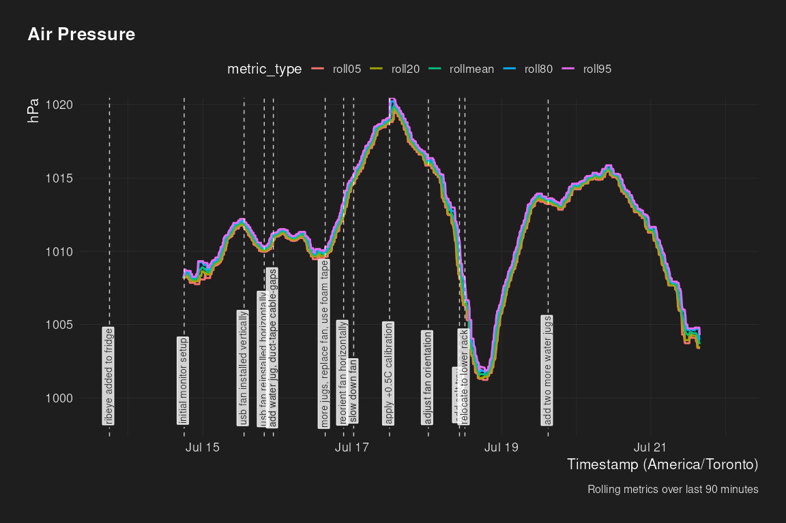

Dry Age Monitor - Log Analysis
================
2026-07-21 19:45:02.718271

``` r
knitr::opts_chunk$set(echo = FALSE, dev = "ragg_png")
suppressPackageStartupMessages({
  library(jsonlite)
  library(dplyr)
  library(tidyr)
  library(purrr)
  library(slider)
  library(lubridate)
  library(glue)
  library(ggplot2)
  library(geomtextpath)
  library(scales)
  library(ragg)
  library(marquee)
  library(tantastic)
  library(here)
})
here::i_am("reports/log_analysis.Rmd")
```

    ## here() starts at /dry-age-monitor

## dry age status

Current dry-age duration: 8.3 days

Starting weight: 14.2 lbs

Start date: 2026-07-13

Target date: 2026-08-27 (45 days)

## event timeline

| local_time          | event                                 |
|:--------------------|:--------------------------------------|
| 2026-07-13 18:00:00 | ribeye added to fridge                |
| 2026-07-14 18:00:00 | initial monitor setup                 |
| 2026-07-15 13:15:00 | usb fan installed vertically          |
| 2026-07-15 19:45:00 | usb fan reinstalled horizontally      |
| 2026-07-15 22:40:00 | add water jug, duct-tape cable-gaps   |
| 2026-07-16 15:20:00 | more jugs, replace fan, use foam tape |
| 2026-07-16 21:15:00 | reorient fan horizontally             |
| 2026-07-17 00:30:00 | slow down fan                         |
| 2026-07-17 12:01:00 | apply +0.5C calibration               |
| 2026-07-18 00:30:00 | adjust fan orientation                |
| 2026-07-18 10:30:00 | add salt tray                         |
| 2026-07-18 12:15:00 | relocate to lower rack                |
| 2026-07-19 15:00:00 | add two more water jugs               |

## Rolling Average Plots

    ## Warning: The `size` argument of `element_line()` is deprecated as of ggplot2 3.4.0.
    ## ℹ Please use the `linewidth` argument instead.
    ## ℹ The deprecated feature was likely used in the tantastic package.
    ##   Please report the issue at <https://github.com/tanho63/tantastic/issues>.
    ## This warning is displayed once per session.
    ## Call `lifecycle::last_lifecycle_warnings()` to see where this warning was
    ## generated.

<!-- --><!-- --><!-- --><!-- --><!-- -->

## Summary Tables

| timestamp           | metric        |   roll05 |   roll20 | rollmean |   roll80 |   roll95 |
|:--------------------|:--------------|---------:|---------:|---------:|---------:|---------:|
| 2026-07-14 21:00:00 | temperature_f | 35.48947 | 35.88158 | 37.04737 | 38.22105 | 38.73684 |
| 2026-07-14 22:00:00 | temperature_f | 33.01500 | 35.51583 | 39.80667 | 43.07583 | 52.49000 |
| 2026-07-14 23:00:00 | temperature_f | 31.31167 | 33.80417 | 38.22000 | 41.65500 | 47.80583 |
| 2026-07-15 00:00:00 | temperature_f | 30.78083 | 33.00333 | 37.08833 | 41.08083 | 42.42083 |
| 2026-07-15 01:00:00 | temperature_f | 30.51833 | 32.84583 | 36.95417 | 41.01083 | 42.44417 |
| 2026-07-15 02:00:00 | temperature_f | 30.30833 | 32.70167 | 36.86250 | 40.99333 | 42.42250 |
| 2026-07-15 03:00:00 | temperature_f | 30.34250 | 32.90667 | 37.01000 | 41.06417 | 42.44583 |
| 2026-07-15 04:00:00 | temperature_f | 30.38000 | 33.03417 | 37.07833 | 41.09167 | 42.44333 |
| 2026-07-15 05:00:00 | temperature_f | 30.26083 | 32.94333 | 36.97667 | 40.98750 | 42.41917 |
| 2026-07-15 06:00:00 | temperature_f | 30.25667 | 32.79250 | 36.92333 | 40.99583 | 42.42667 |
| 2026-07-15 07:00:00 | temperature_f | 30.39500 | 33.01583 | 37.06917 | 41.08583 | 42.47500 |
| 2026-07-15 08:00:00 | temperature_f | 30.49250 | 33.03250 | 37.12000 | 41.20667 | 42.51417 |
| 2026-07-15 09:00:00 | temperature_f | 30.46833 | 32.99583 | 37.05167 | 41.09750 | 42.52917 |
| 2026-07-15 10:00:00 | temperature_f | 30.56500 | 32.99417 | 37.05917 | 41.13750 | 42.54000 |
| 2026-07-15 11:00:00 | temperature_f | 30.67000 | 32.99583 | 37.12417 | 41.22333 | 42.55833 |
| 2026-07-15 12:00:00 | temperature_f | 30.83417 | 33.17000 | 37.22417 | 41.26750 | 42.57667 |
| 2026-07-15 13:00:00 | temperature_f | 30.87167 | 33.20583 | 37.25833 | 41.25583 | 42.58917 |
| 2026-07-15 14:00:00 | temperature_f | 31.04250 | 33.28250 | 37.27917 | 41.28000 | 42.60000 |
| 2026-07-15 15:00:00 | temperature_f | 31.05000 | 33.24000 | 37.23083 | 41.17000 | 42.55250 |
| 2026-07-15 16:00:00 | temperature_f | 31.03417 | 33.27000 | 37.21917 | 41.11917 | 42.50167 |
| 2026-07-15 17:00:00 | temperature_f | 31.00084 | 33.01765 | 37.35546 | 41.44286 | 42.86134 |
| 2026-07-15 18:00:00 | temperature_f | 30.86167 | 32.77000 | 37.12000 | 41.28000 | 42.87667 |
| 2026-07-15 19:00:00 | temperature_f | 30.46917 | 32.78833 | 36.92417 | 41.05667 | 42.63167 |
| 2026-07-15 20:00:00 | temperature_f | 30.32167 | 32.75667 | 36.95500 | 41.15500 | 42.61833 |
| 2026-07-15 21:00:00 | temperature_f | 30.21167 | 32.82417 | 36.90750 | 41.04583 | 42.55500 |
| 2026-07-15 22:00:00 | temperature_f | 29.99083 | 32.48667 | 36.72833 | 41.01750 | 42.58333 |
| 2026-07-15 23:00:00 | temperature_f | 30.07833 | 32.82167 | 37.03250 | 41.22833 | 42.62000 |
| 2026-07-16 00:00:00 | temperature_f | 30.50000 | 33.15833 | 37.00583 | 40.93750 | 42.46750 |
| 2026-07-16 01:00:00 | temperature_f | 30.45167 | 32.82083 | 36.82500 | 40.85917 | 42.34250 |
| 2026-07-16 02:00:00 | temperature_f | 30.35583 | 32.99333 | 37.01500 | 41.03250 | 42.47083 |
| 2026-07-16 03:00:00 | temperature_f | 31.51500 | 33.59667 | 37.40833 | 41.23583 | 43.09500 |
| 2026-07-16 04:00:00 | temperature_f | 32.36000 | 34.02417 | 37.79833 | 41.60917 | 43.05583 |
| 2026-07-16 05:00:00 | temperature_f | 32.27500 | 34.05083 | 37.72250 | 41.39333 | 42.61667 |
| 2026-07-16 06:00:00 | temperature_f | 32.05417 | 33.93500 | 37.60333 | 41.18417 | 42.45250 |
| 2026-07-16 07:00:00 | temperature_f | 32.00250 | 33.93833 | 37.52000 | 41.07500 | 42.27750 |
| 2026-07-16 08:00:00 | temperature_f | 31.84250 | 33.87250 | 37.45083 | 41.03833 | 42.21917 |
| 2026-07-16 09:00:00 | temperature_f | 31.74500 | 33.80667 | 37.40833 | 40.98833 | 42.16750 |
| 2026-07-16 10:00:00 | temperature_f | 31.86750 | 33.85500 | 37.39667 | 40.96250 | 42.16500 |
| 2026-07-16 11:00:00 | temperature_f | 31.84917 | 33.82083 | 37.35917 | 40.90083 | 42.14083 |
| 2026-07-16 12:00:00 | temperature_f | 31.85500 | 33.87583 | 37.40667 | 40.86333 | 42.15000 |
| 2026-07-16 13:00:00 | temperature_f | 31.97417 | 33.91000 | 37.44833 | 40.90333 | 42.12750 |
| 2026-07-16 14:00:00 | temperature_f | 31.98917 | 33.95750 | 37.45833 | 40.91417 | 42.08583 |
| 2026-07-16 15:00:00 | temperature_f | 31.77333 | 33.75833 | 37.34333 | 40.89083 | 42.07750 |
| 2026-07-16 16:00:00 | temperature_f | 31.75833 | 33.76083 | 37.30833 | 40.83667 | 42.07667 |
| 2026-07-16 17:00:00 | temperature_f | 31.79583 | 33.67917 | 37.33333 | 40.89250 | 42.14167 |
| 2026-07-16 18:00:00 | temperature_f | 31.66917 | 33.74250 | 37.32250 | 40.89583 | 42.16833 |
| 2026-07-16 19:00:00 | temperature_f | 31.78667 | 34.79333 | 38.85250 | 42.17250 | 46.51583 |
| 2026-07-16 20:00:00 | temperature_f | 33.95833 | 35.52750 | 39.70333 | 43.10833 | 48.76667 |
| 2026-07-16 21:00:00 | temperature_f | 33.43833 | 34.71083 | 37.83083 | 41.15167 | 42.74167 |
| 2026-07-16 22:00:00 | temperature_f | 32.45083 | 33.94000 | 37.49417 | 41.05417 | 42.27333 |
| 2026-07-16 23:00:00 | temperature_f | 31.54417 | 33.44917 | 37.15667 | 40.80750 | 41.94667 |
| 2026-07-17 00:00:00 | temperature_f | 31.22833 | 33.46333 | 37.19833 | 40.79417 | 41.76750 |
| 2026-07-17 01:00:00 | temperature_f | 31.12167 | 33.44583 | 37.17750 | 40.58833 | 42.03500 |
| 2026-07-17 02:00:00 | temperature_f | 31.58500 | 33.61750 | 37.27250 | 40.75750 | 42.06167 |
| 2026-07-17 03:00:00 | temperature_f | 31.72417 | 33.99000 | 37.55167 | 41.08500 | 41.77167 |
| 2026-07-17 04:00:00 | temperature_f | 31.65667 | 33.88500 | 37.45500 | 40.87833 | 41.72000 |
| 2026-07-17 05:00:00 | temperature_f | 32.32083 | 34.47250 | 37.70250 | 40.85417 | 41.63917 |
| 2026-07-17 06:00:00 | temperature_f | 32.52417 | 34.38750 | 37.53167 | 40.60750 | 41.44917 |
| 2026-07-17 07:00:00 | temperature_f | 32.68667 | 34.63167 | 37.70417 | 40.64750 | 41.46917 |
| 2026-07-17 08:00:00 | temperature_f | 32.88500 | 34.69833 | 37.69833 | 40.61750 | 41.50167 |
| 2026-07-17 09:00:00 | temperature_f | 33.04917 | 34.70000 | 37.71000 | 40.64167 | 41.52250 |
| 2026-07-17 10:00:00 | temperature_f | 33.09833 | 34.79667 | 37.76667 | 40.65667 | 41.56917 |
| 2026-07-17 11:00:00 | temperature_f | 33.09750 | 34.83750 | 37.78750 | 40.70083 | 41.58333 |
| 2026-07-17 12:00:00 | temperature_f | 33.01583 | 34.69667 | 37.71083 | 40.64917 | 41.52667 |
| 2026-07-17 13:00:00 | temperature_f | 33.11667 | 34.74500 | 37.69583 | 40.57417 | 41.47667 |
| 2026-07-17 14:00:00 | temperature_f | 33.13583 | 34.75583 | 37.70833 | 40.59667 | 41.48417 |
| 2026-07-17 15:00:00 | temperature_f | 33.15333 | 34.72833 | 37.68417 | 40.57250 | 41.49083 |
| 2026-07-17 16:00:00 | temperature_f | 33.18512 | 34.94298 | 37.95537 | 40.93140 | 41.87603 |
| 2026-07-17 17:00:00 | temperature_f | 33.24333 | 35.23000 | 38.45083 | 41.56917 | 42.40833 |
| 2026-07-17 18:00:00 | temperature_f | 32.86667 | 34.74667 | 38.15500 | 41.44167 | 42.50000 |
| 2026-07-17 19:00:00 | temperature_f | 32.18250 | 34.53250 | 38.11333 | 41.55917 | 42.51917 |
| 2026-07-17 20:00:00 | temperature_f | 31.69583 | 34.09583 | 37.84917 | 41.46500 | 42.51167 |
| 2026-07-17 21:00:00 | temperature_f | 31.84083 | 34.09000 | 37.82500 | 41.33083 | 42.58833 |
| 2026-07-17 22:00:00 | temperature_f | 31.73750 | 34.11083 | 37.85250 | 41.36000 | 42.46083 |
| 2026-07-17 23:00:00 | temperature_f | 31.71667 | 34.23417 | 37.99750 | 41.55417 | 42.42333 |
| 2026-07-18 00:00:00 | temperature_f | 31.76667 | 34.14667 | 37.88000 | 41.52000 | 42.41250 |
| 2026-07-18 01:00:00 | temperature_f | 31.67966 | 34.11864 | 37.91864 | 41.54068 | 42.41780 |
| 2026-07-18 02:00:00 | temperature_f | 31.48000 | 33.92000 | 37.79167 | 41.51417 | 42.40000 |
| 2026-07-18 03:00:00 | temperature_f | 31.78333 | 34.31083 | 38.04667 | 41.57000 | 42.41083 |
| 2026-07-18 04:00:00 | temperature_f | 31.65417 | 33.90833 | 37.77833 | 41.55000 | 42.51417 |
| 2026-07-18 05:00:00 | temperature_f | 31.72500 | 34.12667 | 37.88083 | 41.50500 | 42.67833 |
| 2026-07-18 06:00:00 | temperature_f | 31.65083 | 34.15000 | 37.95583 | 41.63167 | 42.51333 |
| 2026-07-18 07:00:00 | temperature_f | 31.76917 | 34.30000 | 38.03750 | 41.59667 | 42.51417 |
| 2026-07-18 08:00:00 | temperature_f | 31.97083 | 34.21583 | 37.91083 | 41.49917 | 42.44000 |
| 2026-07-18 09:00:00 | temperature_f | 32.19583 | 34.53250 | 38.12833 | 41.56917 | 42.45917 |
| 2026-07-18 10:00:00 | temperature_f | 32.23750 | 34.38167 | 37.96000 | 41.44250 | 42.44750 |
| 2026-07-18 11:00:00 | temperature_f | 32.30500 | 34.39667 | 37.97833 | 41.47083 | 42.45750 |
| 2026-07-18 12:00:00 | temperature_f | 32.34083 | 34.53167 | 38.06750 | 41.53917 | 42.46583 |
| 2026-07-18 13:00:00 | temperature_f | 32.35750 | 34.47750 | 37.95083 | 41.36917 | 42.42917 |
| 2026-07-18 14:00:00 | temperature_f | 32.47500 | 34.32250 | 37.99750 | 41.60167 | 42.69000 |
| 2026-07-18 15:00:00 | temperature_f | 32.84000 | 34.61917 | 38.11667 | 41.54583 | 42.69250 |
| 2026-07-18 16:00:00 | temperature_f | 32.97143 | 35.22653 | 38.44082 | 41.55510 | 42.38571 |
| 2026-07-18 17:00:00 | temperature_f | 33.83448 | 35.29828 | 38.16379 | 41.43448 | 42.23621 |
| 2026-07-18 18:00:00 | temperature_f | 33.30833 | 35.17167 | 38.29083 | 41.46750 | 42.19667 |
| 2026-07-18 19:00:00 | temperature_f | 32.56000 | 34.40522 | 37.75565 | 41.01652 | 42.02000 |
| 2026-07-18 20:00:00 | temperature_f | 32.94524 | 35.27024 | 38.38452 | 41.25952 | 42.03929 |
| 2026-07-18 21:00:00 | temperature_f | 32.58833 | 34.92583 | 38.16917 | 41.24833 | 42.01750 |
| 2026-07-18 22:00:00 | temperature_f | 32.10250 | 34.00167 | 37.47833 | 40.89000 | 41.96333 |
| 2026-07-18 23:00:00 | temperature_f | 32.26667 | 34.21417 | 37.69417 | 41.03500 | 41.93833 |
| 2026-07-19 00:00:00 | temperature_f | 31.89000 | 33.92417 | 37.47750 | 40.91333 | 41.91667 |
| 2026-07-19 01:00:00 | temperature_f | 31.68667 | 33.83083 | 37.50750 | 40.97750 | 41.92083 |
| 2026-07-19 02:00:00 | temperature_f | 31.48333 | 33.61333 | 37.44000 | 40.96667 | 41.94250 |
| 2026-07-19 03:00:00 | temperature_f | 31.72000 | 33.95417 | 37.65500 | 41.07250 | 42.00000 |
| 2026-07-19 04:00:00 | temperature_f | 31.68500 | 33.92417 | 37.60667 | 41.15917 | 42.00500 |
| 2026-07-19 05:00:00 | temperature_f | 31.70583 | 33.92917 | 37.62167 | 41.14750 | 42.00833 |
| 2026-07-19 06:00:00 | temperature_f | 31.80750 | 34.10000 | 37.72417 | 41.16583 | 42.02417 |
| 2026-07-19 07:00:00 | temperature_f | 32.06500 | 34.13667 | 37.65167 | 41.04250 | 42.02000 |
| 2026-07-19 08:00:00 | temperature_f | 32.16250 | 34.35417 | 37.80750 | 41.17250 | 42.04417 |
| 2026-07-19 09:00:00 | temperature_f | 32.23000 | 34.28583 | 37.72417 | 41.08333 | 42.02500 |
| 2026-07-19 10:00:00 | temperature_f | 32.29667 | 34.30667 | 37.78750 | 41.18500 | 42.04917 |
| 2026-07-19 11:00:00 | temperature_f | 32.28250 | 34.48083 | 37.88333 | 41.18500 | 42.04417 |
| 2026-07-19 12:00:00 | temperature_f | 32.23250 | 34.22333 | 37.71333 | 41.10583 | 42.03667 |
| 2026-07-19 13:00:00 | temperature_f | 32.25500 | 34.38417 | 37.89250 | 41.22667 | 42.14167 |
| 2026-07-19 14:00:00 | temperature_f | 32.24500 | 34.26167 | 37.73000 | 41.10167 | 42.05667 |
| 2026-07-19 15:00:00 | temperature_f | 32.33250 | 34.33167 | 37.78833 | 41.12750 | 42.05417 |
| 2026-07-19 16:00:00 | temperature_f | 32.14667 | 34.18667 | 37.73833 | 41.09250 | 42.04167 |
| 2026-07-19 17:00:00 | temperature_f | 31.43500 | 33.32333 | 37.24167 | 40.93833 | 42.02167 |
| 2026-07-19 18:00:00 | temperature_f | 31.49667 | 33.78000 | 37.34167 | 40.81750 | 42.09000 |
| 2026-07-19 19:00:00 | temperature_f | 32.65250 | 34.00917 | 36.86083 | 39.97833 | 41.66333 |
| 2026-07-19 20:00:00 | temperature_f | 32.52750 | 33.51667 | 36.58250 | 39.85833 | 41.44917 |
| 2026-07-19 21:00:00 | temperature_f | 32.13000 | 33.24083 | 36.61917 | 40.01417 | 41.43500 |
| 2026-07-19 22:00:00 | temperature_f | 32.06250 | 33.76583 | 37.17667 | 40.53000 | 41.55833 |
| 2026-07-19 23:00:00 | temperature_f | 31.47000 | 33.10000 | 37.01333 | 40.63000 | 41.65083 |
| 2026-07-20 00:00:00 | temperature_f | 31.56083 | 33.49500 | 37.32750 | 40.92833 | 41.77583 |
| 2026-07-20 01:00:00 | temperature_f | 31.40333 | 33.47500 | 37.33917 | 40.99000 | 41.77333 |
| 2026-07-20 02:00:00 | temperature_f | 31.44000 | 33.92167 | 37.63833 | 41.09667 | 41.86167 |
| 2026-07-20 03:00:00 | temperature_f | 31.51417 | 33.80750 | 37.65750 | 41.12083 | 41.85333 |
| 2026-07-20 04:00:00 | temperature_f | 31.41083 | 33.73667 | 37.60000 | 41.14417 | 41.86083 |
| 2026-07-20 05:00:00 | temperature_f | 31.43750 | 33.70667 | 37.52750 | 41.06917 | 41.85333 |
| 2026-07-20 06:00:00 | temperature_f | 31.76250 | 33.95250 | 37.67000 | 41.14250 | 41.86333 |
| 2026-07-20 07:00:00 | temperature_f | 31.64667 | 33.92750 | 37.69750 | 41.14667 | 41.88833 |
| 2026-07-20 08:00:00 | temperature_f | 31.73167 | 33.86083 | 37.67500 | 41.15250 | 41.89250 |
| 2026-07-20 09:00:00 | temperature_f | 31.82667 | 33.94083 | 37.64833 | 41.14417 | 41.88750 |
| 2026-07-20 10:00:00 | temperature_f | 31.78167 | 33.85333 | 37.63917 | 41.06917 | 41.88583 |
| 2026-07-20 11:00:00 | temperature_f | 32.21750 | 34.30333 | 37.85333 | 41.16583 | 41.90250 |
| 2026-07-20 12:00:00 | temperature_f | 32.20000 | 34.30000 | 37.83333 | 41.20250 | 41.90000 |
| 2026-07-20 13:00:00 | temperature_f | 32.06500 | 34.22583 | 37.81917 | 41.13833 | 41.90917 |
| 2026-07-20 14:00:00 | temperature_f | 32.03083 | 34.12500 | 37.73583 | 41.11500 | 41.90417 |
| 2026-07-20 15:00:00 | temperature_f | 32.21417 | 34.22917 | 37.82333 | 41.14333 | 41.90667 |
| 2026-07-20 16:00:00 | temperature_f | 32.22917 | 34.21500 | 37.82083 | 41.15167 | 41.91167 |
| 2026-07-20 17:00:00 | temperature_f | 32.20250 | 34.04417 | 37.70333 | 41.08667 | 41.90583 |
| 2026-07-20 18:00:00 | temperature_f | 32.12833 | 34.20250 | 37.81167 | 41.20250 | 41.90667 |
| 2026-07-20 19:00:00 | temperature_f | 32.00083 | 34.03667 | 37.74667 | 41.16833 | 41.89583 |
| 2026-07-20 20:00:00 | temperature_f | 31.65750 | 34.01667 | 37.75583 | 41.15500 | 41.92000 |
| 2026-07-20 21:00:00 | temperature_f | 31.56083 | 33.74250 | 37.64667 | 41.15167 | 41.94417 |
| 2026-07-20 22:00:00 | temperature_f | 31.83000 | 34.08333 | 37.80333 | 41.26833 | 41.98333 |
| 2026-07-20 23:00:00 | temperature_f | 31.34000 | 33.58667 | 37.52583 | 41.11333 | 41.92750 |
| 2026-07-21 00:00:00 | temperature_f | 31.85667 | 34.32083 | 37.95417 | 41.28500 | 41.96667 |
| 2026-07-21 01:00:00 | temperature_f | 31.36387 | 34.09664 | 37.76891 | 41.18908 | 41.94370 |
| 2026-07-21 02:00:00 | temperature_f | 31.10250 | 33.95333 | 37.72583 | 41.21000 | 41.95333 |
| 2026-07-21 03:00:00 | temperature_f | 31.63000 | 34.34833 | 37.99667 | 41.30417 | 41.99417 |
| 2026-07-21 04:00:00 | temperature_f | 31.83000 | 34.39167 | 38.04167 | 41.34000 | 42.05333 |
| 2026-07-21 05:00:00 | temperature_f | 31.35250 | 33.69000 | 37.61833 | 41.22583 | 41.99500 |
| 2026-07-21 06:00:00 | temperature_f | 31.68750 | 34.04000 | 37.74667 | 41.10250 | 41.94833 |
| 2026-07-21 07:00:00 | temperature_f | 31.91333 | 34.16667 | 37.84750 | 41.19333 | 41.95500 |
| 2026-07-21 08:00:00 | temperature_f | 31.77833 | 34.10083 | 37.82750 | 41.21583 | 41.89250 |
| 2026-07-21 09:00:00 | temperature_f | 32.30667 | 34.46083 | 38.00333 | 41.22917 | 41.95833 |
| 2026-07-21 10:00:00 | temperature_f | 32.26250 | 34.32667 | 37.87833 | 41.21250 | 41.92667 |
| 2026-07-21 11:00:00 | temperature_f | 32.29083 | 34.19917 | 37.80250 | 41.13083 | 41.90333 |
| 2026-07-21 12:00:00 | temperature_f | 32.31333 | 34.20750 | 37.81417 | 41.13000 | 41.90417 |
| 2026-07-21 13:00:00 | temperature_f | 32.30000 | 34.27833 | 37.80083 | 41.09417 | 41.88583 |
| 2026-07-21 14:00:00 | temperature_f | 32.06667 | 34.10750 | 37.68000 | 41.04000 | 41.81000 |
| 2026-07-21 15:00:00 | temperature_f | 32.08667 | 34.06500 | 37.68250 | 41.02083 | 41.81500 |
| 2026-07-21 16:00:00 | temperature_f | 32.08333 | 33.93333 | 37.56333 | 40.96583 | 41.80917 |
| 2026-07-21 17:00:00 | temperature_f | 32.03333 | 33.99667 | 37.63000 | 40.99917 | 41.80583 |
| 2026-07-21 18:00:00 | temperature_f | 31.65333 | 33.63667 | 37.48333 | 41.04833 | 41.79750 |
| 2026-07-21 19:00:00 | temperature_f | 31.75393 | 33.70899 | 37.51910 | 41.07416 | 41.80000 |

| timestamp           | metric       |   roll05 |   roll20 | rollmean |    roll80 |    roll95 |
|:--------------------|:-------------|---------:|---------:|---------:|----------:|----------:|
| 2026-07-14 21:00:00 | humidity_pct | 43.97368 | 44.12105 | 57.64474 |  70.13947 |  74.32632 |
| 2026-07-14 22:00:00 | humidity_pct | 44.14083 | 47.17667 | 74.91250 |  98.27167 | 100.31250 |
| 2026-07-14 23:00:00 | humidity_pct | 46.09917 | 50.66917 | 79.85333 | 100.64583 | 102.02250 |
| 2026-07-15 00:00:00 | humidity_pct | 49.22000 | 53.83583 | 84.03250 | 102.11000 | 102.50000 |
| 2026-07-15 01:00:00 | humidity_pct | 49.48250 | 55.59667 | 84.81333 | 102.40917 | 102.62250 |
| 2026-07-15 02:00:00 | humidity_pct | 49.33167 | 56.00917 | 84.93167 | 102.53083 | 102.76500 |
| 2026-07-15 03:00:00 | humidity_pct | 49.08750 | 56.34083 | 85.14250 | 102.58417 | 102.80000 |
| 2026-07-15 04:00:00 | humidity_pct | 49.17667 | 57.12083 | 85.73833 | 102.57333 | 102.81667 |
| 2026-07-15 05:00:00 | humidity_pct | 49.26833 | 56.94500 | 85.96000 | 102.69917 | 102.92250 |
| 2026-07-15 06:00:00 | humidity_pct | 49.46000 | 56.60333 | 85.54000 | 102.77833 | 103.00000 |
| 2026-07-15 07:00:00 | humidity_pct | 49.20167 | 55.81583 | 85.19417 | 102.73667 | 102.92167 |
| 2026-07-15 08:00:00 | humidity_pct | 48.87833 | 56.05000 | 85.28417 | 102.66000 | 102.83333 |
| 2026-07-15 09:00:00 | humidity_pct | 49.14417 | 56.38333 | 85.36000 | 102.53167 | 102.73500 |
| 2026-07-15 10:00:00 | humidity_pct | 49.32167 | 56.00083 | 85.31417 | 102.41583 | 102.82750 |
| 2026-07-15 11:00:00 | humidity_pct | 49.21167 | 54.93083 | 84.90833 | 102.49167 | 102.82000 |
| 2026-07-15 12:00:00 | humidity_pct | 49.04000 | 54.64583 | 84.57583 | 102.57917 | 102.80000 |
| 2026-07-15 13:00:00 | humidity_pct | 48.87250 | 54.35750 | 84.08333 | 102.37833 | 102.71167 |
| 2026-07-15 14:00:00 | humidity_pct | 48.76750 | 53.75417 | 83.58250 | 102.23417 | 102.57083 |
| 2026-07-15 15:00:00 | humidity_pct | 48.61000 | 53.19583 | 83.10167 | 102.20000 | 102.35417 |
| 2026-07-15 16:00:00 | humidity_pct | 48.41917 | 52.97417 | 83.02917 | 102.19667 | 102.30000 |
| 2026-07-15 17:00:00 | humidity_pct | 48.28992 | 53.95882 | 81.75714 | 101.67143 | 102.30000 |
| 2026-07-15 18:00:00 | humidity_pct | 51.81833 | 57.30583 | 82.57000 | 100.81833 | 101.94000 |
| 2026-07-15 19:00:00 | humidity_pct | 54.48833 | 58.47083 | 84.46833 | 101.41083 | 101.70000 |
| 2026-07-15 20:00:00 | humidity_pct | 54.42583 | 59.48917 | 85.30917 | 101.62583 | 101.74750 |
| 2026-07-15 21:00:00 | humidity_pct | 54.51500 | 60.63000 | 86.23000 | 101.66917 | 101.80000 |
| 2026-07-15 22:00:00 | humidity_pct | 54.47667 | 60.01333 | 85.78917 | 101.65750 | 101.80750 |
| 2026-07-15 23:00:00 | humidity_pct | 54.31667 | 60.55333 | 86.21333 | 101.66583 | 101.88917 |
| 2026-07-16 00:00:00 | humidity_pct | 54.80167 | 60.61167 | 86.16083 | 101.74000 | 102.68167 |
| 2026-07-16 01:00:00 | humidity_pct | 54.94417 | 59.56833 | 85.91500 | 102.83333 | 103.06000 |
| 2026-07-16 02:00:00 | humidity_pct | 54.99833 | 60.55750 | 87.18083 | 102.92667 | 103.12583 |
| 2026-07-16 03:00:00 | humidity_pct | 50.81833 | 55.10833 | 81.38083 | 101.34500 | 103.10000 |
| 2026-07-16 04:00:00 | humidity_pct | 49.80417 | 52.11500 | 77.41417 |  99.18667 | 100.71667 |
| 2026-07-16 05:00:00 | humidity_pct | 50.49500 | 53.90083 | 80.33333 | 100.24083 | 101.09167 |
| 2026-07-16 06:00:00 | humidity_pct | 51.28250 | 55.23583 | 82.26917 | 101.08333 | 101.70333 |
| 2026-07-16 07:00:00 | humidity_pct | 51.98917 | 56.48417 | 83.28417 | 101.55667 | 101.94583 |
| 2026-07-16 08:00:00 | humidity_pct | 52.16417 | 57.12250 | 83.90833 | 101.58750 | 101.89250 |
| 2026-07-16 09:00:00 | humidity_pct | 52.36833 | 57.78750 | 84.38750 | 101.48417 | 101.74833 |
| 2026-07-16 10:00:00 | humidity_pct | 52.47167 | 57.71333 | 84.37667 | 101.37583 | 101.70000 |
| 2026-07-16 11:00:00 | humidity_pct | 52.59083 | 57.79833 | 84.33917 | 101.41000 | 101.70000 |
| 2026-07-16 12:00:00 | humidity_pct | 52.69333 | 57.85667 | 84.35500 | 101.42667 | 101.74000 |
| 2026-07-16 13:00:00 | humidity_pct | 52.36833 | 57.69167 | 84.14583 | 101.28583 | 101.67750 |
| 2026-07-16 14:00:00 | humidity_pct | 51.94583 | 56.99833 | 83.74333 | 101.17083 | 101.48917 |
| 2026-07-16 15:00:00 | humidity_pct | 51.87500 | 56.59917 | 83.48417 | 101.06500 | 101.40000 |
| 2026-07-16 16:00:00 | humidity_pct | 51.73917 | 57.11667 | 83.86250 | 101.08417 | 101.38917 |
| 2026-07-16 17:00:00 | humidity_pct | 51.83667 | 57.56833 | 84.03500 | 101.18167 | 101.47667 |
| 2026-07-16 18:00:00 | humidity_pct | 51.74167 | 57.33333 | 83.83583 | 101.16417 | 101.53667 |
| 2026-07-16 19:00:00 | humidity_pct | 48.04417 | 54.71750 | 80.34000 | 100.97083 | 101.60000 |
| 2026-07-16 20:00:00 | humidity_pct | 41.50500 | 42.61167 | 62.81917 |  88.69667 |  99.20417 |
| 2026-07-16 21:00:00 | humidity_pct | 42.92750 | 44.84167 | 66.92000 |  92.71583 |  99.02417 |
| 2026-07-16 22:00:00 | humidity_pct | 45.47750 | 48.23917 | 75.75083 |  99.51000 | 101.08500 |
| 2026-07-16 23:00:00 | humidity_pct | 47.17000 | 51.82417 | 80.40167 | 101.30167 | 101.99417 |
| 2026-07-17 00:00:00 | humidity_pct | 48.76833 | 55.25167 | 83.46750 | 101.98167 | 102.25250 |
| 2026-07-17 01:00:00 | humidity_pct | 49.31917 | 56.79667 | 84.29750 | 102.09917 | 102.38583 |
| 2026-07-17 02:00:00 | humidity_pct | 49.68333 | 56.69333 | 83.72417 | 101.88333 | 102.33167 |
| 2026-07-17 03:00:00 | humidity_pct | 50.03833 | 63.54333 | 86.78167 | 101.57333 | 102.09500 |
| 2026-07-17 04:00:00 | humidity_pct | 49.68250 | 60.67250 | 85.94833 | 101.38667 | 101.70000 |
| 2026-07-17 05:00:00 | humidity_pct | 49.08500 | 64.28833 | 87.39667 | 101.86167 | 102.69000 |
| 2026-07-17 06:00:00 | humidity_pct | 48.68000 | 60.90333 | 86.15500 | 102.33500 | 102.75167 |
| 2026-07-17 07:00:00 | humidity_pct | 48.02833 | 60.15917 | 85.80583 | 102.22667 | 102.60083 |
| 2026-07-17 08:00:00 | humidity_pct | 47.68583 | 59.94000 | 85.71250 | 102.07750 | 102.44167 |
| 2026-07-17 09:00:00 | humidity_pct | 47.44250 | 58.38167 | 84.77583 | 101.88250 | 102.26417 |
| 2026-07-17 10:00:00 | humidity_pct | 47.49167 | 56.83000 | 84.27083 | 101.76583 | 102.18500 |
| 2026-07-17 11:00:00 | humidity_pct | 47.49500 | 56.99500 | 84.32500 | 101.73583 | 102.16500 |
| 2026-07-17 12:00:00 | humidity_pct | 47.49750 | 56.31250 | 84.05167 | 101.65750 | 102.07750 |
| 2026-07-17 13:00:00 | humidity_pct | 47.68667 | 56.83000 | 84.11417 | 101.68167 | 102.03667 |
| 2026-07-17 14:00:00 | humidity_pct | 47.68667 | 56.17250 | 83.88250 | 101.62833 | 102.00167 |
| 2026-07-17 15:00:00 | humidity_pct | 47.40917 | 54.86250 | 82.99000 | 101.51500 | 101.87583 |
| 2026-07-17 16:00:00 | humidity_pct | 47.03636 | 54.52066 | 82.30000 | 101.40744 | 101.80165 |
| 2026-07-17 17:00:00 | humidity_pct | 46.53333 | 54.65417 | 83.02500 | 101.59667 | 101.99167 |
| 2026-07-17 18:00:00 | humidity_pct | 46.37833 | 54.24667 | 83.57167 | 101.72917 | 102.18000 |
| 2026-07-17 19:00:00 | humidity_pct | 46.48750 | 55.21667 | 83.93583 | 101.82083 | 102.29917 |
| 2026-07-17 20:00:00 | humidity_pct | 46.64917 | 57.43417 | 85.34083 | 102.06167 | 102.58083 |
| 2026-07-17 21:00:00 | humidity_pct | 46.94333 | 56.34833 | 84.63083 | 102.32833 | 102.80917 |
| 2026-07-17 22:00:00 | humidity_pct | 47.38500 | 60.44917 | 86.53167 | 102.50417 | 102.99917 |
| 2026-07-17 23:00:00 | humidity_pct | 47.65667 | 61.94917 | 86.77500 | 102.52000 | 103.10000 |
| 2026-07-18 00:00:00 | humidity_pct | 47.80000 | 61.09750 | 86.64750 | 102.50250 | 103.10000 |
| 2026-07-18 01:00:00 | humidity_pct | 47.72288 | 60.15847 | 86.51186 | 102.58644 | 103.10000 |
| 2026-07-18 02:00:00 | humidity_pct | 47.84000 | 60.28917 | 86.89500 | 102.67667 | 103.22167 |
| 2026-07-18 03:00:00 | humidity_pct | 48.22000 | 64.82000 | 88.01333 | 102.88333 | 103.39333 |
| 2026-07-18 04:00:00 | humidity_pct | 47.90250 | 58.88417 | 85.65833 | 102.67417 | 103.41167 |
| 2026-07-18 05:00:00 | humidity_pct | 47.91500 | 61.87250 | 86.39917 | 102.51250 | 103.28750 |
| 2026-07-18 06:00:00 | humidity_pct | 48.33333 | 61.12917 | 86.93333 | 102.64250 | 103.30000 |
| 2026-07-18 07:00:00 | humidity_pct | 48.34833 | 61.49333 | 87.09667 | 102.66833 | 103.22750 |
| 2026-07-18 08:00:00 | humidity_pct | 47.97250 | 58.31667 | 85.39417 | 102.48583 | 103.15500 |
| 2026-07-18 09:00:00 | humidity_pct | 47.87250 | 59.20417 | 85.68000 | 102.48500 | 103.02167 |
| 2026-07-18 10:00:00 | humidity_pct | 47.64417 | 57.57250 | 85.03000 | 102.34833 | 102.91833 |
| 2026-07-18 11:00:00 | humidity_pct | 47.47333 | 55.27000 | 84.01667 | 102.21583 | 102.78000 |
| 2026-07-18 12:00:00 | humidity_pct | 47.65833 | 56.54917 | 84.60083 | 102.24583 | 102.77167 |
| 2026-07-18 13:00:00 | humidity_pct | 47.66083 | 56.68833 | 84.71750 | 102.36167 | 102.80000 |
| 2026-07-18 14:00:00 | humidity_pct | 47.41000 | 53.61250 | 82.82333 | 101.85583 | 102.84500 |
| 2026-07-18 15:00:00 | humidity_pct | 47.40250 | 52.98083 | 81.75750 | 100.69333 | 101.65583 |
| 2026-07-18 16:00:00 | humidity_pct | 48.46327 | 57.10408 | 84.11837 | 100.92857 | 101.30000 |
| 2026-07-18 17:00:00 | humidity_pct | 50.81207 | 57.13793 | 79.79138 |  95.67241 | 101.76379 |
| 2026-07-18 18:00:00 | humidity_pct | 52.48667 | 60.18000 | 84.06500 | 101.72417 | 101.81000 |
| 2026-07-18 19:00:00 | humidity_pct | 51.81304 | 57.93217 | 84.04870 | 101.63304 | 101.80000 |
| 2026-07-18 20:00:00 | humidity_pct | 52.62500 | 62.17381 | 85.94762 | 101.57143 | 101.80000 |
| 2026-07-18 21:00:00 | humidity_pct | 51.17000 | 59.51167 | 84.58250 | 101.16083 | 101.62500 |
| 2026-07-18 22:00:00 | humidity_pct | 50.94750 | 57.85000 | 83.51333 | 100.76333 | 101.08000 |
| 2026-07-18 23:00:00 | humidity_pct | 51.66250 | 59.27583 | 84.71833 | 100.88000 | 101.14083 |
| 2026-07-19 00:00:00 | humidity_pct | 52.06417 | 59.81833 | 84.99583 | 100.92333 | 101.20667 |
| 2026-07-19 01:00:00 | humidity_pct | 52.01167 | 59.99417 | 85.26750 | 100.94083 | 101.24417 |
| 2026-07-19 02:00:00 | humidity_pct | 52.57583 | 60.78667 | 86.17750 | 101.11000 | 101.36583 |
| 2026-07-19 03:00:00 | humidity_pct | 53.15750 | 62.73917 | 87.06583 | 101.22500 | 101.49500 |
| 2026-07-19 04:00:00 | humidity_pct | 53.03917 | 62.04583 | 86.70167 | 101.25167 | 101.59417 |
| 2026-07-19 05:00:00 | humidity_pct | 52.95667 | 62.19417 | 86.78167 | 101.32083 | 101.70000 |
| 2026-07-19 06:00:00 | humidity_pct | 52.79333 | 61.95583 | 86.35667 | 101.22333 | 101.50917 |
| 2026-07-19 07:00:00 | humidity_pct | 52.52417 | 61.39500 | 85.83750 | 101.10250 | 101.44500 |
| 2026-07-19 08:00:00 | humidity_pct | 52.32417 | 61.25667 | 85.48833 | 101.05917 | 101.37167 |
| 2026-07-19 09:00:00 | humidity_pct | 52.32500 | 61.35667 | 85.70750 | 100.99667 | 101.30000 |
| 2026-07-19 10:00:00 | humidity_pct | 52.47833 | 60.25750 | 84.99333 | 101.01833 | 101.30000 |
| 2026-07-19 11:00:00 | humidity_pct | 52.41167 | 61.61083 | 85.96000 | 101.03667 | 101.32333 |
| 2026-07-19 12:00:00 | humidity_pct | 52.21083 | 60.28417 | 84.91000 | 100.97083 | 101.30000 |
| 2026-07-19 13:00:00 | humidity_pct | 52.09000 | 60.77833 | 85.22000 | 101.00000 | 101.26750 |
| 2026-07-19 14:00:00 | humidity_pct | 51.95083 | 60.40917 | 85.08333 | 100.91333 | 101.24417 |
| 2026-07-19 15:00:00 | humidity_pct | 51.99250 | 59.22333 | 84.34167 | 100.87417 | 101.20000 |
| 2026-07-19 16:00:00 | humidity_pct | 51.69417 | 59.52417 | 84.75833 | 100.85417 | 101.19417 |
| 2026-07-19 17:00:00 | humidity_pct | 50.80833 | 55.87167 | 82.42167 | 100.51333 | 100.93083 |
| 2026-07-19 18:00:00 | humidity_pct | 49.37750 | 53.71083 | 79.94500 | 100.20667 | 100.68583 |
| 2026-07-19 19:00:00 | humidity_pct | 46.28417 | 48.03167 | 67.51000 |  93.06917 |  99.36667 |
| 2026-07-19 20:00:00 | humidity_pct | 45.85250 | 47.23333 | 68.41667 |  93.72250 |  98.28750 |
| 2026-07-19 21:00:00 | humidity_pct | 46.48000 | 49.33917 | 73.85250 |  97.30167 |  99.17917 |
| 2026-07-19 22:00:00 | humidity_pct | 48.68250 | 53.52000 | 79.28333 |  99.47417 | 100.08917 |
| 2026-07-19 23:00:00 | humidity_pct | 49.51750 | 54.64333 | 81.75167 | 100.13417 | 100.47917 |
| 2026-07-20 00:00:00 | humidity_pct | 50.83417 | 57.08917 | 84.09000 | 100.62083 | 101.09333 |
| 2026-07-20 01:00:00 | humidity_pct | 51.57667 | 59.93583 | 85.42000 | 100.90000 | 101.33167 |
| 2026-07-20 02:00:00 | humidity_pct | 53.26083 | 64.02583 | 87.21917 | 101.35083 | 101.70000 |
| 2026-07-20 03:00:00 | humidity_pct | 53.77917 | 64.82333 | 87.51500 | 101.39917 | 101.83750 |
| 2026-07-20 04:00:00 | humidity_pct | 53.97500 | 63.88083 | 87.26333 | 101.60333 | 101.96000 |
| 2026-07-20 05:00:00 | humidity_pct | 54.15083 | 64.41333 | 87.48000 | 101.54917 | 101.81333 |
| 2026-07-20 06:00:00 | humidity_pct | 54.33000 | 63.87833 | 87.45833 | 101.63083 | 102.00000 |
| 2026-07-20 07:00:00 | humidity_pct | 53.94500 | 63.06833 | 87.28917 | 101.43750 | 101.91333 |
| 2026-07-20 08:00:00 | humidity_pct | 53.63833 | 61.00167 | 86.54500 | 101.39083 | 101.89917 |
| 2026-07-20 09:00:00 | humidity_pct | 53.49750 | 61.25000 | 86.67167 | 101.36917 | 101.79167 |
| 2026-07-20 10:00:00 | humidity_pct | 53.40833 | 60.94000 | 86.43250 | 101.35667 | 101.71667 |
| 2026-07-20 11:00:00 | humidity_pct | 54.48417 | 63.45417 | 87.42500 | 101.42167 | 101.72333 |
| 2026-07-20 12:00:00 | humidity_pct | 54.51000 | 63.40000 | 87.39250 | 101.52000 | 101.81833 |
| 2026-07-20 13:00:00 | humidity_pct | 54.12167 | 62.06750 | 87.04167 | 101.60000 | 101.90000 |
| 2026-07-20 14:00:00 | humidity_pct | 54.19000 | 61.83083 | 86.86833 | 101.60000 | 101.96000 |
| 2026-07-20 15:00:00 | humidity_pct | 54.07583 | 61.98167 | 86.80917 | 101.51833 | 101.96333 |
| 2026-07-20 16:00:00 | humidity_pct | 53.88000 | 61.52333 | 86.47667 | 101.41083 | 101.70000 |
| 2026-07-20 17:00:00 | humidity_pct | 53.72333 | 60.84833 | 86.26667 | 101.42083 | 101.70000 |
| 2026-07-20 18:00:00 | humidity_pct | 53.75250 | 62.06750 | 86.78917 | 101.58667 | 101.79833 |
| 2026-07-20 19:00:00 | humidity_pct | 53.65500 | 62.14917 | 86.98417 | 101.58417 | 101.88417 |
| 2026-07-20 20:00:00 | humidity_pct | 53.86917 | 63.04333 | 87.26583 | 101.59250 | 102.00000 |
| 2026-07-20 21:00:00 | humidity_pct | 53.92667 | 63.86417 | 87.45500 | 101.62167 | 101.95667 |
| 2026-07-20 22:00:00 | humidity_pct | 54.31500 | 63.83083 | 87.75000 | 101.81917 | 102.09833 |
| 2026-07-20 23:00:00 | humidity_pct | 53.56500 | 62.62917 | 87.06583 | 101.72000 | 102.06167 |
| 2026-07-21 00:00:00 | humidity_pct | 54.84667 | 69.22500 | 89.43083 | 101.90000 | 102.24083 |
| 2026-07-21 01:00:00 | humidity_pct | 54.13613 | 66.68319 | 88.37479 | 101.98403 | 102.30000 |
| 2026-07-21 02:00:00 | humidity_pct | 54.21833 | 70.18583 | 88.87250 | 101.87500 | 102.19167 |
| 2026-07-21 03:00:00 | humidity_pct | 55.69583 | 71.55667 | 90.00333 | 102.11833 | 102.48000 |
| 2026-07-21 04:00:00 | humidity_pct | 55.87250 | 68.92083 | 89.63667 | 102.29500 | 102.59583 |
| 2026-07-21 05:00:00 | humidity_pct | 54.48250 | 64.75667 | 87.86500 | 101.97667 | 102.42833 |
| 2026-07-21 06:00:00 | humidity_pct | 54.89000 | 66.35917 | 88.76333 | 101.95167 | 102.36917 |
| 2026-07-21 07:00:00 | humidity_pct | 54.99917 | 65.15250 | 88.49750 | 102.10500 | 102.40000 |
| 2026-07-21 08:00:00 | humidity_pct | 54.66667 | 64.56333 | 88.20917 | 101.97500 | 102.31083 |
| 2026-07-21 09:00:00 | humidity_pct | 54.78833 | 64.05167 | 88.12083 | 101.99250 | 102.29500 |
| 2026-07-21 10:00:00 | humidity_pct | 54.24000 | 62.41000 | 87.50417 | 101.82000 | 102.10417 |
| 2026-07-21 11:00:00 | humidity_pct | 54.05417 | 61.73167 | 86.90167 | 101.80833 | 102.10000 |
| 2026-07-21 12:00:00 | humidity_pct | 53.87417 | 61.76083 | 86.98667 | 101.81250 | 102.10583 |
| 2026-07-21 13:00:00 | humidity_pct | 53.89333 | 61.52000 | 86.77917 | 101.72500 | 102.10583 |
| 2026-07-21 14:00:00 | humidity_pct | 54.03333 | 61.53833 | 86.56083 | 101.64583 | 102.10000 |
| 2026-07-21 15:00:00 | humidity_pct | 53.91083 | 61.37083 | 86.39000 | 101.61583 | 102.01333 |
| 2026-07-21 16:00:00 | humidity_pct | 53.60500 | 60.29000 | 85.78917 | 101.61250 | 102.00500 |
| 2026-07-21 17:00:00 | humidity_pct | 53.52833 | 60.91500 | 86.40250 | 101.60000 | 101.98917 |
| 2026-07-21 18:00:00 | humidity_pct | 53.31667 | 59.93000 | 85.88500 | 101.49250 | 101.80000 |
| 2026-07-21 19:00:00 | humidity_pct | 53.29213 | 60.67753 | 86.30787 | 101.52360 | 101.86517 |

| timestamp           | metric              |     roll05 |     roll20 |  rollmean |    roll80 |   roll95 |
|:--------------------|:--------------------|-----------:|-----------:|----------:|----------:|---------:|
| 2026-07-14 21:00:00 | temp_minus_dewpoint |  8.5236842 |  9.9342105 | 14.660526 | 19.921053 | 19.99211 |
| 2026-07-14 22:00:00 | temp_minus_dewpoint | -0.0875000 |  0.4483333 |  8.415000 | 18.404167 | 19.89500 |
| 2026-07-14 23:00:00 | temp_minus_dewpoint | -0.5258333 | -0.1775000 |  6.649167 | 16.569167 | 18.65750 |
| 2026-07-15 00:00:00 | temp_minus_dewpoint | -0.6333333 | -0.5266667 |  5.155833 | 15.145000 | 16.96833 |
| 2026-07-15 01:00:00 | temp_minus_dewpoint | -0.7000000 | -0.6066667 |  4.905000 | 14.462500 | 16.81583 |
| 2026-07-15 02:00:00 | temp_minus_dewpoint | -0.7000000 | -0.6616667 |  4.868333 | 14.350833 | 16.88000 |
| 2026-07-15 03:00:00 | temp_minus_dewpoint | -0.7000000 | -0.6700000 |  4.811667 | 14.176667 | 16.96833 |
| 2026-07-15 04:00:00 | temp_minus_dewpoint | -0.7000000 | -0.6783333 |  4.626667 | 13.811667 | 16.94417 |
| 2026-07-15 05:00:00 | temp_minus_dewpoint | -0.7225000 | -0.6916667 |  4.556667 | 13.804167 | 16.90000 |
| 2026-07-15 06:00:00 | temp_minus_dewpoint | -0.8000000 | -0.7000000 |  4.686667 | 14.028333 | 16.80750 |
| 2026-07-15 07:00:00 | temp_minus_dewpoint | -0.7225000 | -0.6908333 |  4.806667 | 14.325833 | 16.94667 |
| 2026-07-15 08:00:00 | temp_minus_dewpoint | -0.7000000 | -0.6916667 |  4.781667 | 14.231667 | 17.13583 |
| 2026-07-15 09:00:00 | temp_minus_dewpoint | -0.7000000 | -0.6600000 |  4.746667 | 14.194167 | 16.95250 |
| 2026-07-15 10:00:00 | temp_minus_dewpoint | -0.7000000 | -0.6016667 |  4.758333 | 14.244167 | 16.86833 |
| 2026-07-15 11:00:00 | temp_minus_dewpoint | -0.7000000 | -0.6183333 |  4.902500 | 14.710833 | 16.99917 |
| 2026-07-15 12:00:00 | temp_minus_dewpoint | -0.7000000 | -0.6708333 |  5.002500 | 14.950000 | 17.04333 |
| 2026-07-15 13:00:00 | temp_minus_dewpoint | -0.7000000 | -0.6000000 |  5.169167 | 15.096667 | 17.13917 |
| 2026-07-15 14:00:00 | temp_minus_dewpoint | -0.6875000 | -0.5858333 |  5.324167 | 15.333333 | 17.20000 |
| 2026-07-15 15:00:00 | temp_minus_dewpoint | -0.6000000 | -0.5641667 |  5.475000 | 15.509167 | 17.24667 |
| 2026-07-15 16:00:00 | temp_minus_dewpoint | -0.6000000 | -0.5966667 |  5.493333 | 15.616667 | 17.33333 |
| 2026-07-15 17:00:00 | temp_minus_dewpoint | -0.6000000 | -0.4285714 |  5.875630 | 15.145378 | 17.40000 |
| 2026-07-15 18:00:00 | temp_minus_dewpoint | -0.4816667 | -0.2150000 |  5.462500 | 13.645833 | 15.88917 |
| 2026-07-15 19:00:00 | temp_minus_dewpoint | -0.4000000 | -0.3633333 |  4.837500 | 13.191667 | 14.57333 |
| 2026-07-15 20:00:00 | temp_minus_dewpoint | -0.4466667 | -0.4000000 |  4.580833 | 12.770000 | 14.55833 |
| 2026-07-15 21:00:00 | temp_minus_dewpoint | -0.5000000 | -0.4000000 |  4.285000 | 12.377500 | 14.54500 |
| 2026-07-15 22:00:00 | temp_minus_dewpoint | -0.4766667 | -0.4000000 |  4.419167 | 12.594167 | 14.50000 |
| 2026-07-15 23:00:00 | temp_minus_dewpoint | -0.5000000 | -0.4000000 |  4.300000 | 12.419167 | 14.57667 |
| 2026-07-16 00:00:00 | temp_minus_dewpoint | -0.6716667 | -0.4608333 |  4.313333 | 12.332500 | 14.46000 |
| 2026-07-16 01:00:00 | temp_minus_dewpoint | -0.8000000 | -0.7000000 |  4.422500 | 12.780000 | 14.33333 |
| 2026-07-16 02:00:00 | temp_minus_dewpoint | -0.8000000 | -0.7466667 |  4.044167 | 12.439167 | 14.34583 |
| 2026-07-16 03:00:00 | temp_minus_dewpoint | -0.8000000 | -0.3283333 |  5.954167 | 14.620000 | 16.32083 |
| 2026-07-16 04:00:00 | temp_minus_dewpoint | -0.1983333 |  0.2283333 |  7.241667 | 15.845833 | 16.79333 |
| 2026-07-16 05:00:00 | temp_minus_dewpoint | -0.2833333 | -0.0591667 |  6.257500 | 15.138333 | 16.40500 |
| 2026-07-16 06:00:00 | temp_minus_dewpoint | -0.4600000 | -0.2708333 |  5.615000 | 14.527500 | 16.05500 |
| 2026-07-16 07:00:00 | temp_minus_dewpoint | -0.5000000 | -0.3933333 |  5.280000 | 14.087500 | 15.74333 |
| 2026-07-16 08:00:00 | temp_minus_dewpoint | -0.4991667 | -0.3925000 |  5.075833 | 13.807500 | 15.62167 |
| 2026-07-16 09:00:00 | temp_minus_dewpoint | -0.4000000 | -0.3866667 |  4.915000 | 13.533333 | 15.54667 |
| 2026-07-16 10:00:00 | temp_minus_dewpoint | -0.4000000 | -0.3800000 |  4.910000 | 13.575000 | 15.54667 |
| 2026-07-16 11:00:00 | temp_minus_dewpoint | -0.4000000 | -0.3725000 |  4.920833 | 13.542500 | 15.50750 |
| 2026-07-16 12:00:00 | temp_minus_dewpoint | -0.4400000 | -0.3675000 |  4.916667 | 13.430000 | 15.42417 |
| 2026-07-16 13:00:00 | temp_minus_dewpoint | -0.4000000 | -0.3000000 |  4.984167 | 13.568333 | 15.58833 |
| 2026-07-16 14:00:00 | temp_minus_dewpoint | -0.4000000 | -0.3000000 |  5.120833 | 13.835000 | 15.76000 |
| 2026-07-16 15:00:00 | temp_minus_dewpoint | -0.4000000 | -0.2833333 |  5.205000 | 14.002500 | 15.77083 |
| 2026-07-16 16:00:00 | temp_minus_dewpoint | -0.3891667 | -0.2808333 |  5.085833 | 13.800000 | 15.82083 |
| 2026-07-16 17:00:00 | temp_minus_dewpoint | -0.4000000 | -0.2941667 |  5.025833 | 13.581667 | 15.78250 |
| 2026-07-16 18:00:00 | temp_minus_dewpoint | -0.4000000 | -0.2891667 |  5.092500 | 13.630000 | 15.86667 |
| 2026-07-16 19:00:00 | temp_minus_dewpoint | -0.4000000 | -0.2483333 |  6.452500 | 15.048333 | 17.87417 |
| 2026-07-16 20:00:00 | temp_minus_dewpoint |  0.2208333 |  3.1125000 | 12.848333 | 20.696667 | 21.09583 |
| 2026-07-16 21:00:00 | temp_minus_dewpoint |  0.2658333 |  1.9550000 | 11.153333 | 19.366667 | 20.28167 |
| 2026-07-16 22:00:00 | temp_minus_dewpoint | -0.2858333 |  0.1475000 |  7.959167 | 17.643333 | 18.82167 |
| 2026-07-16 23:00:00 | temp_minus_dewpoint | -0.4816667 | -0.3300000 |  6.353333 | 16.032500 | 17.89500 |
| 2026-07-17 00:00:00 | temp_minus_dewpoint | -0.6000000 | -0.5000000 |  5.317500 | 14.559167 | 17.14250 |
| 2026-07-17 01:00:00 | temp_minus_dewpoint | -0.6000000 | -0.5391667 |  5.021667 | 13.981667 | 16.86583 |
| 2026-07-17 02:00:00 | temp_minus_dewpoint | -0.6000000 | -0.4741667 |  5.190833 | 13.979167 | 16.72167 |
| 2026-07-17 03:00:00 | temp_minus_dewpoint | -0.5191667 | -0.4216667 |  4.188333 | 11.297500 | 16.60583 |
| 2026-07-17 04:00:00 | temp_minus_dewpoint | -0.4000000 | -0.3625000 |  4.455833 | 12.231667 | 16.73250 |
| 2026-07-17 05:00:00 | temp_minus_dewpoint | -0.6883333 | -0.4625000 |  4.027500 | 11.000833 | 17.03667 |
| 2026-07-17 06:00:00 | temp_minus_dewpoint | -0.7000000 | -0.6000000 |  4.465000 | 12.304167 | 17.25750 |
| 2026-07-17 07:00:00 | temp_minus_dewpoint | -0.6500000 | -0.5691667 |  4.594167 | 12.697500 | 17.61750 |
| 2026-07-17 08:00:00 | temp_minus_dewpoint | -0.6000000 | -0.5291667 |  4.625000 | 12.775833 | 17.75833 |
| 2026-07-17 09:00:00 | temp_minus_dewpoint | -0.6000000 | -0.4783333 |  4.907500 | 13.377500 | 17.91000 |
| 2026-07-17 10:00:00 | temp_minus_dewpoint | -0.5175000 | -0.4658333 |  5.082500 | 14.000000 | 17.88500 |
| 2026-07-17 11:00:00 | temp_minus_dewpoint | -0.5000000 | -0.4658333 |  5.061667 | 13.953333 | 17.92250 |
| 2026-07-17 12:00:00 | temp_minus_dewpoint | -0.5000000 | -0.4000000 |  5.156667 | 14.196667 | 17.91250 |
| 2026-07-17 13:00:00 | temp_minus_dewpoint | -0.5000000 | -0.4316667 |  5.122500 | 13.977500 | 17.78917 |
| 2026-07-17 14:00:00 | temp_minus_dewpoint | -0.5000000 | -0.4000000 |  5.200000 | 14.252500 | 17.77917 |
| 2026-07-17 15:00:00 | temp_minus_dewpoint | -0.5000000 | -0.3883333 |  5.480833 | 14.763333 | 17.98833 |
| 2026-07-17 16:00:00 | temp_minus_dewpoint | -0.4809917 | -0.3685950 |  5.724793 | 14.950413 | 18.15124 |
| 2026-07-17 17:00:00 | temp_minus_dewpoint | -0.5000000 | -0.4000000 |  5.543333 | 14.910000 | 18.39583 |
| 2026-07-17 18:00:00 | temp_minus_dewpoint | -0.5800000 | -0.4383333 |  5.376667 | 15.062500 | 18.41833 |
| 2026-07-17 19:00:00 | temp_minus_dewpoint | -0.6000000 | -0.4608333 |  5.248333 | 14.657500 | 18.31833 |
| 2026-07-17 20:00:00 | temp_minus_dewpoint | -0.6808333 | -0.5283333 |  4.786667 | 13.715833 | 18.19917 |
| 2026-07-17 21:00:00 | temp_minus_dewpoint | -0.7000000 | -0.6125000 |  5.004167 | 14.046667 | 18.07500 |
| 2026-07-17 22:00:00 | temp_minus_dewpoint | -0.7866667 | -0.6350000 |  4.379167 | 12.500833 | 17.85083 |
| 2026-07-17 23:00:00 | temp_minus_dewpoint | -0.8000000 | -0.6208333 |  4.292500 | 11.770833 | 17.69333 |
| 2026-07-18 00:00:00 | temp_minus_dewpoint | -0.8000000 | -0.6316667 |  4.325833 | 12.237500 | 17.63417 |
| 2026-07-18 01:00:00 | temp_minus_dewpoint | -0.8000000 | -0.6508475 |  4.372034 | 12.533051 | 17.62542 |
| 2026-07-18 02:00:00 | temp_minus_dewpoint | -0.8000000 | -0.7000000 |  4.268333 | 12.410000 | 17.59083 |
| 2026-07-18 03:00:00 | temp_minus_dewpoint | -0.8933333 | -0.7275000 |  3.897500 | 10.739167 | 17.42917 |
| 2026-07-18 04:00:00 | temp_minus_dewpoint | -0.9000000 | -0.6608333 |  4.654167 | 13.020833 | 17.56000 |
| 2026-07-18 05:00:00 | temp_minus_dewpoint | -0.8550000 | -0.6383333 |  4.409167 | 11.956667 | 17.57583 |
| 2026-07-18 06:00:00 | temp_minus_dewpoint | -0.8000000 | -0.7000000 |  4.232500 | 12.237500 | 17.37167 |
| 2026-07-18 07:00:00 | temp_minus_dewpoint | -0.8083333 | -0.6616667 |  4.195833 | 12.099167 | 17.37750 |
| 2026-07-18 08:00:00 | temp_minus_dewpoint | -0.8000000 | -0.6316667 |  4.757500 | 13.361667 | 17.57167 |
| 2026-07-18 09:00:00 | temp_minus_dewpoint | -0.8000000 | -0.6466667 |  4.668333 | 13.053333 | 17.61917 |
| 2026-07-18 10:00:00 | temp_minus_dewpoint | -0.7450000 | -0.5825000 |  4.874167 | 13.706667 | 17.73000 |
| 2026-07-18 11:00:00 | temp_minus_dewpoint | -0.7000000 | -0.5591667 |  5.203333 | 14.613333 | 17.82333 |
| 2026-07-18 12:00:00 | temp_minus_dewpoint | -0.7000000 | -0.5708333 |  5.014167 | 14.062500 | 17.78167 |
| 2026-07-18 13:00:00 | temp_minus_dewpoint | -0.7000000 | -0.5800000 |  4.974167 | 14.045000 | 17.75000 |
| 2026-07-18 14:00:00 | temp_minus_dewpoint | -0.7000000 | -0.4725000 |  5.590000 | 15.243333 | 17.89083 |
| 2026-07-18 15:00:00 | temp_minus_dewpoint | -0.4100000 | -0.1716667 |  5.903333 | 15.570000 | 17.90000 |
| 2026-07-18 16:00:00 | temp_minus_dewpoint | -0.3000000 | -0.2204082 |  5.089796 | 13.802041 | 17.41429 |
| 2026-07-18 17:00:00 | temp_minus_dewpoint | -0.4879310 |  1.1448276 |  6.300000 | 13.887931 | 16.35000 |
| 2026-07-18 18:00:00 | temp_minus_dewpoint | -0.5000000 | -0.4300000 |  4.998333 | 12.627500 | 15.59833 |
| 2026-07-18 19:00:00 | temp_minus_dewpoint | -0.5000000 | -0.4000000 |  5.029565 | 13.451304 | 15.84348 |
| 2026-07-18 20:00:00 | temp_minus_dewpoint | -0.4261905 | -0.4000000 |  4.419048 | 11.845238 | 15.51429 |
| 2026-07-18 21:00:00 | temp_minus_dewpoint | -0.3950000 | -0.3100000 |  4.861667 | 12.874167 | 16.14000 |
| 2026-07-18 22:00:00 | temp_minus_dewpoint | -0.3000000 | -0.2000000 |  5.175833 | 13.474167 | 16.20583 |
| 2026-07-18 23:00:00 | temp_minus_dewpoint | -0.3000000 | -0.2183333 |  4.780000 | 12.885000 | 15.83833 |
| 2026-07-19 00:00:00 | temp_minus_dewpoint | -0.3000000 | -0.2233333 |  4.684167 | 12.585833 | 15.63667 |
| 2026-07-19 01:00:00 | temp_minus_dewpoint | -0.3000000 | -0.2475000 |  4.610833 | 12.620000 | 15.63333 |
| 2026-07-19 02:00:00 | temp_minus_dewpoint | -0.3641667 | -0.3000000 |  4.316667 | 12.299167 | 15.44333 |
| 2026-07-19 03:00:00 | temp_minus_dewpoint | -0.4000000 | -0.3000000 |  4.030000 | 11.526667 | 15.16417 |
| 2026-07-19 04:00:00 | temp_minus_dewpoint | -0.4000000 | -0.3000000 |  4.140833 | 11.803333 | 15.22000 |
| 2026-07-19 05:00:00 | temp_minus_dewpoint | -0.4000000 | -0.3200000 |  4.104167 | 11.770000 | 15.25083 |
| 2026-07-19 06:00:00 | temp_minus_dewpoint | -0.4000000 | -0.3058333 |  4.252500 | 11.864167 | 15.34583 |
| 2026-07-19 07:00:00 | temp_minus_dewpoint | -0.4000000 | -0.3000000 |  4.411667 | 11.965833 | 15.45083 |
| 2026-07-19 08:00:00 | temp_minus_dewpoint | -0.3133333 | -0.2841667 |  4.532500 | 12.109167 | 15.55667 |
| 2026-07-19 09:00:00 | temp_minus_dewpoint | -0.3000000 | -0.2491667 |  4.457500 | 12.093333 | 15.58000 |
| 2026-07-19 10:00:00 | temp_minus_dewpoint | -0.3000000 | -0.2450000 |  4.682500 | 12.505833 | 15.51750 |
| 2026-07-19 11:00:00 | temp_minus_dewpoint | -0.3233333 | -0.2708333 |  4.382500 | 11.988333 | 15.52750 |
| 2026-07-19 12:00:00 | temp_minus_dewpoint | -0.3000000 | -0.2400000 |  4.713333 | 12.494167 | 15.59750 |
| 2026-07-19 13:00:00 | temp_minus_dewpoint | -0.3000000 | -0.2550000 |  4.623333 | 12.326667 | 15.65750 |
| 2026-07-19 14:00:00 | temp_minus_dewpoint | -0.3000000 | -0.2400000 |  4.662500 | 12.473333 | 15.73583 |
| 2026-07-19 15:00:00 | temp_minus_dewpoint | -0.3000000 | -0.2066667 |  4.893333 | 12.915833 | 15.74417 |
| 2026-07-19 16:00:00 | temp_minus_dewpoint | -0.3000000 | -0.2183333 |  4.770833 | 12.823333 | 15.84833 |
| 2026-07-19 17:00:00 | temp_minus_dewpoint | -0.2550000 | -0.1233333 |  5.530000 | 14.188333 | 16.19417 |
| 2026-07-19 18:00:00 | temp_minus_dewpoint | -0.1925000 | -0.0800000 |  6.393333 | 15.125833 | 16.92833 |
| 2026-07-19 19:00:00 | temp_minus_dewpoint |  0.1591667 |  1.8541667 | 10.705000 | 17.695833 | 18.41833 |
| 2026-07-19 20:00:00 | temp_minus_dewpoint |  0.4450000 |  1.6441667 | 10.394167 | 18.020000 | 18.57333 |
| 2026-07-19 21:00:00 | temp_minus_dewpoint |  0.2091667 |  0.6991667 |  8.483333 | 17.005833 | 18.29250 |
| 2026-07-19 22:00:00 | temp_minus_dewpoint |  0.0000000 |  0.1216667 |  6.588333 | 15.166667 | 17.24917 |
| 2026-07-19 23:00:00 | temp_minus_dewpoint | -0.1408333 | -0.0083333 |  5.770833 | 14.612500 | 16.76250 |
| 2026-07-20 00:00:00 | temp_minus_dewpoint | -0.2983333 | -0.1866667 |  4.975833 | 13.645000 | 16.16250 |
| 2026-07-20 01:00:00 | temp_minus_dewpoint | -0.3408333 | -0.2200000 |  4.575833 | 12.620833 | 15.80667 |
| 2026-07-20 02:00:00 | temp_minus_dewpoint | -0.4000000 | -0.3491667 |  3.976667 | 11.056667 | 15.06833 |
| 2026-07-20 03:00:00 | temp_minus_dewpoint | -0.4650000 | -0.3591667 |  3.875833 | 10.814167 | 14.86833 |
| 2026-07-20 04:00:00 | temp_minus_dewpoint | -0.4950000 | -0.4000000 |  3.955833 | 11.114167 | 14.82000 |
| 2026-07-20 05:00:00 | temp_minus_dewpoint | -0.4916667 | -0.4000000 |  3.883333 | 10.931667 | 14.70417 |
| 2026-07-20 06:00:00 | temp_minus_dewpoint | -0.5000000 | -0.4000000 |  3.880833 | 10.948333 | 14.63083 |
| 2026-07-20 07:00:00 | temp_minus_dewpoint | -0.4900000 | -0.3783333 |  3.953333 | 11.230000 | 14.83917 |
| 2026-07-20 08:00:00 | temp_minus_dewpoint | -0.5000000 | -0.3891667 |  4.181667 | 12.195833 | 14.93917 |
| 2026-07-20 09:00:00 | temp_minus_dewpoint | -0.4916667 | -0.3075000 |  4.147500 | 12.058333 | 15.01250 |
| 2026-07-20 10:00:00 | temp_minus_dewpoint | -0.4566667 | -0.3566667 |  4.212500 | 12.165000 | 15.05000 |
| 2026-07-20 11:00:00 | temp_minus_dewpoint | -0.4591667 | -0.3691667 |  3.884167 | 11.249167 | 14.63917 |
| 2026-07-20 12:00:00 | temp_minus_dewpoint | -0.5000000 | -0.4000000 |  3.886667 | 11.257500 | 14.64333 |
| 2026-07-20 13:00:00 | temp_minus_dewpoint | -0.5000000 | -0.4000000 |  4.005000 | 11.630833 | 14.76833 |
| 2026-07-20 14:00:00 | temp_minus_dewpoint | -0.5000000 | -0.4000000 |  4.094167 | 11.691667 | 14.72167 |
| 2026-07-20 15:00:00 | temp_minus_dewpoint | -0.4941667 | -0.4000000 |  4.115000 | 11.858333 | 14.83750 |
| 2026-07-20 16:00:00 | temp_minus_dewpoint | -0.4000000 | -0.4000000 |  4.208333 | 11.989167 | 14.87500 |
| 2026-07-20 17:00:00 | temp_minus_dewpoint | -0.4000000 | -0.4000000 |  4.275000 | 12.262500 | 14.98833 |
| 2026-07-20 18:00:00 | temp_minus_dewpoint | -0.4966667 | -0.4000000 |  4.120000 | 11.732500 | 14.91583 |
| 2026-07-20 19:00:00 | temp_minus_dewpoint | -0.5000000 | -0.4000000 |  4.051667 | 11.760833 | 14.88417 |
| 2026-07-20 20:00:00 | temp_minus_dewpoint | -0.5000000 | -0.4000000 |  3.963333 | 11.422500 | 14.86417 |
| 2026-07-20 21:00:00 | temp_minus_dewpoint | -0.4941667 | -0.4000000 |  3.903333 | 11.137500 | 14.81417 |
| 2026-07-20 22:00:00 | temp_minus_dewpoint | -0.5000000 | -0.4700000 |  3.812500 | 11.060000 | 14.69333 |
| 2026-07-20 23:00:00 | temp_minus_dewpoint | -0.5191667 | -0.4600000 |  4.041667 | 11.523333 | 14.93667 |
| 2026-07-21 00:00:00 | temp_minus_dewpoint | -0.6000000 | -0.4891667 |  3.281667 |  9.287500 | 14.41333 |
| 2026-07-21 01:00:00 | temp_minus_dewpoint | -0.6000000 | -0.4949580 |  3.621849 | 10.167227 | 14.74202 |
| 2026-07-21 02:00:00 | temp_minus_dewpoint | -0.5575000 | -0.4750000 |  3.472500 |  9.080833 | 14.67083 |
| 2026-07-21 03:00:00 | temp_minus_dewpoint | -0.6566667 | -0.5550000 |  3.105000 |  8.550833 | 14.12667 |
| 2026-07-21 04:00:00 | temp_minus_dewpoint | -0.6958333 | -0.5825000 |  3.223333 |  9.355833 | 13.99833 |
| 2026-07-21 05:00:00 | temp_minus_dewpoint | -0.5883333 | -0.4975000 |  3.772500 | 10.800000 | 14.55833 |
| 2026-07-21 06:00:00 | temp_minus_dewpoint | -0.5925000 | -0.4966667 |  3.490833 | 10.227500 | 14.38417 |
| 2026-07-21 07:00:00 | temp_minus_dewpoint | -0.6000000 | -0.5541667 |  3.576667 | 10.673333 | 14.39083 |
| 2026-07-21 08:00:00 | temp_minus_dewpoint | -0.5891667 | -0.5000000 |  3.668333 | 10.893333 | 14.53583 |
| 2026-07-21 09:00:00 | temp_minus_dewpoint | -0.6000000 | -0.5000000 |  3.687500 | 11.058333 | 14.50583 |
| 2026-07-21 10:00:00 | temp_minus_dewpoint | -0.5008333 | -0.5000000 |  3.895833 | 11.639167 | 14.70833 |
| 2026-07-21 11:00:00 | temp_minus_dewpoint | -0.5000000 | -0.5000000 |  4.079167 | 11.920833 | 14.81250 |
| 2026-07-21 12:00:00 | temp_minus_dewpoint | -0.5000000 | -0.4991667 |  4.073333 | 11.825000 | 14.90417 |
| 2026-07-21 13:00:00 | temp_minus_dewpoint | -0.5016667 | -0.4200000 |  4.125833 | 11.872500 | 14.87083 |
| 2026-07-21 14:00:00 | temp_minus_dewpoint | -0.5000000 | -0.4000000 |  4.186667 | 12.012500 | 14.82000 |
| 2026-07-21 15:00:00 | temp_minus_dewpoint | -0.5000000 | -0.4000000 |  4.234167 | 12.071667 | 14.88250 |
| 2026-07-21 16:00:00 | temp_minus_dewpoint | -0.5000000 | -0.4000000 |  4.420833 | 12.408333 | 14.99917 |
| 2026-07-21 17:00:00 | temp_minus_dewpoint | -0.5000000 | -0.4000000 |  4.221667 | 12.226667 | 15.03500 |
| 2026-07-21 18:00:00 | temp_minus_dewpoint | -0.5000000 | -0.4000000 |  4.393333 | 12.569167 | 15.08583 |
| 2026-07-21 19:00:00 | temp_minus_dewpoint | -0.5000000 | -0.4000000 |  4.267416 | 12.282023 | 15.11573 |

| timestamp           | metric   |    roll05 |   roll20 |  rollmean |   roll80 |    roll95 |
|:--------------------|:---------|----------:|---------:|----------:|---------:|----------:|
| 2026-07-14 21:00:00 | gas_ohms |  5600.000 |  5600.00 |  5600.000 |  5600.00 |  5600.000 |
| 2026-07-14 22:00:00 | gas_ohms |  5600.000 |  5600.00 |  6318.417 |  7088.00 |  7778.708 |
| 2026-07-14 23:00:00 | gas_ohms |  6320.833 |  7027.50 |  8771.825 | 10288.67 | 11467.542 |
| 2026-07-15 00:00:00 | gas_ohms |  9702.500 | 10345.83 | 11524.125 | 12490.83 | 13920.833 |
| 2026-07-15 01:00:00 | gas_ohms | 11547.500 | 12099.17 | 12997.133 | 14045.00 | 15225.000 |
| 2026-07-15 02:00:00 | gas_ohms | 12483.333 | 12783.33 | 13739.742 | 14940.83 | 16134.167 |
| 2026-07-15 03:00:00 | gas_ohms | 12844.167 | 13060.83 | 14087.875 | 15384.17 | 16627.500 |
| 2026-07-15 04:00:00 | gas_ohms | 13000.000 | 13196.67 | 14282.158 | 15540.00 | 17016.667 |
| 2026-07-15 05:00:00 | gas_ohms | 13097.500 | 13355.00 | 14443.192 | 15763.33 | 17241.667 |
| 2026-07-15 06:00:00 | gas_ohms | 13119.167 | 13425.00 | 14576.300 | 16063.33 | 17525.833 |
| 2026-07-15 07:00:00 | gas_ohms | 13169.167 | 13442.50 | 14640.525 | 16158.33 | 17629.167 |
| 2026-07-15 08:00:00 | gas_ohms | 13200.000 | 13437.50 | 14675.058 | 16182.50 | 17800.833 |
| 2026-07-15 09:00:00 | gas_ohms | 13200.000 | 13494.17 | 14753.592 | 16332.50 | 18025.833 |
| 2026-07-15 10:00:00 | gas_ohms | 13229.167 | 13537.50 | 14847.892 | 16492.50 | 18154.167 |
| 2026-07-15 11:00:00 | gas_ohms | 13300.000 | 13564.17 | 14964.092 | 16736.67 | 18375.000 |
| 2026-07-15 12:00:00 | gas_ohms | 13313.333 | 13635.00 | 15050.717 | 16882.50 | 18474.167 |
| 2026-07-15 13:00:00 | gas_ohms | 13360.833 | 13700.00 | 15123.033 | 17024.17 | 18665.000 |
| 2026-07-15 14:00:00 | gas_ohms | 13400.000 | 13700.00 | 15186.092 | 17124.17 | 18785.000 |
| 2026-07-15 15:00:00 | gas_ohms | 13400.000 | 13700.00 | 15235.625 | 17290.00 | 18888.333 |
| 2026-07-15 16:00:00 | gas_ohms | 13400.000 | 13700.00 | 15250.450 | 17365.83 | 18901.667 |
| 2026-07-15 17:00:00 | gas_ohms | 13267.059 | 13644.54 | 15328.261 | 17490.92 | 19003.529 |
| 2026-07-15 18:00:00 | gas_ohms | 13020.833 | 13455.50 | 15108.300 | 17142.50 | 18481.875 |
| 2026-07-15 19:00:00 | gas_ohms | 13168.333 | 13493.33 | 15041.850 | 17099.17 | 18457.500 |
| 2026-07-15 20:00:00 | gas_ohms | 13204.167 | 13543.33 | 15051.625 | 17019.17 | 18600.833 |
| 2026-07-15 21:00:00 | gas_ohms | 13245.000 | 13574.17 | 14991.817 | 16900.83 | 18671.667 |
| 2026-07-15 22:00:00 | gas_ohms | 13200.000 | 13565.83 | 15054.283 | 17070.00 | 18825.000 |
| 2026-07-15 23:00:00 | gas_ohms | 13201.667 | 13570.83 | 15026.342 | 16939.17 | 18867.500 |
| 2026-07-16 00:00:00 | gas_ohms | 13300.000 | 13781.67 | 15242.800 | 17066.67 | 18893.333 |
| 2026-07-16 01:00:00 | gas_ohms | 13700.833 | 14071.67 | 15588.767 | 17550.83 | 19185.833 |
| 2026-07-16 02:00:00 | gas_ohms | 13745.833 | 14087.50 | 15456.758 | 17262.50 | 19162.500 |
| 2026-07-16 03:00:00 | gas_ohms | 13406.667 | 13968.33 | 15626.275 | 18004.17 | 19171.667 |
| 2026-07-16 04:00:00 | gas_ohms | 13200.000 | 13619.17 | 15683.942 | 18345.00 | 19295.833 |
| 2026-07-16 05:00:00 | gas_ohms | 13286.667 | 13630.00 | 15525.717 | 18055.00 | 19295.000 |
| 2026-07-16 06:00:00 | gas_ohms | 13429.167 | 13742.50 | 15473.967 | 17794.17 | 19277.500 |
| 2026-07-16 07:00:00 | gas_ohms | 13607.500 | 13880.83 | 15473.900 | 17765.83 | 19209.167 |
| 2026-07-16 08:00:00 | gas_ohms | 13620.833 | 13886.67 | 15472.192 | 17701.67 | 19340.833 |
| 2026-07-16 09:00:00 | gas_ohms | 13659.167 | 13927.50 | 15467.733 | 17661.67 | 19365.833 |
| 2026-07-16 10:00:00 | gas_ohms | 13700.000 | 13972.50 | 15529.075 | 17803.33 | 19425.000 |
| 2026-07-16 11:00:00 | gas_ohms | 13735.833 | 14034.17 | 15593.542 | 17817.50 | 19494.167 |
| 2026-07-16 12:00:00 | gas_ohms | 13807.500 | 14083.33 | 15620.125 | 17822.50 | 19451.667 |
| 2026-07-16 13:00:00 | gas_ohms | 13800.000 | 14110.83 | 15639.892 | 17850.83 | 19587.500 |
| 2026-07-16 14:00:00 | gas_ohms | 13800.000 | 14026.67 | 15660.342 | 17926.67 | 19675.000 |
| 2026-07-16 15:00:00 | gas_ohms | 13759.167 | 14030.83 | 15688.483 | 17960.83 | 19757.500 |
| 2026-07-16 16:00:00 | gas_ohms | 13761.667 | 14047.50 | 15671.567 | 17900.00 | 19742.500 |
| 2026-07-16 17:00:00 | gas_ohms | 13800.000 | 14055.83 | 15687.625 | 17942.50 | 19801.667 |
| 2026-07-16 18:00:00 | gas_ohms | 13800.000 | 14071.67 | 15719.783 | 18006.67 | 19819.167 |
| 2026-07-16 19:00:00 | gas_ohms | 13455.000 | 14010.83 | 15628.433 | 17827.50 | 19729.167 |
| 2026-07-16 20:00:00 | gas_ohms | 12900.833 | 14010.00 | 16551.417 | 18853.33 | 19951.667 |
| 2026-07-16 21:00:00 | gas_ohms | 13050.000 | 13866.67 | 16984.733 | 19960.00 | 21161.667 |
| 2026-07-16 22:00:00 | gas_ohms | 13429.167 | 13828.33 | 16560.458 | 19998.33 | 21188.333 |
| 2026-07-16 23:00:00 | gas_ohms | 13713.333 | 13975.00 | 16232.067 | 19275.83 | 20935.833 |
| 2026-07-17 00:00:00 | gas_ohms | 13875.000 | 14099.17 | 15947.467 | 18505.00 | 20614.167 |
| 2026-07-17 01:00:00 | gas_ohms | 13904.167 | 14135.83 | 15779.342 | 18201.67 | 20410.000 |
| 2026-07-17 02:00:00 | gas_ohms | 13800.000 | 13975.83 | 15701.217 | 18045.00 | 20050.000 |
| 2026-07-17 03:00:00 | gas_ohms | 13865.000 | 14137.50 | 15566.983 | 17251.67 | 20042.500 |
| 2026-07-17 04:00:00 | gas_ohms | 14129.167 | 14319.17 | 15784.175 | 17760.00 | 20339.167 |
| 2026-07-17 05:00:00 | gas_ohms | 14200.000 | 14362.50 | 15667.425 | 17214.17 | 20112.500 |
| 2026-07-17 06:00:00 | gas_ohms | 14200.000 | 14366.67 | 15750.308 | 17506.67 | 20043.333 |
| 2026-07-17 07:00:00 | gas_ohms | 14135.833 | 14315.00 | 15695.425 | 17460.00 | 20085.000 |
| 2026-07-17 08:00:00 | gas_ohms | 14100.000 | 14235.00 | 15642.350 | 17444.17 | 19998.333 |
| 2026-07-17 09:00:00 | gas_ohms | 14032.500 | 14194.17 | 15622.075 | 17530.00 | 19959.167 |
| 2026-07-17 10:00:00 | gas_ohms | 13945.833 | 14104.17 | 15557.900 | 17604.17 | 19842.500 |
| 2026-07-17 11:00:00 | gas_ohms | 13900.000 | 14025.83 | 15484.900 | 17512.50 | 19757.500 |
| 2026-07-17 12:00:00 | gas_ohms | 13807.500 | 13966.67 | 15447.542 | 17565.00 | 19714.167 |
| 2026-07-17 13:00:00 | gas_ohms | 13718.333 | 13909.17 | 15375.742 | 17435.00 | 19579.167 |
| 2026-07-17 14:00:00 | gas_ohms | 13700.000 | 13900.00 | 15354.525 | 17416.67 | 19497.500 |
| 2026-07-17 15:00:00 | gas_ohms | 13720.000 | 13920.83 | 15522.658 | 17678.00 | 19741.750 |
| 2026-07-17 16:00:00 | gas_ohms | 13934.711 | 14402.48 | 17373.273 | 20109.42 | 24439.008 |
| 2026-07-17 17:00:00 | gas_ohms | 14295.833 | 14697.50 | 17391.258 | 20469.67 | 23559.167 |
| 2026-07-17 18:00:00 | gas_ohms | 14300.000 | 14510.00 | 16317.608 | 18880.00 | 21360.833 |
| 2026-07-17 19:00:00 | gas_ohms | 14300.000 | 14481.67 | 16245.567 | 18693.33 | 21306.667 |
| 2026-07-17 20:00:00 | gas_ohms | 14349.167 | 14583.33 | 16203.933 | 18470.83 | 21470.000 |
| 2026-07-17 21:00:00 | gas_ohms | 14382.500 | 14601.67 | 16289.833 | 18689.17 | 21388.333 |
| 2026-07-17 22:00:00 | gas_ohms | 14400.000 | 14625.83 | 16186.617 | 18119.17 | 21449.167 |
| 2026-07-17 23:00:00 | gas_ohms | 14484.167 | 14669.17 | 16165.600 | 18057.50 | 21365.000 |
| 2026-07-18 00:00:00 | gas_ohms | 14540.000 | 14738.33 | 16249.458 | 18176.67 | 21380.000 |
| 2026-07-18 01:00:00 | gas_ohms | 14583.559 | 14760.34 | 16268.144 | 18278.64 | 21443.898 |
| 2026-07-18 02:00:00 | gas_ohms | 14600.000 | 14800.00 | 16286.842 | 18323.00 | 21490.958 |
| 2026-07-18 03:00:00 | gas_ohms | 14660.000 | 14854.17 | 16221.408 | 17878.33 | 21377.500 |
| 2026-07-18 04:00:00 | gas_ohms | 14700.000 | 14882.50 | 16451.542 | 18571.67 | 21547.500 |
| 2026-07-18 05:00:00 | gas_ohms | 14527.500 | 14801.67 | 16356.167 | 18359.17 | 21547.500 |
| 2026-07-18 06:00:00 | gas_ohms | 14533.333 | 14816.67 | 16319.267 | 18326.67 | 21537.500 |
| 2026-07-18 07:00:00 | gas_ohms | 14600.000 | 14866.67 | 16329.350 | 18217.50 | 21480.000 |
| 2026-07-18 08:00:00 | gas_ohms | 14600.000 | 14870.83 | 16477.500 | 18705.83 | 21579.167 |
| 2026-07-18 09:00:00 | gas_ohms | 14600.000 | 14842.50 | 16420.600 | 18515.00 | 21572.500 |
| 2026-07-18 10:00:00 | gas_ohms | 14650.833 | 14857.50 | 16506.167 | 18765.00 | 21624.167 |
| 2026-07-18 11:00:00 | gas_ohms | 14600.000 | 14850.83 | 16579.492 | 19034.17 | 21633.333 |
| 2026-07-18 12:00:00 | gas_ohms | 14600.000 | 14842.50 | 16519.583 | 18785.00 | 21683.333 |
| 2026-07-18 13:00:00 | gas_ohms | 14600.000 | 14850.83 | 16530.458 | 18884.17 | 21705.000 |
| 2026-07-18 14:00:00 | gas_ohms | 14519.167 | 14824.17 | 16696.242 | 19357.50 | 21835.000 |
| 2026-07-18 15:00:00 | gas_ohms | 14400.000 | 14692.50 | 16711.058 | 19483.33 | 21830.000 |
| 2026-07-18 16:00:00 | gas_ohms | 14125.102 | 14598.37 | 16297.633 | 18580.82 | 21514.388 |
| 2026-07-18 17:00:00 | gas_ohms | 12227.155 | 13636.55 | 15677.293 | 18753.45 | 20900.776 |
| 2026-07-18 18:00:00 | gas_ohms | 13481.958 | 14513.67 | 16441.267 | 18844.00 | 21130.125 |
| 2026-07-18 19:00:00 | gas_ohms | 14785.348 | 15003.48 | 16979.374 | 19652.35 | 21777.826 |
| 2026-07-18 20:00:00 | gas_ohms | 14800.000 | 14958.10 | 16563.917 | 18484.05 | 21276.548 |
| 2026-07-18 21:00:00 | gas_ohms | 14777.208 | 14903.67 | 16663.642 | 19014.33 | 21524.167 |
| 2026-07-18 22:00:00 | gas_ohms | 14700.000 | 14877.50 | 16800.483 | 19456.67 | 21660.000 |
| 2026-07-18 23:00:00 | gas_ohms | 14600.833 | 14739.17 | 16462.450 | 18910.83 | 21310.000 |
| 2026-07-19 00:00:00 | gas_ohms | 14530.833 | 14625.83 | 16323.192 | 18737.50 | 21101.667 |
| 2026-07-19 01:00:00 | gas_ohms | 14500.000 | 14600.00 | 16249.858 | 18626.67 | 21049.167 |
| 2026-07-19 02:00:00 | gas_ohms | 14500.000 | 14600.00 | 16219.642 | 18641.67 | 21127.500 |
| 2026-07-19 03:00:00 | gas_ohms | 14568.333 | 14676.67 | 16169.667 | 18201.67 | 20964.167 |
| 2026-07-19 04:00:00 | gas_ohms | 14600.000 | 14789.17 | 16292.683 | 18498.33 | 21189.167 |
| 2026-07-19 05:00:00 | gas_ohms | 14648.333 | 14800.00 | 16353.483 | 18457.50 | 21309.167 |
| 2026-07-19 06:00:00 | gas_ohms | 14700.000 | 14806.67 | 16407.300 | 18595.83 | 21364.167 |
| 2026-07-19 07:00:00 | gas_ohms | 14700.000 | 14876.67 | 16526.233 | 18770.83 | 21435.000 |
| 2026-07-19 08:00:00 | gas_ohms | 14700.000 | 14850.33 | 16556.458 | 18867.33 | 21528.458 |
| 2026-07-19 09:00:00 | gas_ohms | 14700.000 | 14881.33 | 16592.575 | 18869.17 | 21590.042 |
| 2026-07-19 10:00:00 | gas_ohms | 14796.667 | 14981.67 | 16759.367 | 19164.17 | 21662.500 |
| 2026-07-19 11:00:00 | gas_ohms | 14874.167 | 15046.67 | 16721.600 | 18975.83 | 21765.000 |
| 2026-07-19 12:00:00 | gas_ohms | 14875.000 | 15050.83 | 16837.158 | 19338.33 | 21839.167 |
| 2026-07-19 13:00:00 | gas_ohms | 14805.833 | 14981.67 | 16744.242 | 19038.33 | 21830.000 |
| 2026-07-19 14:00:00 | gas_ohms | 14800.000 | 14982.50 | 16798.942 | 19202.50 | 21905.833 |
| 2026-07-19 15:00:00 | gas_ohms | 14817.500 | 15043.33 | 16893.825 | 19471.67 | 21935.833 |
| 2026-07-19 16:00:00 | gas_ohms | 14890.000 | 15075.83 | 16927.600 | 19489.17 | 22254.167 |
| 2026-07-19 17:00:00 | gas_ohms | 14845.833 | 15035.83 | 17276.900 | 20457.50 | 22831.667 |
| 2026-07-19 18:00:00 | gas_ohms | 14800.000 | 15040.83 | 17597.692 | 21198.33 | 23196.667 |
| 2026-07-19 19:00:00 | gas_ohms | 14635.833 | 15496.67 | 19403.108 | 23193.33 | 24184.167 |
| 2026-07-19 20:00:00 | gas_ohms | 14383.333 | 15315.83 | 19391.075 | 23891.67 | 24460.000 |
| 2026-07-19 21:00:00 | gas_ohms | 14400.000 | 14911.67 | 18508.267 | 22818.33 | 24325.000 |
| 2026-07-19 22:00:00 | gas_ohms | 14427.500 | 14697.50 | 17485.092 | 21044.17 | 23366.667 |
| 2026-07-19 23:00:00 | gas_ohms | 14600.000 | 14700.00 | 17280.875 | 20905.83 | 23289.167 |
| 2026-07-20 00:00:00 | gas_ohms | 14690.000 | 14880.00 | 17003.983 | 20155.00 | 22635.000 |
| 2026-07-20 01:00:00 | gas_ohms | 14800.000 | 14949.17 | 16965.050 | 19863.33 | 22588.333 |
| 2026-07-20 02:00:00 | gas_ohms | 14910.833 | 15081.67 | 16801.258 | 19106.67 | 22398.333 |
| 2026-07-20 03:00:00 | gas_ohms | 15000.000 | 15118.33 | 16843.942 | 19105.00 | 22335.000 |
| 2026-07-20 04:00:00 | gas_ohms | 15079.167 | 15209.17 | 16944.833 | 19295.00 | 22375.000 |
| 2026-07-20 05:00:00 | gas_ohms | 15187.500 | 15297.50 | 16960.150 | 19194.17 | 22405.833 |
| 2026-07-20 06:00:00 | gas_ohms | 15204.167 | 15307.50 | 16993.792 | 19259.17 | 22372.500 |
| 2026-07-20 07:00:00 | gas_ohms | 15200.000 | 15305.83 | 17017.575 | 19435.83 | 22462.500 |
| 2026-07-20 08:00:00 | gas_ohms | 15253.333 | 15368.33 | 17166.192 | 19905.83 | 22630.000 |
| 2026-07-20 09:00:00 | gas_ohms | 15300.000 | 15400.00 | 17202.350 | 19824.17 | 22677.500 |
| 2026-07-20 10:00:00 | gas_ohms | 15300.000 | 15400.00 | 17277.983 | 19977.50 | 22725.000 |
| 2026-07-20 11:00:00 | gas_ohms | 15340.000 | 15451.67 | 17153.900 | 19487.50 | 22557.500 |
| 2026-07-20 12:00:00 | gas_ohms | 15465.833 | 15502.50 | 17272.833 | 19562.50 | 22700.000 |
| 2026-07-20 13:00:00 | gas_ohms | 15510.833 | 15610.00 | 17414.200 | 19819.17 | 22838.333 |
| 2026-07-20 14:00:00 | gas_ohms | 15600.000 | 15700.00 | 17546.775 | 20121.67 | 23089.167 |
| 2026-07-20 15:00:00 | gas_ohms | 15600.000 | 15750.83 | 17580.675 | 20124.17 | 23220.000 |
| 2026-07-20 16:00:00 | gas_ohms | 15600.000 | 15715.83 | 17623.000 | 20180.83 | 23541.667 |
| 2026-07-20 17:00:00 | gas_ohms | 15600.000 | 15800.00 | 17755.733 | 20545.83 | 23762.500 |
| 2026-07-20 18:00:00 | gas_ohms | 15683.333 | 15876.67 | 17758.983 | 20420.83 | 23676.667 |
| 2026-07-20 19:00:00 | gas_ohms | 15800.000 | 15913.33 | 17810.833 | 20341.67 | 23901.667 |
| 2026-07-20 20:00:00 | gas_ohms | 15852.500 | 15964.17 | 17830.392 | 20303.33 | 23965.000 |
| 2026-07-20 21:00:00 | gas_ohms | 15900.000 | 16006.67 | 17862.542 | 20280.00 | 24037.500 |
| 2026-07-20 22:00:00 | gas_ohms | 15900.000 | 16005.00 | 17807.233 | 20135.83 | 23780.833 |
| 2026-07-20 23:00:00 | gas_ohms | 15921.667 | 16047.50 | 18026.092 | 20748.33 | 24266.667 |
| 2026-07-21 00:00:00 | gas_ohms | 16033.333 | 16142.50 | 17718.017 | 19308.33 | 23740.000 |
| 2026-07-21 01:00:00 | gas_ohms | 16088.992 | 16189.08 | 17893.412 | 19862.02 | 24068.824 |
| 2026-07-21 02:00:00 | gas_ohms | 16064.917 | 16147.33 | 17856.250 | 19702.67 | 24215.542 |
| 2026-07-21 03:00:00 | gas_ohms | 16100.000 | 16207.50 | 17708.342 | 19250.00 | 23549.167 |
| 2026-07-21 04:00:00 | gas_ohms | 16171.667 | 16255.00 | 17790.408 | 19428.33 | 23514.167 |
| 2026-07-21 05:00:00 | gas_ohms | 16141.667 | 16235.83 | 18076.483 | 20409.17 | 24304.167 |
| 2026-07-21 06:00:00 | gas_ohms | 16105.000 | 16260.00 | 18009.242 | 19995.00 | 24096.667 |
| 2026-07-21 07:00:00 | gas_ohms | 16219.167 | 16400.00 | 18098.642 | 20233.33 | 23977.500 |
| 2026-07-21 08:00:00 | gas_ohms | 16240.000 | 16400.00 | 18159.975 | 20366.67 | 24225.000 |
| 2026-07-21 09:00:00 | gas_ohms | 16300.000 | 16400.00 | 18131.992 | 20345.00 | 24066.667 |
| 2026-07-21 10:00:00 | gas_ohms | 16300.000 | 16400.00 | 18247.850 | 20678.33 | 24346.667 |
| 2026-07-21 11:00:00 | gas_ohms | 16300.000 | 16400.00 | 18372.750 | 21102.50 | 24484.167 |
| 2026-07-21 12:00:00 | gas_ohms | 16300.000 | 16452.50 | 18367.133 | 21039.17 | 24442.500 |
| 2026-07-21 13:00:00 | gas_ohms | 16292.500 | 16400.00 | 18364.933 | 21036.67 | 24339.167 |
| 2026-07-21 14:00:00 | gas_ohms | 16289.167 | 16400.00 | 18436.008 | 21195.83 | 24508.333 |
| 2026-07-21 15:00:00 | gas_ohms | 16300.000 | 16471.67 | 18525.325 | 21328.33 | 24711.667 |
| 2026-07-21 16:00:00 | gas_ohms | 16398.333 | 16530.83 | 18713.542 | 21698.33 | 24899.167 |
| 2026-07-21 17:00:00 | gas_ohms | 16400.000 | 16580.00 | 18673.492 | 21563.33 | 24942.500 |
| 2026-07-21 18:00:00 | gas_ohms | 16411.667 | 16600.00 | 18837.500 | 22050.83 | 25359.167 |
| 2026-07-21 19:00:00 | gas_ohms | 16500.000 | 16621.12 | 18819.528 | 21957.98 | 25338.427 |

| timestamp           | metric       |   roll05 |   roll20 | rollmean |   roll80 |   roll95 |
|:--------------------|:-------------|---------:|---------:|---------:|---------:|---------:|
| 2026-07-14 21:00:00 | pressure_hpa | 1008.000 | 1008.000 | 1008.000 | 1008.000 | 1008.000 |
| 2026-07-14 22:00:00 | pressure_hpa | 1008.000 | 1008.000 | 1008.000 | 1008.867 | 1008.942 |
| 2026-07-14 23:00:00 | pressure_hpa | 1008.000 | 1008.000 | 1008.000 | 1008.692 | 1009.000 |
| 2026-07-15 00:00:00 | pressure_hpa | 1008.000 | 1008.000 | 1008.000 | 1008.000 | 1008.142 |
| 2026-07-15 01:00:00 | pressure_hpa | 1008.000 | 1008.000 | 1008.000 | 1008.000 | 1008.000 |
| 2026-07-15 02:00:00 | pressure_hpa | 1008.000 | 1008.000 | 1008.350 | 1008.583 | 1008.808 |
| 2026-07-15 03:00:00 | pressure_hpa | 1008.000 | 1008.417 | 1009.000 | 1009.000 | 1009.000 |
| 2026-07-15 04:00:00 | pressure_hpa | 1008.000 | 1008.892 | 1009.000 | 1009.000 | 1009.000 |
| 2026-07-15 05:00:00 | pressure_hpa | 1008.000 | 1008.000 | 1009.000 | 1009.000 | 1009.000 |
| 2026-07-15 06:00:00 | pressure_hpa | 1008.133 | 1008.625 | 1009.000 | 1009.000 | 1009.000 |
| 2026-07-15 07:00:00 | pressure_hpa | 1009.000 | 1009.000 | 1009.000 | 1009.000 | 1009.000 |
| 2026-07-15 08:00:00 | pressure_hpa | 1009.000 | 1009.000 | 1009.000 | 1009.133 | 1009.983 |
| 2026-07-15 09:00:00 | pressure_hpa | 1009.000 | 1009.075 | 1009.758 | 1010.000 | 1010.000 |
| 2026-07-15 10:00:00 | pressure_hpa | 1009.708 | 1010.000 | 1010.000 | 1010.425 | 1010.650 |
| 2026-07-15 11:00:00 | pressure_hpa | 1010.300 | 1010.525 | 1010.983 | 1011.000 | 1011.000 |
| 2026-07-15 12:00:00 | pressure_hpa | 1011.000 | 1011.000 | 1011.000 | 1011.000 | 1011.142 |
| 2026-07-15 13:00:00 | pressure_hpa | 1011.000 | 1011.000 | 1011.392 | 1011.808 | 1012.000 |
| 2026-07-15 14:00:00 | pressure_hpa | 1011.408 | 1011.892 | 1012.000 | 1012.000 | 1012.000 |
| 2026-07-15 15:00:00 | pressure_hpa | 1012.000 | 1012.000 | 1012.000 | 1012.000 | 1012.000 |
| 2026-07-15 16:00:00 | pressure_hpa | 1012.000 | 1012.000 | 1012.000 | 1012.000 | 1012.000 |
| 2026-07-15 17:00:00 | pressure_hpa | 1011.487 | 1012.000 | 1012.000 | 1012.000 | 1012.000 |
| 2026-07-15 18:00:00 | pressure_hpa | 1011.000 | 1011.108 | 1011.517 | 1012.000 | 1012.000 |
| 2026-07-15 19:00:00 | pressure_hpa | 1011.000 | 1011.000 | 1011.000 | 1011.108 | 1011.333 |
| 2026-07-15 20:00:00 | pressure_hpa | 1010.258 | 1010.808 | 1011.000 | 1011.000 | 1011.000 |
| 2026-07-15 21:00:00 | pressure_hpa | 1010.000 | 1010.000 | 1010.525 | 1011.000 | 1011.000 |
| 2026-07-15 22:00:00 | pressure_hpa | 1010.000 | 1010.000 | 1010.000 | 1010.483 | 1010.708 |
| 2026-07-15 23:00:00 | pressure_hpa | 1010.000 | 1010.000 | 1010.000 | 1010.000 | 1010.000 |
| 2026-07-16 00:00:00 | pressure_hpa | 1010.000 | 1010.000 | 1010.000 | 1010.000 | 1010.108 |
| 2026-07-16 01:00:00 | pressure_hpa | 1010.000 | 1010.000 | 1010.392 | 1010.683 | 1011.000 |
| 2026-07-16 02:00:00 | pressure_hpa | 1010.433 | 1010.783 | 1011.000 | 1011.000 | 1011.000 |
| 2026-07-16 03:00:00 | pressure_hpa | 1011.000 | 1011.000 | 1011.000 | 1011.000 | 1011.000 |
| 2026-07-16 04:00:00 | pressure_hpa | 1011.000 | 1011.000 | 1011.000 | 1011.000 | 1011.200 |
| 2026-07-16 05:00:00 | pressure_hpa | 1011.000 | 1011.000 | 1011.000 | 1011.000 | 1012.000 |
| 2026-07-16 06:00:00 | pressure_hpa | 1011.000 | 1011.000 | 1011.000 | 1011.000 | 1011.333 |
| 2026-07-16 07:00:00 | pressure_hpa | 1011.000 | 1011.000 | 1011.000 | 1011.000 | 1011.000 |
| 2026-07-16 08:00:00 | pressure_hpa | 1011.000 | 1011.000 | 1011.000 | 1011.000 | 1011.000 |
| 2026-07-16 09:00:00 | pressure_hpa | 1011.000 | 1011.000 | 1011.000 | 1011.000 | 1011.000 |
| 2026-07-16 10:00:00 | pressure_hpa | 1011.000 | 1011.000 | 1011.000 | 1011.000 | 1011.000 |
| 2026-07-16 11:00:00 | pressure_hpa | 1011.000 | 1011.000 | 1011.000 | 1011.000 | 1011.000 |
| 2026-07-16 12:00:00 | pressure_hpa | 1011.000 | 1011.000 | 1011.000 | 1011.000 | 1011.000 |
| 2026-07-16 13:00:00 | pressure_hpa | 1010.242 | 1010.467 | 1010.883 | 1011.000 | 1011.000 |
| 2026-07-16 14:00:00 | pressure_hpa | 1010.000 | 1010.000 | 1010.000 | 1010.367 | 1010.592 |
| 2026-07-16 15:00:00 | pressure_hpa | 1009.367 | 1010.000 | 1010.000 | 1010.000 | 1010.000 |
| 2026-07-16 16:00:00 | pressure_hpa | 1009.175 | 1010.000 | 1010.000 | 1010.000 | 1010.000 |
| 2026-07-16 17:00:00 | pressure_hpa | 1010.000 | 1010.000 | 1010.000 | 1010.000 | 1010.000 |
| 2026-07-16 18:00:00 | pressure_hpa | 1010.000 | 1010.000 | 1010.000 | 1010.000 | 1010.000 |
| 2026-07-16 19:00:00 | pressure_hpa | 1010.000 | 1010.000 | 1010.000 | 1010.000 | 1010.000 |
| 2026-07-16 20:00:00 | pressure_hpa | 1010.000 | 1010.000 | 1010.000 | 1010.308 | 1010.742 |
| 2026-07-16 21:00:00 | pressure_hpa | 1010.042 | 1010.408 | 1010.792 | 1011.000 | 1011.000 |
| 2026-07-16 22:00:00 | pressure_hpa | 1011.000 | 1011.000 | 1011.150 | 1011.742 | 1011.967 |
| 2026-07-16 23:00:00 | pressure_hpa | 1011.100 | 1011.650 | 1012.000 | 1012.000 | 1012.000 |
| 2026-07-17 00:00:00 | pressure_hpa | 1012.000 | 1012.000 | 1012.325 | 1012.767 | 1012.992 |
| 2026-07-17 01:00:00 | pressure_hpa | 1012.642 | 1012.867 | 1013.100 | 1013.517 | 1013.742 |
| 2026-07-17 02:00:00 | pressure_hpa | 1013.392 | 1013.617 | 1014.000 | 1014.200 | 1014.508 |
| 2026-07-17 03:00:00 | pressure_hpa | 1014.000 | 1014.300 | 1014.625 | 1015.000 | 1015.000 |
| 2026-07-17 04:00:00 | pressure_hpa | 1014.842 | 1015.000 | 1015.000 | 1015.000 | 1015.050 |
| 2026-07-17 05:00:00 | pressure_hpa | 1015.000 | 1015.000 | 1015.250 | 1015.825 | 1016.000 |
| 2026-07-17 06:00:00 | pressure_hpa | 1015.100 | 1015.775 | 1016.000 | 1016.000 | 1016.000 |
| 2026-07-17 07:00:00 | pressure_hpa | 1016.000 | 1016.000 | 1016.058 | 1016.500 | 1016.892 |
| 2026-07-17 08:00:00 | pressure_hpa | 1016.283 | 1016.600 | 1017.000 | 1017.000 | 1017.000 |
| 2026-07-17 09:00:00 | pressure_hpa | 1017.000 | 1017.000 | 1017.000 | 1017.000 | 1017.200 |
| 2026-07-17 10:00:00 | pressure_hpa | 1017.000 | 1017.075 | 1017.617 | 1017.975 | 1018.000 |
| 2026-07-17 11:00:00 | pressure_hpa | 1017.850 | 1018.000 | 1018.000 | 1018.158 | 1018.683 |
| 2026-07-17 12:00:00 | pressure_hpa | 1018.000 | 1018.000 | 1018.417 | 1019.000 | 1019.000 |
| 2026-07-17 13:00:00 | pressure_hpa | 1018.000 | 1018.458 | 1019.000 | 1019.000 | 1019.000 |
| 2026-07-17 14:00:00 | pressure_hpa | 1018.158 | 1019.000 | 1019.000 | 1019.000 | 1019.000 |
| 2026-07-17 15:00:00 | pressure_hpa | 1019.000 | 1019.000 | 1019.000 | 1019.000 | 1019.000 |
| 2026-07-17 16:00:00 | pressure_hpa | 1019.000 | 1019.000 | 1019.388 | 1019.719 | 1019.942 |
| 2026-07-17 17:00:00 | pressure_hpa | 1019.533 | 1019.825 | 1020.000 | 1020.000 | 1020.000 |
| 2026-07-17 18:00:00 | pressure_hpa | 1019.000 | 1019.450 | 1019.958 | 1020.000 | 1020.000 |
| 2026-07-17 19:00:00 | pressure_hpa | 1019.000 | 1019.000 | 1019.000 | 1019.350 | 1019.708 |
| 2026-07-17 20:00:00 | pressure_hpa | 1018.525 | 1018.750 | 1019.000 | 1019.000 | 1019.000 |
| 2026-07-17 21:00:00 | pressure_hpa | 1017.908 | 1018.000 | 1018.292 | 1018.692 | 1018.917 |
| 2026-07-17 22:00:00 | pressure_hpa | 1017.000 | 1017.625 | 1018.000 | 1018.000 | 1018.000 |
| 2026-07-17 23:00:00 | pressure_hpa | 1017.000 | 1017.000 | 1017.200 | 1017.867 | 1018.000 |
| 2026-07-18 00:00:00 | pressure_hpa | 1017.000 | 1017.000 | 1017.000 | 1017.000 | 1017.367 |
| 2026-07-18 01:00:00 | pressure_hpa | 1017.000 | 1017.000 | 1017.000 | 1017.000 | 1017.000 |
| 2026-07-18 02:00:00 | pressure_hpa | 1016.725 | 1016.950 | 1017.000 | 1017.000 | 1017.000 |
| 2026-07-18 03:00:00 | pressure_hpa | 1016.000 | 1016.000 | 1016.267 | 1016.850 | 1017.000 |
| 2026-07-18 04:00:00 | pressure_hpa | 1016.000 | 1016.000 | 1016.000 | 1016.000 | 1016.075 |
| 2026-07-18 05:00:00 | pressure_hpa | 1016.000 | 1016.000 | 1016.000 | 1016.000 | 1016.000 |
| 2026-07-18 06:00:00 | pressure_hpa | 1015.117 | 1015.342 | 1016.000 | 1016.000 | 1016.000 |
| 2026-07-18 07:00:00 | pressure_hpa | 1015.000 | 1015.000 | 1015.075 | 1015.467 | 1016.000 |
| 2026-07-18 08:00:00 | pressure_hpa | 1014.600 | 1014.825 | 1015.000 | 1015.000 | 1015.075 |
| 2026-07-18 09:00:00 | pressure_hpa | 1013.283 | 1013.725 | 1014.092 | 1014.725 | 1014.950 |
| 2026-07-18 10:00:00 | pressure_hpa | 1012.750 | 1013.000 | 1013.067 | 1013.625 | 1014.000 |
| 2026-07-18 11:00:00 | pressure_hpa | 1012.000 | 1012.833 | 1013.000 | 1013.000 | 1013.025 |
| 2026-07-18 12:00:00 | pressure_hpa | 1011.650 | 1011.875 | 1012.133 | 1012.917 | 1013.000 |
| 2026-07-18 13:00:00 | pressure_hpa | 1009.817 | 1010.267 | 1011.000 | 1011.775 | 1012.142 |
| 2026-07-18 14:00:00 | pressure_hpa | 1008.108 | 1008.333 | 1009.300 | 1010.067 | 1010.517 |
| 2026-07-18 15:00:00 | pressure_hpa | 1006.575 | 1007.025 | 1007.650 | 1008.233 | 1008.458 |
| 2026-07-18 16:00:00 | pressure_hpa | 1005.776 | 1006.000 | 1006.653 | 1007.327 | 1007.653 |
| 2026-07-18 17:00:00 | pressure_hpa | 1003.845 | 1004.172 | 1004.690 | 1005.431 | 1005.690 |
| 2026-07-18 18:00:00 | pressure_hpa | 1002.800 | 1003.058 | 1003.350 | 1004.075 | 1004.325 |
| 2026-07-18 19:00:00 | pressure_hpa | 1002.000 | 1002.035 | 1002.609 | 1003.052 | 1003.365 |
| 2026-07-18 20:00:00 | pressure_hpa | 1001.083 | 1001.333 | 1002.000 | 1002.000 | 1002.036 |
| 2026-07-18 21:00:00 | pressure_hpa | 1001.000 | 1001.000 | 1002.000 | 1002.000 | 1002.000 |
| 2026-07-18 22:00:00 | pressure_hpa | 1001.000 | 1001.000 | 1002.000 | 1002.000 | 1002.000 |
| 2026-07-18 23:00:00 | pressure_hpa | 1001.275 | 1001.508 | 1002.000 | 1002.000 | 1002.000 |
| 2026-07-19 00:00:00 | pressure_hpa | 1002.000 | 1002.000 | 1002.025 | 1002.542 | 1002.767 |
| 2026-07-19 01:00:00 | pressure_hpa | 1002.417 | 1002.642 | 1003.258 | 1003.825 | 1004.275 |
| 2026-07-19 02:00:00 | pressure_hpa | 1003.575 | 1004.025 | 1004.633 | 1005.475 | 1005.700 |
| 2026-07-19 03:00:00 | pressure_hpa | 1005.350 | 1005.575 | 1005.883 | 1006.067 | 1006.292 |
| 2026-07-19 04:00:00 | pressure_hpa | 1006.000 | 1006.167 | 1006.683 | 1007.183 | 1007.408 |
| 2026-07-19 05:00:00 | pressure_hpa | 1007.000 | 1007.283 | 1007.583 | 1008.000 | 1008.000 |
| 2026-07-19 06:00:00 | pressure_hpa | 1008.000 | 1008.000 | 1008.083 | 1008.650 | 1008.875 |
| 2026-07-19 07:00:00 | pressure_hpa | 1008.525 | 1008.750 | 1009.000 | 1009.000 | 1009.183 |
| 2026-07-19 08:00:00 | pressure_hpa | 1009.000 | 1009.058 | 1009.525 | 1009.958 | 1010.000 |
| 2026-07-19 09:00:00 | pressure_hpa | 1009.833 | 1010.000 | 1010.250 | 1010.667 | 1010.892 |
| 2026-07-19 10:00:00 | pressure_hpa | 1010.533 | 1010.758 | 1011.000 | 1011.450 | 1011.675 |
| 2026-07-19 11:00:00 | pressure_hpa | 1011.325 | 1011.550 | 1011.950 | 1012.050 | 1012.275 |
| 2026-07-19 12:00:00 | pressure_hpa | 1012.000 | 1012.150 | 1012.508 | 1013.000 | 1013.000 |
| 2026-07-19 13:00:00 | pressure_hpa | 1012.925 | 1013.000 | 1013.000 | 1013.000 | 1013.275 |
| 2026-07-19 14:00:00 | pressure_hpa | 1013.000 | 1013.000 | 1013.258 | 1013.858 | 1014.000 |
| 2026-07-19 15:00:00 | pressure_hpa | 1013.033 | 1013.850 | 1014.000 | 1014.000 | 1014.000 |
| 2026-07-19 16:00:00 | pressure_hpa | 1013.400 | 1014.000 | 1014.000 | 1014.000 | 1014.000 |
| 2026-07-19 17:00:00 | pressure_hpa | 1013.000 | 1013.717 | 1014.000 | 1014.000 | 1014.000 |
| 2026-07-19 18:00:00 | pressure_hpa | 1013.000 | 1013.000 | 1013.408 | 1014.000 | 1014.000 |
| 2026-07-19 19:00:00 | pressure_hpa | 1013.000 | 1013.000 | 1013.000 | 1014.000 | 1014.000 |
| 2026-07-19 20:00:00 | pressure_hpa | 1013.000 | 1013.000 | 1013.000 | 1013.408 | 1013.975 |
| 2026-07-19 21:00:00 | pressure_hpa | 1013.000 | 1013.000 | 1013.000 | 1013.000 | 1013.000 |
| 2026-07-19 22:00:00 | pressure_hpa | 1013.000 | 1013.000 | 1013.000 | 1013.000 | 1013.000 |
| 2026-07-19 23:00:00 | pressure_hpa | 1013.000 | 1013.000 | 1013.000 | 1013.183 | 1013.658 |
| 2026-07-20 00:00:00 | pressure_hpa | 1013.000 | 1013.000 | 1013.458 | 1014.000 | 1014.000 |
| 2026-07-20 01:00:00 | pressure_hpa | 1013.083 | 1013.800 | 1014.000 | 1014.000 | 1014.000 |
| 2026-07-20 02:00:00 | pressure_hpa | 1014.000 | 1014.000 | 1014.000 | 1014.175 | 1014.400 |
| 2026-07-20 03:00:00 | pressure_hpa | 1014.000 | 1014.000 | 1014.000 | 1015.000 | 1015.000 |
| 2026-07-20 04:00:00 | pressure_hpa | 1014.000 | 1014.000 | 1014.000 | 1015.000 | 1015.000 |
| 2026-07-20 05:00:00 | pressure_hpa | 1014.000 | 1014.367 | 1014.800 | 1015.000 | 1015.000 |
| 2026-07-20 06:00:00 | pressure_hpa | 1014.742 | 1015.000 | 1015.000 | 1015.000 | 1015.000 |
| 2026-07-20 07:00:00 | pressure_hpa | 1015.000 | 1015.000 | 1015.000 | 1015.000 | 1015.000 |
| 2026-07-20 08:00:00 | pressure_hpa | 1015.000 | 1015.000 | 1015.000 | 1015.000 | 1015.000 |
| 2026-07-20 09:00:00 | pressure_hpa | 1015.000 | 1015.000 | 1015.000 | 1015.000 | 1015.000 |
| 2026-07-20 10:00:00 | pressure_hpa | 1015.000 | 1015.000 | 1015.000 | 1015.000 | 1015.000 |
| 2026-07-20 11:00:00 | pressure_hpa | 1015.000 | 1015.000 | 1015.000 | 1015.000 | 1015.000 |
| 2026-07-20 12:00:00 | pressure_hpa | 1015.000 | 1015.000 | 1015.000 | 1015.300 | 1015.717 |
| 2026-07-20 13:00:00 | pressure_hpa | 1015.000 | 1015.400 | 1015.617 | 1016.000 | 1016.000 |
| 2026-07-20 14:00:00 | pressure_hpa | 1015.000 | 1015.817 | 1016.000 | 1016.000 | 1016.000 |
| 2026-07-20 15:00:00 | pressure_hpa | 1015.000 | 1015.000 | 1015.175 | 1015.825 | 1016.000 |
| 2026-07-20 16:00:00 | pressure_hpa | 1015.000 | 1015.000 | 1015.000 | 1015.000 | 1015.050 |
| 2026-07-20 17:00:00 | pressure_hpa | 1014.717 | 1015.000 | 1015.000 | 1015.000 | 1015.000 |
| 2026-07-20 18:00:00 | pressure_hpa | 1014.000 | 1014.083 | 1014.650 | 1014.983 | 1015.000 |
| 2026-07-20 19:00:00 | pressure_hpa | 1014.000 | 1014.000 | 1014.000 | 1014.000 | 1014.433 |
| 2026-07-20 20:00:00 | pressure_hpa | 1013.883 | 1014.000 | 1014.000 | 1014.000 | 1014.000 |
| 2026-07-20 21:00:00 | pressure_hpa | 1013.000 | 1013.108 | 1013.667 | 1014.000 | 1014.000 |
| 2026-07-20 22:00:00 | pressure_hpa | 1013.000 | 1013.000 | 1013.000 | 1013.008 | 1013.233 |
| 2026-07-20 23:00:00 | pressure_hpa | 1013.000 | 1013.000 | 1013.000 | 1013.000 | 1013.000 |
| 2026-07-21 00:00:00 | pressure_hpa | 1012.292 | 1013.000 | 1013.000 | 1013.000 | 1013.000 |
| 2026-07-21 01:00:00 | pressure_hpa | 1012.000 | 1012.008 | 1012.420 | 1013.000 | 1013.000 |
| 2026-07-21 02:00:00 | pressure_hpa | 1011.958 | 1012.000 | 1012.000 | 1012.100 | 1012.325 |
| 2026-07-21 03:00:00 | pressure_hpa | 1011.000 | 1011.183 | 1011.500 | 1012.000 | 1012.000 |
| 2026-07-21 04:00:00 | pressure_hpa | 1011.000 | 1011.000 | 1011.000 | 1012.000 | 1012.000 |
| 2026-07-21 05:00:00 | pressure_hpa | 1010.667 | 1010.892 | 1011.000 | 1011.467 | 1011.692 |
| 2026-07-21 06:00:00 | pressure_hpa | 1010.000 | 1010.000 | 1010.367 | 1010.792 | 1011.000 |
| 2026-07-21 07:00:00 | pressure_hpa | 1009.292 | 1009.517 | 1009.892 | 1010.000 | 1010.017 |
| 2026-07-21 08:00:00 | pressure_hpa | 1008.767 | 1008.992 | 1009.000 | 1009.417 | 1009.642 |
| 2026-07-21 09:00:00 | pressure_hpa | 1008.000 | 1008.000 | 1008.392 | 1008.892 | 1009.000 |
| 2026-07-21 10:00:00 | pressure_hpa | 1008.000 | 1008.000 | 1008.000 | 1008.000 | 1008.117 |
| 2026-07-21 11:00:00 | pressure_hpa | 1007.783 | 1008.000 | 1008.000 | 1008.000 | 1008.000 |
| 2026-07-21 12:00:00 | pressure_hpa | 1006.608 | 1006.842 | 1007.500 | 1007.908 | 1008.000 |
| 2026-07-21 13:00:00 | pressure_hpa | 1005.850 | 1006.000 | 1006.442 | 1006.733 | 1007.092 |
| 2026-07-21 14:00:00 | pressure_hpa | 1004.033 | 1004.792 | 1005.333 | 1005.975 | 1006.000 |
| 2026-07-21 15:00:00 | pressure_hpa | 1004.000 | 1004.000 | 1004.225 | 1005.000 | 1005.200 |
| 2026-07-21 16:00:00 | pressure_hpa | 1004.000 | 1004.000 | 1004.183 | 1005.000 | 1005.000 |
| 2026-07-21 17:00:00 | pressure_hpa | 1004.000 | 1004.000 | 1004.000 | 1005.000 | 1005.000 |
| 2026-07-21 18:00:00 | pressure_hpa | 1003.892 | 1004.000 | 1004.000 | 1005.000 | 1005.000 |
| 2026-07-21 19:00:00 | pressure_hpa | 1003.000 | 1003.225 | 1004.000 | 1004.629 | 1004.933 |
