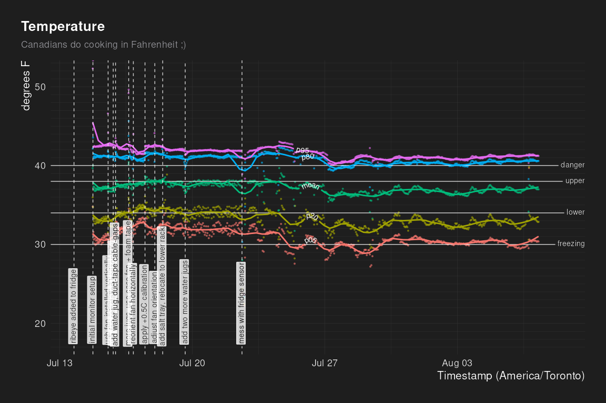
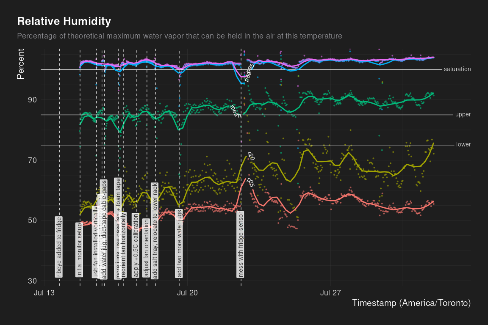
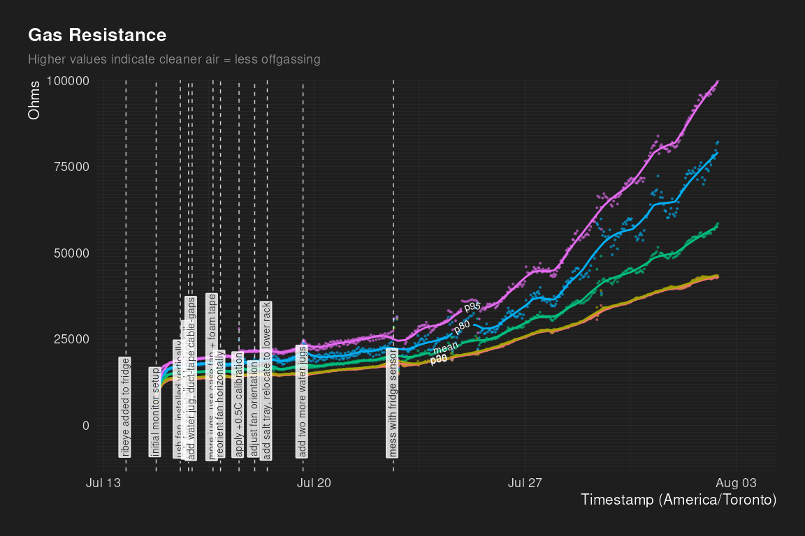
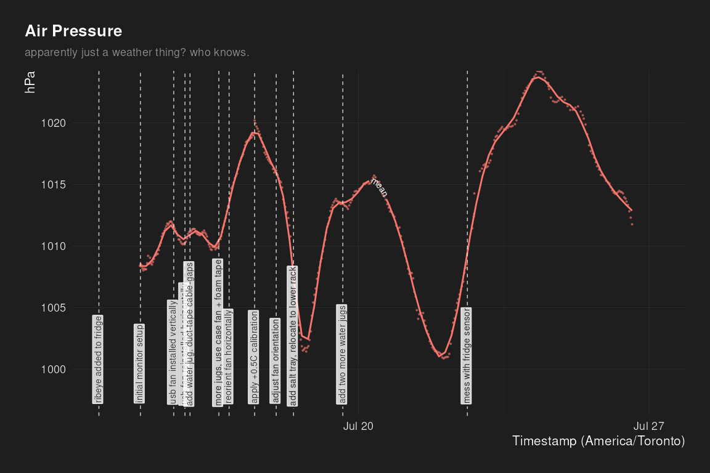

Dry Age Monitor - Log Analysis
================
2026-07-27 02:30:03.03193

``` r
knitr::opts_chunk$set(echo = FALSE, dev = "ragg_png")
suppressPackageStartupMessages({
  library(jsonlite)
  library(dplyr)
  library(tidyr)
  library(purrr)
  library(slider)
  library(lubridate)
  library(glue)
  library(ggplot2)
  library(geomtextpath)
  library(scales)
  library(ragg)
  library(marquee)
  library(tantastic)
  library(here)
})
here::i_am("reports/log_analysis.Rmd")
```

    ## here() starts at /dry-age-monitor

## dry age status

Current dry-age duration: 13.6 days

Starting weight: 14.2 lbs

Start date: 2026-07-13

Target date: 2026-08-27 (45 days)

## event timeline

| local_time          | event                                 |
|:--------------------|:--------------------------------------|
| 2026-07-13 18:00:00 | ribeye added to fridge                |
| 2026-07-14 18:00:00 | initial monitor setup                 |
| 2026-07-15 13:15:00 | usb fan installed vertically          |
| 2026-07-15 19:45:00 | usb fan reinstalled horizontally      |
| 2026-07-15 22:40:00 | add water jug, duct-tape cable-gaps   |
| 2026-07-16 15:20:00 | more jugs, use case fan + foam tape   |
| 2026-07-16 21:15:00 | reorient fan horizontally             |
| 2026-07-17 12:01:00 | apply +0.5C calibration               |
| 2026-07-18 00:30:00 | adjust fan orientation                |
| 2026-07-18 10:30:00 | add salt tray, relocate to lower rack |
| 2026-07-19 15:00:00 | add two more water jugs               |
| 2026-07-22 15:00:00 | mess with fridge sensor               |

## Cycle Analysis

### Temperature

<!-- -->

<details>
<summary>
table
</summary>

| cycle_start         |  mean |   p05 |   p20 |   p80 |   p95 | cycle_duration | cycle_duration_up | cycle_duration_down |
|:--------------------|------:|------:|------:|------:|------:|---------------:|------------------:|--------------------:|
| 2026-07-26 20:23:02 | 37.38 | 29.86 | 33.25 | 41.01 | 41.60 |      1H 6M 13S |           47M 13S |             18M 30S |
| 2026-07-26 19:17:32 | 37.31 | 29.81 | 33.21 | 40.98 | 41.60 |       1H 5M 0S |            46M 0S |             18M 30S |
| 2026-07-26 18:13:32 | 37.40 | 30.01 | 33.35 | 40.95 | 41.58 |      1H 3M 30S |           45M 30S |             17M 30S |
| 2026-07-26 17:11:02 | 37.42 | 30.01 | 33.44 | 40.99 | 41.60 |       1H 2M 0S |            44M 0S |             17M 30S |
| 2026-07-26 16:12:02 | 37.47 | 30.10 | 33.55 | 40.97 | 41.60 |        58M 30S |            42M 0S |              16M 0S |
| 2026-07-26 15:11:02 | 37.17 | 30.23 | 33.67 | 40.85 | 41.56 |      1H 0M 30S |           39M 30S |             20M 30S |
| 2026-07-26 14:14:02 | 37.10 | 29.51 | 32.57 | 41.04 | 41.76 |        56M 30S |           38M 30S |             17M 30S |
| 2026-07-26 13:25:32 | 37.30 | 30.52 | 33.04 | 41.24 | 41.78 |         48M 0S |           31M 30S |              16M 0S |
| 2026-07-26 12:37:32 | 37.34 | 30.41 | 33.21 | 41.00 | 41.70 |        47M 30S |           32M 30S |             14M 30S |
| 2026-07-26 11:49:32 | 37.19 | 30.21 | 33.08 | 40.93 | 41.68 |        47M 30S |            32M 0S |              15M 0S |
| 2026-07-26 11:00:32 | 37.24 | 30.26 | 32.99 | 41.04 | 41.78 |        48M 30S |            33M 0S |              15M 0S |
| 2026-07-26 10:26:32 | 36.28 | 30.65 | 32.52 | 39.64 | 41.33 |        33M 30S |           19M 30S |             13M 30S |
| 2026-07-26 09:40:32 | 37.19 | 30.52 | 33.09 | 40.95 | 41.72 |        45M 30S |            30M 0S |              15M 0S |
| 2026-07-26 08:57:02 | 37.49 | 30.98 | 33.66 | 41.04 | 41.76 |         43M 0S |           29M 30S |              13M 0S |
| 2026-07-26 08:12:02 | 37.34 | 30.72 | 33.26 | 40.98 | 41.73 |        44M 30S |           29M 30S |             14M 30S |
| 2026-07-26 07:28:02 | 37.49 | 30.97 | 33.63 | 41.04 | 41.75 |        43M 30S |           29M 30S |             13M 30S |
| 2026-07-26 06:44:02 | 37.55 | 31.02 | 33.71 | 41.10 | 41.81 |        43M 30S |            30M 0S |              13M 0S |
| 2026-07-26 05:57:02 | 37.41 | 30.74 | 33.43 | 41.05 | 41.78 |        46M 30S |            31M 0S |              15M 0S |
| 2026-07-26 05:12:02 | 37.67 | 31.06 | 33.89 | 41.14 | 41.82 |        44M 30S |            31M 0S |              13M 0S |
| 2026-07-26 04:24:32 | 37.63 | 30.80 | 33.77 | 41.15 | 41.86 |         47M 0S |           32M 30S |              14M 0S |
| 2026-07-26 03:35:02 | 37.61 | 30.75 | 33.67 | 41.20 | 41.86 |         49M 0S |           33M 30S |              15M 0S |
| 2026-07-26 02:46:32 | 37.81 | 31.13 | 34.10 | 41.22 | 41.86 |         48M 0S |            34M 0S |             13M 30S |
| 2026-07-26 01:57:32 | 37.82 | 31.04 | 34.08 | 41.21 | 41.87 |        48M 30S |           34M 30S |             13M 30S |
| 2026-07-26 01:06:02 | 37.82 | 30.90 | 34.01 | 41.25 | 41.88 |         51M 0S |            36M 0S |             14M 30S |
| 2026-07-26 00:11:02 | 37.85 | 31.17 | 34.41 | 41.21 | 41.85 |        54M 30S |            38M 0S |              16M 0S |
| 2026-07-25 23:11:02 | 37.57 | 29.92 | 33.51 | 41.19 | 41.86 |        59M 30S |            42M 0S |              17M 0S |
| 2026-07-25 22:10:32 | 37.61 | 29.98 | 33.67 | 41.22 | 41.86 |       1H 0M 0S |           43M 30S |              16M 0S |
| 2026-07-25 21:07:49 | 37.64 | 29.88 | 33.65 | 41.25 | 41.86 |      1H 2M 13S |           45M 13S |             16M 30S |
| 2026-07-25 20:09:19 | 37.33 | 29.55 | 33.00 | 41.11 | 41.82 |         58M 0S |            41M 0S |             16M 30S |
| 2026-07-25 19:05:49 | 37.41 | 29.58 | 33.08 | 41.21 | 41.85 |       1H 3M 0S |            45M 0S |             17M 30S |
| 2026-07-25 18:01:49 | 37.55 | 29.71 | 33.42 | 41.22 | 41.80 |      1H 3M 30S |           46M 30S |             16M 30S |
| 2026-07-25 17:14:49 | 36.53 | 29.65 | 32.31 | 40.15 | 41.87 |        46M 30S |            29M 0S |              17M 0S |
| 2026-07-25 16:16:49 | 37.53 | 29.96 | 33.51 | 41.14 | 41.80 |        57M 30S |            41M 0S |              16M 0S |
| 2026-07-25 15:19:19 | 37.46 | 29.87 | 33.33 | 41.14 | 41.78 |         57M 0S |            41M 0S |             15M 30S |
| 2026-07-25 14:19:19 | 37.08 | 29.45 | 32.59 | 41.01 | 41.74 |        59M 30S |           41M 30S |             17M 30S |
| 2026-07-25 13:18:19 | 37.06 | 29.46 | 32.46 | 41.04 | 41.74 |      1H 0M 30S |           41M 30S |             18M 30S |
| 2026-07-25 12:17:19 | 37.07 | 29.52 | 32.53 | 40.99 | 41.68 |      1H 0M 30S |            41M 0S |              19M 0S |
| 2026-07-25 11:18:49 | 37.21 | 29.64 | 32.87 | 40.99 | 41.67 |         58M 0S |           40M 30S |              17M 0S |
| 2026-07-25 10:17:19 | 37.92 | 29.60 | 34.89 | 41.06 | 41.68 |       1H 1M 0S |            57M 0S |              3M 30S |
| 2026-07-25 09:42:49 | 31.72 | 27.56 | 28.23 | 34.89 | 40.54 |         34M 0S |             2M 0S |             31M 30S |
| 2026-07-25 08:30:49 | 35.70 | 28.77 | 30.41 | 40.45 | 41.48 |     1H 11M 30S |            39M 0S |              32M 0S |
| 2026-07-25 06:57:49 | 37.08 | 28.76 | 31.08 | 41.88 | 42.68 |     1H 32M 30S |         1H 0M 30S |             31M 30S |
| 2026-07-25 05:28:19 | 37.25 | 28.87 | 31.52 | 41.95 | 42.73 |      1H 29M 0S |           58M 30S |              30M 0S |
| 2026-07-25 03:59:19 | 37.16 | 28.91 | 31.45 | 41.87 | 42.72 |     1H 28M 30S |            58M 0S |              30M 0S |
| 2026-07-25 02:27:49 | 37.24 | 28.93 | 31.51 | 41.91 | 42.76 |      1H 31M 0S |           59M 30S |              31M 0S |
| 2026-07-25 00:53:49 | 37.43 | 28.82 | 31.67 | 42.02 | 42.81 |     1H 33M 30S |         1H 3M 30S |             29M 30S |
| 2026-07-24 23:23:19 | 37.57 | 29.05 | 32.13 | 42.04 | 42.82 |      1H 30M 0S |          1H 2M 0S |             27M 30S |
| 2026-07-24 21:45:49 | 37.63 | 29.12 | 32.60 | 42.04 | 42.90 |      1H 37M 0S |          1H 5M 0S |             31M 30S |
| 2026-07-24 20:38:06 | 38.60 | 31.39 | 34.42 | 42.22 | 42.88 |      1H 7M 13S |           48M 13S |             18M 30S |
| 2026-07-24 19:36:05 | 38.56 | 31.62 | 34.46 | 42.19 | 42.87 |      1H 1M 31S |            43M 1S |              18M 0S |
| 2026-07-24 18:34:05 | 38.66 | 31.77 | 34.69 | 42.17 | 42.87 |      1H 1M 30S |            44M 0S |              17M 0S |
| 2026-07-24 17:31:35 | 38.82 | 31.93 | 34.92 | 42.27 | 42.90 |       1H 2M 0S |           44M 30S |              17M 0S |
| 2026-07-24 16:30:35 | 39.02 | 32.60 | 35.77 | 42.25 | 42.93 |      1H 0M 30S |           42M 30S |             17M 30S |
| 2026-07-24 15:14:35 | 38.39 | 30.65 | 33.85 | 42.23 | 42.98 |     1H 15M 30S |           52M 30S |             22M 30S |
| 2026-07-24 14:12:35 | 39.68 | 32.12 | 36.84 | 42.53 | 43.03 |      1H 1M 30S |           57M 30S |              3M 30S |
| 2026-07-24 13:52:05 | 34.34 | 30.06 | 30.96 | 37.98 | 41.56 |         20M 0S |            2M 30S |              17M 0S |
| 2026-07-24 13:46:35 | 41.86 | 41.39 | 41.47 | 42.35 | 42.51 |          5M 0S |             2M 0S |              2M 30S |
| 2026-07-24 13:06:05 | 34.30 | 29.68 | 30.65 | 37.53 | 41.58 |         40M 0S |           14M 30S |              25M 0S |
| 2026-07-24 11:56:05 | 36.74 | 29.93 | 31.86 | 40.96 | 41.81 |      1H 9M 30S |            44M 0S |              25M 0S |
| 2026-07-24 10:43:35 | 36.48 | 29.85 | 31.49 | 40.94 | 41.89 |      1H 12M 0S |            42M 0S |             29M 30S |
| 2026-07-24 09:53:05 | 37.79 | 31.39 | 33.64 | 41.40 | 42.19 |         50M 0S |           32M 30S |              17M 0S |
| 2026-07-24 09:02:35 | 37.96 | 31.51 | 33.93 | 41.56 | 42.30 |         50M 0S |            33M 0S |             16M 30S |
| 2026-07-24 08:13:05 | 37.99 | 31.51 | 34.00 | 41.57 | 42.30 |         49M 0S |            33M 0S |             15M 30S |
| 2026-07-24 07:22:05 | 37.91 | 31.53 | 33.89 | 41.55 | 42.31 |        50M 30S |           33M 30S |             16M 30S |
| 2026-07-24 06:31:35 | 37.98 | 31.60 | 34.09 | 41.56 | 42.30 |         50M 0S |           33M 30S |              16M 0S |
| 2026-07-24 05:41:35 | 38.01 | 31.50 | 34.11 | 41.57 | 42.31 |        49M 30S |           33M 30S |             15M 30S |
| 2026-07-24 04:50:35 | 37.92 | 31.40 | 33.81 | 41.56 | 42.30 |        50M 30S |           33M 30S |             16M 30S |
| 2026-07-24 03:59:05 | 38.04 | 31.61 | 34.07 | 41.62 | 42.35 |         51M 0S |            34M 0S |             16M 30S |
| 2026-07-24 03:07:35 | 38.12 | 31.57 | 34.21 | 41.63 | 42.37 |         51M 0S |           34M 30S |              16M 0S |
| 2026-07-24 02:16:05 | 38.16 | 31.70 | 34.36 | 41.63 | 42.36 |         51M 0S |            35M 0S |             15M 30S |
| 2026-07-24 01:21:05 | 38.13 | 31.52 | 34.15 | 41.69 | 42.38 |        54M 30S |           37M 30S |             16M 30S |
| 2026-07-24 00:25:05 | 38.17 | 31.51 | 34.28 | 41.71 | 42.38 |        55M 30S |           38M 30S |             16M 30S |
| 2026-07-23 23:29:05 | 38.25 | 31.53 | 34.37 | 41.69 | 42.37 |        55M 30S |            39M 0S |              16M 0S |
| 2026-07-23 22:33:05 | 38.29 | 31.50 | 34.55 | 41.71 | 42.35 |        55M 30S |           39M 30S |             15M 30S |
| 2026-07-23 21:34:35 | 38.29 | 31.41 | 34.45 | 41.69 | 42.35 |         58M 0S |            42M 0S |             15M 30S |
| 2026-07-23 20:31:52 | 38.30 | 31.32 | 34.38 | 41.78 | 42.36 |      1H 2M 13S |           44M 13S |             17M 30S |
| 2026-07-23 19:25:18 | 38.67 | 31.91 | 35.18 | 41.76 | 42.29 |       1H 6M 4S |           52M 41S |              13M 0S |
| 2026-07-23 18:32:18 | 35.35 | 29.08 | 30.90 | 39.29 | 41.40 |        52M 30S |            28M 0S |              24M 0S |
| 2026-07-23 17:09:18 | 37.51 | 29.19 | 32.49 | 41.61 | 42.33 |     1H 22M 30S |           57M 30S |             24M 30S |
| 2026-07-23 16:19:18 | 36.67 | 30.51 | 32.42 | 40.37 | 41.65 |        49M 30S |           29M 30S |             19M 30S |
| 2026-07-23 15:16:48 | 37.63 | 30.53 | 33.05 | 41.55 | 42.29 |       1H 2M 0S |           41M 30S |              20M 0S |
| 2026-07-23 14:15:18 | 37.45 | 30.46 | 32.85 | 41.50 | 42.26 |       1H 1M 0S |           39M 30S |              21M 0S |
| 2026-07-23 13:12:48 | 37.39 | 30.44 | 32.82 | 41.42 | 42.21 |       1H 2M 0S |            40M 0S |             21M 30S |
| 2026-07-23 12:10:18 | 37.48 | 30.60 | 32.91 | 41.46 | 42.21 |       1H 2M 0S |           40M 30S |              21M 0S |
| 2026-07-23 11:03:18 | 37.91 | 30.58 | 33.40 | 41.83 | 42.20 |      1H 6M 30S |            41M 0S |              25M 0S |
| 2026-07-23 10:31:18 | 36.25 | 31.66 | 32.83 | 39.70 | 42.05 |        31M 30S |           14M 30S |             16M 30S |
| 2026-07-23 09:43:18 | 37.78 | 31.97 | 34.02 | 41.18 | 41.95 |        47M 30S |            31M 0S |              16M 0S |
| 2026-07-23 08:55:48 | 37.94 | 32.10 | 34.37 | 41.26 | 42.01 |         47M 0S |           31M 30S |              15M 0S |
| 2026-07-23 08:05:18 | 37.66 | 31.84 | 34.02 | 41.11 | 41.94 |         50M 0S |           31M 30S |              18M 0S |
| 2026-07-23 07:20:48 | 38.08 | 32.59 | 34.64 | 41.23 | 41.95 |         44M 0S |            29M 0S |             14M 30S |
| 2026-07-23 06:36:48 | 38.05 | 32.57 | 34.62 | 41.24 | 41.96 |        43M 30S |           29M 30S |             13M 30S |
| 2026-07-23 05:50:18 | 37.89 | 32.25 | 34.31 | 41.17 | 41.92 |         46M 0S |            30M 0S |             15M 30S |
| 2026-07-23 05:06:18 | 38.08 | 32.56 | 34.73 | 41.22 | 41.93 |        43M 30S |           29M 30S |             13M 30S |
| 2026-07-23 04:20:48 | 37.91 | 32.30 | 34.30 | 41.13 | 41.89 |         45M 0S |           29M 30S |              15M 0S |
| 2026-07-23 03:35:48 | 37.99 | 32.49 | 34.59 | 41.15 | 41.86 |        44M 30S |           29M 30S |             14M 30S |
| 2026-07-23 02:50:18 | 38.03 | 32.36 | 34.66 | 41.20 | 41.91 |         45M 0S |           30M 30S |              14M 0S |
| 2026-07-23 02:01:48 | 37.80 | 32.06 | 34.22 | 41.13 | 41.86 |         48M 0S |            32M 0S |             15M 30S |
| 2026-07-23 01:13:48 | 38.08 | 32.40 | 34.61 | 41.22 | 41.89 |        47M 30S |           32M 30S |             14M 30S |
| 2026-07-23 00:22:48 | 37.95 | 32.01 | 34.40 | 41.15 | 41.83 |        50M 30S |           34M 30S |             15M 30S |
| 2026-07-22 23:25:18 | 37.78 | 31.65 | 34.06 | 41.06 | 41.73 |         57M 0S |            39M 0S |             17M 30S |
| 2026-07-22 22:13:48 | 37.83 | 31.34 | 34.00 | 41.07 | 41.65 |      1H 11M 0S |           50M 30S |              20M 0S |
| 2026-07-22 19:01:05 | 38.02 | 33.09 | 35.83 | 40.39 | 41.36 |     3H 12M 13S |         3H 2M 13S |              9M 30S |
| 2026-07-22 18:55:35 | 37.16 | 34.24 | 35.15 | 39.58 | 40.78 |          5M 0S |             2M 0S |              2M 30S |
| 2026-07-22 18:46:35 | 32.55 | 28.34 | 29.60 | 34.79 | 38.34 |         8M 30S |            2M 30S |              5M 30S |
| 2026-07-22 17:53:05 | 23.28 | 22.28 | 22.46 | 23.41 | 23.62 |         53M 0S |             3M 0S |             49M 30S |
| 2026-07-22 15:19:05 | 28.01 | 23.82 | 24.39 | 30.32 | 38.93 |     2H 33M 30S |            18M 0S |           2H 15M 0S |
| 2026-07-22 14:41:35 | 37.20 | 31.52 | 33.07 | 39.77 | 47.28 |         37M 0S |            20M 0S |             16M 30S |
| 2026-07-22 14:02:05 | 38.08 | 32.79 | 34.81 | 41.13 | 41.89 |         39M 0S |            26M 0S |             12M 30S |
| 2026-07-22 13:17:05 | 37.43 | 31.71 | 33.61 | 40.99 | 41.81 |        44M 30S |            28M 0S |              16M 0S |
| 2026-07-22 12:37:05 | 38.07 | 32.79 | 34.83 | 41.16 | 41.90 |        39M 30S |           26M 30S |             12M 30S |
| 2026-07-22 11:53:05 | 37.52 | 31.88 | 33.79 | 41.00 | 41.84 |        43M 30S |            28M 0S |              15M 0S |
| 2026-07-22 11:12:35 | 38.01 | 32.70 | 34.61 | 41.14 | 41.90 |         40M 0S |           26M 30S |              13M 0S |
| 2026-07-22 10:29:05 | 37.65 | 32.03 | 34.00 | 41.07 | 41.86 |         43M 0S |            28M 0S |             14M 30S |
| 2026-07-22 09:46:35 | 37.94 | 32.46 | 34.48 | 41.15 | 41.89 |         42M 0S |           27M 30S |              14M 0S |
| 2026-07-22 09:04:35 | 37.90 | 32.42 | 34.44 | 41.10 | 41.87 |        41M 30S |           27M 30S |             13M 30S |
| 2026-07-22 08:17:35 | 37.45 | 31.62 | 33.61 | 41.02 | 41.85 |        46M 30S |           29M 30S |             16M 30S |
| 2026-07-22 07:36:35 | 38.07 | 32.73 | 34.84 | 41.16 | 41.88 |        40M 30S |           27M 30S |             12M 30S |
| 2026-07-22 06:50:05 | 37.56 | 31.73 | 33.80 | 41.05 | 41.87 |         46M 0S |            30M 0S |             15M 30S |
| 2026-07-22 06:07:35 | 38.01 | 32.54 | 34.66 | 41.17 | 41.89 |         42M 0S |           28M 30S |              13M 0S |
| 2026-07-22 05:21:35 | 37.72 | 31.89 | 34.07 | 41.11 | 41.87 |        45M 30S |           30M 30S |             14M 30S |
| 2026-07-22 04:31:05 | 37.46 | 31.32 | 33.49 | 41.05 | 41.85 |         50M 0S |           32M 30S |              17M 0S |
| 2026-07-22 03:45:35 | 38.11 | 32.41 | 34.61 | 41.25 | 41.92 |         45M 0S |            31M 0S |             13M 30S |
| 2026-07-22 02:56:05 | 37.70 | 31.60 | 33.89 | 41.12 | 41.86 |         49M 0S |            33M 0S |             15M 30S |
| 2026-07-22 02:05:05 | 37.61 | 31.49 | 33.73 | 41.11 | 41.85 |        50M 30S |           33M 30S |             16M 30S |
| 2026-07-22 01:18:35 | 38.08 | 32.33 | 34.63 | 41.24 | 41.90 |         46M 0S |            32M 0S |             13M 30S |
| 2026-07-22 00:27:35 | 37.58 | 31.36 | 33.72 | 41.13 | 41.85 |        50M 30S |            34M 0S |              16M 0S |
| 2026-07-21 23:32:35 | 37.48 | 31.08 | 33.49 | 41.14 | 41.87 |        54M 30S |            36M 0S |              18M 0S |
| 2026-07-21 22:45:05 | 38.15 | 32.37 | 34.79 | 41.28 | 41.92 |         47M 0S |            33M 0S |             13M 30S |
| 2026-07-21 21:52:35 | 37.69 | 31.39 | 33.83 | 41.17 | 41.89 |         52M 0S |           35M 30S |              16M 0S |
| 2026-07-21 20:58:22 | 37.52 | 31.26 | 33.51 | 41.12 | 41.85 |        53M 43S |           36M 13S |              17M 0S |
| 2026-07-21 20:16:52 | 38.06 | 32.71 | 34.78 | 41.15 | 41.83 |         41M 0S |            28M 0S |             12M 30S |
| 2026-07-21 19:30:22 | 37.55 | 31.70 | 33.74 | 41.04 | 41.83 |         46M 0S |            30M 0S |             15M 30S |
| 2026-07-21 18:45:52 | 37.92 | 32.28 | 34.43 | 41.12 | 41.84 |         44M 0S |           29M 30S |              14M 0S |
| 2026-07-21 17:59:52 | 37.59 | 31.78 | 33.93 | 41.04 | 41.78 |        45M 30S |            30M 0S |              15M 0S |
| 2026-07-21 17:13:22 | 37.59 | 31.83 | 33.94 | 40.97 | 41.76 |         46M 0S |            30M 0S |             15M 30S |
| 2026-07-21 16:28:52 | 37.74 | 32.08 | 34.18 | 41.04 | 41.83 |         44M 0S |            29M 0S |             14M 30S |
| 2026-07-21 15:42:22 | 37.36 | 31.57 | 33.55 | 40.91 | 41.76 |         46M 0S |            29M 0S |             16M 30S |
| 2026-07-21 14:58:21 | 37.77 | 32.11 | 34.20 | 41.09 | 41.84 |        43M 31S |            29M 0S |              14M 1S |
| 2026-07-21 14:10:51 | 37.37 | 31.47 | 33.48 | 40.99 | 41.78 |         47M 0S |           29M 30S |              17M 0S |
| 2026-07-21 13:25:51 | 37.52 | 31.77 | 33.80 | 40.99 | 41.80 |        44M 30S |           28M 30S |             15M 30S |
| 2026-07-21 12:38:51 | 37.56 | 31.77 | 33.81 | 41.05 | 41.83 |        46M 30S |            30M 0S |              16M 0S |
| 2026-07-21 11:57:51 | 37.88 | 32.46 | 34.50 | 41.07 | 41.83 |        40M 30S |            27M 0S |              13M 0S |
| 2026-07-21 11:12:21 | 37.31 | 31.62 | 33.48 | 40.93 | 41.74 |         45M 0S |            28M 0S |             16M 30S |
| 2026-07-21 10:32:51 | 37.99 | 32.70 | 34.70 | 41.11 | 41.86 |         39M 0S |            26M 0S |             12M 30S |
| 2026-07-21 09:46:51 | 37.37 | 31.62 | 33.50 | 40.96 | 41.79 |        45M 30S |           28M 30S |             16M 30S |
| 2026-07-21 09:06:51 | 38.10 | 32.89 | 34.84 | 41.14 | 41.86 |        39M 30S |           26M 30S |             12M 30S |
| 2026-07-21 08:21:21 | 37.44 | 31.72 | 33.71 | 40.95 | 41.80 |         45M 0S |           28M 30S |              16M 0S |
| 2026-07-21 07:39:51 | 38.12 | 32.78 | 34.79 | 41.20 | 41.93 |         41M 0S |           27M 30S |              13M 0S |
| 2026-07-21 06:54:21 | 37.57 | 31.82 | 33.87 | 41.09 | 41.86 |         45M 0S |            29M 0S |             15M 30S |
| 2026-07-21 06:12:51 | 38.06 | 32.73 | 34.72 | 41.19 | 41.91 |         41M 0S |           27M 30S |              13M 0S |
| 2026-07-21 05:27:21 | 37.69 | 31.90 | 34.00 | 41.09 | 41.89 |         45M 0S |           29M 30S |              15M 0S |
| 2026-07-21 04:42:51 | 37.93 | 32.31 | 34.41 | 41.21 | 41.93 |         44M 0S |           29M 30S |              14M 0S |
| 2026-07-21 03:58:51 | 38.10 | 32.49 | 34.68 | 41.27 | 41.97 |        43M 30S |            30M 0S |              13M 0S |
| 2026-07-21 03:07:51 | 37.46 | 31.33 | 33.49 | 41.08 | 41.86 |        50M 30S |            33M 0S |              17M 0S |
| 2026-07-21 02:21:51 | 38.11 | 32.40 | 34.69 | 41.26 | 41.95 |        45M 30S |            31M 0S |              14M 0S |
| 2026-07-21 01:31:21 | 37.79 | 31.60 | 34.02 | 41.22 | 41.92 |         50M 0S |           34M 30S |              15M 0S |
| 2026-07-21 00:36:21 | 37.45 | 31.01 | 33.31 | 41.18 | 41.92 |        54M 30S |            36M 0S |              18M 0S |
| 2026-07-20 23:44:51 | 37.99 | 31.89 | 34.33 | 41.34 | 42.01 |         51M 0S |           35M 30S |              15M 0S |
| 2026-07-20 22:51:21 | 38.06 | 31.78 | 34.37 | 41.37 | 42.05 |         53M 0S |           37M 30S |              15M 0S |
| 2026-07-20 21:53:51 | 37.78 | 31.16 | 33.87 | 41.30 | 41.96 |         57M 0S |           39M 30S |              17M 0S |
| 2026-07-20 20:52:08 | 37.59 | 30.80 | 33.39 | 41.30 | 41.97 |      1H 1M 13S |           42M 13S |             18M 30S |
| 2026-07-20 20:04:38 | 38.12 | 32.29 | 34.66 | 41.32 | 41.99 |         47M 0S |           32M 30S |              14M 0S |
| 2026-07-20 19:12:38 | 37.73 | 31.44 | 33.83 | 41.23 | 41.96 |        51M 30S |            35M 0S |              16M 0S |
| 2026-07-20 18:18:08 | 37.51 | 31.11 | 33.39 | 41.18 | 41.93 |         54M 0S |           35M 30S |              18M 0S |
| 2026-07-20 17:31:38 | 38.07 | 32.30 | 34.56 | 41.30 | 41.96 |         46M 0S |            32M 0S |             13M 30S |
| 2026-07-20 16:41:38 | 37.73 | 31.51 | 33.91 | 41.24 | 41.97 |        49M 30S |           33M 30S |             15M 30S |
| 2026-07-20 15:48:08 | 37.51 | 31.22 | 33.42 | 41.16 | 41.93 |         53M 0S |            35M 0S |             17M 30S |
| 2026-07-20 15:02:08 | 38.07 | 32.33 | 34.61 | 41.28 | 41.96 |        45M 30S |            31M 0S |              14M 0S |
| 2026-07-20 14:13:38 | 37.53 | 31.59 | 33.64 | 41.14 | 41.92 |         48M 0S |           30M 30S |              17M 0S |
| 2026-07-20 13:32:08 | 38.11 | 32.70 | 34.76 | 41.24 | 41.93 |         41M 0S |           27M 30S |              13M 0S |
| 2026-07-20 12:45:38 | 37.57 | 31.75 | 33.74 | 41.10 | 41.91 |         46M 0S |            30M 0S |             15M 30S |
| 2026-07-20 12:03:38 | 37.91 | 32.51 | 34.44 | 41.16 | 41.93 |        41M 30S |            27M 0S |              14M 0S |
| 2026-07-20 11:20:38 | 37.77 | 32.15 | 34.11 | 41.13 | 41.91 |        42M 30S |            28M 0S |              14M 0S |
| 2026-07-20 10:35:08 | 37.65 | 31.94 | 33.89 | 41.09 | 41.89 |         45M 0S |            29M 0S |             15M 30S |
| 2026-07-20 09:53:08 | 38.06 | 32.57 | 34.68 | 41.24 | 41.96 |        41M 30S |            28M 0S |              13M 0S |
| 2026-07-20 09:05:08 | 37.45 | 31.49 | 33.58 | 41.05 | 41.88 |        47M 30S |            30M 0S |              17M 0S |
| 2026-07-20 08:23:08 | 38.17 | 32.77 | 34.87 | 41.25 | 41.94 |        41M 30S |            28M 0S |              13M 0S |
| 2026-07-20 07:36:08 | 37.59 | 31.73 | 33.82 | 41.09 | 41.88 |        46M 30S |           30M 30S |             15M 30S |
| 2026-07-20 06:53:08 | 38.08 | 32.56 | 34.77 | 41.20 | 41.91 |        42M 30S |            29M 0S |              13M 0S |
| 2026-07-20 06:07:08 | 37.71 | 31.88 | 34.01 | 41.09 | 41.87 |        45M 30S |            30M 0S |              15M 0S |
| 2026-07-20 05:19:08 | 37.55 | 31.67 | 33.67 | 41.05 | 41.84 |        47M 30S |           30M 30S |             16M 30S |
| 2026-07-20 04:35:38 | 37.90 | 32.27 | 34.40 | 41.18 | 41.90 |         43M 0S |            29M 0S |             13M 30S |
| 2026-07-20 03:44:38 | 37.36 | 31.20 | 33.26 | 41.08 | 41.90 |        50M 30S |            32M 0S |              18M 0S |
| 2026-07-20 03:01:08 | 38.06 | 32.51 | 34.68 | 41.20 | 41.92 |         43M 0S |            29M 0S |             13M 30S |
| 2026-07-20 02:10:08 | 37.29 | 31.19 | 33.26 | 40.98 | 41.83 |        50M 30S |            32M 0S |              18M 0S |
| 2026-07-20 01:24:08 | 37.97 | 32.23 | 34.43 | 41.22 | 41.92 |        45M 30S |            31M 0S |              14M 0S |
| 2026-07-20 00:31:38 | 37.49 | 31.23 | 33.42 | 41.15 | 41.88 |         52M 0S |           34M 30S |              17M 0S |
| 2026-07-19 23:37:38 | 37.51 | 31.20 | 33.50 | 41.14 | 41.87 |        53M 30S |            35M 0S |              18M 0S |
| 2026-07-19 22:47:38 | 37.83 | 31.76 | 34.14 | 41.19 | 41.88 |        49M 30S |           34M 30S |             14M 30S |
| 2026-07-19 21:52:08 | 37.38 | 30.94 | 33.30 | 41.13 | 41.88 |         55M 0S |            36M 0S |             18M 30S |
| 2026-07-19 21:04:08 | 37.88 | 31.99 | 34.27 | 41.13 | 41.82 |        47M 30S |            33M 0S |              14M 0S |
| 2026-07-19 20:12:38 | 37.06 | 30.90 | 32.91 | 40.88 | 41.76 |         51M 0S |            32M 0S |             18M 30S |
| 2026-07-19 19:29:38 | 37.72 | 32.12 | 34.23 | 41.05 | 41.77 |        42M 30S |           28M 30S |             13M 30S |
| 2026-07-19 18:41:38 | 37.10 | 31.22 | 33.03 | 40.82 | 41.71 |        47M 30S |            29M 0S |              18M 0S |
| 2026-07-19 17:58:38 | 37.03 | 31.55 | 33.24 | 40.62 | 41.63 |        42M 30S |           25M 30S |             16M 30S |
| 2026-07-19 17:23:38 | 37.68 | 32.87 | 34.42 | 40.77 | 41.62 |        34M 30S |            21M 0S |              13M 0S |
| 2026-07-19 16:44:38 | 36.75 | 31.91 | 33.18 | 40.34 | 41.49 |        38M 30S |           19M 30S |             18M 30S |
| 2026-07-19 16:06:38 | 36.61 | 32.14 | 33.24 | 40.06 | 41.42 |        37M 30S |           17M 30S |             19M 30S |
| 2026-07-19 15:29:38 | 36.59 | 32.49 | 33.44 | 39.91 | 41.39 |        36M 30S |            15M 0S |              21M 0S |
| 2026-07-19 14:51:38 | 36.47 | 32.84 | 33.57 | 39.56 | 41.37 |        37M 30S |            13M 0S |              24M 0S |
| 2026-07-19 14:15:08 | 37.19 | 33.77 | 34.42 | 40.19 | 41.77 |         36M 0S |           11M 30S |              24M 0S |
| 2026-07-19 13:35:38 | 36.82 | 31.12 | 32.95 | 40.44 | 42.07 |         39M 0S |           22M 30S |              16M 0S |
| 2026-07-19 12:54:38 | 37.24 | 31.42 | 33.33 | 40.88 | 41.94 |        40M 30S |            25M 0S |              15M 0S |
| 2026-07-19 12:12:38 | 37.22 | 31.34 | 33.28 | 40.93 | 42.02 |        41M 30S |           25M 30S |             15M 30S |
| 2026-07-19 11:35:08 | 37.84 | 32.28 | 34.38 | 41.20 | 42.13 |         37M 0S |            24M 0S |             12M 30S |
| 2026-07-19 10:58:38 | 37.87 | 32.51 | 34.44 | 41.15 | 42.07 |         36M 0S |            23M 0S |             12M 30S |
| 2026-07-19 10:21:08 | 37.65 | 32.09 | 34.13 | 41.10 | 42.05 |         37M 0S |            24M 0S |             12M 30S |
| 2026-07-19 09:44:38 | 38.01 | 32.64 | 34.65 | 41.23 | 42.12 |         36M 0S |           23M 30S |              12M 0S |
| 2026-07-19 09:05:38 | 37.55 | 31.85 | 33.83 | 41.06 | 42.04 |        38M 30S |           24M 30S |             13M 30S |
| 2026-07-19 08:29:38 | 37.98 | 32.63 | 34.68 | 41.23 | 42.08 |        35M 30S |           23M 30S |             11M 30S |
| 2026-07-19 07:50:38 | 37.72 | 31.98 | 34.10 | 41.18 | 42.11 |        38M 30S |            25M 0S |              13M 0S |
| 2026-07-19 07:14:08 | 37.97 | 32.57 | 34.59 | 41.19 | 42.06 |         36M 0S |           23M 30S |              12M 0S |
| 2026-07-19 06:35:38 | 37.61 | 31.92 | 34.00 | 41.05 | 42.00 |         38M 0S |           24M 30S |              13M 0S |
| 2026-07-19 05:59:08 | 37.98 | 32.59 | 34.59 | 41.20 | 42.06 |         36M 0S |           23M 30S |              12M 0S |
| 2026-07-19 05:20:38 | 37.64 | 31.97 | 34.02 | 41.08 | 42.02 |         38M 0S |           24M 30S |              13M 0S |
| 2026-07-19 04:43:38 | 37.97 | 32.54 | 34.55 | 41.20 | 42.04 |        36M 30S |            24M 0S |              12M 0S |
| 2026-07-19 04:04:37 | 37.57 | 31.85 | 33.94 | 41.02 | 41.96 |        38M 31S |            25M 0S |              13M 1S |
| 2026-07-19 03:27:07 | 37.88 | 32.41 | 34.40 | 41.15 | 42.02 |         37M 0S |           24M 30S |              12M 0S |
| 2026-07-19 02:47:37 | 37.60 | 31.86 | 33.99 | 41.08 | 42.02 |         39M 0S |           25M 30S |              13M 0S |
| 2026-07-19 02:08:37 | 37.85 | 32.30 | 34.37 | 41.18 | 42.02 |        38M 30S |            25M 0S |              13M 0S |
| 2026-07-19 01:28:37 | 37.56 | 31.76 | 33.89 | 41.06 | 41.95 |        39M 30S |           26M 30S |             12M 30S |
| 2026-07-19 00:44:07 | 37.47 | 31.35 | 33.59 | 41.14 | 42.00 |         44M 0S |           28M 30S |              15M 0S |
| 2026-07-19 00:03:37 | 37.92 | 32.20 | 34.47 | 41.16 | 41.99 |         40M 0S |           27M 30S |              12M 0S |
| 2026-07-18 23:17:37 | 37.32 | 31.09 | 33.38 | 41.00 | 41.91 |        45M 30S |            30M 0S |              15M 0S |
| 2026-07-18 22:36:07 | 37.86 | 32.08 | 34.40 | 41.16 | 41.96 |         41M 0S |            28M 0S |             12M 30S |
| 2026-07-18 21:51:37 | 37.48 | 31.37 | 33.71 | 41.04 | 41.92 |         44M 0S |           29M 30S |              14M 0S |
| 2026-07-18 21:06:07 | 37.44 | 31.32 | 33.64 | 41.04 | 41.91 |         45M 0S |            30M 0S |             14M 30S |
| 2026-07-18 20:26:07 | 37.68 | 32.06 | 34.22 | 41.04 | 41.94 |        39M 30S |           26M 30S |             12M 30S |
| 2026-07-18 19:44:07 | 37.26 | 31.43 | 33.44 | 40.84 | 41.85 |        41M 30S |           26M 30S |             14M 30S |
| 2026-07-18 19:06:37 | 37.94 | 32.63 | 34.69 | 41.11 | 41.97 |         37M 0S |            25M 0S |             11M 30S |
| 2026-07-18 18:24:37 | 37.31 | 31.52 | 33.55 | 40.93 | 41.89 |        41M 30S |            26M 0S |              15M 0S |
| 2026-07-18 17:48:37 | 37.92 | 32.71 | 34.67 | 41.09 | 41.97 |        35M 30S |           23M 30S |             11M 30S |
| 2026-07-18 17:07:37 | 37.33 | 31.52 | 33.53 | 41.02 | 41.95 |        40M 30S |            25M 0S |              15M 0S |
| 2026-07-18 16:32:37 | 37.94 | 32.80 | 34.63 | 41.08 | 42.01 |        34M 30S |           22M 30S |             11M 30S |
| 2026-07-18 15:52:36 | 39.90 | 34.50 | 38.86 | 41.56 | 42.06 |        39M 31S |           12M 30S |              9M 31S |
| 2026-07-18 15:17:27 | 37.88 | 32.72 | 34.59 | 41.12 | 41.98 |        34M 39S |            22M 3S |              12M 6S |
| 2026-07-18 14:41:22 | 37.62 | 32.39 | 34.20 | 41.04 | 41.92 |        35M 35S |           21M 35S |             13M 30S |
| 2026-07-18 14:06:52 | 37.73 | 32.61 | 34.34 | 41.01 | 42.00 |         34M 0S |            21M 0S |             12M 30S |
| 2026-07-18 13:34:22 | 38.51 | 33.98 | 35.64 | 41.32 | 42.17 |         32M 0S |           19M 30S |              12M 0S |
| 2026-07-18 12:04:10 | 38.32 | 33.74 | 35.29 | 41.61 | 42.30 |     1H 29M 42S |        1H 18M 12S |              11M 0S |
| 2026-07-18 11:29:10 | 38.05 | 32.71 | 34.76 | 41.30 | 42.30 |        34M 30S |           22M 30S |             11M 30S |
| 2026-07-18 10:54:10 | 38.25 | 32.93 | 34.89 | 41.50 | 42.36 |        34M 30S |           22M 30S |             11M 30S |
| 2026-07-18 10:19:10 | 38.28 | 32.98 | 34.88 | 41.51 | 42.49 |        34M 30S |            21M 0S |              13M 0S |
| 2026-07-18 09:51:10 | 37.95 | 32.48 | 34.11 | 42.08 | 43.30 |        27M 30S |            16M 0S |              11M 0S |
| 2026-07-18 09:16:10 | 37.84 | 32.14 | 34.16 | 41.39 | 42.37 |        34M 30S |            22M 0S |              12M 0S |
| 2026-07-18 08:41:40 | 38.14 | 32.60 | 34.71 | 41.47 | 42.45 |         34M 0S |           22M 30S |              11M 0S |
| 2026-07-18 08:06:10 | 37.78 | 32.01 | 34.11 | 41.36 | 42.38 |         35M 0S |            22M 0S |             12M 30S |
| 2026-07-18 07:31:40 | 38.11 | 32.57 | 34.66 | 41.46 | 42.45 |         34M 0S |           22M 30S |              11M 0S |
| 2026-07-18 06:55:40 | 37.90 | 32.12 | 34.20 | 41.44 | 42.47 |        35M 30S |           22M 30S |             12M 30S |
| 2026-07-18 06:20:40 | 38.13 | 32.50 | 34.71 | 41.51 | 42.50 |        34M 30S |           22M 30S |             11M 30S |
| 2026-07-18 05:44:40 | 37.93 | 32.19 | 34.24 | 41.42 | 42.46 |        35M 30S |            23M 0S |              12M 0S |
| 2026-07-18 05:08:40 | 38.05 | 32.27 | 34.40 | 41.53 | 42.51 |        35M 30S |           23M 30S |             11M 30S |
| 2026-07-18 04:32:10 | 37.98 | 32.18 | 34.33 | 41.53 | 42.44 |         36M 0S |            23M 0S |             12M 30S |
| 2026-07-18 03:54:40 | 38.00 | 32.04 | 34.37 | 41.58 | 42.49 |         37M 0S |           24M 30S |              12M 0S |
| 2026-07-18 03:16:10 | 37.95 | 31.95 | 34.25 | 41.57 | 42.45 |         38M 0S |           24M 30S |              13M 0S |
| 2026-07-18 02:37:10 | 38.04 | 31.96 | 34.37 | 41.59 | 42.47 |        38M 30S |            26M 0S |              12M 0S |
| 2026-07-18 01:55:10 | 37.69 | 31.26 | 33.67 | 41.51 | 42.45 |        41M 30S |           27M 30S |             13M 30S |
| 2026-07-18 01:13:40 | 38.19 | 31.97 | 34.54 | 41.72 | 42.53 |         41M 0S |           28M 30S |              12M 0S |
| 2026-07-18 00:30:10 | 38.18 | 31.54 | 34.30 | 41.83 | 42.69 |         43M 0S |           29M 30S |              13M 0S |
| 2026-07-18 00:02:10 | 37.11 | 31.99 | 33.60 | 40.46 | 44.11 |        27M 30S |            15M 0S |              12M 0S |
| 2026-07-17 23:19:40 | 37.77 | 31.40 | 33.81 | 41.51 | 42.39 |         42M 0S |            28M 0S |             13M 30S |
| 2026-07-17 22:38:10 | 38.10 | 31.98 | 34.40 | 41.61 | 42.41 |         41M 0S |           28M 30S |              12M 0S |
| 2026-07-17 21:55:40 | 38.02 | 31.71 | 34.34 | 41.55 | 42.39 |         42M 0S |            29M 0S |             12M 30S |
| 2026-07-17 21:09:27 | 37.60 | 30.98 | 33.57 | 41.43 | 42.35 |        45M 43S |           30M 43S |             14M 30S |
| 2026-07-17 20:29:27 | 38.14 | 32.24 | 34.58 | 41.59 | 42.39 |        39M 30S |           27M 30S |             11M 30S |
| 2026-07-17 19:46:57 | 37.78 | 31.41 | 33.83 | 41.57 | 42.41 |         42M 0S |           27M 30S |              14M 0S |
| 2026-07-17 19:06:27 | 38.11 | 32.14 | 34.47 | 41.56 | 42.40 |         40M 0S |           27M 30S |              12M 0S |
| 2026-07-17 18:24:27 | 37.85 | 31.58 | 34.02 | 41.53 | 42.39 |        41M 30S |            28M 0S |              13M 0S |
| 2026-07-17 17:41:57 | 37.88 | 31.60 | 34.03 | 41.54 | 42.41 |         42M 0S |           28M 30S |              13M 0S |
| 2026-07-17 17:00:57 | 38.25 | 32.17 | 34.55 | 41.68 | 42.58 |        40M 30S |            28M 0S |              12M 0S |
| 2026-07-17 16:23:57 | 37.22 | 31.37 | 33.38 | 40.68 | 42.54 |        36M 30S |            22M 0S |              14M 0S |
| 2026-07-17 15:44:27 | 38.16 | 32.19 | 34.54 | 41.65 | 42.51 |         39M 0S |           26M 30S |              12M 0S |
| 2026-07-17 15:01:57 | 37.63 | 31.26 | 33.54 | 41.52 | 42.45 |         42M 0S |            27M 0S |             14M 30S |
| 2026-07-17 14:24:27 | 38.54 | 33.27 | 35.32 | 41.71 | 42.51 |         37M 0S |           24M 30S |              12M 0S |
| 2026-07-17 13:43:27 | 37.99 | 32.28 | 34.33 | 41.53 | 42.46 |        40M 30S |           25M 30S |             14M 30S |
| 2026-07-17 13:06:57 | 38.51 | 33.36 | 35.28 | 41.65 | 42.49 |         36M 0S |            24M 0S |             11M 30S |
| 2026-07-17 12:28:57 | 38.28 | 32.89 | 34.77 | 41.56 | 42.51 |        37M 30S |           22M 30S |             14M 30S |
| 2026-07-17 12:00:24 | 38.66 | 34.10 | 36.09 | 41.57 | 42.46 |         28M 3S |           20M 15S |              7M 30S |
| 2026-07-17 11:21:13 | 37.67 | 32.64 | 34.69 | 40.67 | 41.74 |        38M 41S |           23M 11S |              15M 0S |
| 2026-07-17 10:49:43 | 37.82 | 33.26 | 34.89 | 40.72 | 41.52 |         31M 0S |           19M 30S |              11M 0S |
| 2026-07-17 10:18:43 | 37.79 | 33.23 | 34.90 | 40.65 | 41.47 |        30M 30S |           19M 30S |             10M 30S |
| 2026-07-17 09:46:13 | 37.56 | 32.90 | 34.56 | 40.47 | 41.44 |         32M 0S |           20M 30S |              11M 0S |
| 2026-07-17 09:14:13 | 37.91 | 33.42 | 35.03 | 40.68 | 41.54 |        31M 30S |           20M 30S |             10M 30S |
| 2026-07-17 08:40:43 | 37.54 | 32.75 | 34.46 | 40.57 | 41.46 |         33M 0S |            21M 0S |             11M 30S |
| 2026-07-17 08:08:43 | 37.85 | 33.35 | 35.00 | 40.63 | 41.48 |        31M 30S |           20M 30S |             10M 30S |
| 2026-07-17 07:34:43 | 37.54 | 32.74 | 34.45 | 40.58 | 41.48 |        33M 30S |            21M 0S |              12M 0S |
| 2026-07-17 07:02:13 | 37.70 | 33.12 | 34.76 | 40.56 | 41.47 |         32M 0S |            21M 0S |             10M 30S |
| 2026-07-17 06:29:43 | 37.84 | 33.26 | 34.89 | 40.67 | 41.54 |         32M 0S |            21M 0S |             10M 30S |
| 2026-07-17 05:56:13 | 37.67 | 32.95 | 34.71 | 40.60 | 41.53 |         33M 0S |           21M 30S |              11M 0S |
| 2026-07-17 05:22:43 | 37.92 | 33.26 | 35.05 | 40.81 | 41.56 |         33M 0S |           21M 30S |              11M 0S |
| 2026-07-17 04:48:43 | 37.64 | 32.83 | 34.61 | 40.64 | 41.50 |        33M 30S |           21M 30S |             11M 30S |
| 2026-07-17 04:15:13 | 37.87 | 33.22 | 34.96 | 40.70 | 41.51 |         33M 0S |            22M 0S |             10M 30S |
| 2026-07-17 03:40:13 | 37.56 | 32.64 | 34.43 | 40.61 | 41.47 |        34M 30S |           22M 30S |             11M 30S |
| 2026-07-17 03:05:13 | 37.78 | 32.91 | 34.82 | 40.77 | 41.52 |        34M 30S |            23M 0S |              11M 0S |
| 2026-07-17 02:28:43 | 37.44 | 32.30 | 34.22 | 40.58 | 41.44 |         36M 0S |           23M 30S |              12M 0S |
| 2026-07-17 01:53:13 | 37.74 | 32.86 | 34.63 | 40.62 | 41.44 |         35M 0S |            24M 0S |             10M 30S |
| 2026-07-17 01:14:43 | 37.44 | 32.18 | 34.12 | 40.66 | 41.44 |         38M 0S |            25M 0S |             12M 30S |
| 2026-07-17 00:36:13 | 37.76 | 32.59 | 34.63 | 40.71 | 41.54 |         38M 0S |           26M 30S |              11M 0S |
| 2026-07-16 23:53:43 | 37.38 | 31.38 | 33.70 | 40.84 | 41.73 |         42M 0S |            28M 0S |             13M 30S |
| 2026-07-16 23:13:13 | 37.58 | 31.84 | 34.11 | 40.87 | 41.72 |         40M 0S |            27M 0S |             12M 30S |
| 2026-07-16 22:32:43 | 37.66 | 31.93 | 34.18 | 40.93 | 41.74 |         40M 0S |            28M 0S |             11M 30S |
| 2026-07-16 21:54:43 | 37.15 | 31.30 | 33.33 | 41.31 | 41.80 |        37M 30S |           23M 30S |             13M 30S |
| 2026-07-16 21:15:43 | 38.18 | 32.45 | 34.66 | 41.10 | 43.99 |        38M 30S |            25M 0S |              13M 0S |
| 2026-07-16 20:39:43 | 36.25 | 30.36 | 32.33 | 39.59 | 41.96 |        35M 30S |           20M 30S |             14M 30S |
| 2026-07-16 20:02:13 | 37.31 | 31.47 | 33.76 | 40.77 | 41.65 |         37M 0S |            25M 0S |             11M 30S |
| 2026-07-16 19:22:43 | 36.97 | 30.85 | 33.00 | 40.73 | 41.73 |         39M 0S |            25M 0S |             13M 30S |
| 2026-07-16 18:48:43 | 37.52 | 31.99 | 33.99 | 40.91 | 41.85 |        33M 30S |           21M 30S |             11M 30S |
| 2026-07-16 18:12:13 | 37.12 | 31.30 | 33.21 | 40.90 | 42.03 |         36M 0S |            21M 0S |             14M 30S |
| 2026-07-16 17:42:43 | 37.68 | 32.68 | 34.33 | 41.03 | 42.06 |         29M 0S |            17M 0S |             11M 30S |
| 2026-07-16 17:11:43 | 37.56 | 32.55 | 33.97 | 41.11 | 42.39 |        30M 30S |            16M 0S |              14M 0S |
| 2026-07-16 16:43:13 | 37.88 | 33.21 | 34.53 | 41.31 | 42.61 |         28M 0S |           13M 30S |              14M 0S |
| 2026-07-16 16:16:13 | 38.41 | 34.23 | 35.26 | 41.66 | 42.99 |        26M 30S |           11M 30S |             14M 30S |
| 2026-07-16 15:19:13 | 40.44 | 34.54 | 35.67 | 45.65 | 49.63 |        56M 30S |           11M 30S |             44M 30S |
| 2026-07-16 15:05:43 | 40.16 | 34.12 | 35.93 | 43.76 | 49.18 |         13M 0S |            4M 30S |               8M 0S |
| 2026-07-16 14:29:13 | 37.11 | 31.02 | 33.29 | 40.93 | 42.11 |         36M 0S |            23M 0S |             12M 30S |
| 2026-07-16 13:56:13 | 37.49 | 32.01 | 34.02 | 40.98 | 42.08 |        32M 30S |            21M 0S |              11M 0S |
| 2026-07-16 13:21:43 | 37.21 | 31.37 | 33.48 | 40.94 | 42.13 |         34M 0S |           21M 30S |              12M 0S |
| 2026-07-16 12:49:43 | 37.56 | 32.20 | 34.09 | 40.98 | 42.08 |        31M 30S |           20M 30S |             10M 30S |
| 2026-07-16 12:15:43 | 37.26 | 31.48 | 33.51 | 40.98 | 42.14 |        33M 30S |            21M 0S |              12M 0S |
| 2026-07-16 11:43:43 | 37.47 | 31.95 | 33.98 | 40.96 | 42.06 |        31M 30S |           20M 30S |             10M 30S |
| 2026-07-16 11:10:43 | 37.30 | 31.71 | 33.73 | 40.84 | 42.01 |        32M 30S |           20M 30S |             11M 30S |
| 2026-07-16 10:37:13 | 37.14 | 31.43 | 33.43 | 40.78 | 42.07 |         33M 0S |           20M 30S |              12M 0S |
| 2026-07-16 10:05:43 | 37.62 | 32.31 | 34.18 | 41.07 | 42.14 |         31M 0S |           19M 30S |              11M 0S |
| 2026-07-16 09:33:43 | 37.32 | 31.83 | 33.81 | 40.88 | 42.05 |        31M 30S |           19M 30S |             11M 30S |
| 2026-07-16 09:02:13 | 37.54 | 32.23 | 34.11 | 40.92 | 42.11 |         31M 0S |            20M 0S |             10M 30S |
| 2026-07-16 08:29:13 | 37.31 | 31.73 | 33.75 | 40.95 | 42.09 |        32M 30S |           20M 30S |             11M 30S |
| 2026-07-16 07:57:13 | 37.44 | 32.02 | 33.93 | 40.85 | 42.11 |        31M 30S |           20M 30S |             10M 30S |
| 2026-07-16 07:24:13 | 37.47 | 31.95 | 33.85 | 41.02 | 42.11 |        32M 30S |            21M 0S |              11M 0S |
| 2026-07-16 06:50:13 | 37.25 | 31.53 | 33.62 | 40.89 | 42.07 |        33M 30S |           21M 30S |             11M 30S |
| 2026-07-16 06:18:13 | 37.59 | 32.18 | 34.16 | 41.02 | 42.12 |        31M 30S |           20M 30S |             10M 30S |
| 2026-07-16 05:44:43 | 37.30 | 31.62 | 33.69 | 40.92 | 42.16 |         33M 0S |            21M 0S |             11M 30S |
| 2026-07-16 05:12:13 | 37.56 | 32.08 | 34.01 | 41.02 | 42.20 |         32M 0S |           20M 30S |              11M 0S |
| 2026-07-16 04:37:43 | 37.25 | 31.37 | 33.48 | 40.98 | 42.17 |         34M 0S |           21M 30S |              12M 0S |
| 2026-07-16 04:05:13 | 37.49 | 32.04 | 34.08 | 40.95 | 42.11 |         32M 0S |           20M 30S |              11M 0S |
| 2026-07-16 03:30:13 | 37.29 | 31.40 | 33.58 | 41.06 | 42.27 |        34M 30S |           21M 30S |             12M 30S |
| 2026-07-16 02:58:43 | 37.55 | 32.12 | 34.12 | 41.03 | 42.12 |         31M 0S |            20M 0S |             10M 30S |
| 2026-07-16 02:26:13 | 37.51 | 31.91 | 33.84 | 41.07 | 42.30 |         32M 0S |            20M 0S |             11M 30S |
| 2026-07-16 01:54:43 | 37.63 | 32.21 | 34.12 | 41.13 | 42.30 |         31M 0S |           19M 30S |              11M 0S |
| 2026-07-16 01:23:13 | 37.67 | 32.25 | 34.10 | 41.17 | 42.44 |         31M 0S |            19M 0S |             11M 30S |
| 2026-07-16 00:51:13 | 37.63 | 32.04 | 33.95 | 41.30 | 42.55 |        31M 30S |           19M 30S |             11M 30S |
| 2026-07-16 00:21:43 | 38.03 | 32.84 | 34.59 | 41.48 | 42.63 |         29M 0S |            17M 0S |             11M 30S |
| 2026-07-15 23:49:13 | 37.55 | 31.94 | 33.77 | 41.32 | 42.76 |         32M 0S |            18M 0S |             13M 30S |
| 2026-07-15 23:19:13 | 38.11 | 32.89 | 34.60 | 41.69 | 43.11 |        29M 30S |           16M 30S |             12M 30S |
| 2026-07-15 22:43:13 | 37.69 | 32.00 | 33.58 | 41.75 | 43.47 |        35M 30S |           17M 30S |             17M 30S |
| 2026-07-15 22:09:13 | 36.89 | 30.58 | 32.92 | 40.57 | 43.01 |        33M 30S |            22M 0S |              11M 0S |
| 2026-07-15 21:29:43 | 36.65 | 29.68 | 32.33 | 40.89 | 42.36 |         39M 0S |           25M 30S |              13M 0S |
| 2026-07-15 20:54:43 | 37.10 | 30.79 | 33.25 | 41.05 | 42.31 |        34M 30S |            23M 0S |              11M 0S |
| 2026-07-15 20:18:43 | 36.77 | 30.10 | 32.52 | 41.01 | 42.37 |        35M 30S |            23M 0S |              12M 0S |
| 2026-07-15 19:41:13 | 37.29 | 31.30 | 33.87 | 40.74 | 42.31 |         37M 0S |            21M 0S |             15M 30S |
| 2026-07-15 19:04:13 | 36.73 | 29.72 | 32.33 | 41.13 | 42.59 |        36M 30S |            24M 0S |              12M 0S |
| 2026-07-15 18:29:13 | 37.06 | 30.43 | 32.92 | 41.11 | 42.57 |        34M 30S |           23M 30S |             10M 30S |
| 2026-07-15 17:50:43 | 36.71 | 29.47 | 32.24 | 41.19 | 42.63 |         38M 0S |            25M 0S |             12M 30S |
| 2026-07-15 17:15:43 | 37.02 | 30.45 | 32.97 | 41.11 | 42.46 |        34M 30S |            23M 0S |              11M 0S |
| 2026-07-15 16:38:13 | 36.70 | 29.69 | 32.31 | 41.05 | 42.60 |         37M 0S |            24M 0S |             12M 30S |
| 2026-07-15 16:04:43 | 37.11 | 30.67 | 33.02 | 41.10 | 42.55 |         33M 0S |            22M 0S |             10M 30S |
| 2026-07-15 15:28:13 | 36.71 | 29.70 | 32.30 | 41.16 | 42.66 |         36M 0S |            23M 0S |             12M 30S |
| 2026-07-15 14:55:43 | 37.15 | 30.82 | 33.18 | 41.21 | 42.55 |         32M 0S |           20M 30S |              11M 0S |
| 2026-07-15 14:21:43 | 36.74 | 30.15 | 32.46 | 40.98 | 42.51 |        33M 30S |            21M 0S |              12M 0S |
| 2026-07-15 13:50:13 | 37.33 | 31.13 | 33.37 | 41.33 | 42.68 |         31M 0S |            20M 0S |             10M 30S |
| 2026-07-15 13:17:43 | 37.72 | 31.35 | 33.59 | 41.71 | 44.17 |         32M 0S |            19M 0S |             12M 30S |
| 2026-07-15 12:58:23 | 36.74 | 30.28 | 31.52 | 41.84 | 46.60 |        18M 50S |            7M 20S |              11M 0S |
| 2026-07-15 12:29:23 | 37.34 | 31.34 | 33.54 | 41.12 | 42.53 |        28M 30S |           18M 30S |              9M 30S |
| 2026-07-15 11:58:23 | 37.14 | 30.70 | 32.99 | 41.22 | 42.61 |        30M 30S |            19M 0S |              11M 0S |
| 2026-07-15 11:28:53 | 37.21 | 31.09 | 33.29 | 41.08 | 42.51 |         29M 0S |           18M 30S |              10M 0S |
| 2026-07-15 10:58:53 | 37.30 | 31.14 | 33.34 | 41.19 | 42.56 |        29M 30S |           18M 30S |             10M 30S |
| 2026-07-15 10:28:23 | 37.08 | 30.72 | 33.12 | 41.18 | 42.57 |         30M 0S |            19M 0S |             10M 30S |
| 2026-07-15 09:58:53 | 37.37 | 31.33 | 33.55 | 41.22 | 42.51 |         29M 0S |           18M 30S |              10M 0S |
| 2026-07-15 09:28:23 | 37.23 | 31.03 | 33.22 | 41.22 | 42.53 |         30M 0S |            19M 0S |             10M 30S |
| 2026-07-15 08:57:53 | 37.26 | 31.03 | 33.31 | 41.20 | 42.62 |         30M 0S |           19M 30S |              10M 0S |
| 2026-07-15 08:26:53 | 37.27 | 30.89 | 33.19 | 41.25 | 42.55 |        30M 30S |            20M 0S |              10M 0S |
| 2026-07-15 07:55:23 | 37.17 | 30.79 | 33.12 | 41.24 | 42.56 |         31M 0S |            20M 0S |             10M 30S |
| 2026-07-15 07:24:23 | 37.32 | 31.11 | 33.48 | 41.28 | 42.51 |        30M 30S |            20M 0S |              10M 0S |
| 2026-07-15 06:51:23 | 37.00 | 30.26 | 32.92 | 41.20 | 42.53 |        32M 30S |           21M 30S |             10M 30S |
| 2026-07-15 06:19:53 | 37.30 | 30.88 | 33.27 | 41.24 | 42.51 |         31M 0S |            21M 0S |              9M 30S |
| 2026-07-15 05:45:53 | 37.01 | 30.21 | 32.75 | 41.15 | 42.55 |        33M 30S |            22M 0S |              11M 0S |
| 2026-07-15 05:13:23 | 37.19 | 30.78 | 33.31 | 41.15 | 42.47 |         32M 0S |           21M 30S |              10M 0S |
| 2026-07-15 04:38:53 | 36.80 | 30.02 | 32.66 | 41.02 | 42.39 |         34M 0S |           22M 30S |              11M 0S |
| 2026-07-15 04:05:23 | 37.18 | 30.60 | 33.16 | 41.25 | 42.54 |         33M 0S |            22M 0S |             10M 30S |
| 2026-07-15 03:31:53 | 37.01 | 30.38 | 32.97 | 41.12 | 42.42 |         33M 0S |            22M 0S |             10M 30S |
| 2026-07-15 02:58:53 | 37.05 | 30.55 | 32.95 | 41.04 | 42.46 |        32M 30S |            22M 0S |              10M 0S |
| 2026-07-15 02:24:53 | 37.16 | 30.48 | 33.11 | 41.21 | 42.56 |        33M 30S |           22M 30S |             10M 30S |
| 2026-07-15 01:50:53 | 36.91 | 30.20 | 32.76 | 41.06 | 42.38 |        33M 30S |           22M 30S |             10M 30S |
| 2026-07-15 01:16:53 | 36.99 | 30.33 | 32.86 | 41.08 | 42.42 |        33M 30S |           22M 30S |             10M 30S |
| 2026-07-15 00:41:53 | 36.96 | 30.16 | 32.75 | 41.16 | 42.49 |        34M 30S |           23M 30S |             10M 30S |
| 2026-07-15 00:07:53 | 37.05 | 30.45 | 33.00 | 41.12 | 42.36 |        33M 30S |           22M 30S |             10M 30S |
| 2026-07-14 23:33:23 | 36.94 | 30.20 | 32.78 | 41.12 | 42.45 |         34M 0S |            23M 0S |             10M 30S |
| 2026-07-14 22:59:53 | 37.12 | 30.58 | 33.17 | 41.18 | 42.43 |         33M 0S |           22M 30S |              10M 0S |
| 2026-07-14 22:24:53 | 36.89 | 30.05 | 32.74 | 41.06 | 42.44 |        34M 30S |            23M 0S |              11M 0S |
| 2026-07-14 21:51:23 | 37.03 | 30.49 | 32.96 | 41.07 | 42.35 |         33M 0S |            22M 0S |             10M 30S |
| 2026-07-14 21:16:23 | 36.79 | 29.94 | 32.61 | 41.02 | 42.39 |        34M 30S |            23M 0S |              11M 0S |
| 2026-07-14 20:43:53 | 37.14 | 30.75 | 33.26 | 41.15 | 42.40 |         32M 0S |           21M 30S |              10M 0S |
| 2026-07-14 20:10:23 | 36.80 | 30.10 | 32.65 | 40.93 | 42.42 |         33M 0S |           21M 30S |              11M 0S |
| 2026-07-14 19:39:23 | 37.29 | 31.03 | 33.27 | 41.19 | 42.48 |        30M 30S |           20M 30S |              9M 30S |
| 2026-07-14 19:08:23 | 36.98 | 30.62 | 32.94 | 40.95 | 42.36 |        30M 30S |            20M 0S |              10M 0S |
| 2026-07-14 18:40:23 | 37.34 | 31.58 | 33.44 | 41.11 | 42.36 |        27M 30S |            18M 0S |               9M 0S |
| 2026-07-14 18:08:23 | 40.00 | 31.31 | 34.74 | 43.54 | 53.33 |        31M 30S |           15M 30S |             15M 30S |
| 2026-07-14 17:41:23 | 39.67 | 34.79 | 35.97 | 42.15 | 52.30 |        26M 30S |           19M 30S |              6M 30S |

</details>

### Relative Humidity

<!-- -->

<details>
<summary>
table
</summary>

| cycle_start         |  mean |   p05 |   p20 |   p80 |   p95 | cycle_duration | cycle_duration_up | cycle_duration_down |
|:--------------------|------:|------:|------:|------:|------:|---------------:|------------------:|--------------------:|
| 2026-07-26 20:23:02 |  91.9 |  57.3 |  73.0 | 103.3 | 103.4 |      1H 6M 13S |           47M 13S |             18M 30S |
| 2026-07-26 19:17:32 |  91.7 |  57.3 |  72.4 | 103.2 | 103.4 |       1H 5M 0S |            46M 0S |             18M 30S |
| 2026-07-26 18:13:32 |  92.0 |  57.8 |  73.5 | 103.2 | 103.3 |      1H 3M 30S |           45M 30S |             17M 30S |
| 2026-07-26 17:11:02 |  91.9 |  57.6 |  74.2 | 103.2 | 103.3 |       1H 2M 0S |            44M 0S |             17M 30S |
| 2026-07-26 16:12:02 |  91.8 |  57.2 |  74.9 | 103.3 | 103.4 |        58M 30S |            42M 0S |              16M 0S |
| 2026-07-26 15:11:02 |  90.8 |  57.1 |  72.3 | 103.1 | 103.2 |      1H 0M 30S |           39M 30S |             20M 30S |
| 2026-07-26 14:14:02 |  89.9 |  56.3 |  67.6 | 102.9 | 103.1 |        56M 30S |           38M 30S |             17M 30S |
| 2026-07-26 13:25:32 |  89.3 |  57.1 |  66.8 | 102.7 | 104.3 |         48M 0S |           31M 30S |              16M 0S |
| 2026-07-26 12:37:32 |  90.0 |  57.2 |  68.2 | 102.8 | 103.0 |        47M 30S |           32M 30S |             14M 30S |
| 2026-07-26 11:49:32 |  89.2 |  56.8 |  66.4 | 102.5 | 102.7 |        47M 30S |            32M 0S |              15M 0S |
| 2026-07-26 11:00:32 |  88.5 |  55.3 |  64.0 | 102.3 | 102.4 |        48M 30S |            33M 0S |              15M 0S |
| 2026-07-26 10:26:32 |  85.6 |  56.7 |  62.3 | 102.4 | 102.8 |        33M 30S |           19M 30S |             13M 30S |
| 2026-07-26 09:40:32 |  88.5 |  57.1 |  66.1 | 102.4 | 102.7 |        45M 30S |            30M 0S |              15M 0S |
| 2026-07-26 08:57:02 |  89.8 |  57.7 |  67.9 | 102.8 | 103.0 |         43M 0S |           29M 30S |              13M 0S |
| 2026-07-26 08:12:02 |  89.2 |  57.8 |  67.1 | 102.6 | 102.8 |        44M 30S |           29M 30S |             14M 30S |
| 2026-07-26 07:28:02 |  89.7 |  58.0 |  67.4 | 102.7 | 102.9 |        43M 30S |           29M 30S |             13M 30S |
| 2026-07-26 06:44:02 |  90.2 |  58.4 |  68.7 | 103.0 | 103.2 |        43M 30S |            30M 0S |              13M 0S |
| 2026-07-26 05:57:02 |  89.4 |  57.5 |  67.6 | 102.7 | 102.9 |        46M 30S |            31M 0S |              15M 0S |
| 2026-07-26 05:12:02 |  90.9 |  58.7 |  71.2 | 103.1 | 103.3 |        44M 30S |            31M 0S |              13M 0S |
| 2026-07-26 04:24:32 |  90.9 |  58.0 |  71.0 | 103.1 | 103.2 |         47M 0S |           32M 30S |              14M 0S |
| 2026-07-26 03:35:02 |  90.5 |  58.0 |  69.1 | 102.8 | 103.0 |         49M 0S |           33M 30S |              15M 0S |
| 2026-07-26 02:46:32 |  91.7 |  59.1 |  72.0 | 103.2 | 103.4 |         48M 0S |            34M 0S |             13M 30S |
| 2026-07-26 01:57:32 |  92.1 |  60.0 |  74.9 | 103.2 | 103.5 |        48M 30S |           34M 30S |             13M 30S |
| 2026-07-26 01:06:02 |  92.2 |  60.0 |  74.7 | 103.2 | 103.3 |         51M 0S |            36M 0S |             14M 30S |
| 2026-07-26 00:11:02 |  92.8 |  61.0 |  76.8 | 103.3 | 103.5 |        54M 30S |            38M 0S |              16M 0S |
| 2026-07-25 23:11:02 |  92.2 |  58.5 |  75.3 | 103.3 | 103.5 |        59M 30S |            42M 0S |              17M 0S |
| 2026-07-25 22:10:32 |  92.7 |  59.0 |  77.0 | 103.3 | 103.6 |       1H 0M 0S |           43M 30S |              16M 0S |
| 2026-07-25 21:07:49 |  92.7 |  58.5 |  76.7 | 103.2 | 103.4 |      1H 2M 13S |           45M 13S |             16M 30S |
| 2026-07-25 20:09:19 |  91.8 |  58.3 |  73.7 | 103.2 | 103.4 |         58M 0S |            41M 0S |             16M 30S |
| 2026-07-25 19:05:49 |  92.0 |  58.0 |  75.1 | 103.1 | 103.3 |       1H 3M 0S |            45M 0S |             17M 30S |
| 2026-07-25 18:01:49 |  92.2 |  57.5 |  75.3 | 102.9 | 103.1 |      1H 3M 30S |           46M 30S |             16M 30S |
| 2026-07-25 17:14:49 |  89.1 |  58.5 |  67.4 | 103.2 | 104.6 |        46M 30S |            29M 0S |              17M 0S |
| 2026-07-25 16:16:49 |  92.4 |  59.6 |  76.6 | 103.0 | 103.3 |        57M 30S |            41M 0S |              16M 0S |
| 2026-07-25 15:19:19 |  92.2 |  59.1 |  76.7 | 103.0 | 103.2 |         57M 0S |            41M 0S |             15M 30S |
| 2026-07-25 14:19:19 |  90.8 |  58.2 |  71.9 | 102.7 | 102.9 |        59M 30S |           41M 30S |             17M 30S |
| 2026-07-25 13:18:19 |  90.8 |  57.8 |  70.9 | 102.6 | 102.8 |      1H 0M 30S |           41M 30S |             18M 30S |
| 2026-07-25 12:17:19 |  90.8 |  58.3 |  72.5 | 102.5 | 102.7 |      1H 0M 30S |            41M 0S |              19M 0S |
| 2026-07-25 11:18:49 |  92.3 |  61.1 |  79.0 | 102.5 | 102.7 |         58M 0S |           40M 30S |              17M 0S |
| 2026-07-25 10:17:19 |  97.9 |  76.5 |  97.8 | 101.2 | 101.2 |       1H 1M 0S |            57M 0S |              3M 30S |
| 2026-07-25 09:42:49 |  62.3 |  50.1 |  51.0 |  74.0 |  94.6 |         34M 0S |             2M 0S |             31M 30S |
| 2026-07-25 08:30:49 |  80.1 |  47.3 |  51.2 | 100.5 | 100.6 |     1H 11M 30S |            39M 0S |              32M 0S |
| 2026-07-25 06:57:49 |  84.3 |  47.4 |  53.4 | 100.5 | 100.6 |     1H 32M 30S |         1H 0M 30S |             31M 30S |
| 2026-07-25 05:28:19 |  84.8 |  47.8 |  54.4 | 100.6 | 100.8 |      1H 29M 0S |           58M 30S |              30M 0S |
| 2026-07-25 03:59:19 |  84.6 |  47.9 |  54.1 | 100.6 | 100.8 |     1H 28M 30S |            58M 0S |              30M 0S |
| 2026-07-25 02:27:49 |  85.1 |  48.0 |  55.3 | 100.9 | 101.0 |      1H 31M 0S |           59M 30S |              31M 0S |
| 2026-07-25 00:53:49 |  86.0 |  47.9 |  55.6 | 101.1 | 101.2 |     1H 33M 30S |         1H 3M 30S |             29M 30S |
| 2026-07-24 23:23:19 |  86.4 |  48.4 |  56.8 | 101.3 | 101.5 |      1H 30M 0S |          1H 2M 0S |             27M 30S |
| 2026-07-24 21:45:49 |  85.7 |  47.7 |  56.8 | 101.0 | 101.2 |      1H 37M 0S |          1H 5M 0S |             31M 30S |
| 2026-07-24 20:38:06 |  88.5 |  51.3 |  63.3 | 101.8 | 101.9 |      1H 7M 13S |           48M 13S |             18M 30S |
| 2026-07-24 19:36:05 |  88.1 |  51.8 |  63.6 | 101.7 | 101.8 |      1H 1M 31S |            43M 1S |              18M 0S |
| 2026-07-24 18:34:05 |  88.9 |  52.1 |  65.6 | 102.0 | 102.1 |      1H 1M 30S |            44M 0S |              17M 0S |
| 2026-07-24 17:31:35 |  89.8 |  52.9 |  70.0 | 102.0 | 102.1 |       1H 2M 0S |           44M 30S |              17M 0S |
| 2026-07-24 16:30:35 |  90.9 |  54.6 |  77.2 | 102.1 | 102.2 |      1H 0M 30S |           42M 30S |             17M 30S |
| 2026-07-24 15:14:35 |  88.8 |  50.9 |  70.3 | 101.4 | 101.5 |     1H 15M 30S |           52M 30S |             22M 30S |
| 2026-07-24 14:12:35 |  96.1 |  62.1 |  94.9 | 100.4 | 100.5 |      1H 1M 30S |           57M 30S |              3M 30S |
| 2026-07-24 13:52:05 |  72.4 |  54.9 |  57.4 |  86.6 |  96.8 |         20M 0S |            2M 30S |              17M 0S |
| 2026-07-24 13:46:35 | 103.5 | 102.3 | 102.4 | 104.6 | 106.0 |          5M 0S |             2M 0S |              2M 30S |
| 2026-07-24 13:06:05 |  74.5 |  50.7 |  53.2 |  95.0 | 105.5 |         40M 0S |           14M 30S |              25M 0S |
| 2026-07-24 11:56:05 |  84.8 |  50.4 |  56.7 | 101.8 | 101.9 |      1H 9M 30S |            44M 0S |              25M 0S |
| 2026-07-24 10:43:35 |  81.4 |  49.1 |  52.8 | 101.6 | 101.7 |      1H 12M 0S |            42M 0S |             29M 30S |
| 2026-07-24 09:53:05 |  87.7 |  55.7 |  63.8 | 102.3 | 102.4 |         50M 0S |           32M 30S |              17M 0S |
| 2026-07-24 09:02:35 |  88.6 |  56.1 |  65.2 | 102.4 | 102.6 |         50M 0S |            33M 0S |             16M 30S |
| 2026-07-24 08:13:05 |  88.9 |  56.5 |  66.7 | 102.5 | 102.7 |         49M 0S |            33M 0S |             15M 30S |
| 2026-07-24 07:22:05 |  88.3 |  56.1 |  64.8 | 102.3 | 102.4 |        50M 30S |           33M 30S |             16M 30S |
| 2026-07-24 06:31:35 |  88.7 |  56.6 |  66.5 | 102.4 | 102.6 |         50M 0S |           33M 30S |              16M 0S |
| 2026-07-24 05:41:35 |  89.1 |  56.2 |  67.2 | 102.4 | 102.6 |        49M 30S |           33M 30S |             15M 30S |
| 2026-07-24 04:50:35 |  88.5 |  56.2 |  65.0 | 102.4 | 102.6 |        50M 30S |           33M 30S |             16M 30S |
| 2026-07-24 03:59:05 |  89.0 |  56.9 |  67.0 | 102.4 | 102.6 |         51M 0S |            34M 0S |             16M 30S |
| 2026-07-24 03:07:35 |  89.7 |  56.5 |  67.6 | 102.7 | 102.9 |         51M 0S |           34M 30S |              16M 0S |
| 2026-07-24 02:16:05 |  89.8 |  57.2 |  67.5 | 102.7 | 102.8 |         51M 0S |            35M 0S |             15M 30S |
| 2026-07-24 01:21:05 |  90.1 |  57.7 |  68.4 | 102.7 | 102.8 |        54M 30S |           37M 30S |             16M 30S |
| 2026-07-24 00:25:05 |  90.4 |  57.8 |  69.4 | 102.7 | 102.9 |        55M 30S |           38M 30S |             16M 30S |
| 2026-07-23 23:29:05 |  91.3 |  58.8 |  72.1 | 102.9 | 103.1 |        55M 30S |            39M 0S |              16M 0S |
| 2026-07-23 22:33:05 |  92.1 |  59.2 |  75.9 | 103.1 | 103.2 |        55M 30S |           39M 30S |             15M 30S |
| 2026-07-23 21:34:35 |  92.3 |  59.2 |  76.1 | 103.0 | 103.2 |         58M 0S |            42M 0S |             15M 30S |
| 2026-07-23 20:31:52 |  92.6 |  60.3 |  78.9 | 102.7 | 102.9 |      1H 2M 13S |           44M 13S |             17M 30S |
| 2026-07-23 19:25:18 |  93.9 |  59.3 |  87.0 | 102.5 | 102.6 |       1H 6M 4S |           52M 41S |              13M 0S |
| 2026-07-23 18:32:18 |  84.5 |  55.2 |  61.2 | 102.2 | 102.7 |        52M 30S |            28M 0S |              24M 0S |
| 2026-07-23 17:09:18 |  88.9 |  53.3 |  64.7 | 101.9 | 102.0 |     1H 22M 30S |           57M 30S |             24M 30S |
| 2026-07-23 16:19:18 |  85.3 |  53.4 |  60.1 | 102.4 | 102.5 |        49M 30S |           29M 30S |             19M 30S |
| 2026-07-23 15:16:48 |  88.1 |  53.6 |  63.4 | 102.3 | 102.4 |       1H 2M 0S |           41M 30S |              20M 0S |
| 2026-07-23 14:15:18 |  87.2 |  53.6 |  62.0 | 102.0 | 102.1 |       1H 1M 0S |           39M 30S |              21M 0S |
| 2026-07-23 13:12:48 |  86.8 |  52.9 |  61.0 | 101.8 | 102.0 |       1H 2M 0S |            40M 0S |             21M 30S |
| 2026-07-23 12:10:18 |  87.3 |  53.2 |  61.8 | 101.9 | 102.1 |       1H 2M 0S |           40M 30S |              21M 0S |
| 2026-07-23 11:03:18 |  88.8 |  52.8 |  64.3 | 102.0 | 102.3 |      1H 6M 30S |            41M 0S |              25M 0S |
| 2026-07-23 10:31:18 |  79.9 |  54.3 |  58.3 |  97.5 | 104.6 |        31M 30S |           14M 30S |             16M 30S |
| 2026-07-23 09:43:18 |  87.5 |  54.7 |  64.6 | 102.1 | 102.2 |        47M 30S |            31M 0S |              16M 0S |
| 2026-07-23 08:55:48 |  88.5 |  55.9 |  66.2 | 102.3 | 102.4 |         47M 0S |           31M 30S |              15M 0S |
| 2026-07-23 08:05:18 |  86.9 |  54.8 |  63.8 | 102.1 | 102.2 |         50M 0S |           31M 30S |              18M 0S |
| 2026-07-23 07:20:48 |  88.5 |  56.2 |  66.7 | 102.2 | 102.3 |         44M 0S |            29M 0S |             14M 30S |
| 2026-07-23 06:36:48 |  88.8 |  57.0 |  67.5 | 102.4 | 102.5 |        43M 30S |           29M 30S |             13M 30S |
| 2026-07-23 05:50:18 |  87.9 |  55.9 |  65.4 | 102.2 | 102.3 |         46M 0S |            30M 0S |             15M 30S |
| 2026-07-23 05:06:18 |  89.2 |  57.2 |  68.8 | 102.4 | 102.5 |        43M 30S |           29M 30S |             13M 30S |
| 2026-07-23 04:20:48 |  88.7 |  57.0 |  67.3 | 102.3 | 102.5 |         45M 0S |           29M 30S |              15M 0S |
| 2026-07-23 03:35:48 |  89.3 |  58.1 |  69.3 | 102.4 | 102.5 |        44M 30S |           29M 30S |             14M 30S |
| 2026-07-23 02:50:18 |  90.2 |  58.7 |  70.8 | 102.6 | 102.8 |         45M 0S |           30M 30S |              14M 0S |
| 2026-07-23 02:01:48 |  89.8 |  59.0 |  69.2 | 102.5 | 102.6 |         48M 0S |            32M 0S |             15M 30S |
| 2026-07-23 01:13:48 |  91.9 |  62.0 |  76.6 | 102.9 | 103.0 |        47M 30S |           32M 30S |             14M 30S |
| 2026-07-23 00:22:48 |  93.1 |  65.1 |  78.9 | 103.0 | 103.2 |        50M 30S |           34M 30S |             15M 30S |
| 2026-07-22 23:25:18 |  94.6 |  70.4 |  82.8 | 103.0 | 103.3 |         57M 0S |            39M 0S |             17M 30S |
| 2026-07-22 22:13:48 |  96.6 |  79.0 |  84.7 | 103.0 | 103.4 |      1H 11M 0S |           50M 30S |              20M 0S |
| 2026-07-22 19:01:05 |  97.0 |  90.4 |  97.5 |  98.2 |  99.0 |     3H 12M 13S |         3H 2M 13S |              9M 30S |
| 2026-07-22 18:55:35 |  98.1 |  88.3 |  90.6 | 105.1 | 105.8 |          5M 0S |             2M 0S |              2M 30S |
| 2026-07-22 18:46:35 |  95.1 |  85.7 |  88.8 | 104.8 | 106.1 |         8M 30S |            2M 30S |              5M 30S |
| 2026-07-22 17:53:05 |  46.8 |  44.0 |  44.1 |  44.5 |  44.6 |         53M 0S |             3M 0S |             49M 30S |
| 2026-07-22 15:19:05 |  48.8 |  44.3 |  44.4 |  48.9 |  76.1 |     2H 33M 30S |            18M 0S |           2H 15M 0S |
| 2026-07-22 14:41:35 |  81.1 |  51.9 |  56.1 | 100.8 | 104.8 |         37M 0S |            20M 0S |             16M 30S |
| 2026-07-22 14:02:05 |  87.7 |  54.8 |  64.2 | 101.8 | 102.1 |         39M 0S |            26M 0S |             12M 30S |
| 2026-07-22 13:17:05 |  85.0 |  52.6 |  58.6 | 101.5 | 101.8 |        44M 30S |            28M 0S |              16M 0S |
| 2026-07-22 12:37:05 |  87.7 |  54.6 |  63.6 | 101.8 | 102.1 |        39M 30S |           26M 30S |             12M 30S |
| 2026-07-22 11:53:05 |  85.5 |  52.9 |  59.6 | 101.6 | 101.9 |        43M 30S |            28M 0S |              15M 0S |
| 2026-07-22 11:12:35 |  87.4 |  54.9 |  63.3 | 101.8 | 102.1 |         40M 0S |           26M 30S |              13M 0S |
| 2026-07-22 10:29:05 |  86.3 |  53.4 |  61.0 | 101.8 | 102.0 |         43M 0S |            28M 0S |             14M 30S |
| 2026-07-22 09:46:35 |  87.2 |  54.5 |  62.8 | 101.8 | 102.1 |         42M 0S |           27M 30S |              14M 0S |
| 2026-07-22 09:04:35 |  87.5 |  54.2 |  63.6 | 101.8 | 102.1 |        41M 30S |           27M 30S |             13M 30S |
| 2026-07-22 08:17:35 |  85.6 |  52.8 |  59.8 | 101.5 | 101.8 |        46M 30S |           29M 30S |             16M 30S |
| 2026-07-22 07:36:35 |  88.3 |  54.9 |  65.6 | 102.0 | 102.2 |        40M 30S |           27M 30S |             12M 30S |
| 2026-07-22 06:50:05 |  86.4 |  53.6 |  60.7 | 101.8 | 102.0 |         46M 0S |            30M 0S |             15M 30S |
| 2026-07-22 06:07:35 |  88.4 |  55.2 |  65.0 | 102.0 | 102.3 |         42M 0S |           28M 30S |              13M 0S |
| 2026-07-22 05:21:35 |  87.7 |  53.9 |  62.7 | 102.0 | 102.2 |        45M 30S |           30M 30S |             14M 30S |
| 2026-07-22 04:31:05 |  86.8 |  53.1 |  61.4 | 101.9 | 102.1 |         50M 0S |           32M 30S |              17M 0S |
| 2026-07-22 03:45:35 |  89.5 |  55.7 |  67.0 | 102.3 | 102.5 |         45M 0S |            31M 0S |             13M 30S |
| 2026-07-22 02:56:05 |  88.0 |  53.9 |  62.6 | 101.9 | 102.2 |         49M 0S |            33M 0S |             15M 30S |
| 2026-07-22 02:05:05 |  87.6 |  53.9 |  62.3 | 101.9 | 102.2 |        50M 30S |           33M 30S |             16M 30S |
| 2026-07-22 01:18:35 |  89.7 |  55.6 |  68.8 | 102.3 | 102.5 |         46M 0S |            32M 0S |             13M 30S |
| 2026-07-22 00:27:35 |  88.0 |  53.8 |  62.9 | 102.0 | 102.3 |        50M 30S |            34M 0S |              16M 0S |
| 2026-07-21 23:32:35 |  87.3 |  53.2 |  61.7 | 101.8 | 102.0 |        54M 30S |            36M 0S |              18M 0S |
| 2026-07-21 22:45:05 |  90.1 |  56.3 |  69.9 | 102.4 | 102.6 |         47M 0S |            33M 0S |             13M 30S |
| 2026-07-21 21:52:35 |  88.5 |  53.9 |  64.5 | 102.0 | 102.3 |         52M 0S |           35M 30S |              16M 0S |
| 2026-07-21 20:58:22 |  86.7 |  52.3 |  59.8 | 101.7 | 101.9 |        53M 43S |           36M 13S |              17M 0S |
| 2026-07-21 20:16:52 |  88.6 |  55.1 |  66.7 | 102.0 | 102.2 |         41M 0S |            28M 0S |             12M 30S |
| 2026-07-21 19:30:22 |  86.5 |  53.4 |  60.5 | 101.7 | 101.9 |         46M 0S |            30M 0S |             15M 30S |
| 2026-07-21 18:45:52 |  88.0 |  54.6 |  63.9 | 101.8 | 102.1 |         44M 0S |           29M 30S |              14M 0S |
| 2026-07-21 17:59:52 |  87.0 |  53.8 |  62.2 | 101.7 | 102.0 |        45M 30S |            30M 0S |              15M 0S |
| 2026-07-21 17:13:22 |  86.6 |  53.4 |  61.3 | 101.4 | 101.8 |         46M 0S |            30M 0S |             15M 30S |
| 2026-07-21 16:28:52 |  87.3 |  54.1 |  63.0 | 101.7 | 102.0 |         44M 0S |            29M 0S |             14M 30S |
| 2026-07-21 15:42:22 |  85.7 |  53.2 |  60.2 | 101.5 | 101.8 |         46M 0S |            29M 0S |             16M 30S |
| 2026-07-21 14:58:21 |  87.4 |  54.3 |  63.2 | 101.8 | 102.1 |        43M 31S |            29M 0S |              14M 1S |
| 2026-07-21 14:10:51 |  85.5 |  52.9 |  59.1 | 101.4 | 101.7 |         47M 0S |           29M 30S |              17M 0S |
| 2026-07-21 13:25:51 |  86.2 |  53.6 |  60.5 | 101.6 | 101.9 |        44M 30S |           28M 30S |             15M 30S |
| 2026-07-21 12:38:51 |  85.9 |  53.2 |  60.2 | 101.4 | 101.7 |        46M 30S |            30M 0S |              16M 0S |
| 2026-07-21 11:57:51 |  87.5 |  54.6 |  62.8 | 101.7 | 102.1 |        40M 30S |            27M 0S |              13M 0S |
| 2026-07-21 11:12:21 |  84.8 |  53.1 |  58.7 | 101.4 | 101.7 |         45M 0S |            28M 0S |             16M 30S |
| 2026-07-21 10:32:51 |  87.7 |  55.1 |  63.7 | 101.8 | 102.1 |         39M 0S |            26M 0S |             12M 30S |
| 2026-07-21 09:46:51 |  85.1 |  53.4 |  59.1 | 101.4 | 101.6 |        45M 30S |           28M 30S |             16M 30S |
| 2026-07-21 09:06:51 |  88.3 |  55.4 |  65.4 | 101.9 | 102.2 |        39M 30S |           26M 30S |             12M 30S |
| 2026-07-21 08:21:21 |  85.5 |  53.1 |  59.8 | 101.6 | 101.8 |         45M 0S |           28M 30S |              16M 0S |
| 2026-07-21 07:39:51 |  88.1 |  55.1 |  65.7 | 101.9 | 102.2 |         41M 0S |           27M 30S |              13M 0S |
| 2026-07-21 06:54:21 |  86.0 |  52.9 |  59.9 | 101.7 | 102.0 |         45M 0S |            29M 0S |             15M 30S |
| 2026-07-21 06:12:51 |  88.0 |  54.8 |  64.9 | 101.9 | 102.2 |         41M 0S |           27M 30S |              13M 0S |
| 2026-07-21 05:27:21 |  86.8 |  53.5 |  60.8 | 101.7 | 102.0 |         45M 0S |           29M 30S |              15M 0S |
| 2026-07-21 04:42:51 |  87.8 |  54.7 |  63.5 | 101.9 | 102.1 |         44M 0S |           29M 30S |              14M 0S |
| 2026-07-21 03:58:51 |  89.1 |  55.2 |  66.8 | 102.0 | 102.3 |        43M 30S |            30M 0S |              13M 0S |
| 2026-07-21 03:07:51 |  86.7 |  53.9 |  60.7 | 101.8 | 102.1 |        50M 30S |            33M 0S |              17M 0S |
| 2026-07-21 02:21:51 |  89.5 |  56.3 |  68.5 | 102.2 | 102.4 |        45M 30S |            31M 0S |              14M 0S |
| 2026-07-21 01:31:21 |  88.8 |  54.2 |  64.1 | 102.2 | 102.4 |         50M 0S |           34M 30S |              15M 0S |
| 2026-07-21 00:36:21 |  87.3 |  53.9 |  61.5 | 101.7 | 102.0 |        54M 30S |            36M 0S |              18M 0S |
| 2026-07-20 23:44:51 |  89.7 |  55.8 |  68.2 | 102.3 | 102.6 |         51M 0S |           35M 30S |              15M 0S |
| 2026-07-20 22:51:21 |  90.4 |  56.0 |  71.2 | 102.4 | 102.7 |         53M 0S |           37M 30S |              15M 0S |
| 2026-07-20 21:53:51 |  89.3 |  54.5 |  66.0 | 102.1 | 102.4 |         57M 0S |           39M 30S |              17M 0S |
| 2026-07-20 20:52:08 |  87.8 |  53.2 |  61.3 | 101.8 | 102.1 |      1H 1M 13S |           42M 13S |             18M 30S |
| 2026-07-20 20:04:38 |  89.7 |  56.1 |  68.7 | 102.1 | 102.4 |         47M 0S |           32M 30S |              14M 0S |
| 2026-07-20 19:12:38 |  88.2 |  53.9 |  63.1 | 102.0 | 102.2 |        51M 30S |            35M 0S |              16M 0S |
| 2026-07-20 18:18:08 |  86.8 |  53.1 |  60.1 | 101.6 | 101.9 |         54M 0S |           35M 30S |              18M 0S |
| 2026-07-20 17:31:38 |  88.9 |  55.1 |  66.5 | 101.9 | 102.2 |         46M 0S |            32M 0S |             13M 30S |
| 2026-07-20 16:41:38 |  87.9 |  54.1 |  62.6 | 101.8 | 102.0 |        49M 30S |           33M 30S |             15M 30S |
| 2026-07-20 15:48:08 |  86.6 |  53.2 |  60.9 | 101.5 | 101.8 |         53M 0S |            35M 0S |             17M 30S |
| 2026-07-20 15:02:08 |  88.5 |  54.5 |  65.0 | 101.8 | 102.0 |        45M 30S |            31M 0S |              14M 0S |
| 2026-07-20 14:13:38 |  85.9 |  53.0 |  60.1 | 101.5 | 101.8 |         48M 0S |           30M 30S |              17M 0S |
| 2026-07-20 13:32:08 |  87.9 |  55.1 |  64.5 | 101.7 | 101.9 |         41M 0S |           27M 30S |              13M 0S |
| 2026-07-20 12:45:38 |  85.8 |  53.1 |  59.4 | 101.5 | 101.7 |         46M 0S |            30M 0S |             15M 30S |
| 2026-07-20 12:03:38 |  86.7 |  54.4 |  62.5 | 101.4 | 101.6 |        41M 30S |            27M 0S |              14M 0S |
| 2026-07-20 11:20:38 |  86.5 |  53.7 |  61.6 | 101.5 | 101.8 |        42M 30S |            28M 0S |              14M 0S |
| 2026-07-20 10:35:08 |  86.0 |  53.8 |  60.1 | 101.3 | 101.6 |         45M 0S |            29M 0S |             15M 30S |
| 2026-07-20 09:53:08 |  88.1 |  55.3 |  64.7 | 101.8 | 102.0 |        41M 30S |            28M 0S |              13M 0S |
| 2026-07-20 09:05:08 |  85.6 |  53.5 |  59.8 | 101.5 | 101.7 |        47M 30S |            30M 0S |              17M 0S |
| 2026-07-20 08:23:08 |  88.5 |  55.6 |  66.5 | 101.7 | 101.9 |        41M 30S |            28M 0S |              13M 0S |
| 2026-07-20 07:36:08 |  86.4 |  54.1 |  60.8 | 101.4 | 101.7 |        46M 30S |           30M 30S |             15M 30S |
| 2026-07-20 06:53:08 |  88.2 |  55.4 |  64.5 | 101.6 | 101.9 |        42M 30S |            29M 0S |              13M 0S |
| 2026-07-20 06:07:08 |  86.8 |  53.8 |  61.6 | 101.4 | 101.6 |        45M 30S |            30M 0S |              15M 0S |
| 2026-07-20 05:19:08 |  85.9 |  53.1 |  59.7 | 101.3 | 101.6 |        47M 30S |           30M 30S |             16M 30S |
| 2026-07-20 04:35:38 |  87.8 |  54.6 |  64.3 | 101.6 | 101.9 |         43M 0S |            29M 0S |             13M 30S |
| 2026-07-20 03:44:38 |  85.4 |  53.0 |  58.8 | 101.2 | 101.5 |        50M 30S |            32M 0S |              18M 0S |
| 2026-07-20 03:01:08 |  88.4 |  55.4 |  66.8 | 101.7 | 102.0 |         43M 0S |            29M 0S |             13M 30S |
| 2026-07-20 02:10:08 |  85.5 |  53.2 |  60.1 | 101.2 | 101.5 |        50M 30S |            32M 0S |              18M 0S |
| 2026-07-20 01:24:08 |  88.6 |  55.3 |  66.0 | 101.8 | 102.0 |        45M 30S |            31M 0S |              14M 0S |
| 2026-07-20 00:31:38 |  87.3 |  54.0 |  61.9 | 101.6 | 101.9 |         52M 0S |           34M 30S |              17M 0S |
| 2026-07-19 23:37:38 |  87.1 |  53.9 |  61.8 | 101.5 | 101.8 |        53M 30S |            35M 0S |              18M 0S |
| 2026-07-19 22:47:38 |  88.6 |  54.2 |  66.2 | 101.8 | 102.0 |        49M 30S |           34M 30S |             14M 30S |
| 2026-07-19 21:52:08 |  86.3 |  52.4 |  60.1 | 101.2 | 101.4 |         55M 0S |            36M 0S |             18M 30S |
| 2026-07-19 21:04:08 |  88.2 |  53.6 |  64.8 | 101.5 | 101.8 |        47M 30S |            33M 0S |              14M 0S |
| 2026-07-19 20:12:38 |  83.5 |  50.6 |  56.1 | 100.7 | 100.8 |         51M 0S |            32M 0S |             18M 30S |
| 2026-07-19 19:29:38 |  86.0 |  52.0 |  60.9 | 100.9 | 101.2 |        42M 30S |           28M 30S |             13M 30S |
| 2026-07-19 18:41:38 |  82.4 |  49.6 |  54.9 | 100.5 | 100.6 |        47M 30S |            29M 0S |              18M 0S |
| 2026-07-19 17:58:38 |  80.6 |  48.8 |  53.3 | 100.1 | 100.2 |        42M 30S |           25M 30S |             16M 30S |
| 2026-07-19 17:23:38 |  81.7 |  50.0 |  55.9 |  99.9 | 100.1 |        34M 30S |            21M 0S |              13M 0S |
| 2026-07-19 16:44:38 |  75.3 |  47.1 |  49.5 |  98.9 |  99.3 |        38M 30S |           19M 30S |             18M 30S |
| 2026-07-19 16:06:38 |  71.8 |  46.0 |  47.5 |  97.7 |  99.0 |        37M 30S |           17M 30S |             19M 30S |
| 2026-07-19 15:29:38 |  68.7 |  46.0 |  47.1 |  94.9 |  98.4 |        36M 30S |            15M 0S |              21M 0S |
| 2026-07-19 14:51:38 |  64.6 |  45.8 |  46.6 |  90.6 |  97.9 |        37M 30S |            13M 0S |              24M 0S |
| 2026-07-19 14:15:08 |  65.3 |  46.9 |  48.2 |  87.9 |  96.7 |         36M 0S |           11M 30S |              24M 0S |
| 2026-07-19 13:35:38 |  81.1 |  50.3 |  54.7 | 100.3 | 100.5 |         39M 0S |           22M 30S |              16M 0S |
| 2026-07-19 12:54:38 |  82.8 |  50.9 |  55.6 | 100.3 | 100.7 |        40M 30S |            25M 0S |              15M 0S |
| 2026-07-19 12:12:38 |  82.6 |  50.6 |  56.0 | 100.5 | 100.8 |        41M 30S |           25M 30S |             15M 30S |
| 2026-07-19 11:35:08 |  84.9 |  51.9 |  58.9 | 100.9 | 101.2 |         37M 0S |            24M 0S |             12M 30S |
| 2026-07-19 10:58:38 |  85.0 |  52.4 |  60.1 | 100.9 | 101.2 |         36M 0S |            23M 0S |             12M 30S |
| 2026-07-19 10:21:08 |  84.4 |  51.5 |  57.9 | 100.9 | 101.2 |         37M 0S |            24M 0S |             12M 30S |
| 2026-07-19 09:44:38 |  85.5 |  52.7 |  60.7 | 100.8 | 101.1 |         36M 0S |           23M 30S |              12M 0S |
| 2026-07-19 09:05:38 |  84.3 |  51.3 |  57.7 | 100.9 | 101.3 |        38M 30S |           24M 30S |             13M 30S |
| 2026-07-19 08:29:38 |  85.7 |  52.8 |  60.7 | 101.1 | 101.3 |        35M 30S |           23M 30S |             11M 30S |
| 2026-07-19 07:50:38 |  85.0 |  51.9 |  59.0 | 101.0 | 101.2 |        38M 30S |            25M 0S |              13M 0S |
| 2026-07-19 07:14:08 |  85.8 |  52.6 |  60.6 | 101.1 | 101.3 |         36M 0S |           23M 30S |              12M 0S |
| 2026-07-19 06:35:38 |  84.7 |  51.9 |  58.3 | 100.9 | 101.2 |         38M 0S |           24M 30S |              13M 0S |
| 2026-07-19 05:59:08 |  86.0 |  53.0 |  61.1 | 101.2 | 101.4 |         36M 0S |           23M 30S |              12M 0S |
| 2026-07-19 05:20:38 |  85.0 |  52.1 |  58.5 | 101.0 | 101.3 |         38M 0S |           24M 30S |              13M 0S |
| 2026-07-19 04:43:38 |  86.0 |  52.8 |  61.3 | 101.0 | 101.3 |        36M 30S |            24M 0S |              12M 0S |
| 2026-07-19 04:04:37 |  84.9 |  52.1 |  58.6 | 100.9 | 101.3 |        38M 31S |            25M 0S |              13M 1S |
| 2026-07-19 03:27:07 |  85.9 |  52.8 |  61.1 | 101.1 | 101.4 |         37M 0S |           24M 30S |              12M 0S |
| 2026-07-19 02:47:37 |  85.4 |  52.1 |  59.5 | 101.0 | 101.3 |         39M 0S |           25M 30S |              13M 0S |
| 2026-07-19 02:08:37 |  86.3 |  53.2 |  62.4 | 101.1 | 101.4 |        38M 30S |            25M 0S |              13M 0S |
| 2026-07-19 01:28:37 |  86.1 |  52.8 |  61.1 | 101.2 | 101.5 |        39M 30S |           26M 30S |             12M 30S |
| 2026-07-19 00:44:07 |  85.8 |  52.5 |  59.3 | 101.2 | 101.5 |         44M 0S |           28M 30S |              15M 0S |
| 2026-07-19 00:03:37 |  88.0 |  53.9 |  66.0 | 101.5 | 101.8 |         40M 0S |           27M 30S |              12M 0S |
| 2026-07-18 23:17:37 |  85.8 |  52.4 |  59.7 | 101.1 | 101.4 |        45M 30S |            30M 0S |              15M 0S |
| 2026-07-18 22:36:07 |  87.7 |  53.5 |  65.0 | 101.3 | 101.6 |         41M 0S |            28M 0S |             12M 30S |
| 2026-07-18 21:51:37 |  86.7 |  53.0 |  62.3 | 101.1 | 101.5 |         44M 0S |           29M 30S |              14M 0S |
| 2026-07-18 21:06:07 |  85.8 |  51.9 |  58.8 | 101.1 | 101.4 |         45M 0S |            30M 0S |             14M 30S |
| 2026-07-18 20:26:07 |  85.8 |  52.4 |  61.0 | 101.0 | 101.3 |        39M 30S |           26M 30S |             12M 30S |
| 2026-07-18 19:44:07 |  83.9 |  51.8 |  57.0 | 100.8 | 101.0 |        41M 30S |           26M 30S |             14M 30S |
| 2026-07-18 19:06:37 |  86.3 |  52.7 |  62.6 | 101.1 | 101.3 |         37M 0S |            25M 0S |             11M 30S |
| 2026-07-18 18:24:37 |  83.6 |  50.8 |  57.1 | 100.8 | 101.0 |        41M 30S |            26M 0S |              15M 0S |
| 2026-07-18 17:48:37 |  85.5 |  52.5 |  61.5 | 101.0 | 101.1 |        35M 30S |           23M 30S |             11M 30S |
| 2026-07-18 17:07:37 |  82.3 |  50.0 |  54.4 | 100.7 | 100.9 |        40M 30S |            25M 0S |              15M 0S |
| 2026-07-18 16:32:37 |  84.5 |  51.8 |  59.0 | 100.9 | 101.1 |        34M 30S |           22M 30S |             11M 30S |
| 2026-07-18 15:52:36 |  88.8 |  53.8 |  65.7 | 101.6 | 101.6 |        39M 31S |           12M 30S |              9M 31S |
| 2026-07-18 15:17:27 |  84.9 |  52.6 |  59.3 | 101.6 | 101.8 |        34M 39S |            22M 3S |              12M 6S |
| 2026-07-18 14:41:22 |  83.1 |  51.5 |  56.5 | 101.6 | 101.7 |        35M 35S |           21M 35S |             13M 30S |
| 2026-07-18 14:06:52 |  83.5 |  51.7 |  56.8 | 101.7 | 101.8 |         34M 0S |            21M 0S |             12M 30S |
| 2026-07-18 13:34:22 |  86.1 |  53.1 |  60.4 | 101.8 | 101.9 |         32M 0S |           19M 30S |              12M 0S |
| 2026-07-18 12:04:10 |  77.3 |  48.6 |  52.4 |  93.9 | 101.8 |     1H 29M 42S |        1H 18M 12S |              11M 0S |
| 2026-07-18 11:29:10 |  83.7 |  48.4 |  55.2 | 101.1 | 101.4 |        34M 30S |           22M 30S |             11M 30S |
| 2026-07-18 10:54:10 |  83.7 |  48.1 |  55.7 | 100.9 | 101.2 |        34M 30S |           22M 30S |             11M 30S |
| 2026-07-18 10:19:10 |  81.1 |  46.0 |  51.2 | 100.5 | 100.9 |        34M 30S |            21M 0S |              13M 0S |
| 2026-07-18 09:51:10 |  81.0 |  47.8 |  53.0 | 100.4 | 103.8 |        27M 30S |            16M 0S |              11M 0S |
| 2026-07-18 09:16:10 |  83.8 |  47.5 |  54.7 | 102.3 | 102.8 |        34M 30S |            22M 0S |              12M 0S |
| 2026-07-18 08:41:40 |  85.2 |  48.0 |  56.9 | 102.5 | 102.9 |         34M 0S |           22M 30S |              11M 0S |
| 2026-07-18 08:06:10 |  83.6 |  47.6 |  54.1 | 102.3 | 102.7 |         35M 0S |            22M 0S |             12M 30S |
| 2026-07-18 07:31:40 |  85.0 |  47.6 |  57.3 | 102.3 | 102.8 |         34M 0S |           22M 30S |              11M 0S |
| 2026-07-18 06:55:40 |  83.9 |  47.5 |  53.7 | 102.2 | 102.7 |        35M 30S |           22M 30S |             12M 30S |
| 2026-07-18 06:20:40 |  85.1 |  47.5 |  56.2 | 102.4 | 102.9 |        34M 30S |           22M 30S |             11M 30S |
| 2026-07-18 05:44:40 |  84.2 |  47.6 |  54.8 | 102.2 | 102.7 |        35M 30S |            23M 0S |              12M 0S |
| 2026-07-18 05:08:40 |  85.3 |  47.8 |  56.5 | 102.4 | 103.0 |        35M 30S |           23M 30S |             11M 30S |
| 2026-07-18 04:32:10 |  85.0 |  47.8 |  55.9 | 102.4 | 103.0 |         36M 0S |            23M 0S |             12M 30S |
| 2026-07-18 03:54:40 |  85.8 |  48.1 |  57.5 | 102.5 | 103.1 |         37M 0S |           24M 30S |              12M 0S |
| 2026-07-18 03:16:10 |  85.7 |  48.0 |  57.4 | 102.5 | 103.1 |         38M 0S |           24M 30S |              13M 0S |
| 2026-07-18 02:37:10 |  87.0 |  48.6 |  59.9 | 102.7 | 103.3 |        38M 30S |            26M 0S |              12M 0S |
| 2026-07-18 01:55:10 |  86.0 |  48.3 |  57.4 | 102.6 | 103.2 |        41M 30S |           27M 30S |             13M 30S |
| 2026-07-18 01:13:40 |  88.2 |  48.5 |  65.6 | 102.9 | 103.4 |         41M 0S |           28M 30S |              12M 0S |
| 2026-07-18 00:30:10 |  87.3 |  47.8 |  60.0 | 102.5 | 103.1 |         43M 0S |           29M 30S |              13M 0S |
| 2026-07-18 00:02:10 |  81.5 |  47.8 |  53.9 | 101.0 | 103.7 |        27M 30S |            15M 0S |              12M 0S |
| 2026-07-17 23:19:40 |  86.9 |  47.9 |  60.0 | 102.9 | 103.4 |         42M 0S |            28M 0S |             13M 30S |
| 2026-07-17 22:38:10 |  88.0 |  48.4 |  65.0 | 102.9 | 103.4 |         41M 0S |           28M 30S |              12M 0S |
| 2026-07-17 21:55:40 |  88.0 |  48.3 |  64.8 | 102.9 | 103.4 |         42M 0S |            29M 0S |             12M 30S |
| 2026-07-17 21:09:27 |  86.1 |  47.6 |  56.5 | 102.6 | 103.2 |        45M 43S |           30M 43S |             14M 30S |
| 2026-07-17 20:29:27 |  87.3 |  47.9 |  63.7 | 102.6 | 103.1 |        39M 30S |           27M 30S |             11M 30S |
| 2026-07-17 19:46:57 |  85.9 |  47.6 |  58.2 | 102.5 | 103.1 |         42M 0S |           27M 30S |              14M 0S |
| 2026-07-17 19:06:27 |  87.4 |  48.1 |  64.0 | 102.6 | 103.1 |         40M 0S |           27M 30S |              12M 0S |
| 2026-07-17 18:24:27 |  86.5 |  47.3 |  60.3 | 102.5 | 103.1 |        41M 30S |            28M 0S |              13M 0S |
| 2026-07-17 17:41:57 |  86.5 |  47.6 |  58.9 | 102.6 | 103.1 |         42M 0S |           28M 30S |              13M 0S |
| 2026-07-17 17:00:57 |  86.8 |  47.4 |  60.6 | 102.4 | 103.0 |        40M 30S |            28M 0S |              12M 0S |
| 2026-07-17 16:23:57 |  82.8 |  46.8 |  52.3 | 102.4 | 102.7 |        36M 30S |            22M 0S |              14M 0S |
| 2026-07-17 15:44:27 |  86.5 |  46.9 |  61.4 | 102.3 | 102.8 |         39M 0S |           26M 30S |              12M 0S |
| 2026-07-17 15:01:57 |  83.8 |  46.4 |  52.0 | 102.0 | 102.5 |         42M 0S |            27M 0S |             14M 30S |
| 2026-07-17 14:24:27 |  85.4 |  46.7 |  58.7 | 101.9 | 102.3 |         37M 0S |           24M 30S |              12M 0S |
| 2026-07-17 13:43:27 |  82.7 |  46.1 |  51.3 | 101.7 | 102.1 |        40M 30S |           25M 30S |             14M 30S |
| 2026-07-17 13:06:57 |  84.5 |  46.9 |  56.1 | 101.8 | 102.2 |         36M 0S |            24M 0S |             11M 30S |
| 2026-07-17 12:28:57 |  81.7 |  45.7 |  51.0 | 101.6 | 102.0 |        37M 30S |           22M 30S |             14M 30S |
| 2026-07-17 12:00:24 |  84.7 |  47.2 |  54.5 | 101.6 | 101.8 |         28M 3S |           20M 15S |              7M 30S |
| 2026-07-17 11:21:13 |  81.4 |  46.9 |  54.9 | 101.1 | 101.7 |        38M 41S |           23M 11S |              15M 0S |
| 2026-07-17 10:49:43 |  83.5 |  47.4 |  55.4 | 101.6 | 101.9 |         31M 0S |           19M 30S |              11M 0S |
| 2026-07-17 10:18:43 |  83.5 |  47.7 |  56.2 | 101.5 | 101.8 |        30M 30S |           19M 30S |             10M 30S |
| 2026-07-17 09:46:13 |  83.3 |  47.5 |  54.4 | 101.6 | 102.0 |         32M 0S |           20M 30S |              11M 0S |
| 2026-07-17 09:14:13 |  84.7 |  47.8 |  57.3 | 101.7 | 102.1 |        31M 30S |           20M 30S |             10M 30S |
| 2026-07-17 08:40:43 |  83.3 |  47.6 |  55.2 | 101.6 | 101.9 |         33M 0S |            21M 0S |             11M 30S |
| 2026-07-17 08:08:43 |  84.7 |  47.9 |  56.9 | 101.8 | 102.1 |        31M 30S |           20M 30S |             10M 30S |
| 2026-07-17 07:34:43 |  83.1 |  47.3 |  54.0 | 101.5 | 101.8 |        33M 30S |            21M 0S |              12M 0S |
| 2026-07-17 07:02:13 |  84.3 |  47.4 |  56.5 | 101.8 | 102.2 |         32M 0S |            21M 0S |             10M 30S |
| 2026-07-17 06:29:43 |  84.4 |  47.7 |  57.4 | 101.8 | 102.1 |         32M 0S |            21M 0S |             10M 30S |
| 2026-07-17 05:56:13 |  84.3 |  47.6 |  56.1 | 101.8 | 102.2 |         33M 0S |           21M 30S |              11M 0S |
| 2026-07-17 05:22:43 |  85.1 |  47.8 |  57.5 | 101.8 | 102.2 |         33M 0S |           21M 30S |              11M 0S |
| 2026-07-17 04:48:43 |  84.0 |  47.1 |  55.3 | 101.7 | 102.1 |        33M 30S |           21M 30S |             11M 30S |
| 2026-07-17 04:15:13 |  85.6 |  48.1 |  59.0 | 102.0 | 102.3 |         33M 0S |            22M 0S |             10M 30S |
| 2026-07-17 03:40:13 |  84.5 |  47.4 |  56.4 | 101.9 | 102.3 |        34M 30S |           22M 30S |             11M 30S |
| 2026-07-17 03:05:13 |  86.0 |  48.2 |  60.6 | 102.2 | 102.5 |        34M 30S |            23M 0S |              11M 0S |
| 2026-07-17 02:28:43 |  85.0 |  47.5 |  57.1 | 102.2 | 102.5 |         36M 0S |           23M 30S |              12M 0S |
| 2026-07-17 01:53:13 |  86.8 |  49.0 |  60.7 | 102.3 | 102.7 |         35M 0S |            24M 0S |             10M 30S |
| 2026-07-17 01:14:43 |  86.1 |  48.7 |  58.4 | 102.3 | 102.7 |         38M 0S |            25M 0S |             12M 30S |
| 2026-07-17 00:36:13 |  88.0 |  48.8 |  66.2 | 102.5 | 102.9 |         38M 0S |           26M 30S |              11M 0S |
| 2026-07-16 23:53:43 |  85.9 |  49.6 |  59.6 | 101.3 | 101.7 |         42M 0S |            28M 0S |             13M 30S |
| 2026-07-16 23:13:13 |  86.4 |  50.0 |  63.1 | 101.4 | 101.7 |         40M 0S |            27M 0S |             12M 30S |
| 2026-07-16 22:32:43 |  87.5 |  49.5 |  67.6 | 101.5 | 101.8 |         40M 0S |            28M 0S |             11M 30S |
| 2026-07-16 21:54:43 |  84.5 |  50.5 |  56.3 | 101.5 | 103.5 |        37M 30S |           23M 30S |             13M 30S |
| 2026-07-16 21:15:43 |  85.0 |  49.2 |  58.0 | 101.9 | 102.2 |        38M 30S |            25M 0S |              13M 0S |
| 2026-07-16 20:39:43 |  81.2 |  49.4 |  52.9 | 101.9 | 102.4 |        35M 30S |           20M 30S |             14M 30S |
| 2026-07-16 20:02:13 |  85.5 |  49.4 |  57.6 | 102.2 | 102.4 |         37M 0S |            25M 0S |             11M 30S |
| 2026-07-16 19:22:43 |  83.0 |  48.3 |  52.9 | 102.0 | 102.3 |         39M 0S |            25M 0S |             13M 30S |
| 2026-07-16 18:48:43 |  83.3 |  48.4 |  54.6 | 102.0 | 102.2 |        33M 30S |           21M 30S |             11M 30S |
| 2026-07-16 18:12:13 |  79.2 |  46.3 |  49.7 | 101.6 | 101.7 |         36M 0S |            21M 0S |             14M 30S |
| 2026-07-16 17:42:43 |  78.1 |  46.0 |  49.8 | 100.8 | 101.2 |         29M 0S |            17M 0S |             11M 30S |
| 2026-07-16 17:11:43 |  73.8 |  44.9 |  47.3 |  99.5 | 100.5 |        30M 30S |            16M 0S |              14M 0S |
| 2026-07-16 16:43:13 |  70.7 |  44.3 |  45.8 |  98.0 |  99.6 |         28M 0S |           13M 30S |              14M 0S |
| 2026-07-16 16:16:13 |  66.8 |  44.0 |  45.5 |  94.9 |  98.3 |        26M 30S |           11M 30S |             14M 30S |
| 2026-07-16 15:19:13 |  56.3 |  41.4 |  41.9 |  80.5 |  93.1 |        56M 30S |           11M 30S |             44M 30S |
| 2026-07-16 15:05:43 |  74.8 |  48.5 |  55.5 |  95.6 | 103.5 |         13M 0S |            4M 30S |               8M 0S |
| 2026-07-16 14:29:13 |  84.3 |  51.5 |  56.3 | 101.2 | 101.6 |         36M 0S |            23M 0S |             12M 30S |
| 2026-07-16 13:56:13 |  84.6 |  51.6 |  58.2 | 101.3 | 101.6 |        32M 30S |            21M 0S |              11M 0S |
| 2026-07-16 13:21:43 |  83.8 |  51.9 |  56.3 | 101.0 | 101.4 |         34M 0S |           21M 30S |              12M 0S |
| 2026-07-16 12:49:43 |  84.8 |  51.9 |  58.4 | 101.3 | 101.7 |        31M 30S |           20M 30S |             10M 30S |
| 2026-07-16 12:15:43 |  83.7 |  51.8 |  56.5 | 101.1 | 101.4 |        33M 30S |            21M 0S |              12M 0S |
| 2026-07-16 11:43:43 |  84.3 |  51.4 |  57.5 | 101.2 | 101.5 |        31M 30S |           20M 30S |             10M 30S |
| 2026-07-16 11:10:43 |  83.5 |  52.0 |  56.7 | 101.2 | 101.4 |        32M 30S |           20M 30S |             11M 30S |
| 2026-07-16 10:37:13 |  83.0 |  51.8 |  56.0 | 100.8 | 101.2 |         33M 0S |           20M 30S |              12M 0S |
| 2026-07-16 10:05:43 |  83.9 |  52.0 |  57.4 | 101.2 | 101.5 |         31M 0S |           19M 30S |              11M 0S |
| 2026-07-16 09:33:43 |  83.3 |  51.9 |  56.8 | 101.0 | 101.3 |        31M 30S |           19M 30S |             11M 30S |
| 2026-07-16 09:02:13 |  84.2 |  52.2 |  57.2 | 101.2 | 101.6 |         31M 0S |            20M 0S |             10M 30S |
| 2026-07-16 08:29:13 |  83.6 |  52.4 |  57.0 | 101.0 | 101.4 |        32M 30S |           20M 30S |             11M 30S |
| 2026-07-16 07:57:13 |  84.8 |  52.9 |  58.3 | 101.6 | 101.8 |        31M 30S |           20M 30S |             10M 30S |
| 2026-07-16 07:24:13 |  84.5 |  52.7 |  57.6 | 101.3 | 101.7 |        32M 30S |            21M 0S |              11M 0S |
| 2026-07-16 06:50:13 |  84.5 |  52.5 |  57.1 | 101.5 | 101.8 |        33M 30S |           21M 30S |             11M 30S |
| 2026-07-16 06:18:13 |  84.7 |  52.9 |  58.4 | 101.4 | 101.7 |        31M 30S |           20M 30S |             10M 30S |
| 2026-07-16 05:44:43 |  84.0 |  52.2 |  56.9 | 101.4 | 101.7 |         33M 0S |            21M 0S |             11M 30S |
| 2026-07-16 05:12:13 |  84.5 |  52.8 |  57.5 | 101.4 | 101.7 |         32M 0S |           20M 30S |              11M 0S |
| 2026-07-16 04:37:43 |  84.0 |  52.6 |  57.0 | 101.4 | 101.7 |         34M 0S |           21M 30S |              12M 0S |
| 2026-07-16 04:05:13 |  84.2 |  52.0 |  57.8 | 101.6 | 101.8 |         32M 0S |           20M 30S |              11M 0S |
| 2026-07-16 03:30:13 |  83.6 |  52.5 |  56.2 | 101.5 | 101.8 |        34M 30S |           21M 30S |             12M 30S |
| 2026-07-16 02:58:43 |  83.9 |  52.0 |  57.3 | 101.8 | 102.0 |         31M 0S |            20M 0S |             10M 30S |
| 2026-07-16 02:26:13 |  83.4 |  52.2 |  56.6 | 101.7 | 101.8 |         32M 0S |            20M 0S |             11M 30S |
| 2026-07-16 01:54:43 |  83.3 |  51.4 |  56.7 | 101.7 | 102.0 |         31M 0S |           19M 30S |              11M 0S |
| 2026-07-16 01:23:13 |  82.1 |  51.2 |  54.7 | 101.1 | 101.7 |         31M 0S |            19M 0S |             11M 30S |
| 2026-07-16 00:51:13 |  81.4 |  50.8 |  54.5 | 100.8 | 101.3 |        31M 30S |           19M 30S |             11M 30S |
| 2026-07-16 00:21:43 |  80.5 |  50.4 |  54.3 | 100.3 | 101.1 |         29M 0S |            17M 0S |             11M 30S |
| 2026-07-15 23:49:13 |  77.9 |  49.9 |  51.9 |  99.8 | 100.6 |         32M 0S |            18M 0S |             13M 30S |
| 2026-07-15 23:19:13 |  77.0 |  49.5 |  51.3 |  99.2 | 100.3 |        29M 30S |           16M 30S |             12M 30S |
| 2026-07-15 22:43:13 |  75.2 |  50.9 |  52.6 |  98.2 |  99.7 |        35M 30S |           17M 30S |             17M 30S |
| 2026-07-15 22:09:13 |  87.0 |  55.2 |  59.9 | 103.0 | 104.6 |        33M 30S |            22M 0S |              11M 0S |
| 2026-07-15 21:29:43 |  87.0 |  55.4 |  60.1 | 102.8 | 103.0 |         39M 0S |           25M 30S |              13M 0S |
| 2026-07-15 20:54:43 |  87.4 |  54.7 |  60.4 | 103.1 | 103.2 |        34M 30S |            23M 0S |              11M 0S |
| 2026-07-15 20:18:43 |  86.4 |  55.1 |  59.1 | 102.9 | 103.0 |        35M 30S |            23M 0S |              12M 0S |
| 2026-07-15 19:41:13 |  85.7 |  55.1 |  60.8 | 102.7 | 102.9 |         37M 0S |            21M 0S |             15M 30S |
| 2026-07-15 19:04:13 |  85.6 |  54.1 |  58.7 | 101.4 | 101.5 |        36M 30S |            24M 0S |              12M 0S |
| 2026-07-15 18:29:13 |  86.5 |  54.1 |  60.2 | 101.8 | 101.9 |        34M 30S |           23M 30S |             10M 30S |
| 2026-07-15 17:50:43 |  86.1 |  54.5 |  59.6 | 101.7 | 101.9 |         38M 0S |            25M 0S |             12M 30S |
| 2026-07-15 17:15:43 |  86.4 |  54.7 |  61.0 | 101.6 | 101.7 |        34M 30S |            23M 0S |              11M 0S |
| 2026-07-15 16:38:13 |  85.6 |  54.5 |  58.6 | 101.7 | 101.8 |         37M 0S |            24M 0S |             12M 30S |
| 2026-07-15 16:04:43 |  85.9 |  54.4 |  60.2 | 101.7 | 101.8 |         33M 0S |            22M 0S |             10M 30S |
| 2026-07-15 15:28:13 |  85.0 |  54.5 |  58.3 | 101.6 | 101.7 |         36M 0S |            23M 0S |             12M 30S |
| 2026-07-15 14:55:43 |  85.6 |  54.6 |  59.3 | 101.7 | 101.8 |         32M 0S |           20M 30S |              11M 0S |
| 2026-07-15 14:21:43 |  84.3 |  54.5 |  57.9 | 101.5 | 101.6 |        33M 30S |            21M 0S |              12M 0S |
| 2026-07-15 13:50:13 |  85.1 |  54.6 |  59.2 | 101.6 | 101.7 |         31M 0S |            20M 0S |             10M 30S |
| 2026-07-15 13:17:43 |  84.9 |  55.2 |  60.3 | 100.7 | 100.9 |         32M 0S |            19M 0S |             12M 30S |
| 2026-07-15 12:58:23 |  71.4 |  48.1 |  49.3 |  95.0 | 103.5 |        18M 50S |            7M 20S |              11M 0S |
| 2026-07-15 12:29:23 |  83.2 |  48.0 |  53.4 | 102.2 | 102.3 |        28M 30S |           18M 30S |              9M 30S |
| 2026-07-15 11:58:23 |  82.6 |  48.2 |  52.5 | 102.1 | 102.3 |        30M 30S |            19M 0S |              11M 0S |
| 2026-07-15 11:28:53 |  83.3 |  48.8 |  53.9 | 102.2 | 102.3 |         29M 0S |           18M 30S |              10M 0S |
| 2026-07-15 10:58:53 |  83.0 |  48.4 |  53.3 | 102.2 | 102.4 |        29M 30S |           18M 30S |             10M 30S |
| 2026-07-15 10:28:23 |  82.8 |  48.7 |  52.4 | 102.1 | 102.3 |         30M 0S |            19M 0S |             10M 30S |
| 2026-07-15 09:58:53 |  83.6 |  48.5 |  54.2 | 102.2 | 102.4 |         29M 0S |           18M 30S |              10M 0S |
| 2026-07-15 09:28:23 |  83.2 |  48.9 |  53.8 | 102.1 | 102.3 |         30M 0S |            19M 0S |             10M 30S |
| 2026-07-15 08:57:53 |  84.1 |  48.8 |  54.4 | 102.5 | 102.7 |         30M 0S |           19M 30S |              10M 0S |
| 2026-07-15 08:26:53 |  84.0 |  48.6 |  54.2 | 102.3 | 102.4 |        30M 30S |            20M 0S |              10M 0S |
| 2026-07-15 07:55:23 |  84.4 |  49.1 |  54.9 | 102.5 | 102.7 |         31M 0S |            20M 0S |             10M 30S |
| 2026-07-15 07:24:23 |  85.0 |  49.1 |  55.5 | 102.7 | 102.8 |        30M 30S |            20M 0S |              10M 0S |
| 2026-07-15 06:51:23 |  84.6 |  49.1 |  54.1 | 102.6 | 102.7 |        32M 30S |           21M 30S |             10M 30S |
| 2026-07-15 06:19:53 |  85.5 |  49.2 |  55.4 | 102.8 | 102.9 |         31M 0S |            21M 0S |              9M 30S |
| 2026-07-15 05:45:53 |  84.8 |  49.5 |  54.3 | 102.3 | 102.4 |        33M 30S |            22M 0S |              11M 0S |
| 2026-07-15 05:13:23 |  85.7 |  49.2 |  55.9 | 102.8 | 102.9 |         32M 0S |           21M 30S |              10M 0S |
| 2026-07-15 04:38:53 |  84.6 |  49.1 |  54.6 | 102.4 | 102.6 |         34M 0S |           22M 30S |              11M 0S |
| 2026-07-15 04:05:23 |  85.5 |  48.9 |  56.3 | 102.6 | 102.8 |         33M 0S |            22M 0S |             10M 30S |
| 2026-07-15 03:31:53 |  84.9 |  48.9 |  54.3 | 102.6 | 102.7 |         33M 0S |            22M 0S |             10M 30S |
| 2026-07-15 02:58:53 |  85.3 |  48.7 |  56.0 | 102.7 | 102.9 |        32M 30S |            22M 0S |              10M 0S |
| 2026-07-15 02:24:53 |  85.6 |  49.6 |  56.1 | 102.7 | 102.9 |        33M 30S |           22M 30S |             10M 30S |
| 2026-07-15 01:50:53 |  85.6 |  49.5 |  55.4 | 102.8 | 102.9 |        33M 30S |           22M 30S |             10M 30S |
| 2026-07-15 01:16:53 |  85.6 |  49.3 |  56.0 | 102.9 | 103.0 |        33M 30S |           22M 30S |             10M 30S |
| 2026-07-15 00:41:53 |  85.8 |  49.2 |  55.7 | 102.8 | 102.9 |        34M 30S |           23M 30S |             10M 30S |
| 2026-07-15 00:07:53 |  85.7 |  49.3 |  56.0 | 102.8 | 102.9 |        33M 30S |           22M 30S |             10M 30S |
| 2026-07-14 23:33:23 |  85.3 |  49.1 |  54.9 | 102.6 | 102.7 |         34M 0S |            23M 0S |             10M 30S |
| 2026-07-14 22:59:53 |  85.7 |  49.2 |  56.4 | 102.5 | 102.6 |         33M 0S |           22M 30S |              10M 0S |
| 2026-07-14 22:24:53 |  85.3 |  49.2 |  55.3 | 102.7 | 102.8 |        34M 30S |            23M 0S |              11M 0S |
| 2026-07-14 21:51:23 |  85.4 |  49.0 |  56.1 | 102.7 | 102.8 |         33M 0S |            22M 0S |             10M 30S |
| 2026-07-14 21:16:23 |  85.0 |  49.6 |  54.5 | 102.6 | 102.7 |        34M 30S |            23M 0S |              11M 0S |
| 2026-07-14 20:43:53 |  85.1 |  49.4 |  55.3 | 102.5 | 102.7 |         32M 0S |           21M 30S |              10M 0S |
| 2026-07-14 20:10:23 |  84.2 |  49.5 |  53.9 | 102.4 | 102.6 |         33M 0S |           21M 30S |              11M 0S |
| 2026-07-14 19:39:23 |  84.8 |  49.1 |  54.6 | 102.3 | 102.5 |        30M 30S |           20M 30S |              9M 30S |
| 2026-07-14 19:08:23 |  83.6 |  49.2 |  52.8 | 102.0 | 102.3 |        30M 30S |            20M 0S |              10M 0S |
| 2026-07-14 18:40:23 |  83.5 |  49.3 |  53.0 | 101.8 | 102.2 |        27M 30S |            18M 0S |               9M 0S |
| 2026-07-14 18:08:23 |  74.5 |  45.6 |  46.5 | 100.4 | 100.7 |        31M 30S |           15M 30S |             15M 30S |
| 2026-07-14 17:41:23 |  79.6 |  44.0 |  48.2 |  98.4 | 100.8 |        26M 30S |           19M 30S |              6M 30S |

</details>

### Gas

<!-- -->
<details>
<summary>
table
</summary>

| cycle_start         |  mean |   p05 |   p20 |   p80 |   p95 | cycle_duration | cycle_duration_up | cycle_duration_down |
|:--------------------|------:|------:|------:|------:|------:|---------------:|------------------:|--------------------:|
| 2026-07-26 20:23:02 | 28537 | 25200 | 25300 | 32240 | 40980 |      1H 6M 13S |           47M 13S |             18M 30S |
| 2026-07-26 19:17:32 | 28492 | 25100 | 25200 | 32400 | 40800 |       1H 5M 0S |            46M 0S |             18M 30S |
| 2026-07-26 18:13:32 | 28215 | 25000 | 25100 | 31680 | 40195 |      1H 3M 30S |           45M 30S |             17M 30S |
| 2026-07-26 17:11:02 | 28192 | 24900 | 25000 | 31340 | 40200 |       1H 2M 0S |            44M 0S |             17M 30S |
| 2026-07-26 16:12:02 | 28210 | 24900 | 25000 | 31540 | 40245 |        58M 30S |            42M 0S |              16M 0S |
| 2026-07-26 15:11:02 | 28248 | 24800 | 24900 | 31720 | 39665 |      1H 0M 30S |           39M 30S |             20M 30S |
| 2026-07-26 14:14:02 | 28341 | 24300 | 24600 | 33180 | 40975 |        56M 30S |           38M 30S |             17M 30S |
| 2026-07-26 13:25:32 | 28121 | 24200 | 24400 | 33260 | 39560 |         48M 0S |           31M 30S |              16M 0S |
| 2026-07-26 12:37:32 | 27826 | 24100 | 24400 | 32300 | 39225 |        47M 30S |           32M 30S |             14M 30S |
| 2026-07-26 11:49:32 | 27857 | 23900 | 24200 | 32800 | 39425 |        47M 30S |            32M 0S |              15M 0S |
| 2026-07-26 11:00:32 | 27972 | 23685 | 23940 | 33140 | 40045 |        48M 30S |            33M 0S |              15M 0S |
| 2026-07-26 10:26:32 | 28394 | 23835 | 24200 | 34040 | 38495 |        33M 30S |           19M 30S |             13M 30S |
| 2026-07-26 09:40:32 | 27588 | 23600 | 23900 | 32580 | 38645 |        45M 30S |            30M 0S |              15M 0S |
| 2026-07-26 08:57:02 | 27123 | 23700 | 23920 | 31080 | 37710 |         43M 0S |           29M 30S |              13M 0S |
| 2026-07-26 08:12:02 | 27113 | 23500 | 23800 | 31540 | 37455 |        44M 30S |           29M 30S |             14M 30S |
| 2026-07-26 07:28:02 | 26767 | 23400 | 23640 | 30560 | 37060 |        43M 30S |           29M 30S |             13M 30S |
| 2026-07-26 06:44:02 | 26618 | 23000 | 23600 | 30320 | 36725 |        43M 30S |            30M 0S |              13M 0S |
| 2026-07-26 05:57:02 | 26654 | 22900 | 23500 | 30740 | 37100 |        46M 30S |            31M 0S |              15M 0S |
| 2026-07-26 05:12:02 | 26272 | 22945 | 23500 | 29320 | 36010 |        44M 30S |            31M 0S |              13M 0S |
| 2026-07-26 04:24:32 | 26153 | 22800 | 23400 | 29400 | 35960 |         47M 0S |           32M 30S |              14M 0S |
| 2026-07-26 03:35:02 | 25963 | 22690 | 22900 | 29780 | 35940 |         49M 0S |           33M 30S |              15M 0S |
| 2026-07-26 02:46:32 | 25677 | 22600 | 22900 | 28700 | 35320 |         48M 0S |            34M 0S |             13M 30S |
| 2026-07-26 01:57:32 | 25503 | 22600 | 22900 | 28040 | 34675 |        48M 30S |           34M 30S |             13M 30S |
| 2026-07-26 01:06:02 | 25318 | 22500 | 22700 | 27820 | 34460 |         51M 0S |            36M 0S |             14M 30S |
| 2026-07-26 00:11:02 | 25052 | 22445 | 22600 | 27040 | 34010 |        54M 30S |            38M 0S |              16M 0S |
| 2026-07-25 23:11:02 | 25338 | 22500 | 22680 | 27860 | 35420 |        59M 30S |            42M 0S |              17M 0S |
| 2026-07-25 22:10:32 | 25058 | 22400 | 22500 | 27100 | 35000 |       1H 0M 0S |           43M 30S |              16M 0S |
| 2026-07-25 21:07:49 | 24866 | 22200 | 22400 | 27000 | 34925 |      1H 2M 13S |           45M 13S |             16M 30S |
| 2026-07-25 20:09:19 | 25007 | 22100 | 22300 | 27680 | 35220 |         58M 0S |            41M 0S |             16M 30S |
| 2026-07-25 19:05:49 | 24824 | 22000 | 22100 | 27660 | 35050 |       1H 3M 0S |            45M 0S |             17M 30S |
| 2026-07-25 18:01:49 | 24669 | 21800 | 21940 | 27080 | 35200 |      1H 3M 30S |           46M 30S |             16M 30S |
| 2026-07-25 17:14:49 | 25317 | 21700 | 22200 | 29420 | 34540 |        46M 30S |            29M 0S |              17M 0S |
| 2026-07-25 16:16:49 | 24398 | 21775 | 21900 | 26800 | 33675 |        57M 30S |            41M 0S |              16M 0S |
| 2026-07-25 15:19:19 | 24277 | 21600 | 21800 | 26540 | 33560 |         57M 0S |            41M 0S |             15M 30S |
| 2026-07-25 14:19:19 | 24420 | 21500 | 21600 | 27720 | 34115 |        59M 30S |           41M 30S |             17M 30S |
| 2026-07-25 13:18:19 | 24207 | 21300 | 21420 | 27440 | 33690 |      1H 0M 30S |           41M 30S |             18M 30S |
| 2026-07-25 12:17:19 | 23925 | 21200 | 21300 | 26940 | 33085 |      1H 0M 30S |            41M 0S |              19M 0S |
| 2026-07-25 11:18:49 | 23274 | 21000 | 21100 | 25400 | 30840 |         58M 0S |           40M 30S |              17M 0S |
| 2026-07-25 10:17:19 | 21631 | 20600 | 20600 | 22200 | 26830 |       1H 1M 0S |            57M 0S |              3M 30S |
| 2026-07-25 09:42:49 | 30954 | 21760 | 25240 | 35440 | 35960 |         34M 0S |             2M 0S |             31M 30S |
| 2026-07-25 08:30:49 | 25892 | 20600 | 20700 | 34040 | 36300 |     1H 11M 30S |            39M 0S |              32M 0S |
| 2026-07-25 06:57:49 | 24919 | 20700 | 20800 | 32500 | 36300 |     1H 32M 30S |         1H 0M 30S |             31M 30S |
| 2026-07-25 05:28:19 | 24745 | 20600 | 20700 | 31820 | 36510 |      1H 29M 0S |           58M 30S |              30M 0S |
| 2026-07-25 03:59:19 | 24688 | 20500 | 20600 | 31680 | 36300 |     1H 28M 30S |            58M 0S |              30M 0S |
| 2026-07-25 02:27:49 | 24484 | 20500 | 20600 | 31120 | 35990 |      1H 31M 0S |           59M 30S |              31M 0S |
| 2026-07-25 00:53:49 | 24313 | 20600 | 20600 | 30660 | 35900 |     1H 33M 30S |         1H 3M 30S |             29M 30S |
| 2026-07-24 23:23:19 | 24197 | 20400 | 20600 | 30400 | 35900 |      1H 30M 0S |          1H 2M 0S |             27M 30S |
| 2026-07-24 21:45:49 | 24206 | 20270 | 20400 | 29600 | 36100 |      1H 37M 0S |          1H 5M 0S |             31M 30S |
| 2026-07-24 20:38:06 | 23350 | 20300 | 20300 | 27200 | 33735 |      1H 7M 13S |           48M 13S |             18M 30S |
| 2026-07-24 19:36:05 | 23243 | 20100 | 20200 | 27020 | 33155 |      1H 1M 31S |            43M 1S |              18M 0S |
| 2026-07-24 18:34:05 | 23148 | 20200 | 20360 | 26500 | 32885 |      1H 1M 30S |            44M 0S |              17M 0S |
| 2026-07-24 17:31:35 | 22977 | 20300 | 20400 | 25500 | 32420 |       1H 2M 0S |           44M 30S |              17M 0S |
| 2026-07-24 16:30:35 | 22404 | 20200 | 20300 | 23980 | 30380 |      1H 0M 30S |           42M 30S |             17M 30S |
| 2026-07-24 15:14:35 | 22667 | 20000 | 20100 | 25720 | 32145 |     1H 15M 30S |           52M 30S |             22M 30S |
| 2026-07-24 14:12:35 | 20785 | 19500 | 19600 | 21640 | 27765 |      1H 1M 30S |           57M 30S |              3M 30S |
| 2026-07-24 13:52:05 | 25522 | 19500 | 21400 | 29900 | 31500 |         20M 0S |            2M 30S |              17M 0S |
| 2026-07-24 13:46:35 | 19055 | 18900 | 19000 | 19200 | 19200 |          5M 0S |             2M 0S |              2M 30S |
| 2026-07-24 13:06:05 | 25542 | 19100 | 20800 | 31500 | 32800 |         40M 0S |           14M 30S |              25M 0S |
| 2026-07-24 11:56:05 | 23338 | 19595 | 19600 | 29280 | 33000 |      1H 9M 30S |            44M 0S |              25M 0S |
| 2026-07-24 10:43:35 | 23943 | 19300 | 19300 | 31320 | 33300 |      1H 12M 0S |            42M 0S |             29M 30S |
| 2026-07-24 09:53:05 | 22280 | 19300 | 19500 | 26300 | 30600 |         50M 0S |           32M 30S |              17M 0S |
| 2026-07-24 09:02:35 | 22080 | 19300 | 19500 | 25300 | 30300 |         50M 0S |            33M 0S |             16M 30S |
| 2026-07-24 08:13:05 | 22000 | 19300 | 19500 | 25540 | 30110 |         49M 0S |            33M 0S |             15M 30S |
| 2026-07-24 07:22:05 | 21984 | 19100 | 19320 | 25540 | 30090 |        50M 30S |           33M 30S |             16M 30S |
| 2026-07-24 06:31:35 | 21807 | 19100 | 19300 | 25200 | 29700 |         50M 0S |           33M 30S |              16M 0S |
| 2026-07-24 05:41:35 | 21650 | 19000 | 19200 | 25140 | 29520 |        49M 30S |           33M 30S |             15M 30S |
| 2026-07-24 04:50:35 | 21740 | 19000 | 19200 | 25160 | 29595 |        50M 30S |           33M 30S |             16M 30S |
| 2026-07-24 03:59:05 | 21499 | 18900 | 19100 | 24960 | 29180 |         51M 0S |            34M 0S |             16M 30S |
| 2026-07-24 03:07:35 | 21402 | 18900 | 19100 | 24420 | 29170 |         51M 0S |           34M 30S |              16M 0S |
| 2026-07-24 02:16:05 | 21682 | 18900 | 19100 | 25260 | 29180 |         51M 0S |            35M 0S |             15M 30S |
| 2026-07-24 01:21:05 | 21187 | 18845 | 19000 | 23900 | 28655 |        54M 30S |           37M 30S |             16M 30S |
| 2026-07-24 00:25:05 | 21047 | 18800 | 18900 | 23600 | 28545 |        55M 30S |           38M 30S |             16M 30S |
| 2026-07-23 23:29:05 | 20859 | 18800 | 18900 | 22840 | 28090 |        55M 30S |            39M 0S |              16M 0S |
| 2026-07-23 22:33:05 | 20687 | 18755 | 18900 | 22120 | 27635 |        55M 30S |           39M 30S |             15M 30S |
| 2026-07-23 21:34:35 | 20550 | 18700 | 18800 | 21920 | 27500 |         58M 0S |            42M 0S |             15M 30S |
| 2026-07-23 20:31:52 | 20454 | 18500 | 18700 | 21780 | 26955 |      1H 2M 13S |           44M 13S |             17M 30S |
| 2026-07-23 19:25:18 | 20764 | 18500 | 18600 | 22080 | 28190 |       1H 6M 4S |           52M 41S |              13M 0S |
| 2026-07-23 18:32:18 | 21817 | 18500 | 18800 | 26300 | 29075 |        52M 30S |            28M 0S |              24M 0S |
| 2026-07-23 17:09:18 | 20971 | 18200 | 18300 | 25000 | 29900 |     1H 22M 30S |           57M 30S |             24M 30S |
| 2026-07-23 16:19:18 | 21471 | 18395 | 18600 | 25880 | 29110 |        49M 30S |           29M 30S |             19M 30S |
| 2026-07-23 15:16:48 | 20907 | 18200 | 18300 | 24480 | 29080 |       1H 2M 0S |           41M 30S |              20M 0S |
| 2026-07-23 14:15:18 | 20936 | 18100 | 18200 | 25040 | 29080 |       1H 1M 0S |           39M 30S |              21M 0S |
| 2026-07-23 13:12:48 | 20882 | 18000 | 18100 | 25180 | 28880 |       1H 2M 0S |            40M 0S |             21M 30S |
| 2026-07-23 12:10:18 | 20701 | 17900 | 18000 | 24660 | 28680 |       1H 2M 0S |           40M 30S |              21M 0S |
| 2026-07-23 11:03:18 | 20299 | 17500 | 17900 | 23960 | 28670 |      1H 6M 30S |            41M 0S |              25M 0S |
| 2026-07-23 10:31:18 | 21656 | 17500 | 18560 | 26020 | 27885 |        31M 30S |           14M 30S |             16M 30S |
| 2026-07-23 09:43:18 | 20326 | 17800 | 17900 | 23400 | 27375 |        47M 30S |            31M 0S |              16M 0S |
| 2026-07-23 08:55:48 | 20163 | 17800 | 17900 | 23100 | 27060 |         47M 0S |           31M 30S |              15M 0S |
| 2026-07-23 08:05:18 | 20318 | 17600 | 17800 | 23800 | 27400 |         50M 0S |           31M 30S |              18M 0S |
| 2026-07-23 07:20:48 | 19888 | 17600 | 17800 | 22360 | 26420 |         44M 0S |            29M 0S |             14M 30S |
| 2026-07-23 06:36:48 | 19839 | 17700 | 17800 | 22320 | 26260 |        43M 30S |           29M 30S |             13M 30S |
| 2026-07-23 05:50:18 | 19872 | 17500 | 17700 | 22600 | 26680 |         46M 0S |            30M 0S |             15M 30S |
| 2026-07-23 05:06:18 | 19648 | 17535 | 17700 | 22040 | 25895 |        43M 30S |           29M 30S |             13M 30S |
| 2026-07-23 04:20:48 | 19703 | 17500 | 17700 | 22100 | 26050 |         45M 0S |           29M 30S |              15M 0S |
| 2026-07-23 03:35:48 | 19488 | 17500 | 17600 | 21740 | 25610 |        44M 30S |           29M 30S |             14M 30S |
| 2026-07-23 02:50:18 | 19312 | 17450 | 17600 | 21300 | 25250 |         45M 0S |           30M 30S |              14M 0S |
| 2026-07-23 02:01:48 | 19313 | 17400 | 17500 | 21660 | 25340 |         48M 0S |            32M 0S |             15M 30S |
| 2026-07-23 01:13:48 | 18883 | 17300 | 17500 | 20200 | 24225 |        47M 30S |           32M 30S |             14M 30S |
| 2026-07-23 00:22:48 | 18619 | 17205 | 17300 | 19860 | 23685 |        50M 30S |           34M 30S |             15M 30S |
| 2026-07-22 23:25:18 | 18422 | 17200 | 17300 | 19820 | 22330 |         57M 0S |            39M 0S |             17M 30S |
| 2026-07-22 22:13:48 | 18692 | 17400 | 17500 | 20420 | 22200 |      1H 11M 0S |           50M 30S |              20M 0S |
| 2026-07-22 19:01:05 | 17789 | 17215 | 17500 | 18000 | 18100 |     3H 12M 13S |         3H 2M 13S |              9M 30S |
| 2026-07-22 18:55:35 | 15891 | 14850 | 15200 | 16500 | 16900 |          5M 0S |             2M 0S |              2M 30S |
| 2026-07-22 18:46:35 | 17194 | 15500 | 16080 | 18220 | 19100 |         8M 30S |            2M 30S |              5M 30S |
| 2026-07-22 17:53:05 | 30696 | 31000 | 31200 | 31400 | 31500 |         53M 0S |             3M 0S |             49M 30S |
| 2026-07-22 15:19:05 | 28578 | 19605 | 28200 | 30700 | 31000 |     2H 33M 30S |            18M 0S |           2H 15M 0S |
| 2026-07-22 14:41:35 | 20404 | 15770 | 17400 | 24940 | 27330 |         37M 0S |            20M 0S |             16M 30S |
| 2026-07-22 14:02:05 | 19356 | 17200 | 17400 | 21840 | 25700 |         39M 0S |            26M 0S |             12M 30S |
| 2026-07-22 13:17:05 | 19984 | 17200 | 17300 | 24200 | 27155 |        44M 30S |            28M 0S |              16M 0S |
| 2026-07-22 12:37:05 | 19359 | 17200 | 17400 | 21700 | 25715 |        39M 30S |           26M 30S |             12M 30S |
| 2026-07-22 11:53:05 | 19808 | 17100 | 17300 | 23740 | 26730 |        43M 30S |            28M 0S |              15M 0S |
| 2026-07-22 11:12:35 | 19415 | 17300 | 17400 | 22100 | 25700 |         40M 0S |           26M 30S |              13M 0S |
| 2026-07-22 10:29:05 | 19716 | 17200 | 17400 | 22920 | 26570 |         43M 0S |            28M 0S |             14M 30S |
| 2026-07-22 09:46:35 | 19419 | 17200 | 17300 | 22260 | 25860 |         42M 0S |           27M 30S |              14M 0S |
| 2026-07-22 09:04:35 | 19354 | 17100 | 17300 | 22000 | 25840 |        41M 30S |           27M 30S |             13M 30S |
| 2026-07-22 08:17:35 | 19646 | 17100 | 17200 | 23080 | 26635 |        46M 30S |           29M 30S |             16M 30S |
| 2026-07-22 07:36:35 | 19137 | 17200 | 17400 | 21200 | 25280 |        40M 30S |           27M 30S |             12M 30S |
| 2026-07-22 06:50:05 | 19545 | 17100 | 17300 | 22700 | 26300 |         46M 0S |            30M 0S |             15M 30S |
| 2026-07-22 06:07:35 | 19100 | 17100 | 17300 | 21120 | 25220 |         42M 0S |           28M 30S |              13M 0S |
| 2026-07-22 05:21:35 | 19240 | 17100 | 17300 | 21900 | 25790 |        45M 30S |           30M 30S |             14M 30S |
| 2026-07-22 04:31:05 | 19401 | 17000 | 17200 | 22600 | 26300 |         50M 0S |           32M 30S |              17M 0S |
| 2026-07-22 03:45:35 | 18881 | 17050 | 17200 | 20500 | 25050 |         45M 0S |            31M 0S |             13M 30S |
| 2026-07-22 02:56:05 | 19124 | 17000 | 17100 | 21700 | 25820 |         49M 0S |            33M 0S |             15M 30S |
| 2026-07-22 02:05:05 | 19148 | 16905 | 17100 | 22020 | 25790 |        50M 30S |           33M 30S |             16M 30S |
| 2026-07-22 01:18:35 | 18726 | 16900 | 17100 | 20480 | 24820 |         46M 0S |            32M 0S |             13M 30S |
| 2026-07-22 00:27:35 | 19035 | 16900 | 17000 | 21820 | 25690 |        50M 30S |            34M 0S |              16M 0S |
| 2026-07-21 23:32:35 | 19059 | 16800 | 17000 | 22120 | 25955 |        54M 30S |            36M 0S |              18M 0S |
| 2026-07-21 22:45:05 | 18617 | 17000 | 17100 | 19960 | 24600 |         47M 0S |            33M 0S |             13M 30S |
| 2026-07-21 21:52:35 | 18914 | 16900 | 17000 | 21460 | 25640 |         52M 0S |           35M 30S |              16M 0S |
| 2026-07-21 20:58:22 | 19133 | 16800 | 16900 | 22160 | 26240 |        53M 43S |           36M 13S |              17M 0S |
| 2026-07-21 20:16:52 | 18658 | 16800 | 17000 | 20580 | 24460 |         41M 0S |            28M 0S |             12M 30S |
| 2026-07-21 19:30:22 | 19039 | 16700 | 16840 | 22140 | 25580 |         46M 0S |            30M 0S |             15M 30S |
| 2026-07-21 18:45:52 | 18717 | 16700 | 16860 | 21000 | 24960 |         44M 0S |           29M 30S |              14M 0S |
| 2026-07-21 17:59:52 | 18902 | 16700 | 16800 | 21700 | 25445 |        45M 30S |            30M 0S |              15M 0S |
| 2026-07-21 17:13:22 | 18853 | 16600 | 16800 | 21780 | 25340 |         46M 0S |            30M 0S |             15M 30S |
| 2026-07-21 16:28:52 | 18751 | 16700 | 16800 | 21320 | 25020 |         44M 0S |            29M 0S |             14M 30S |
| 2026-07-21 15:42:22 | 19040 | 16600 | 16740 | 22160 | 25540 |         46M 0S |            29M 0S |             16M 30S |
| 2026-07-21 14:58:21 | 18685 | 16600 | 16700 | 21280 | 24865 |        43M 31S |            29M 0S |              14M 1S |
| 2026-07-21 14:10:51 | 18941 | 16470 | 16600 | 22320 | 25530 |         47M 0S |           29M 30S |              17M 0S |
| 2026-07-21 13:25:51 | 18803 | 16500 | 16600 | 21800 | 25155 |        44M 30S |           28M 30S |             15M 30S |
| 2026-07-21 12:38:51 | 18746 | 16400 | 16500 | 21780 | 25235 |        46M 30S |            30M 0S |              16M 0S |
| 2026-07-21 11:57:51 | 18473 | 16405 | 16600 | 20800 | 24485 |        40M 30S |            27M 0S |              13M 0S |
| 2026-07-21 11:12:21 | 18898 | 16400 | 16500 | 22600 | 25350 |         45M 0S |            28M 0S |             16M 30S |
| 2026-07-21 10:32:51 | 18282 | 16400 | 16500 | 20560 | 24100 |         39M 0S |            26M 0S |             12M 30S |
| 2026-07-21 09:46:51 | 18685 | 16255 | 16400 | 22160 | 25045 |        45M 30S |           28M 30S |             16M 30S |
| 2026-07-21 09:06:51 | 18122 | 16300 | 16480 | 20140 | 23620 |        39M 30S |           26M 30S |             12M 30S |
| 2026-07-21 08:21:21 | 18610 | 16200 | 16400 | 21600 | 24950 |         45M 0S |           28M 30S |              16M 0S |
| 2026-07-21 07:39:51 | 18135 | 16300 | 16500 | 20100 | 23880 |         41M 0S |           27M 30S |              13M 0S |
| 2026-07-21 06:54:21 | 18559 | 16300 | 16400 | 21600 | 24950 |         45M 0S |            29M 0S |             15M 30S |
| 2026-07-21 06:12:51 | 18160 | 16300 | 16400 | 20220 | 23970 |         41M 0S |           27M 30S |              13M 0S |
| 2026-07-21 05:27:21 | 18393 | 16250 | 16400 | 21100 | 24700 |         45M 0S |           29M 30S |              15M 0S |
| 2026-07-21 04:42:51 | 18148 | 16300 | 16400 | 20300 | 24080 |         44M 0S |           29M 30S |              14M 0S |
| 2026-07-21 03:58:51 | 18014 | 16300 | 16440 | 19740 | 23795 |        43M 30S |            30M 0S |              13M 0S |
| 2026-07-21 03:07:51 | 18405 | 16205 | 16400 | 21260 | 24790 |        50M 30S |            33M 0S |              17M 0S |
| 2026-07-21 02:21:51 | 17877 | 16255 | 16400 | 19500 | 23315 |        45M 30S |            31M 0S |              14M 0S |
| 2026-07-21 01:31:21 | 18087 | 16200 | 16400 | 20100 | 24300 |         50M 0S |           34M 30S |              15M 0S |
| 2026-07-21 00:36:21 | 18140 | 16100 | 16200 | 20960 | 24555 |        54M 30S |            36M 0S |              18M 0S |
| 2026-07-20 23:44:51 | 17771 | 16200 | 16300 | 19520 | 23590 |         51M 0S |           35M 30S |              15M 0S |
| 2026-07-20 22:51:21 | 17699 | 16200 | 16300 | 19200 | 23610 |         53M 0S |           37M 30S |              15M 0S |
| 2026-07-20 21:53:51 | 17817 | 16100 | 16200 | 19640 | 24130 |         57M 0S |           39M 30S |              17M 0S |
| 2026-07-20 20:52:08 | 18006 | 16005 | 16100 | 20860 | 24600 |      1H 1M 13S |           42M 13S |             18M 30S |
| 2026-07-20 20:04:38 | 17629 | 16100 | 16200 | 19080 | 22910 |         47M 0S |           32M 30S |              14M 0S |
| 2026-07-20 19:12:38 | 17949 | 16100 | 16200 | 20260 | 24200 |        51M 30S |            35M 0S |              16M 0S |
| 2026-07-20 18:18:08 | 18060 | 15940 | 16000 | 21140 | 24520 |         54M 0S |           35M 30S |              18M 0S |
| 2026-07-20 17:31:38 | 17592 | 15900 | 16000 | 19400 | 23240 |         46M 0S |            32M 0S |             13M 30S |
| 2026-07-20 16:41:38 | 17835 | 15900 | 16000 | 20220 | 24005 |        49M 30S |           33M 30S |             15M 30S |
| 2026-07-20 15:48:08 | 17972 | 15900 | 15920 | 20920 | 24340 |         53M 0S |            35M 0S |             17M 30S |
| 2026-07-20 15:02:08 | 17611 | 15900 | 16000 | 19520 | 23225 |        45M 30S |            31M 0S |              14M 0S |
| 2026-07-20 14:13:38 | 17992 | 15800 | 15900 | 21140 | 24320 |         48M 0S |           30M 30S |              17M 0S |
| 2026-07-20 13:32:08 | 17545 | 15800 | 15900 | 19640 | 22700 |         41M 0S |           27M 30S |              13M 0S |
| 2026-07-20 12:45:38 | 17927 | 15700 | 15800 | 21000 | 24180 |         46M 0S |            30M 0S |             15M 30S |
| 2026-07-20 12:03:38 | 17575 | 15600 | 15760 | 19920 | 22970 |        41M 30S |            27M 0S |              14M 0S |
| 2026-07-20 11:20:38 | 17647 | 15600 | 15800 | 20300 | 23500 |        42M 30S |            28M 0S |              14M 0S |
| 2026-07-20 10:35:08 | 17697 | 15600 | 15700 | 20500 | 23600 |         45M 0S |            29M 0S |             15M 30S |
| 2026-07-20 09:53:08 | 17360 | 15615 | 15760 | 19360 | 22485 |        41M 30S |            28M 0S |              13M 0S |
| 2026-07-20 09:05:08 | 17744 | 15600 | 15700 | 20700 | 23825 |        47M 30S |            30M 0S |              17M 0S |
| 2026-07-20 08:23:08 | 17161 | 15515 | 15660 | 18980 | 22155 |        41M 30S |            28M 0S |              13M 0S |
| 2026-07-20 07:36:08 | 17465 | 15500 | 15500 | 20260 | 23175 |        46M 30S |           30M 30S |             15M 30S |
| 2026-07-20 06:53:08 | 17076 | 15500 | 15500 | 19000 | 22150 |        42M 30S |            29M 0S |              13M 0S |
| 2026-07-20 06:07:08 | 17232 | 15300 | 15420 | 19740 | 22645 |        45M 30S |            30M 0S |              15M 0S |
| 2026-07-20 05:19:08 | 17331 | 15300 | 15400 | 20200 | 22850 |        47M 30S |           30M 30S |             16M 30S |
| 2026-07-20 04:35:38 | 17066 | 15400 | 15500 | 19220 | 22210 |         43M 0S |            29M 0S |             13M 30S |
| 2026-07-20 03:44:38 | 17365 | 15200 | 15300 | 20540 | 23475 |        50M 30S |            32M 0S |              18M 0S |
| 2026-07-20 03:01:08 | 16876 | 15300 | 15400 | 18740 | 21810 |         43M 0S |            29M 0S |             13M 30S |
| 2026-07-20 02:10:08 | 17247 | 15105 | 15300 | 20340 | 22895 |        50M 30S |            32M 0S |              18M 0S |
| 2026-07-20 01:24:08 | 16811 | 15300 | 15300 | 18440 | 21845 |        45M 30S |            31M 0S |              14M 0S |
| 2026-07-20 00:31:38 | 17021 | 15200 | 15300 | 19380 | 22560 |         52M 0S |           34M 30S |              17M 0S |
| 2026-07-19 23:37:38 | 16977 | 15100 | 15200 | 19700 | 22400 |        53M 30S |            35M 0S |              18M 0S |
| 2026-07-19 22:47:38 | 16769 | 15100 | 15200 | 18820 | 22200 |        49M 30S |           34M 30S |             14M 30S |
| 2026-07-19 21:52:08 | 16961 | 15000 | 15100 | 20100 | 22800 |         55M 0S |            36M 0S |             18M 30S |
| 2026-07-19 21:04:08 | 16696 | 15000 | 15100 | 18600 | 22025 |        47M 30S |            33M 0S |              14M 0S |
| 2026-07-19 20:12:38 | 17192 | 14800 | 14900 | 20700 | 23400 |         51M 0S |            32M 0S |             18M 30S |
| 2026-07-19 19:29:38 | 16717 | 14800 | 14900 | 19100 | 22150 |        42M 30S |           28M 30S |             13M 30S |
| 2026-07-19 18:41:38 | 17235 | 14600 | 14700 | 20900 | 23200 |        47M 30S |            29M 0S |              18M 0S |
| 2026-07-19 17:58:38 | 17401 | 14500 | 14700 | 21100 | 23575 |        42M 30S |           25M 30S |             16M 30S |
| 2026-07-19 17:23:38 | 17050 | 14545 | 14700 | 20280 | 22455 |        34M 30S |            21M 0S |              13M 0S |
| 2026-07-19 16:44:38 | 18186 | 14400 | 14700 | 22480 | 24115 |        38M 30S |           19M 30S |             18M 30S |
| 2026-07-19 16:06:38 | 18883 | 14400 | 14800 | 23700 | 24625 |        37M 30S |           17M 30S |             19M 30S |
| 2026-07-19 15:29:38 | 19382 | 14400 | 15160 | 23940 | 24535 |        36M 30S |            15M 0S |              21M 0S |
| 2026-07-19 14:51:38 | 20086 | 14375 | 15800 | 24100 | 24400 |        37M 30S |            13M 0S |              24M 0S |
| 2026-07-19 14:15:08 | 19344 | 14500 | 15740 | 22860 | 23500 |         36M 0S |           11M 30S |              24M 0S |
| 2026-07-19 13:35:38 | 17548 | 14800 | 15100 | 21020 | 23510 |         39M 0S |           22M 30S |              16M 0S |
| 2026-07-19 12:54:38 | 17232 | 14800 | 15000 | 20400 | 22795 |        40M 30S |            25M 0S |              15M 0S |
| 2026-07-19 12:12:38 | 17229 | 14800 | 15000 | 20520 | 22800 |        41M 30S |           25M 30S |             15M 30S |
| 2026-07-19 11:35:08 | 16900 | 14900 | 15100 | 19520 | 22060 |         37M 0S |            24M 0S |             12M 30S |
| 2026-07-19 10:58:38 | 16827 | 14900 | 15100 | 19140 | 21780 |         36M 0S |            23M 0S |             12M 30S |
| 2026-07-19 10:21:08 | 16956 | 14870 | 15000 | 19820 | 22230 |         37M 0S |            24M 0S |             12M 30S |
| 2026-07-19 09:44:38 | 16660 | 14800 | 15000 | 18980 | 21580 |         36M 0S |           23M 30S |              12M 0S |
| 2026-07-19 09:05:38 | 16921 | 14800 | 15000 | 19720 | 22200 |        38M 30S |           24M 30S |             13M 30S |
| 2026-07-19 08:29:38 | 16644 | 14800 | 15000 | 19080 | 21490 |        35M 30S |           23M 30S |             11M 30S |
| 2026-07-19 07:50:38 | 16827 | 14800 | 15000 | 19440 | 22030 |        38M 30S |            25M 0S |              13M 0S |
| 2026-07-19 07:14:08 | 16707 | 14900 | 15040 | 19040 | 21620 |         36M 0S |           23M 30S |              12M 0S |
| 2026-07-19 06:35:38 | 16908 | 14900 | 15020 | 19880 | 22040 |         38M 0S |           24M 30S |              13M 0S |
| 2026-07-19 05:59:08 | 16693 | 14900 | 15100 | 18980 | 21440 |         36M 0S |           23M 30S |              12M 0S |
| 2026-07-19 05:20:38 | 16805 | 14800 | 15000 | 19400 | 21820 |         38M 0S |           24M 30S |              13M 0S |
| 2026-07-19 04:43:38 | 16509 | 14765 | 14900 | 18720 | 21370 |        36M 30S |            24M 0S |              12M 0S |
| 2026-07-19 04:04:37 | 16655 | 14700 | 14800 | 19500 | 21715 |        38M 31S |            25M 0S |              13M 1S |
| 2026-07-19 03:27:07 | 16496 | 14700 | 14900 | 18680 | 21360 |         37M 0S |           24M 30S |              12M 0S |
| 2026-07-19 02:47:37 | 16599 | 14700 | 14860 | 19140 | 21620 |         39M 0S |           25M 30S |              13M 0S |
| 2026-07-19 02:08:37 | 16418 | 14700 | 14900 | 18520 | 21130 |        38M 30S |            25M 0S |              13M 0S |
| 2026-07-19 01:28:37 | 16470 | 14700 | 14880 | 18860 | 21410 |        39M 30S |           26M 30S |             12M 30S |
| 2026-07-19 00:44:07 | 16467 | 14700 | 14800 | 19040 | 21560 |         44M 0S |           28M 30S |              15M 0S |
| 2026-07-19 00:03:37 | 16184 | 14700 | 14900 | 17800 | 20800 |         40M 0S |           27M 30S |              12M 0S |
| 2026-07-18 23:17:37 | 16418 | 14600 | 14800 | 18960 | 21435 |        45M 30S |            30M 0S |              15M 0S |
| 2026-07-18 22:36:07 | 16077 | 14600 | 14740 | 17720 | 20690 |         41M 0S |            28M 0S |             12M 30S |
| 2026-07-18 21:51:37 | 16188 | 14600 | 14660 | 18280 | 21000 |         44M 0S |           29M 30S |              14M 0S |
| 2026-07-18 21:06:07 | 16248 | 14500 | 14600 | 18800 | 21250 |         45M 0S |            30M 0S |             14M 30S |
| 2026-07-18 20:26:07 | 16169 | 14500 | 14600 | 18340 | 20905 |        39M 30S |           26M 30S |             12M 30S |
| 2026-07-18 19:44:07 | 16405 | 14400 | 14600 | 19280 | 21285 |        41M 30S |           26M 30S |             14M 30S |
| 2026-07-18 19:06:37 | 16175 | 14600 | 14700 | 18180 | 20760 |         37M 0S |            25M 0S |             11M 30S |
| 2026-07-18 18:24:37 | 16619 | 14500 | 14600 | 19640 | 21670 |        41M 30S |            26M 0S |              15M 0S |
| 2026-07-18 17:48:37 | 16507 | 14755 | 14900 | 18700 | 21190 |        35M 30S |           23M 30S |             11M 30S |
| 2026-07-18 17:07:37 | 17000 | 14700 | 14820 | 20080 | 22195 |        40M 30S |            25M 0S |              15M 0S |
| 2026-07-18 16:32:37 | 16706 | 14800 | 14980 | 19180 | 21465 |        34M 30S |           22M 30S |             11M 30S |
| 2026-07-18 15:52:36 | 15915 | 14800 | 14900 | 17000 | 20600 |        39M 31S |           12M 30S |              9M 31S |
| 2026-07-18 15:17:27 | 16796 | 14845 | 15000 | 19260 | 21410 |        34M 39S |            22M 3S |              12M 6S |
| 2026-07-18 14:41:22 | 17134 | 14800 | 15000 | 20100 | 22050 |        35M 35S |           21M 35S |             13M 30S |
| 2026-07-18 14:06:52 | 17088 | 14800 | 15000 | 20000 | 21860 |         34M 0S |            21M 0S |             12M 30S |
| 2026-07-18 13:34:22 | 16366 | 14600 | 14800 | 18200 | 20500 |         32M 0S |           19M 30S |              12M 0S |
| 2026-07-18 12:04:10 | 15749 | 12200 | 13600 | 19300 | 21300 |     1H 29M 42S |        1H 18M 12S |              11M 0S |
| 2026-07-18 11:29:10 | 16543 | 14500 | 14700 | 19080 | 21610 |        34M 30S |           22M 30S |             11M 30S |
| 2026-07-18 10:54:10 | 16473 | 14400 | 14700 | 19020 | 21610 |        34M 30S |           22M 30S |             11M 30S |
| 2026-07-18 10:19:10 | 16741 | 14400 | 14600 | 19700 | 22110 |        34M 30S |            21M 0S |              13M 0S |
| 2026-07-18 09:51:10 | 16816 | 14400 | 14800 | 19700 | 21575 |        27M 30S |            16M 0S |              11M 0S |
| 2026-07-18 09:16:10 | 16646 | 14645 | 14900 | 19180 | 21855 |        34M 30S |            22M 0S |              12M 0S |
| 2026-07-18 08:41:40 | 16464 | 14600 | 14900 | 18740 | 21500 |         34M 0S |           22M 30S |              11M 0S |
| 2026-07-18 08:06:10 | 16641 | 14550 | 14800 | 19200 | 21900 |         35M 0S |            22M 0S |             12M 30S |
| 2026-07-18 07:31:40 | 16486 | 14600 | 14900 | 18740 | 21520 |         34M 0S |           22M 30S |              11M 0S |
| 2026-07-18 06:55:40 | 16604 | 14600 | 14900 | 19160 | 21790 |        35M 30S |           22M 30S |             12M 30S |
| 2026-07-18 06:20:40 | 16469 | 14600 | 14880 | 18760 | 21565 |        34M 30S |           22M 30S |             11M 30S |
| 2026-07-18 05:44:40 | 16551 | 14600 | 14900 | 19040 | 21690 |        35M 30S |            23M 0S |              12M 0S |
| 2026-07-18 05:08:40 | 16503 | 14700 | 14820 | 18940 | 21645 |        35M 30S |           23M 30S |             11M 30S |
| 2026-07-18 04:32:10 | 16464 | 14600 | 14840 | 18900 | 21540 |         36M 0S |            23M 0S |             12M 30S |
| 2026-07-18 03:54:40 | 16448 | 14600 | 14900 | 18660 | 21560 |         37M 0S |           24M 30S |              12M 0S |
| 2026-07-18 03:16:10 | 16419 | 14600 | 14900 | 18540 | 21540 |         38M 0S |           24M 30S |              13M 0S |
| 2026-07-18 02:37:10 | 16355 | 14600 | 14900 | 18340 | 21330 |        38M 30S |            26M 0S |              12M 0S |
| 2026-07-18 01:55:10 | 16462 | 14600 | 14900 | 18760 | 21770 |        41M 30S |           27M 30S |             13M 30S |
| 2026-07-18 01:13:40 | 16155 | 14600 | 14800 | 17740 | 21260 |         41M 0S |           28M 30S |              12M 0S |
| 2026-07-18 00:30:10 | 16318 | 14500 | 14700 | 18300 | 21870 |         43M 0S |           29M 30S |              13M 0S |
| 2026-07-18 00:02:10 | 16716 | 14375 | 15100 | 19300 | 21375 |        27M 30S |            15M 0S |              12M 0S |
| 2026-07-17 23:19:40 | 16378 | 14700 | 14900 | 18480 | 21760 |         42M 0S |            28M 0S |             13M 30S |
| 2026-07-17 22:38:10 | 16230 | 14700 | 14900 | 17760 | 21280 |         41M 0S |           28M 30S |              12M 0S |
| 2026-07-17 21:55:40 | 16208 | 14620 | 14800 | 17760 | 21340 |         42M 0S |            29M 0S |             12M 30S |
| 2026-07-17 21:09:27 | 16378 | 14600 | 14700 | 18600 | 21700 |        45M 43S |           30M 43S |             14M 30S |
| 2026-07-17 20:29:27 | 16165 | 14600 | 14800 | 17780 | 21305 |        39M 30S |           27M 30S |             11M 30S |
| 2026-07-17 19:46:57 | 16335 | 14500 | 14700 | 18440 | 21640 |         42M 0S |           27M 30S |              14M 0S |
| 2026-07-17 19:06:27 | 16151 | 14600 | 14800 | 17700 | 21300 |         40M 0S |           27M 30S |              12M 0S |
| 2026-07-17 18:24:27 | 16201 | 14500 | 14600 | 18200 | 21385 |        41M 30S |            28M 0S |              13M 0S |
| 2026-07-17 17:41:57 | 16192 | 14500 | 14680 | 18240 | 21400 |         42M 0S |           28M 30S |              13M 0S |
| 2026-07-17 17:00:57 | 16129 | 14400 | 14600 | 18000 | 21295 |        40M 30S |            28M 0S |              12M 0S |
| 2026-07-17 16:23:57 | 16465 | 14400 | 14660 | 19260 | 21535 |        36M 30S |            22M 0S |              14M 0S |
| 2026-07-17 15:44:27 | 16075 | 14400 | 14600 | 17920 | 21140 |         39M 0S |           26M 30S |              12M 0S |
| 2026-07-17 15:01:57 | 16380 | 14300 | 14500 | 19240 | 21780 |         42M 0S |            27M 0S |             14M 30S |
| 2026-07-17 14:24:27 | 16032 | 14300 | 14500 | 17980 | 20860 |         37M 0S |           24M 30S |              12M 0S |
| 2026-07-17 13:43:27 | 16383 | 14300 | 14420 | 19460 | 21495 |        40M 30S |           25M 30S |             14M 30S |
| 2026-07-17 13:06:57 | 16199 | 14300 | 14540 | 18440 | 21140 |         36M 0S |            24M 0S |             11M 30S |
| 2026-07-17 12:28:57 | 16699 | 14300 | 14500 | 20000 | 21825 |        37M 30S |           22M 30S |             14M 30S |
| 2026-07-17 12:00:24 | 20286 | 15185 | 15740 | 24660 | 28060 |         28M 3S |           20M 15S |              7M 30S |
| 2026-07-17 11:21:13 | 16582 | 14185 | 14400 | 19020 | 21000 |        38M 41S |           23M 11S |              15M 0S |
| 2026-07-17 10:49:43 | 15448 | 13800 | 13940 | 17520 | 19600 |         31M 0S |           19M 30S |              11M 0S |
| 2026-07-17 10:18:43 | 15344 | 13700 | 13900 | 17340 | 19300 |        30M 30S |           19M 30S |             10M 30S |
| 2026-07-17 09:46:13 | 15423 | 13700 | 13900 | 17680 | 19580 |         32M 0S |           20M 30S |              11M 0S |
| 2026-07-17 09:14:13 | 15252 | 13700 | 13900 | 17080 | 19285 |        31M 30S |           20M 30S |             10M 30S |
| 2026-07-17 08:40:43 | 15461 | 13700 | 13820 | 17720 | 19600 |         33M 0S |            21M 0S |             11M 30S |
| 2026-07-17 08:08:43 | 15338 | 13800 | 13900 | 17240 | 19470 |        31M 30S |           20M 30S |             10M 30S |
| 2026-07-17 07:34:43 | 15507 | 13700 | 13900 | 17880 | 19830 |        33M 30S |            21M 0S |              12M 0S |
| 2026-07-17 07:02:13 | 15486 | 13900 | 14000 | 17500 | 19740 |         32M 0S |            21M 0S |             10M 30S |
| 2026-07-17 06:29:43 | 15463 | 13900 | 14080 | 17360 | 19560 |         32M 0S |            21M 0S |             10M 30S |
| 2026-07-17 05:56:13 | 15545 | 13900 | 14100 | 17740 | 19810 |         33M 0S |           21M 30S |              11M 0S |
| 2026-07-17 05:22:43 | 15472 | 13930 | 14100 | 17400 | 19740 |         33M 0S |           21M 30S |              11M 0S |
| 2026-07-17 04:48:43 | 15647 | 14000 | 14100 | 17820 | 20030 |        33M 30S |           21M 30S |             11M 30S |
| 2026-07-17 04:15:13 | 15566 | 14030 | 14200 | 17420 | 19840 |         33M 0S |            22M 0S |             10M 30S |
| 2026-07-17 03:40:13 | 15737 | 14100 | 14200 | 17860 | 20210 |        34M 30S |           22M 30S |             11M 30S |
| 2026-07-17 03:05:13 | 15641 | 14100 | 14280 | 17280 | 19910 |        34M 30S |            23M 0S |              11M 0S |
| 2026-07-17 02:28:43 | 15784 | 14100 | 14300 | 17780 | 20280 |         36M 0S |           23M 30S |              12M 0S |
| 2026-07-17 01:53:13 | 15654 | 14200 | 14400 | 17400 | 19850 |         35M 0S |            24M 0S |             10M 30S |
| 2026-07-17 01:14:43 | 15766 | 14180 | 14320 | 17720 | 20220 |         38M 0S |            25M 0S |             12M 30S |
| 2026-07-17 00:36:13 | 15647 | 14200 | 14400 | 16980 | 19860 |         38M 0S |           26M 30S |              11M 0S |
| 2026-07-16 23:53:43 | 15835 | 14200 | 14300 | 17960 | 20560 |         42M 0S |            28M 0S |             13M 30S |
| 2026-07-16 23:13:13 | 15730 | 14100 | 14400 | 17400 | 20100 |         40M 0S |            27M 0S |             12M 30S |
| 2026-07-16 22:32:43 | 15507 | 14100 | 14200 | 16700 | 19900 |         40M 0S |            28M 0S |             11M 30S |
| 2026-07-16 21:54:43 | 15755 | 13800 | 14000 | 18400 | 20150 |        37M 30S |           23M 30S |             13M 30S |
| 2026-07-16 21:15:43 | 15338 | 13800 | 13900 | 17340 | 19530 |        38M 30S |            25M 0S |              13M 0S |
| 2026-07-16 20:39:43 | 16194 | 13910 | 14300 | 19100 | 20690 |        35M 30S |           20M 30S |             14M 30S |
| 2026-07-16 20:02:13 | 15749 | 14000 | 14200 | 18040 | 20220 |         37M 0S |            25M 0S |             11M 30S |
| 2026-07-16 19:22:43 | 16051 | 13900 | 14100 | 18900 | 20820 |         39M 0S |            25M 0S |             13M 30S |
| 2026-07-16 18:48:43 | 15922 | 13900 | 14040 | 18540 | 20530 |        33M 30S |           21M 30S |             11M 30S |
| 2026-07-16 18:12:13 | 16379 | 13700 | 13900 | 19980 | 21300 |         36M 0S |            21M 0S |             14M 30S |
| 2026-07-16 17:42:43 | 16337 | 13600 | 13900 | 19420 | 20820 |         29M 0S |            17M 0S |             11M 30S |
| 2026-07-16 17:11:43 | 16750 | 13400 | 13720 | 20360 | 21390 |        30M 30S |            16M 0S |              14M 0S |
| 2026-07-16 16:43:13 | 16872 | 13200 | 13620 | 20540 | 21220 |         28M 0S |           13M 30S |              14M 0S |
| 2026-07-16 16:16:13 | 17046 | 12965 | 13720 | 20440 | 21200 |        26M 30S |           11M 30S |             14M 30S |
| 2026-07-16 15:19:13 | 16552 | 12700 | 13960 | 18800 | 18900 |        56M 30S |           11M 30S |             44M 30S |
| 2026-07-16 15:05:43 | 15952 | 12990 | 13840 | 17960 | 19380 |         13M 0S |            4M 30S |               8M 0S |
| 2026-07-16 14:29:13 | 15744 | 13860 | 14100 | 18280 | 20140 |         36M 0S |            23M 0S |             12M 30S |
| 2026-07-16 13:56:13 | 15633 | 13825 | 14100 | 17900 | 19725 |        32M 30S |            21M 0S |              11M 0S |
| 2026-07-16 13:21:43 | 15735 | 13800 | 14000 | 18120 | 19860 |         34M 0S |           21M 30S |              12M 0S |
| 2026-07-16 12:49:43 | 15616 | 13900 | 14160 | 17780 | 19555 |        31M 30S |           20M 30S |             10M 30S |
| 2026-07-16 12:15:43 | 15712 | 13735 | 14000 | 18100 | 19865 |        33M 30S |            21M 0S |              12M 0S |
| 2026-07-16 11:43:43 | 15622 | 13800 | 14060 | 17780 | 19670 |        31M 30S |           20M 30S |             10M 30S |
| 2026-07-16 11:10:43 | 15703 | 13800 | 14100 | 18000 | 19750 |        32M 30S |           20M 30S |             11M 30S |
| 2026-07-16 10:37:13 | 15739 | 13700 | 14000 | 18100 | 19800 |         33M 0S |           20M 30S |              12M 0S |
| 2026-07-16 10:05:43 | 15621 | 13800 | 14040 | 17760 | 19580 |         31M 0S |           19M 30S |              11M 0S |
| 2026-07-16 09:33:43 | 15716 | 13700 | 14060 | 17980 | 19685 |        31M 30S |           19M 30S |             11M 30S |
| 2026-07-16 09:02:13 | 15617 | 13800 | 14100 | 17900 | 19580 |         31M 0S |            20M 0S |             10M 30S |
| 2026-07-16 08:29:13 | 15682 | 13800 | 14100 | 17900 | 19575 |        32M 30S |           20M 30S |             11M 30S |
| 2026-07-16 07:57:13 | 15628 | 13900 | 14100 | 17780 | 19385 |        31M 30S |           20M 30S |             10M 30S |
| 2026-07-16 07:24:13 | 15579 | 13800 | 14100 | 17800 | 19375 |        32M 30S |            21M 0S |              11M 0S |
| 2026-07-16 06:50:13 | 15615 | 13800 | 14100 | 17920 | 19630 |        33M 30S |           21M 30S |             11M 30S |
| 2026-07-16 06:18:13 | 15525 | 13800 | 14000 | 17580 | 19285 |        31M 30S |           20M 30S |             10M 30S |
| 2026-07-16 05:44:43 | 15594 | 13700 | 13920 | 18040 | 19570 |         33M 0S |            21M 0S |             11M 30S |
| 2026-07-16 05:12:13 | 15480 | 13700 | 14000 | 17640 | 19260 |         32M 0S |           20M 30S |              11M 0S |
| 2026-07-16 04:37:43 | 15530 | 13600 | 13900 | 17840 | 19420 |         34M 0S |           21M 30S |              12M 0S |
| 2026-07-16 04:05:13 | 15432 | 13700 | 13900 | 17520 | 19260 |         32M 0S |           20M 30S |              11M 0S |
| 2026-07-16 03:30:13 | 15517 | 13600 | 13900 | 17920 | 19500 |        34M 30S |           21M 30S |             12M 30S |
| 2026-07-16 02:58:43 | 15463 | 13700 | 13940 | 17580 | 19090 |         31M 0S |            20M 0S |             10M 30S |
| 2026-07-16 02:26:13 | 15465 | 13600 | 13800 | 17660 | 19260 |         32M 0S |            20M 0S |             11M 30S |
| 2026-07-16 01:54:43 | 15440 | 13600 | 13900 | 17640 | 19180 |         31M 0S |           19M 30S |              11M 0S |
| 2026-07-16 01:23:13 | 15457 | 13410 | 13700 | 17800 | 19270 |         31M 0S |            19M 0S |             11M 30S |
| 2026-07-16 00:51:13 | 15514 | 13400 | 13700 | 17940 | 19300 |        31M 30S |           19M 30S |             11M 30S |
| 2026-07-16 00:21:43 | 15436 | 13300 | 13600 | 17680 | 19110 |         29M 0S |            17M 0S |             11M 30S |
| 2026-07-15 23:49:13 | 15711 | 13200 | 13600 | 18400 | 19460 |         32M 0S |            18M 0S |             13M 30S |
| 2026-07-15 23:19:13 | 15633 | 13200 | 13600 | 18140 | 19205 |        29M 30S |           16M 30S |             12M 30S |
| 2026-07-15 22:43:13 | 15829 | 13100 | 13620 | 18480 | 19200 |        35M 30S |           17M 30S |             17M 30S |
| 2026-07-15 22:09:13 | 15466 | 13800 | 14140 | 17380 | 19030 |        33M 30S |            22M 0S |              11M 0S |
| 2026-07-15 21:29:43 | 15499 | 13700 | 14000 | 17700 | 19410 |         39M 0S |           25M 30S |              13M 0S |
| 2026-07-15 20:54:43 | 15511 | 13800 | 14180 | 17420 | 19100 |        34M 30S |            23M 0S |              11M 0S |
| 2026-07-15 20:18:43 | 15617 | 13755 | 14100 | 17820 | 19345 |        35M 30S |            23M 0S |              12M 0S |
| 2026-07-15 19:41:13 | 15333 | 13670 | 14000 | 16920 | 18630 |         37M 0S |            21M 0S |             15M 30S |
| 2026-07-15 19:04:13 | 15126 | 13200 | 13560 | 17280 | 19035 |        36M 30S |            24M 0S |              12M 0S |
| 2026-07-15 18:29:13 | 15013 | 13300 | 13600 | 17100 | 18710 |        34M 30S |           23M 30S |             10M 30S |
| 2026-07-15 17:50:43 | 15056 | 13200 | 13600 | 17180 | 19020 |         38M 0S |            25M 0S |             12M 30S |
| 2026-07-15 17:15:43 | 14939 | 13200 | 13600 | 16740 | 18555 |        34M 30S |            23M 0S |              11M 0S |
| 2026-07-15 16:38:13 | 15061 | 13200 | 13580 | 17240 | 18830 |         37M 0S |            24M 0S |             12M 30S |
| 2026-07-15 16:04:43 | 15006 | 13300 | 13600 | 16980 | 18500 |         33M 0S |            22M 0S |             10M 30S |
| 2026-07-15 15:28:13 | 15114 | 13200 | 13500 | 17280 | 18780 |         36M 0S |            23M 0S |             12M 30S |
| 2026-07-15 14:55:43 | 14989 | 13200 | 13580 | 16860 | 18400 |         32M 0S |           20M 30S |              11M 0S |
| 2026-07-15 14:21:43 | 15097 | 13200 | 13500 | 17180 | 18565 |        33M 30S |            21M 0S |              12M 0S |
| 2026-07-15 13:50:13 | 14830 | 13100 | 13400 | 16560 | 18100 |         31M 0S |            20M 0S |             10M 30S |
| 2026-07-15 13:17:43 | 14588 | 12900 | 13200 | 16400 | 17680 |         32M 0S |            19M 0S |             12M 30S |
| 2026-07-15 12:58:23 | 16576 | 13170 | 14480 | 18700 | 19415 |        18M 50S |            7M 20S |              11M 0S |
| 2026-07-15 12:29:23 | 15245 | 13400 | 13740 | 17180 | 18915 |        28M 30S |           18M 30S |              9M 30S |
| 2026-07-15 11:58:23 | 15277 | 13305 | 13700 | 17440 | 18995 |        30M 30S |            19M 0S |              11M 0S |
| 2026-07-15 11:28:53 | 15244 | 13400 | 13760 | 17220 | 18720 |         29M 0S |           18M 30S |              10M 0S |
| 2026-07-15 10:58:53 | 15218 | 13400 | 13700 | 17240 | 18805 |        29M 30S |           18M 30S |             10M 30S |
| 2026-07-15 10:28:23 | 15290 | 13400 | 13800 | 17400 | 18900 |         30M 0S |            19M 0S |             10M 30S |
| 2026-07-15 09:58:53 | 15180 | 13400 | 13700 | 16960 | 18630 |         29M 0S |           18M 30S |              10M 0S |
| 2026-07-15 09:28:23 | 15213 | 13400 | 13700 | 17100 | 18800 |         30M 0S |            19M 0S |             10M 30S |
| 2026-07-15 08:57:53 | 15154 | 13400 | 13700 | 17000 | 18700 |         30M 0S |           19M 30S |              10M 0S |
| 2026-07-15 08:26:53 | 15103 | 13400 | 13700 | 17020 | 18495 |        30M 30S |            20M 0S |              10M 0S |
| 2026-07-15 07:55:23 | 15098 | 13400 | 13700 | 16860 | 18590 |         31M 0S |            20M 0S |             10M 30S |
| 2026-07-15 07:24:23 | 15018 | 13305 | 13700 | 16700 | 18300 |        30M 30S |            20M 0S |              10M 0S |
| 2026-07-15 06:51:23 | 15024 | 13300 | 13600 | 16800 | 18400 |        32M 30S |           21M 30S |             10M 30S |
| 2026-07-15 06:19:53 | 14898 | 13300 | 13600 | 16460 | 18170 |         31M 0S |            21M 0S |              9M 30S |
| 2026-07-15 05:45:53 | 14899 | 13235 | 13500 | 16680 | 18265 |        33M 30S |            22M 0S |              11M 0S |
| 2026-07-15 05:13:23 | 14789 | 13220 | 13580 | 16440 | 18060 |         32M 0S |           21M 30S |              10M 0S |
| 2026-07-15 04:38:53 | 14839 | 13200 | 13560 | 16540 | 18160 |         34M 0S |           22M 30S |              11M 0S |
| 2026-07-15 04:05:23 | 14678 | 13200 | 13500 | 16180 | 17770 |         33M 0S |            22M 0S |             10M 30S |
| 2026-07-15 03:31:53 | 14704 | 13200 | 13500 | 16340 | 17870 |         33M 0S |            22M 0S |             10M 30S |
| 2026-07-15 02:58:53 | 14653 | 13125 | 13500 | 16300 | 17750 |        32M 30S |            22M 0S |              10M 0S |
| 2026-07-15 02:24:53 | 14601 | 13200 | 13400 | 16020 | 17465 |        33M 30S |           22M 30S |             10M 30S |
| 2026-07-15 01:50:53 | 14606 | 13200 | 13400 | 16180 | 17565 |        33M 30S |           22M 30S |             10M 30S |
| 2026-07-15 01:16:53 | 14541 | 13100 | 13400 | 16000 | 17365 |        33M 30S |           22M 30S |             10M 30S |
| 2026-07-15 00:41:53 | 14489 | 13100 | 13400 | 15860 | 17310 |        34M 30S |           23M 30S |             10M 30S |
| 2026-07-15 00:07:53 | 14401 | 13100 | 13300 | 15700 | 17165 |        33M 30S |           22M 30S |             10M 30S |
| 2026-07-14 23:33:23 | 14336 | 13040 | 13260 | 15700 | 17060 |         34M 0S |            23M 0S |             10M 30S |
| 2026-07-14 22:59:53 | 14173 | 13000 | 13200 | 15360 | 16740 |         33M 0S |           22M 30S |              10M 0S |
| 2026-07-14 22:24:53 | 14083 | 12900 | 13100 | 15360 | 16655 |        34M 30S |            23M 0S |              11M 0S |
| 2026-07-14 21:51:23 | 13900 | 12800 | 13000 | 15000 | 16200 |         33M 0S |            22M 0S |             10M 30S |
| 2026-07-14 21:16:23 | 13670 | 12600 | 12800 | 14740 | 15955 |        34M 30S |            23M 0S |              11M 0S |
| 2026-07-14 20:43:53 | 13262 | 12400 | 12500 | 14220 | 15260 |         32M 0S |           21M 30S |              10M 0S |
| 2026-07-14 20:10:23 | 12806 | 12000 | 12100 | 13760 | 14640 |         33M 0S |           21M 30S |              11M 0S |
| 2026-07-14 19:39:23 | 11906 | 11200 | 11300 | 12600 | 13495 |        30M 30S |           20M 30S |              9M 30S |
| 2026-07-14 19:08:23 | 10884 | 10310 | 10500 | 11300 | 12200 |        30M 30S |            20M 0S |              10M 0S |
| 2026-07-14 18:40:23 |  9438 |  8650 |  9400 |  9600 | 10100 |        27M 30S |            18M 0S |               9M 0S |
| 2026-07-14 18:08:23 |  7408 |  5915 |  6820 |  7940 |  8100 |        31M 30S |           15M 30S |             15M 30S |
| 2026-07-14 17:41:23 |  5600 |  5600 |  5600 |  5600 |  5600 |        26M 30S |           19M 30S |              6M 30S |

</details>

### Pressure

<!-- -->

<details>
<summary>
table
</summary>

| cycle_start         | mean |  p05 |  p20 |  p80 |  p95 | cycle_duration | cycle_duration_up | cycle_duration_down |
|:--------------------|-----:|-----:|-----:|-----:|-----:|---------------:|------------------:|--------------------:|
| 2026-07-26 20:23:02 | 1011 | 1011 | 1011 | 1011 | 1011 |      1H 6M 13S |           47M 13S |             18M 30S |
| 2026-07-26 19:17:32 | 1011 | 1011 | 1011 | 1011 | 1011 |       1H 5M 0S |            46M 0S |             18M 30S |
| 2026-07-26 18:13:32 | 1011 | 1010 | 1010 | 1011 | 1011 |      1H 3M 30S |           45M 30S |             17M 30S |
| 2026-07-26 17:11:02 | 1011 | 1010 | 1010 | 1011 | 1011 |       1H 2M 0S |            44M 0S |             17M 30S |
| 2026-07-26 16:12:02 | 1011 | 1011 | 1011 | 1011 | 1011 |        58M 30S |            42M 0S |              16M 0S |
| 2026-07-26 15:11:02 | 1011 | 1011 | 1011 | 1011 | 1012 |      1H 0M 30S |           39M 30S |             20M 30S |
| 2026-07-26 14:14:02 | 1012 | 1012 | 1012 | 1012 | 1012 |        56M 30S |           38M 30S |             17M 30S |
| 2026-07-26 13:25:32 | 1012 | 1012 | 1012 | 1012 | 1013 |         48M 0S |           31M 30S |              16M 0S |
| 2026-07-26 12:37:32 | 1013 | 1013 | 1013 | 1013 | 1013 |        47M 30S |           32M 30S |             14M 30S |
| 2026-07-26 11:49:32 | 1013 | 1013 | 1013 | 1013 | 1013 |        47M 30S |            32M 0S |              15M 0S |
| 2026-07-26 11:00:32 | 1014 | 1013 | 1014 | 1014 | 1014 |        48M 30S |            33M 0S |              15M 0S |
| 2026-07-26 10:26:32 | 1014 | 1014 | 1014 | 1014 | 1014 |        33M 30S |           19M 30S |             13M 30S |
| 2026-07-26 09:40:32 | 1014 | 1014 | 1014 | 1014 | 1014 |        45M 30S |            30M 0S |              15M 0S |
| 2026-07-26 08:57:02 | 1014 | 1014 | 1014 | 1014 | 1014 |         43M 0S |           29M 30S |              13M 0S |
| 2026-07-26 08:12:02 | 1014 | 1014 | 1014 | 1014 | 1014 |        44M 30S |           29M 30S |             14M 30S |
| 2026-07-26 07:28:02 | 1014 | 1014 | 1014 | 1014 | 1014 |        43M 30S |           29M 30S |             13M 30S |
| 2026-07-26 06:44:02 | 1014 | 1014 | 1014 | 1015 | 1015 |        43M 30S |            30M 0S |              13M 0S |
| 2026-07-26 05:57:02 | 1014 | 1014 | 1014 | 1014 | 1015 |        46M 30S |            31M 0S |              15M 0S |
| 2026-07-26 05:12:02 | 1014 | 1014 | 1014 | 1014 | 1014 |        44M 30S |            31M 0S |              13M 0S |
| 2026-07-26 04:24:32 | 1014 | 1014 | 1014 | 1014 | 1014 |         47M 0S |           32M 30S |              14M 0S |
| 2026-07-26 03:35:02 | 1014 | 1014 | 1014 | 1014 | 1014 |         49M 0S |           33M 30S |              15M 0S |
| 2026-07-26 02:46:32 | 1015 | 1014 | 1014 | 1015 | 1015 |         48M 0S |            34M 0S |             13M 30S |
| 2026-07-26 01:57:32 | 1015 | 1015 | 1015 | 1015 | 1015 |        48M 30S |           34M 30S |             13M 30S |
| 2026-07-26 01:06:02 | 1015 | 1015 | 1015 | 1015 | 1015 |         51M 0S |            36M 0S |             14M 30S |
| 2026-07-26 00:11:02 | 1015 | 1015 | 1015 | 1015 | 1015 |        54M 30S |            38M 0S |              16M 0S |
| 2026-07-25 23:11:02 | 1015 | 1015 | 1015 | 1015 | 1016 |        59M 30S |            42M 0S |              17M 0S |
| 2026-07-25 22:10:32 | 1016 | 1015 | 1016 | 1016 | 1016 |       1H 0M 0S |           43M 30S |              16M 0S |
| 2026-07-25 21:07:49 | 1016 | 1016 | 1016 | 1016 | 1016 |      1H 2M 13S |           45M 13S |             16M 30S |
| 2026-07-25 20:09:19 | 1016 | 1016 | 1016 | 1016 | 1016 |         58M 0S |            41M 0S |             16M 30S |
| 2026-07-25 19:05:49 | 1016 | 1016 | 1016 | 1016 | 1016 |       1H 3M 0S |            45M 0S |             17M 30S |
| 2026-07-25 18:01:49 | 1016 | 1016 | 1016 | 1017 | 1017 |      1H 3M 30S |           46M 30S |             16M 30S |
| 2026-07-25 17:14:49 | 1017 | 1017 | 1017 | 1017 | 1017 |        46M 30S |            29M 0S |              17M 0S |
| 2026-07-25 16:16:49 | 1017 | 1017 | 1017 | 1017 | 1017 |        57M 30S |            41M 0S |              16M 0S |
| 2026-07-25 15:19:19 | 1018 | 1017 | 1017 | 1018 | 1018 |         57M 0S |            41M 0S |             15M 30S |
| 2026-07-25 14:19:19 | 1018 | 1018 | 1018 | 1018 | 1018 |        59M 30S |           41M 30S |             17M 30S |
| 2026-07-25 13:18:19 | 1018 | 1018 | 1018 | 1018 | 1019 |      1H 0M 30S |           41M 30S |             18M 30S |
| 2026-07-25 12:17:19 | 1019 | 1019 | 1019 | 1019 | 1020 |      1H 0M 30S |            41M 0S |              19M 0S |
| 2026-07-25 11:18:49 | 1020 | 1020 | 1020 | 1020 | 1020 |         58M 0S |           40M 30S |              17M 0S |
| 2026-07-25 10:17:19 | 1020 | 1020 | 1020 | 1020 | 1020 |       1H 1M 0S |            57M 0S |              3M 30S |
| 2026-07-25 09:42:49 | 1021 | 1020 | 1020 | 1021 | 1021 |         34M 0S |             2M 0S |             31M 30S |
| 2026-07-25 08:30:49 | 1021 | 1021 | 1021 | 1021 | 1021 |     1H 11M 30S |            39M 0S |              32M 0S |
| 2026-07-25 06:57:49 | 1021 | 1021 | 1021 | 1021 | 1022 |     1H 32M 30S |         1H 0M 30S |             31M 30S |
| 2026-07-25 05:28:19 | 1021 | 1021 | 1021 | 1021 | 1022 |      1H 29M 0S |           58M 30S |              30M 0S |
| 2026-07-25 03:59:19 | 1021 | 1021 | 1021 | 1021 | 1021 |     1H 28M 30S |            58M 0S |              30M 0S |
| 2026-07-25 02:27:49 | 1021 | 1021 | 1021 | 1021 | 1021 |      1H 31M 0S |           59M 30S |              31M 0S |
| 2026-07-25 00:53:49 | 1021 | 1021 | 1021 | 1021 | 1022 |     1H 33M 30S |         1H 3M 30S |             29M 30S |
| 2026-07-24 23:23:19 | 1022 | 1022 | 1022 | 1022 | 1022 |      1H 30M 0S |          1H 2M 0S |             27M 30S |
| 2026-07-24 21:45:49 | 1022 | 1022 | 1022 | 1022 | 1022 |      1H 37M 0S |          1H 5M 0S |             31M 30S |
| 2026-07-24 20:38:06 | 1022 | 1022 | 1022 | 1022 | 1022 |      1H 7M 13S |           48M 13S |             18M 30S |
| 2026-07-24 19:36:05 | 1022 | 1022 | 1022 | 1022 | 1022 |      1H 1M 31S |            43M 1S |              18M 0S |
| 2026-07-24 18:34:05 | 1022 | 1022 | 1022 | 1022 | 1022 |      1H 1M 30S |            44M 0S |              17M 0S |
| 2026-07-24 17:31:35 | 1022 | 1022 | 1022 | 1022 | 1022 |       1H 2M 0S |           44M 30S |              17M 0S |
| 2026-07-24 16:30:35 | 1022 | 1022 | 1022 | 1022 | 1022 |      1H 0M 30S |           42M 30S |             17M 30S |
| 2026-07-24 15:14:35 | 1022 | 1022 | 1022 | 1022 | 1022 |     1H 15M 30S |           52M 30S |             22M 30S |
| 2026-07-24 14:12:35 | 1023 | 1023 | 1023 | 1023 | 1023 |      1H 1M 30S |           57M 30S |              3M 30S |
| 2026-07-24 13:52:05 | 1023 | 1023 | 1023 | 1023 | 1023 |         20M 0S |            2M 30S |              17M 0S |
| 2026-07-24 13:46:35 | 1023 | 1023 | 1023 | 1023 | 1023 |          5M 0S |             2M 0S |              2M 30S |
| 2026-07-24 13:06:05 | 1023 | 1023 | 1023 | 1023 | 1024 |         40M 0S |           14M 30S |              25M 0S |
| 2026-07-24 11:56:05 | 1024 | 1024 | 1024 | 1024 | 1024 |      1H 9M 30S |            44M 0S |              25M 0S |
| 2026-07-24 10:43:35 | 1024 | 1024 | 1024 | 1024 | 1024 |      1H 12M 0S |            42M 0S |             29M 30S |
| 2026-07-24 09:53:05 | 1024 | 1024 | 1024 | 1024 | 1024 |         50M 0S |           32M 30S |              17M 0S |
| 2026-07-24 09:02:35 | 1024 | 1024 | 1024 | 1024 | 1024 |         50M 0S |            33M 0S |             16M 30S |
| 2026-07-24 08:13:05 | 1024 | 1024 | 1024 | 1024 | 1024 |         49M 0S |            33M 0S |             15M 30S |
| 2026-07-24 07:22:05 | 1024 | 1024 | 1024 | 1024 | 1024 |        50M 30S |           33M 30S |             16M 30S |
| 2026-07-24 06:31:35 | 1024 | 1024 | 1024 | 1024 | 1024 |         50M 0S |           33M 30S |              16M 0S |
| 2026-07-24 05:41:35 | 1024 | 1024 | 1024 | 1024 | 1024 |        49M 30S |           33M 30S |             15M 30S |
| 2026-07-24 04:50:35 | 1023 | 1023 | 1023 | 1024 | 1024 |        50M 30S |           33M 30S |             16M 30S |
| 2026-07-24 03:59:05 | 1023 | 1023 | 1023 | 1023 | 1023 |         51M 0S |            34M 0S |             16M 30S |
| 2026-07-24 03:07:35 | 1023 | 1023 | 1023 | 1023 | 1023 |         51M 0S |           34M 30S |              16M 0S |
| 2026-07-24 02:16:05 | 1023 | 1023 | 1023 | 1023 | 1023 |         51M 0S |            35M 0S |             15M 30S |
| 2026-07-24 01:21:05 | 1023 | 1023 | 1023 | 1023 | 1023 |        54M 30S |           37M 30S |             16M 30S |
| 2026-07-24 00:25:05 | 1023 | 1022 | 1022 | 1023 | 1023 |        55M 30S |           38M 30S |             16M 30S |
| 2026-07-23 23:29:05 | 1022 | 1022 | 1022 | 1023 | 1023 |        55M 30S |            39M 0S |              16M 0S |
| 2026-07-23 22:33:05 | 1022 | 1022 | 1022 | 1022 | 1022 |        55M 30S |           39M 30S |             15M 30S |
| 2026-07-23 21:34:35 | 1021 | 1021 | 1021 | 1022 | 1022 |         58M 0S |            42M 0S |             15M 30S |
| 2026-07-23 20:31:52 | 1021 | 1020 | 1020 | 1021 | 1021 |      1H 2M 13S |           44M 13S |             17M 30S |
| 2026-07-23 19:25:18 | 1020 | 1020 | 1020 | 1020 | 1020 |       1H 6M 4S |           52M 41S |              13M 0S |
| 2026-07-23 18:32:18 | 1020 | 1020 | 1020 | 1020 | 1020 |        52M 30S |            28M 0S |              24M 0S |
| 2026-07-23 17:09:18 | 1020 | 1020 | 1020 | 1020 | 1020 |     1H 22M 30S |           57M 30S |             24M 30S |
| 2026-07-23 16:19:18 | 1020 | 1020 | 1020 | 1020 | 1020 |        49M 30S |           29M 30S |             19M 30S |
| 2026-07-23 15:16:48 | 1020 | 1020 | 1020 | 1020 | 1020 |       1H 2M 0S |           41M 30S |              20M 0S |
| 2026-07-23 14:15:18 | 1020 | 1019 | 1019 | 1020 | 1020 |       1H 1M 0S |           39M 30S |              21M 0S |
| 2026-07-23 13:12:48 | 1019 | 1019 | 1019 | 1020 | 1020 |       1H 2M 0S |            40M 0S |             21M 30S |
| 2026-07-23 12:10:18 | 1019 | 1019 | 1019 | 1020 | 1020 |       1H 2M 0S |           40M 30S |              21M 0S |
| 2026-07-23 11:03:18 | 1020 | 1019 | 1020 | 1020 | 1020 |      1H 6M 30S |            41M 0S |              25M 0S |
| 2026-07-23 10:31:18 | 1020 | 1019 | 1019 | 1020 | 1020 |        31M 30S |           14M 30S |             16M 30S |
| 2026-07-23 09:43:18 | 1019 | 1019 | 1019 | 1020 | 1020 |        47M 30S |            31M 0S |              16M 0S |
| 2026-07-23 08:55:48 | 1019 | 1019 | 1019 | 1019 | 1020 |         47M 0S |           31M 30S |              15M 0S |
| 2026-07-23 08:05:18 | 1019 | 1019 | 1019 | 1019 | 1019 |         50M 0S |           31M 30S |              18M 0S |
| 2026-07-23 07:20:48 | 1019 | 1019 | 1019 | 1019 | 1019 |         44M 0S |            29M 0S |             14M 30S |
| 2026-07-23 06:36:48 | 1019 | 1018 | 1018 | 1019 | 1019 |        43M 30S |           29M 30S |             13M 30S |
| 2026-07-23 05:50:18 | 1018 | 1018 | 1018 | 1018 | 1018 |         46M 0S |            30M 0S |             15M 30S |
| 2026-07-23 05:06:18 | 1017 | 1017 | 1017 | 1018 | 1018 |        43M 30S |           29M 30S |             13M 30S |
| 2026-07-23 04:20:48 | 1017 | 1017 | 1017 | 1017 | 1017 |         45M 0S |           29M 30S |              15M 0S |
| 2026-07-23 03:35:48 | 1017 | 1017 | 1017 | 1017 | 1017 |        44M 30S |           29M 30S |             14M 30S |
| 2026-07-23 02:50:18 | 1016 | 1016 | 1016 | 1017 | 1017 |         45M 0S |           30M 30S |              14M 0S |
| 2026-07-23 02:01:48 | 1016 | 1016 | 1016 | 1016 | 1016 |         48M 0S |            32M 0S |             15M 30S |
| 2026-07-23 01:13:48 | 1017 | 1017 | 1017 | 1017 | 1017 |        47M 30S |           32M 30S |             14M 30S |
| 2026-07-23 00:22:48 | 1017 | 1016 | 1016 | 1017 | 1017 |        50M 30S |           34M 30S |             15M 30S |
| 2026-07-22 23:25:18 | 1016 | 1016 | 1016 | 1016 | 1016 |         57M 0S |            39M 0S |             17M 30S |
| 2026-07-22 22:13:48 | 1016 | 1016 | 1016 | 1016 | 1016 |      1H 11M 0S |           50M 30S |              20M 0S |
| 2026-07-22 19:01:05 | 1014 | 1013 | 1013 | 1015 | 1016 |     3H 12M 13S |         3H 2M 13S |              9M 30S |
| 2026-07-22 18:55:35 | 1013 | 1013 | 1013 | 1013 | 1013 |          5M 0S |             2M 0S |              2M 30S |
| 2026-07-22 18:46:35 | 1012 | 1012 | 1012 | 1012 | 1013 |         8M 30S |            2M 30S |              5M 30S |
| 2026-07-22 17:53:05 | 1011 | 1011 | 1011 | 1012 | 1012 |         53M 0S |             3M 0S |             49M 30S |
| 2026-07-22 15:19:05 | 1010 | 1009 | 1009 | 1010 | 1011 |     2H 33M 30S |            18M 0S |           2H 15M 0S |
| 2026-07-22 14:41:35 | 1009 | 1008 | 1008 | 1009 | 1009 |         37M 0S |            20M 0S |             16M 30S |
| 2026-07-22 14:02:05 | 1008 | 1008 | 1008 | 1008 | 1008 |         39M 0S |            26M 0S |             12M 30S |
| 2026-07-22 13:17:05 | 1008 | 1008 | 1008 | 1008 | 1008 |        44M 30S |            28M 0S |              16M 0S |
| 2026-07-22 12:37:05 | 1007 | 1007 | 1007 | 1007 | 1008 |        39M 30S |           26M 30S |             12M 30S |
| 2026-07-22 11:53:05 | 1007 | 1006 | 1006 | 1007 | 1007 |        43M 30S |            28M 0S |              15M 0S |
| 2026-07-22 11:12:35 | 1006 | 1006 | 1006 | 1007 | 1007 |         40M 0S |           26M 30S |              13M 0S |
| 2026-07-22 10:29:05 | 1006 | 1006 | 1006 | 1006 | 1006 |         43M 0S |            28M 0S |             14M 30S |
| 2026-07-22 09:46:35 | 1006 | 1005 | 1006 | 1006 | 1006 |         42M 0S |           27M 30S |              14M 0S |
| 2026-07-22 09:04:35 | 1005 | 1005 | 1005 | 1006 | 1006 |        41M 30S |           27M 30S |             13M 30S |
| 2026-07-22 08:17:35 | 1005 | 1004 | 1004 | 1005 | 1005 |        46M 30S |           29M 30S |             16M 30S |
| 2026-07-22 07:36:35 | 1004 | 1004 | 1004 | 1004 | 1004 |        40M 30S |           27M 30S |             12M 30S |
| 2026-07-22 06:50:05 | 1004 | 1004 | 1004 | 1004 | 1004 |         46M 0S |            30M 0S |             15M 30S |
| 2026-07-22 06:07:35 | 1003 | 1003 | 1003 | 1003 | 1004 |         42M 0S |           28M 30S |              13M 0S |
| 2026-07-22 05:21:35 | 1002 | 1002 | 1002 | 1002 | 1003 |        45M 30S |           30M 30S |             14M 30S |
| 2026-07-22 04:31:05 | 1001 | 1001 | 1001 | 1001 | 1001 |         50M 0S |           32M 30S |              17M 0S |
| 2026-07-22 03:45:35 | 1001 | 1001 | 1001 | 1001 | 1001 |         45M 0S |            31M 0S |             13M 30S |
| 2026-07-22 02:56:05 | 1001 | 1001 | 1001 | 1001 | 1001 |         49M 0S |            33M 0S |             15M 30S |
| 2026-07-22 02:05:05 | 1001 | 1001 | 1001 | 1001 | 1001 |        50M 30S |           33M 30S |             16M 30S |
| 2026-07-22 01:18:35 | 1001 | 1001 | 1001 | 1001 | 1001 |         46M 0S |            32M 0S |             13M 30S |
| 2026-07-22 00:27:35 | 1001 | 1001 | 1001 | 1001 | 1001 |        50M 30S |            34M 0S |              16M 0S |
| 2026-07-21 23:32:35 | 1001 | 1001 | 1001 | 1001 | 1001 |        54M 30S |            36M 0S |              18M 0S |
| 2026-07-21 22:45:05 | 1001 | 1001 | 1001 | 1001 | 1001 |         47M 0S |            33M 0S |             13M 30S |
| 2026-07-21 21:52:35 | 1001 | 1001 | 1001 | 1001 | 1002 |         52M 0S |           35M 30S |              16M 0S |
| 2026-07-21 20:58:22 | 1001 | 1001 | 1001 | 1002 | 1002 |        53M 43S |           36M 13S |              17M 0S |
| 2026-07-21 20:16:52 | 1001 | 1001 | 1001 | 1001 | 1002 |         41M 0S |            28M 0S |             12M 30S |
| 2026-07-21 19:30:22 | 1002 | 1001 | 1002 | 1002 | 1002 |         46M 0S |            30M 0S |             15M 30S |
| 2026-07-21 18:45:52 | 1002 | 1002 | 1002 | 1002 | 1002 |         44M 0S |           29M 30S |              14M 0S |
| 2026-07-21 17:59:52 | 1002 | 1002 | 1002 | 1002 | 1002 |        45M 30S |            30M 0S |              15M 0S |
| 2026-07-21 17:13:22 | 1002 | 1002 | 1002 | 1002 | 1003 |         46M 0S |            30M 0S |             15M 30S |
| 2026-07-21 16:28:52 | 1003 | 1003 | 1003 | 1003 | 1003 |         44M 0S |            29M 0S |             14M 30S |
| 2026-07-21 15:42:22 | 1003 | 1003 | 1003 | 1003 | 1003 |         46M 0S |            29M 0S |             16M 30S |
| 2026-07-21 14:58:21 | 1003 | 1003 | 1003 | 1004 | 1004 |        43M 31S |            29M 0S |              14M 1S |
| 2026-07-21 14:10:51 | 1004 | 1003 | 1004 | 1004 | 1005 |         47M 0S |           29M 30S |              17M 0S |
| 2026-07-21 13:25:51 | 1005 | 1004 | 1004 | 1005 | 1005 |        44M 30S |           28M 30S |             15M 30S |
| 2026-07-21 12:38:51 | 1004 | 1004 | 1004 | 1004 | 1005 |        46M 30S |            30M 0S |              16M 0S |
| 2026-07-21 11:57:51 | 1005 | 1004 | 1004 | 1005 | 1005 |        40M 30S |            27M 0S |              13M 0S |
| 2026-07-21 11:12:21 | 1004 | 1004 | 1004 | 1005 | 1005 |         45M 0S |            28M 0S |             16M 30S |
| 2026-07-21 10:32:51 | 1004 | 1004 | 1004 | 1004 | 1005 |         39M 0S |            26M 0S |             12M 30S |
| 2026-07-21 09:46:51 | 1005 | 1004 | 1005 | 1005 | 1005 |        45M 30S |           28M 30S |             16M 30S |
| 2026-07-21 09:06:51 | 1006 | 1006 | 1006 | 1006 | 1006 |        39M 30S |           26M 30S |             12M 30S |
| 2026-07-21 08:21:21 | 1006 | 1006 | 1006 | 1007 | 1007 |         45M 0S |           28M 30S |              16M 0S |
| 2026-07-21 07:39:51 | 1007 | 1007 | 1007 | 1007 | 1008 |         41M 0S |           27M 30S |              13M 0S |
| 2026-07-21 06:54:21 | 1008 | 1008 | 1008 | 1008 | 1008 |         45M 0S |            29M 0S |             15M 30S |
| 2026-07-21 06:12:51 | 1008 | 1008 | 1008 | 1008 | 1008 |         41M 0S |           27M 30S |              13M 0S |
| 2026-07-21 05:27:21 | 1008 | 1008 | 1008 | 1008 | 1008 |         45M 0S |           29M 30S |              15M 0S |
| 2026-07-21 04:42:51 | 1008 | 1008 | 1008 | 1008 | 1008 |         44M 0S |           29M 30S |              14M 0S |
| 2026-07-21 03:58:51 | 1009 | 1009 | 1009 | 1009 | 1009 |        43M 30S |            30M 0S |              13M 0S |
| 2026-07-21 03:07:51 | 1009 | 1009 | 1009 | 1009 | 1010 |        50M 30S |            33M 0S |              17M 0S |
| 2026-07-21 02:21:51 | 1010 | 1010 | 1010 | 1010 | 1010 |        45M 30S |            31M 0S |              14M 0S |
| 2026-07-21 01:31:21 | 1010 | 1010 | 1010 | 1010 | 1011 |         50M 0S |           34M 30S |              15M 0S |
| 2026-07-21 00:36:21 | 1011 | 1011 | 1011 | 1011 | 1011 |        54M 30S |            36M 0S |              18M 0S |
| 2026-07-20 23:44:51 | 1012 | 1011 | 1011 | 1012 | 1012 |         51M 0S |           35M 30S |              15M 0S |
| 2026-07-20 22:51:21 | 1011 | 1011 | 1011 | 1012 | 1012 |         53M 0S |           37M 30S |              15M 0S |
| 2026-07-20 21:53:51 | 1012 | 1012 | 1012 | 1012 | 1012 |         57M 0S |           39M 30S |              17M 0S |
| 2026-07-20 20:52:08 | 1012 | 1012 | 1012 | 1012 | 1012 |      1H 1M 13S |           42M 13S |             18M 30S |
| 2026-07-20 20:04:38 | 1013 | 1012 | 1012 | 1013 | 1013 |         47M 0S |           32M 30S |              14M 0S |
| 2026-07-20 19:12:38 | 1013 | 1013 | 1013 | 1013 | 1013 |        51M 30S |            35M 0S |              16M 0S |
| 2026-07-20 18:18:08 | 1013 | 1013 | 1013 | 1013 | 1013 |         54M 0S |           35M 30S |              18M 0S |
| 2026-07-20 17:31:38 | 1013 | 1013 | 1013 | 1013 | 1013 |         46M 0S |            32M 0S |             13M 30S |
| 2026-07-20 16:41:38 | 1013 | 1013 | 1013 | 1013 | 1014 |        49M 30S |           33M 30S |             15M 30S |
| 2026-07-20 15:48:08 | 1014 | 1014 | 1014 | 1014 | 1014 |         53M 0S |            35M 0S |             17M 30S |
| 2026-07-20 15:02:08 | 1014 | 1014 | 1014 | 1014 | 1014 |        45M 30S |            31M 0S |              14M 0S |
| 2026-07-20 14:13:38 | 1014 | 1014 | 1014 | 1014 | 1014 |         48M 0S |           30M 30S |              17M 0S |
| 2026-07-20 13:32:08 | 1014 | 1014 | 1014 | 1015 | 1015 |         41M 0S |           27M 30S |              13M 0S |
| 2026-07-20 12:45:38 | 1015 | 1015 | 1015 | 1015 | 1015 |         46M 0S |            30M 0S |             15M 30S |
| 2026-07-20 12:03:38 | 1015 | 1015 | 1015 | 1015 | 1015 |        41M 30S |            27M 0S |              14M 0S |
| 2026-07-20 11:20:38 | 1015 | 1015 | 1015 | 1015 | 1015 |        42M 30S |            28M 0S |              14M 0S |
| 2026-07-20 10:35:08 | 1015 | 1015 | 1015 | 1015 | 1015 |         45M 0S |            29M 0S |             15M 30S |
| 2026-07-20 09:53:08 | 1016 | 1015 | 1016 | 1016 | 1016 |        41M 30S |            28M 0S |              13M 0S |
| 2026-07-20 09:05:08 | 1016 | 1016 | 1016 | 1016 | 1016 |        47M 30S |            30M 0S |              17M 0S |
| 2026-07-20 08:23:08 | 1016 | 1015 | 1015 | 1016 | 1016 |        41M 30S |            28M 0S |              13M 0S |
| 2026-07-20 07:36:08 | 1015 | 1015 | 1015 | 1016 | 1016 |        46M 30S |           30M 30S |             15M 30S |
| 2026-07-20 06:53:08 | 1015 | 1015 | 1015 | 1015 | 1015 |        42M 30S |            29M 0S |              13M 0S |
| 2026-07-20 06:07:08 | 1015 | 1015 | 1015 | 1015 | 1015 |        45M 30S |            30M 0S |              15M 0S |
| 2026-07-20 05:19:08 | 1015 | 1015 | 1015 | 1015 | 1015 |        47M 30S |           30M 30S |             16M 30S |
| 2026-07-20 04:35:38 | 1015 | 1015 | 1015 | 1015 | 1015 |         43M 0S |            29M 0S |             13M 30S |
| 2026-07-20 03:44:38 | 1015 | 1015 | 1015 | 1015 | 1015 |        50M 30S |            32M 0S |              18M 0S |
| 2026-07-20 03:01:08 | 1015 | 1015 | 1015 | 1015 | 1015 |         43M 0S |            29M 0S |             13M 30S |
| 2026-07-20 02:10:08 | 1015 | 1015 | 1015 | 1015 | 1015 |        50M 30S |            32M 0S |              18M 0S |
| 2026-07-20 01:24:08 | 1015 | 1015 | 1015 | 1015 | 1015 |        45M 30S |            31M 0S |              14M 0S |
| 2026-07-20 00:31:38 | 1015 | 1014 | 1015 | 1015 | 1015 |         52M 0S |           34M 30S |              17M 0S |
| 2026-07-19 23:37:38 | 1014 | 1014 | 1014 | 1015 | 1015 |        53M 30S |            35M 0S |              18M 0S |
| 2026-07-19 22:47:38 | 1014 | 1014 | 1014 | 1015 | 1015 |        49M 30S |           34M 30S |             14M 30S |
| 2026-07-19 21:52:08 | 1014 | 1014 | 1014 | 1015 | 1015 |         55M 0S |            36M 0S |             18M 30S |
| 2026-07-19 21:04:08 | 1014 | 1014 | 1014 | 1014 | 1014 |        47M 30S |            33M 0S |              14M 0S |
| 2026-07-19 20:12:38 | 1014 | 1013 | 1013 | 1014 | 1014 |         51M 0S |            32M 0S |             18M 30S |
| 2026-07-19 19:29:38 | 1014 | 1013 | 1013 | 1014 | 1014 |        42M 30S |           28M 30S |             13M 30S |
| 2026-07-19 18:41:38 | 1013 | 1013 | 1013 | 1014 | 1014 |        47M 30S |            29M 0S |              18M 0S |
| 2026-07-19 17:58:38 | 1013 | 1013 | 1013 | 1013 | 1013 |        42M 30S |           25M 30S |             16M 30S |
| 2026-07-19 17:23:38 | 1013 | 1013 | 1013 | 1013 | 1013 |        34M 30S |            21M 0S |              13M 0S |
| 2026-07-19 16:44:38 | 1013 | 1013 | 1013 | 1013 | 1013 |        38M 30S |           19M 30S |             18M 30S |
| 2026-07-19 16:06:38 | 1013 | 1013 | 1013 | 1013 | 1013 |        37M 30S |           17M 30S |             19M 30S |
| 2026-07-19 15:29:38 | 1013 | 1013 | 1013 | 1013 | 1014 |        36M 30S |            15M 0S |              21M 0S |
| 2026-07-19 14:51:38 | 1013 | 1013 | 1013 | 1014 | 1014 |        37M 30S |            13M 0S |              24M 0S |
| 2026-07-19 14:15:08 | 1013 | 1013 | 1013 | 1014 | 1014 |         36M 0S |           11M 30S |              24M 0S |
| 2026-07-19 13:35:38 | 1013 | 1013 | 1013 | 1014 | 1014 |         39M 0S |           22M 30S |              16M 0S |
| 2026-07-19 12:54:38 | 1014 | 1014 | 1014 | 1014 | 1014 |        40M 30S |            25M 0S |              15M 0S |
| 2026-07-19 12:12:38 | 1014 | 1013 | 1013 | 1014 | 1014 |        41M 30S |           25M 30S |             15M 30S |
| 2026-07-19 11:35:08 | 1014 | 1014 | 1014 | 1014 | 1014 |         37M 0S |            24M 0S |             12M 30S |
| 2026-07-19 10:58:38 | 1014 | 1014 | 1014 | 1014 | 1014 |         36M 0S |            23M 0S |             12M 30S |
| 2026-07-19 10:21:08 | 1014 | 1013 | 1014 | 1014 | 1014 |         37M 0S |            24M 0S |             12M 30S |
| 2026-07-19 09:44:38 | 1014 | 1013 | 1013 | 1014 | 1014 |         36M 0S |           23M 30S |              12M 0S |
| 2026-07-19 09:05:38 | 1013 | 1013 | 1013 | 1013 | 1014 |        38M 30S |           24M 30S |             13M 30S |
| 2026-07-19 08:29:38 | 1013 | 1013 | 1013 | 1013 | 1013 |        35M 30S |           23M 30S |             11M 30S |
| 2026-07-19 07:50:38 | 1013 | 1013 | 1013 | 1013 | 1013 |        38M 30S |            25M 0S |              13M 0S |
| 2026-07-19 07:14:08 | 1012 | 1012 | 1012 | 1013 | 1013 |         36M 0S |           23M 30S |              12M 0S |
| 2026-07-19 06:35:38 | 1012 | 1012 | 1012 | 1012 | 1012 |         38M 0S |           24M 30S |              13M 0S |
| 2026-07-19 05:59:08 | 1012 | 1011 | 1011 | 1012 | 1012 |         36M 0S |           23M 30S |              12M 0S |
| 2026-07-19 05:20:38 | 1011 | 1011 | 1011 | 1011 | 1011 |         38M 0S |           24M 30S |              13M 0S |
| 2026-07-19 04:43:38 | 1011 | 1010 | 1010 | 1011 | 1011 |        36M 30S |            24M 0S |              12M 0S |
| 2026-07-19 04:04:37 | 1010 | 1010 | 1010 | 1010 | 1010 |        38M 31S |            25M 0S |              13M 1S |
| 2026-07-19 03:27:07 | 1010 | 1009 | 1009 | 1010 | 1010 |         37M 0S |           24M 30S |              12M 0S |
| 2026-07-19 02:47:37 | 1009 | 1009 | 1009 | 1009 | 1009 |         39M 0S |           25M 30S |              13M 0S |
| 2026-07-19 02:08:37 | 1009 | 1009 | 1009 | 1009 | 1009 |        38M 30S |            25M 0S |              13M 0S |
| 2026-07-19 01:28:37 | 1008 | 1008 | 1008 | 1008 | 1009 |        39M 30S |           26M 30S |             12M 30S |
| 2026-07-19 00:44:07 | 1008 | 1008 | 1008 | 1008 | 1008 |         44M 0S |           28M 30S |              15M 0S |
| 2026-07-19 00:03:37 | 1007 | 1007 | 1007 | 1008 | 1008 |         40M 0S |           27M 30S |              12M 0S |
| 2026-07-18 23:17:37 | 1007 | 1006 | 1006 | 1007 | 1007 |        45M 30S |            30M 0S |              15M 0S |
| 2026-07-18 22:36:07 | 1006 | 1006 | 1006 | 1006 | 1006 |         41M 0S |            28M 0S |             12M 30S |
| 2026-07-18 21:51:37 | 1005 | 1005 | 1005 | 1006 | 1006 |         44M 0S |           29M 30S |              14M 0S |
| 2026-07-18 21:06:07 | 1004 | 1004 | 1004 | 1005 | 1005 |         45M 0S |            30M 0S |             14M 30S |
| 2026-07-18 20:26:07 | 1003 | 1003 | 1003 | 1003 | 1004 |        39M 30S |           26M 30S |             12M 30S |
| 2026-07-18 19:44:07 | 1002 | 1002 | 1002 | 1003 | 1003 |        41M 30S |           26M 30S |             14M 30S |
| 2026-07-18 19:06:37 | 1002 | 1002 | 1002 | 1002 | 1002 |         37M 0S |            25M 0S |             11M 30S |
| 2026-07-18 18:24:37 | 1002 | 1002 | 1002 | 1002 | 1002 |        41M 30S |            26M 0S |              15M 0S |
| 2026-07-18 17:48:37 | 1001 | 1001 | 1001 | 1002 | 1002 |        35M 30S |           23M 30S |             11M 30S |
| 2026-07-18 17:07:37 | 1002 | 1001 | 1002 | 1002 | 1002 |        40M 30S |            25M 0S |              15M 0S |
| 2026-07-18 16:32:37 | 1002 | 1001 | 1001 | 1002 | 1002 |        34M 30S |           22M 30S |             11M 30S |
| 2026-07-18 15:52:36 | 1002 | 1001 | 1001 | 1002 | 1002 |        39M 31S |           12M 30S |              9M 31S |
| 2026-07-18 15:17:27 | 1002 | 1002 | 1002 | 1002 | 1002 |        34M 39S |            22M 3S |              12M 6S |
| 2026-07-18 14:41:22 | 1002 | 1002 | 1002 | 1002 | 1003 |        35M 35S |           21M 35S |             13M 30S |
| 2026-07-18 14:06:52 | 1003 | 1003 | 1003 | 1003 | 1003 |         34M 0S |            21M 0S |             12M 30S |
| 2026-07-18 13:34:22 | 1004 | 1003 | 1003 | 1004 | 1004 |         32M 0S |           19M 30S |              12M 0S |
| 2026-07-18 12:04:10 | 1006 | 1004 | 1005 | 1006 | 1006 |     1H 29M 42S |        1H 18M 12S |              11M 0S |
| 2026-07-18 11:29:10 | 1006 | 1006 | 1006 | 1007 | 1007 |        34M 30S |           22M 30S |             11M 30S |
| 2026-07-18 10:54:10 | 1007 | 1007 | 1007 | 1007 | 1008 |        34M 30S |           22M 30S |             11M 30S |
| 2026-07-18 10:19:10 | 1008 | 1008 | 1008 | 1008 | 1008 |        34M 30S |            21M 0S |              13M 0S |
| 2026-07-18 09:51:10 | 1009 | 1008 | 1008 | 1009 | 1009 |        27M 30S |            16M 0S |              11M 0S |
| 2026-07-18 09:16:10 | 1009 | 1009 | 1009 | 1010 | 1010 |        34M 30S |            22M 0S |              12M 0S |
| 2026-07-18 08:41:40 | 1011 | 1010 | 1011 | 1011 | 1011 |         34M 0S |           22M 30S |              11M 0S |
| 2026-07-18 08:06:10 | 1012 | 1011 | 1012 | 1012 | 1012 |         35M 0S |            22M 0S |             12M 30S |
| 2026-07-18 07:31:40 | 1012 | 1012 | 1012 | 1013 | 1013 |         34M 0S |           22M 30S |              11M 0S |
| 2026-07-18 06:55:40 | 1013 | 1013 | 1013 | 1013 | 1013 |        35M 30S |           22M 30S |             12M 30S |
| 2026-07-18 06:20:40 | 1013 | 1012 | 1012 | 1013 | 1013 |        34M 30S |           22M 30S |             11M 30S |
| 2026-07-18 05:44:40 | 1013 | 1013 | 1013 | 1013 | 1013 |        35M 30S |            23M 0S |              12M 0S |
| 2026-07-18 05:08:40 | 1013 | 1013 | 1013 | 1014 | 1014 |        35M 30S |           23M 30S |             11M 30S |
| 2026-07-18 04:32:10 | 1014 | 1014 | 1014 | 1014 | 1014 |         36M 0S |            23M 0S |             12M 30S |
| 2026-07-18 03:54:40 | 1015 | 1015 | 1015 | 1015 | 1015 |         37M 0S |           24M 30S |              12M 0S |
| 2026-07-18 03:16:10 | 1015 | 1015 | 1015 | 1015 | 1015 |         38M 0S |           24M 30S |              13M 0S |
| 2026-07-18 02:37:10 | 1015 | 1015 | 1015 | 1015 | 1015 |        38M 30S |            26M 0S |              12M 0S |
| 2026-07-18 01:55:10 | 1015 | 1015 | 1015 | 1016 | 1016 |        41M 30S |           27M 30S |             13M 30S |
| 2026-07-18 01:13:40 | 1016 | 1016 | 1016 | 1016 | 1016 |         41M 0S |           28M 30S |              12M 0S |
| 2026-07-18 00:30:10 | 1016 | 1016 | 1016 | 1016 | 1016 |         43M 0S |           29M 30S |              13M 0S |
| 2026-07-18 00:02:10 | 1016 | 1016 | 1016 | 1016 | 1016 |        27M 30S |            15M 0S |              12M 0S |
| 2026-07-17 23:19:40 | 1016 | 1016 | 1016 | 1016 | 1016 |         42M 0S |            28M 0S |             13M 30S |
| 2026-07-17 22:38:10 | 1016 | 1016 | 1016 | 1016 | 1016 |         41M 0S |           28M 30S |              12M 0S |
| 2026-07-17 21:55:40 | 1017 | 1017 | 1017 | 1017 | 1017 |         42M 0S |            29M 0S |             12M 30S |
| 2026-07-17 21:09:27 | 1017 | 1017 | 1017 | 1017 | 1017 |        45M 43S |           30M 43S |             14M 30S |
| 2026-07-17 20:29:27 | 1017 | 1017 | 1017 | 1017 | 1017 |        39M 30S |           27M 30S |             11M 30S |
| 2026-07-17 19:46:57 | 1017 | 1017 | 1017 | 1017 | 1017 |         42M 0S |           27M 30S |              14M 0S |
| 2026-07-17 19:06:27 | 1017 | 1017 | 1017 | 1017 | 1017 |         40M 0S |           27M 30S |              12M 0S |
| 2026-07-17 18:24:27 | 1017 | 1017 | 1017 | 1018 | 1018 |        41M 30S |            28M 0S |              13M 0S |
| 2026-07-17 17:41:57 | 1018 | 1017 | 1018 | 1018 | 1018 |         42M 0S |           28M 30S |              13M 0S |
| 2026-07-17 17:00:57 | 1018 | 1018 | 1018 | 1018 | 1018 |        40M 30S |            28M 0S |              12M 0S |
| 2026-07-17 16:23:57 | 1018 | 1018 | 1018 | 1018 | 1019 |        36M 30S |            22M 0S |              14M 0S |
| 2026-07-17 15:44:27 | 1019 | 1019 | 1019 | 1019 | 1019 |         39M 0S |           26M 30S |              12M 0S |
| 2026-07-17 15:01:57 | 1019 | 1019 | 1019 | 1019 | 1019 |         42M 0S |            27M 0S |             14M 30S |
| 2026-07-17 14:24:27 | 1019 | 1019 | 1019 | 1019 | 1019 |         37M 0S |           24M 30S |              12M 0S |
| 2026-07-17 13:43:27 | 1020 | 1019 | 1019 | 1020 | 1020 |        40M 30S |           25M 30S |             14M 30S |
| 2026-07-17 13:06:57 | 1020 | 1020 | 1020 | 1020 | 1020 |         36M 0S |            24M 0S |             11M 30S |
| 2026-07-17 12:28:57 | 1020 | 1020 | 1020 | 1020 | 1020 |        37M 30S |           22M 30S |             14M 30S |
| 2026-07-17 12:00:24 | 1020 | 1020 | 1020 | 1020 | 1021 |         28M 3S |           20M 15S |              7M 30S |
| 2026-07-17 11:21:13 | 1019 | 1019 | 1019 | 1019 | 1019 |        38M 41S |           23M 11S |              15M 0S |
| 2026-07-17 10:49:43 | 1019 | 1019 | 1019 | 1019 | 1019 |         31M 0S |           19M 30S |              11M 0S |
| 2026-07-17 10:18:43 | 1019 | 1019 | 1019 | 1019 | 1019 |        30M 30S |           19M 30S |             10M 30S |
| 2026-07-17 09:46:13 | 1019 | 1019 | 1019 | 1019 | 1019 |         32M 0S |           20M 30S |              11M 0S |
| 2026-07-17 09:14:13 | 1019 | 1018 | 1018 | 1019 | 1019 |        31M 30S |           20M 30S |             10M 30S |
| 2026-07-17 08:40:43 | 1019 | 1018 | 1019 | 1019 | 1019 |         33M 0S |            21M 0S |             11M 30S |
| 2026-07-17 08:08:43 | 1019 | 1018 | 1018 | 1019 | 1019 |        31M 30S |           20M 30S |             10M 30S |
| 2026-07-17 07:34:43 | 1019 | 1018 | 1018 | 1019 | 1019 |        33M 30S |            21M 0S |              12M 0S |
| 2026-07-17 07:02:13 | 1018 | 1018 | 1018 | 1019 | 1019 |         32M 0S |            21M 0S |             10M 30S |
| 2026-07-17 06:29:43 | 1018 | 1018 | 1018 | 1018 | 1019 |         32M 0S |            21M 0S |             10M 30S |
| 2026-07-17 05:56:13 | 1018 | 1018 | 1018 | 1018 | 1018 |         33M 0S |           21M 30S |              11M 0S |
| 2026-07-17 05:22:43 | 1017 | 1017 | 1017 | 1018 | 1018 |         33M 0S |           21M 30S |              11M 0S |
| 2026-07-17 04:48:43 | 1017 | 1017 | 1017 | 1017 | 1017 |        33M 30S |           21M 30S |             11M 30S |
| 2026-07-17 04:15:13 | 1017 | 1017 | 1017 | 1017 | 1017 |         33M 0S |            22M 0S |             10M 30S |
| 2026-07-17 03:40:13 | 1017 | 1017 | 1017 | 1017 | 1017 |        34M 30S |           22M 30S |             11M 30S |
| 2026-07-17 03:05:13 | 1017 | 1016 | 1016 | 1017 | 1017 |        34M 30S |            23M 0S |              11M 0S |
| 2026-07-17 02:28:43 | 1016 | 1016 | 1016 | 1016 | 1017 |         36M 0S |           23M 30S |              12M 0S |
| 2026-07-17 01:53:13 | 1016 | 1016 | 1016 | 1016 | 1016 |         35M 0S |            24M 0S |             10M 30S |
| 2026-07-17 01:14:43 | 1016 | 1015 | 1015 | 1016 | 1016 |         38M 0S |            25M 0S |             12M 30S |
| 2026-07-17 00:36:13 | 1016 | 1015 | 1015 | 1016 | 1016 |         38M 0S |           26M 30S |              11M 0S |
| 2026-07-16 23:53:43 | 1015 | 1015 | 1015 | 1015 | 1015 |         42M 0S |            28M 0S |             13M 30S |
| 2026-07-16 23:13:13 | 1015 | 1015 | 1015 | 1015 | 1015 |         40M 0S |            27M 0S |             12M 30S |
| 2026-07-16 22:32:43 | 1015 | 1014 | 1015 | 1015 | 1015 |         40M 0S |            28M 0S |             11M 30S |
| 2026-07-16 21:54:43 | 1014 | 1014 | 1014 | 1014 | 1015 |        37M 30S |           23M 30S |             13M 30S |
| 2026-07-16 21:15:43 | 1014 | 1014 | 1014 | 1014 | 1014 |        38M 30S |            25M 0S |              13M 0S |
| 2026-07-16 20:39:43 | 1013 | 1013 | 1013 | 1013 | 1014 |        35M 30S |           20M 30S |             14M 30S |
| 2026-07-16 20:02:13 | 1013 | 1013 | 1013 | 1013 | 1013 |         37M 0S |            25M 0S |             11M 30S |
| 2026-07-16 19:22:43 | 1012 | 1012 | 1012 | 1012 | 1013 |         39M 0S |            25M 0S |             13M 30S |
| 2026-07-16 18:48:43 | 1012 | 1012 | 1012 | 1012 | 1012 |        33M 30S |           21M 30S |             11M 30S |
| 2026-07-16 18:12:13 | 1012 | 1011 | 1011 | 1012 | 1012 |         36M 0S |            21M 0S |             14M 30S |
| 2026-07-16 17:42:43 | 1011 | 1011 | 1011 | 1012 | 1012 |         29M 0S |            17M 0S |             11M 30S |
| 2026-07-16 17:11:43 | 1011 | 1011 | 1011 | 1011 | 1011 |        30M 30S |            16M 0S |              14M 0S |
| 2026-07-16 16:43:13 | 1011 | 1011 | 1011 | 1011 | 1011 |         28M 0S |           13M 30S |              14M 0S |
| 2026-07-16 16:16:13 | 1011 | 1010 | 1010 | 1011 | 1011 |        26M 30S |           11M 30S |             14M 30S |
| 2026-07-16 15:19:13 | 1010 | 1010 | 1010 | 1010 | 1011 |        56M 30S |           11M 30S |             44M 30S |
| 2026-07-16 15:05:43 | 1010 | 1010 | 1010 | 1010 | 1010 |         13M 0S |            4M 30S |               8M 0S |
| 2026-07-16 14:29:13 | 1010 | 1010 | 1010 | 1010 | 1010 |         36M 0S |            23M 0S |             12M 30S |
| 2026-07-16 13:56:13 | 1010 | 1010 | 1010 | 1010 | 1010 |        32M 30S |            21M 0S |              11M 0S |
| 2026-07-16 13:21:43 | 1010 | 1009 | 1010 | 1010 | 1010 |         34M 0S |           21M 30S |              12M 0S |
| 2026-07-16 12:49:43 | 1010 | 1010 | 1010 | 1010 | 1010 |        31M 30S |           20M 30S |             10M 30S |
| 2026-07-16 12:15:43 | 1010 | 1010 | 1010 | 1010 | 1010 |        33M 30S |            21M 0S |              12M 0S |
| 2026-07-16 11:43:43 | 1010 | 1010 | 1010 | 1010 | 1010 |        31M 30S |           20M 30S |             10M 30S |
| 2026-07-16 11:10:43 | 1010 | 1009 | 1010 | 1010 | 1010 |        32M 30S |           20M 30S |             11M 30S |
| 2026-07-16 10:37:13 | 1010 | 1010 | 1010 | 1010 | 1010 |         33M 0S |           20M 30S |              12M 0S |
| 2026-07-16 10:05:43 | 1010 | 1010 | 1010 | 1010 | 1010 |         31M 0S |           19M 30S |              11M 0S |
| 2026-07-16 09:33:43 | 1010 | 1010 | 1010 | 1010 | 1010 |        31M 30S |           19M 30S |             11M 30S |
| 2026-07-16 09:02:13 | 1010 | 1010 | 1010 | 1011 | 1011 |         31M 0S |            20M 0S |             10M 30S |
| 2026-07-16 08:29:13 | 1011 | 1011 | 1011 | 1011 | 1011 |        32M 30S |           20M 30S |             11M 30S |
| 2026-07-16 07:57:13 | 1011 | 1011 | 1011 | 1011 | 1011 |        31M 30S |           20M 30S |             10M 30S |
| 2026-07-16 07:24:13 | 1011 | 1011 | 1011 | 1011 | 1011 |        32M 30S |            21M 0S |              11M 0S |
| 2026-07-16 06:50:13 | 1011 | 1011 | 1011 | 1011 | 1011 |        33M 30S |           21M 30S |             11M 30S |
| 2026-07-16 06:18:13 | 1011 | 1011 | 1011 | 1011 | 1011 |        31M 30S |           20M 30S |             10M 30S |
| 2026-07-16 05:44:43 | 1011 | 1011 | 1011 | 1011 | 1011 |         33M 0S |            21M 0S |             11M 30S |
| 2026-07-16 05:12:13 | 1011 | 1011 | 1011 | 1011 | 1011 |         32M 0S |           20M 30S |              11M 0S |
| 2026-07-16 04:37:43 | 1011 | 1011 | 1011 | 1011 | 1011 |         34M 0S |           21M 30S |              12M 0S |
| 2026-07-16 04:05:13 | 1011 | 1011 | 1011 | 1011 | 1011 |         32M 0S |           20M 30S |              11M 0S |
| 2026-07-16 03:30:13 | 1011 | 1011 | 1011 | 1011 | 1011 |        34M 30S |           21M 30S |             12M 30S |
| 2026-07-16 02:58:43 | 1011 | 1011 | 1011 | 1011 | 1011 |         31M 0S |            20M 0S |             10M 30S |
| 2026-07-16 02:26:13 | 1011 | 1011 | 1011 | 1011 | 1011 |         32M 0S |            20M 0S |             11M 30S |
| 2026-07-16 01:54:43 | 1011 | 1011 | 1011 | 1011 | 1011 |         31M 0S |           19M 30S |              11M 0S |
| 2026-07-16 01:23:13 | 1011 | 1011 | 1011 | 1011 | 1011 |         31M 0S |            19M 0S |             11M 30S |
| 2026-07-16 00:51:13 | 1011 | 1011 | 1011 | 1011 | 1012 |        31M 30S |           19M 30S |             11M 30S |
| 2026-07-16 00:21:43 | 1011 | 1011 | 1011 | 1012 | 1012 |         29M 0S |            17M 0S |             11M 30S |
| 2026-07-15 23:49:13 | 1011 | 1011 | 1011 | 1011 | 1011 |         32M 0S |            18M 0S |             13M 30S |
| 2026-07-15 23:19:13 | 1011 | 1011 | 1011 | 1011 | 1011 |        29M 30S |           16M 30S |             12M 30S |
| 2026-07-15 22:43:13 | 1011 | 1011 | 1011 | 1011 | 1011 |        35M 30S |           17M 30S |             17M 30S |
| 2026-07-15 22:09:13 | 1011 | 1011 | 1011 | 1011 | 1011 |        33M 30S |            22M 0S |              11M 0S |
| 2026-07-15 21:29:43 | 1011 | 1011 | 1011 | 1011 | 1011 |         39M 0S |           25M 30S |              13M 0S |
| 2026-07-15 20:54:43 | 1011 | 1010 | 1010 | 1011 | 1011 |        34M 30S |            23M 0S |              11M 0S |
| 2026-07-15 20:18:43 | 1010 | 1010 | 1010 | 1010 | 1011 |        35M 30S |            23M 0S |              12M 0S |
| 2026-07-15 19:41:13 | 1010 | 1010 | 1010 | 1010 | 1010 |         37M 0S |            21M 0S |             15M 30S |
| 2026-07-15 19:04:13 | 1010 | 1010 | 1010 | 1010 | 1010 |        36M 30S |            24M 0S |              12M 0S |
| 2026-07-15 18:29:13 | 1010 | 1010 | 1010 | 1010 | 1010 |        34M 30S |           23M 30S |             10M 30S |
| 2026-07-15 17:50:43 | 1010 | 1010 | 1010 | 1010 | 1010 |         38M 0S |            25M 0S |             12M 30S |
| 2026-07-15 17:15:43 | 1010 | 1010 | 1010 | 1010 | 1010 |        34M 30S |            23M 0S |              11M 0S |
| 2026-07-15 16:38:13 | 1011 | 1010 | 1010 | 1011 | 1011 |         37M 0S |            24M 0S |             12M 30S |
| 2026-07-15 16:04:43 | 1011 | 1010 | 1010 | 1011 | 1011 |         33M 0S |            22M 0S |             10M 30S |
| 2026-07-15 15:28:13 | 1011 | 1011 | 1011 | 1011 | 1011 |         36M 0S |            23M 0S |             12M 30S |
| 2026-07-15 14:55:43 | 1011 | 1011 | 1011 | 1011 | 1011 |         32M 0S |           20M 30S |              11M 0S |
| 2026-07-15 14:21:43 | 1011 | 1011 | 1011 | 1011 | 1011 |        33M 30S |            21M 0S |              12M 0S |
| 2026-07-15 13:50:13 | 1011 | 1011 | 1011 | 1011 | 1012 |         31M 0S |            20M 0S |             10M 30S |
| 2026-07-15 13:17:43 | 1012 | 1011 | 1012 | 1012 | 1012 |         32M 0S |            19M 0S |             12M 30S |
| 2026-07-15 12:58:23 | 1012 | 1012 | 1012 | 1012 | 1012 |        18M 50S |            7M 20S |              11M 0S |
| 2026-07-15 12:29:23 | 1012 | 1012 | 1012 | 1012 | 1012 |        28M 30S |           18M 30S |              9M 30S |
| 2026-07-15 11:58:23 | 1012 | 1012 | 1012 | 1012 | 1012 |        30M 30S |            19M 0S |              11M 0S |
| 2026-07-15 11:28:53 | 1012 | 1012 | 1012 | 1012 | 1012 |         29M 0S |           18M 30S |              10M 0S |
| 2026-07-15 10:58:53 | 1012 | 1012 | 1012 | 1012 | 1012 |        29M 30S |           18M 30S |             10M 30S |
| 2026-07-15 10:28:23 | 1012 | 1012 | 1012 | 1012 | 1012 |         30M 0S |            19M 0S |             10M 30S |
| 2026-07-15 09:58:53 | 1012 | 1012 | 1012 | 1012 | 1012 |         29M 0S |           18M 30S |              10M 0S |
| 2026-07-15 09:28:23 | 1012 | 1012 | 1012 | 1012 | 1012 |         30M 0S |            19M 0S |             10M 30S |
| 2026-07-15 08:57:53 | 1012 | 1011 | 1011 | 1012 | 1012 |         30M 0S |           19M 30S |              10M 0S |
| 2026-07-15 08:26:53 | 1011 | 1011 | 1011 | 1012 | 1012 |        30M 30S |            20M 0S |              10M 0S |
| 2026-07-15 07:55:23 | 1011 | 1011 | 1011 | 1011 | 1011 |         31M 0S |            20M 0S |             10M 30S |
| 2026-07-15 07:24:23 | 1011 | 1011 | 1011 | 1011 | 1011 |        30M 30S |            20M 0S |              10M 0S |
| 2026-07-15 06:51:23 | 1011 | 1011 | 1011 | 1011 | 1011 |        32M 30S |           21M 30S |             10M 30S |
| 2026-07-15 06:19:53 | 1011 | 1011 | 1011 | 1011 | 1011 |         31M 0S |            21M 0S |              9M 30S |
| 2026-07-15 05:45:53 | 1010 | 1010 | 1010 | 1010 | 1011 |        33M 30S |            22M 0S |              11M 0S |
| 2026-07-15 05:13:23 | 1010 | 1010 | 1010 | 1010 | 1010 |         32M 0S |           21M 30S |              10M 0S |
| 2026-07-15 04:38:53 | 1010 | 1009 | 1009 | 1010 | 1010 |         34M 0S |           22M 30S |              11M 0S |
| 2026-07-15 04:05:23 | 1009 | 1009 | 1009 | 1009 | 1010 |         33M 0S |            22M 0S |             10M 30S |
| 2026-07-15 03:31:53 | 1009 | 1009 | 1009 | 1010 | 1010 |         33M 0S |            22M 0S |             10M 30S |
| 2026-07-15 02:58:53 | 1009 | 1009 | 1009 | 1009 | 1009 |        32M 30S |            22M 0S |              10M 0S |
| 2026-07-15 02:24:53 | 1009 | 1009 | 1009 | 1009 | 1009 |        33M 30S |           22M 30S |             10M 30S |
| 2026-07-15 01:50:53 | 1009 | 1009 | 1009 | 1009 | 1009 |        33M 30S |           22M 30S |             10M 30S |
| 2026-07-15 01:16:53 | 1009 | 1008 | 1008 | 1009 | 1009 |        33M 30S |           22M 30S |             10M 30S |
| 2026-07-15 00:41:53 | 1008 | 1008 | 1008 | 1009 | 1009 |        34M 30S |           23M 30S |             10M 30S |
| 2026-07-15 00:07:53 | 1009 | 1008 | 1008 | 1009 | 1009 |        33M 30S |           22M 30S |             10M 30S |
| 2026-07-14 23:33:23 | 1009 | 1009 | 1009 | 1009 | 1009 |         34M 0S |            23M 0S |             10M 30S |
| 2026-07-14 22:59:53 | 1009 | 1008 | 1008 | 1009 | 1009 |         33M 0S |           22M 30S |              10M 0S |
| 2026-07-14 22:24:53 | 1009 | 1009 | 1009 | 1009 | 1009 |        34M 30S |            23M 0S |              11M 0S |
| 2026-07-14 21:51:23 | 1009 | 1008 | 1008 | 1009 | 1009 |         33M 0S |            22M 0S |             10M 30S |
| 2026-07-14 21:16:23 | 1008 | 1008 | 1008 | 1008 | 1008 |        34M 30S |            23M 0S |              11M 0S |
| 2026-07-14 20:43:53 | 1008 | 1008 | 1008 | 1008 | 1008 |         32M 0S |           21M 30S |              10M 0S |
| 2026-07-14 20:10:23 | 1008 | 1008 | 1008 | 1008 | 1008 |         33M 0S |           21M 30S |              11M 0S |
| 2026-07-14 19:39:23 | 1008 | 1008 | 1008 | 1008 | 1008 |        30M 30S |           20M 30S |              9M 30S |
| 2026-07-14 19:08:23 | 1008 | 1008 | 1008 | 1008 | 1008 |        30M 30S |            20M 0S |              10M 0S |
| 2026-07-14 18:40:23 | 1008 | 1008 | 1008 | 1008 | 1009 |        27M 30S |            18M 0S |               9M 0S |
| 2026-07-14 18:08:23 | 1009 | 1008 | 1008 | 1009 | 1009 |        31M 30S |           15M 30S |             15M 30S |
| 2026-07-14 17:41:23 | 1008 | 1008 | 1008 | 1008 | 1009 |        26M 30S |           19M 30S |              6M 30S |

</details>
